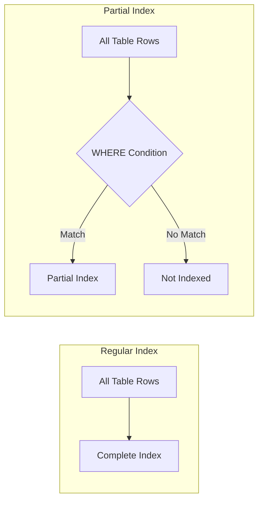

# PostgreSQL Partial Indexes

## Introduction

Partial indexes are a powerful feature in PostgreSQL that allow you to create an index on just a **subset** of your data rather than the entire table. This can significantly improve performance and reduce storage requirements compared to regular indexes, especially when you frequently query specific subsets of your data.

Unlike standard indexes that cover all rows in a table, partial indexes only index rows that satisfy a specified condition. This makes them particularly valuable when:

- You frequently query a specific subset of data
- Your table contains a mix of frequently and infrequently accessed data
- You want to reduce the storage and maintenance overhead of your indexes

## Understanding Partial Indexes

In PostgreSQL, a partial index is created using the `WHERE` clause in your `CREATE INDEX` statement. This tells PostgreSQL to only index rows that match the specified condition.

### Basic Syntax

```sql
CREATE INDEX index_name 
ON table_name(column_name)
WHERE condition;
```

The `condition` can be any valid PostgreSQL expression that evaluates to a boolean result.

## When to Use Partial Indexes

Partial indexes are particularly useful in the following scenarios:

1. **Frequently queried subsets**: When you often query a specific subset of data (e.g., only active users, only completed orders)
2. **Asymmetric data distribution**: When most of your queries target a small proportion of your data
3. **Reduced maintenance overhead**: To minimize the impact of index maintenance during updates
4. **Storage optimization**: To reduce the disk space required for indexes

## Creating Partial Indexes

Let's look at some practical examples of creating partial indexes in PostgreSQL.

### Example 1: Indexing Active Users

Imagine you have a `users` table with millions of rows, but only a small percentage of users are active. Most of your queries target these active users.

First, let's create our sample table:

```sql
CREATE TABLE users (
  user_id SERIAL PRIMARY KEY,
  username VARCHAR(100) NOT NULL,
  email VARCHAR(255) NOT NULL,
  is_active BOOLEAN DEFAULT TRUE,
  last_login TIMESTAMP,
  created_at TIMESTAMP DEFAULT CURRENT_TIMESTAMP
);

-- Insert some sample data
INSERT INTO users (username, email, is_active, last_login) 
VALUES 
  ('john_doe', 'john@example.com', TRUE, '2023-03-15 10:30:00'),
  ('jane_smith', 'jane@example.com', TRUE, '2023-03-14 14:45:00'),
  ('inactive_user', 'inactive@example.com', FALSE, '2022-11-20 09:15:00'),
  ('active_user', 'active@example.com', TRUE, '2023-03-10 16:20:00');
```

Now, let's create a partial index that only includes active users:

```sql
CREATE INDEX idx_users_active_last_login 
ON users(last_login)
WHERE is_active = TRUE;
```

This index will only include rows where `is_active = TRUE`, making it much smaller than a full index on `last_login`.

### Example 2: Indexing Orders with Specific Status

In an e-commerce application, you might have an `orders` table with various statuses, but you frequently query for orders that are "pending" or "processing".

```sql
CREATE TABLE orders (
  order_id SERIAL PRIMARY KEY,
  customer_id INTEGER NOT NULL,
  order_date TIMESTAMP DEFAULT CURRENT_TIMESTAMP,
  total_amount DECIMAL(10, 2) NOT NULL,
  status VARCHAR(20) NOT NULL
);

-- Insert some sample data
INSERT INTO orders (customer_id, total_amount, status) 
VALUES 
  (101, 150.50, 'pending'),
  (102, 75.25, 'processing'),
  (103, 200.00, 'completed'),
  (104, 50.75, 'pending'),
  (105, 300.25, 'canceled');
```

Let's create a partial index for pending and processing orders:

```sql
CREATE INDEX idx_orders_pending_processing 
ON orders(order_date)
WHERE status IN ('pending', 'processing');
```

This index will only include rows where the status is either 'pending' or 'processing'.

## Querying with Partial Indexes

To make effective use of partial indexes, your queries should include the same conditions that were used to create the index.

### Example Query Using the Active Users Index

```sql
-- This query will use our partial index
SELECT user_id, username, last_login 
FROM users 
WHERE is_active = TRUE 
AND last_login > '2023-01-01';

-- This query will NOT use our partial index because it doesn't include is_active = TRUE
SELECT user_id, username, last_login 
FROM users 
WHERE last_login > '2023-01-01';
```

### Example Query Using the Orders Index

```sql
-- This query will use our partial index
SELECT order_id, customer_id, total_amount 
FROM orders 
WHERE status IN ('pending', 'processing') 
AND order_date > '2023-03-01';

-- This query might use our partial index
SELECT order_id, customer_id, total_amount 
FROM orders 
WHERE status = 'pending' 
AND order_date > '2023-03-01';
```

## Verifying Index Usage

To check if your partial index is being used, you can use the `EXPLAIN` command:

```sql
EXPLAIN ANALYZE 
SELECT user_id, username, last_login 
FROM users 
WHERE is_active = TRUE 
AND last_login > '2023-01-01';
```

The output will show whether PostgreSQL is using your partial index or performing a sequential scan.

## Advantages of Partial Indexes

1. **Smaller size**: Partial indexes are typically much smaller than full indexes, reducing storage requirements.
2. **Faster maintenance**: Fewer entries mean faster updates when data changes.
3. **Better query performance**: Smaller indexes can lead to faster query execution.
4. **Targeted optimization**: You can optimize for specific query patterns rather than general cases.

## Limitations and Considerations

While partial indexes are powerful, they come with some limitations:

1. **Query conditions must match**: To use a partial index, your query must include the index's WHERE condition.
2. **Maintenance complexity**: Having multiple specialized indexes can make database maintenance more complex.
3. **Planning challenges**: The PostgreSQL query planner might choose not to use a partial index if it estimates that a full table scan would be faster.
4. **Updates to indexed columns**: If the condition columns are frequently updated, index maintenance overhead may increase.

## Real-World Use Cases

### Filtering Out Soft-Deleted Records

Many applications use a "soft delete" approach where records are marked as deleted but remain in the database. A partial index can optimize queries that only look at non-deleted records:

```sql
CREATE TABLE products (
  product_id SERIAL PRIMARY KEY,
  name VARCHAR(100) NOT NULL,
  price DECIMAL(10, 2) NOT NULL,
  is_deleted BOOLEAN DEFAULT FALSE,
  last_updated TIMESTAMP
);

-- Create a partial index for non-deleted products
CREATE INDEX idx_products_active 
ON products(name, price)
WHERE is_deleted = FALSE;
```

### Indexing High-Value Transactions

In a financial application, you might want to create a special index for high-value transactions that require more frequent auditing:

```sql
CREATE TABLE transactions (
  transaction_id SERIAL PRIMARY KEY,
  account_id INTEGER NOT NULL,
  amount DECIMAL(12, 2) NOT NULL,
  transaction_date TIMESTAMP DEFAULT CURRENT_TIMESTAMP,
  type VARCHAR(50) NOT NULL
);

-- Create a partial index for high-value transactions
CREATE INDEX idx_high_value_transactions 
ON transactions(account_id, transaction_date)
WHERE amount > 10000.00;
```

### Optimizing for Recent Data

If you frequently query recent data but rarely access historical records:

```sql
CREATE TABLE logs (
  log_id SERIAL PRIMARY KEY,
  log_time TIMESTAMP DEFAULT CURRENT_TIMESTAMP,
  log_level VARCHAR(20) NOT NULL,
  message TEXT NOT NULL
);

-- Create a partial index for recent logs
CREATE INDEX idx_recent_logs 
ON logs(log_level, log_time)
WHERE log_time > CURRENT_DATE - INTERVAL '30 days';
```

## Comparing Regular vs. Partial Indexes

Let's visualize the difference between regular and partial indexes:



## Maintenance and Monitoring

### Rebuilding Partial Indexes

Sometimes you may need to rebuild your partial indexes, especially if the data distribution changes significantly:

```sql
-- Rebuild a partial index
REINDEX INDEX idx_users_active_last_login;

-- Rebuild with a different condition
DROP INDEX idx_users_active_last_login;
CREATE INDEX idx_users_active_last_login 
ON users(last_login)
WHERE is_active = TRUE AND last_login > '2023-01-01';
```

### Monitoring Index Size

You can check the size of your indexes to see how much space you're saving with partial indexes:

```sql
SELECT 
    pg_size_pretty(pg_relation_size(indexrelid)) AS index_size,
    indexrelid::regclass AS index_name
FROM 
    pg_index 
WHERE 
    indrelid = 'users'::regclass;
```

## Summary

Partial indexes are a powerful optimization technique in PostgreSQL that allow you to:

- Index only a subset of your data based on specific conditions
- Reduce storage requirements and maintenance overhead
- Improve query performance for frequently accessed subsets of data

When designing your database schema, consider using partial indexes when you have:
- Clear patterns where queries target specific subsets of data
- Tables with a mix of frequently and infrequently accessed rows
- A need to optimize storage and performance

By applying partial indexes strategically, you can significantly improve the performance of your PostgreSQL database while minimizing resource consumption.

## Additional Resources

- [PostgreSQL Official Documentation on Partial Indexes](https://www.postgresql.org/docs/current/indexes-partial.html)
- [PostgreSQL Indexing Strategies](https://www.postgresql.org/docs/current/indexes-strategies.html)

## Exercises

1. Create a partial index for a `comments` table that only indexes non-spam comments.
2. Write a query that effectively uses a partial index on an `inventory` table to find in-stock items.
3. Compare the performance of a query with and without a partial index using `EXPLAIN ANALYZE`.
4. Design a partial index strategy for a social media application where users can have posts with different visibility settings (public, friends-only, private).