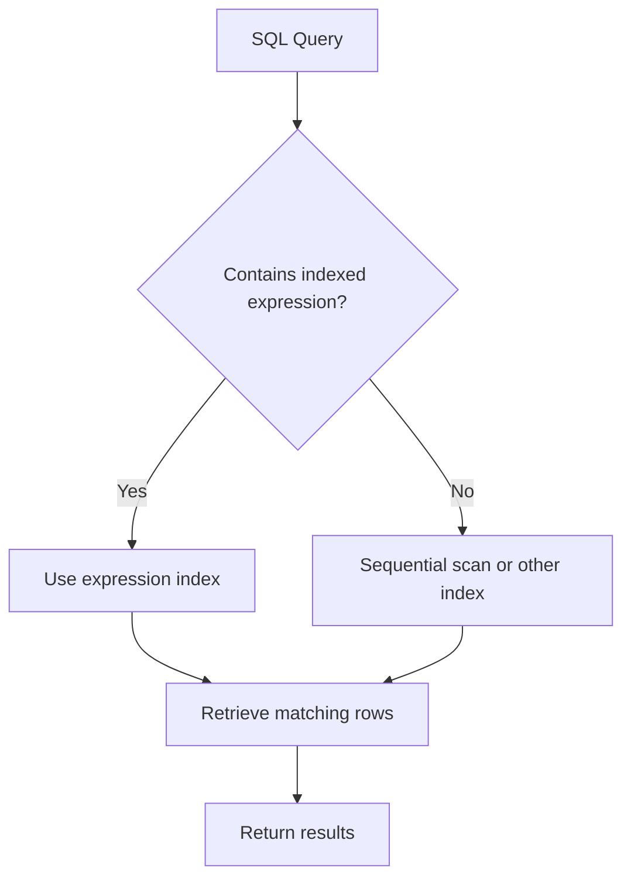

# PostgreSQL Expression Indexes

## Introduction

When optimizing database performance, indexes are among the most powerful tools available to developers. While standard indexes on columns are common, PostgreSQL offers a more advanced indexing feature called **expression indexes** (sometimes called functional indexes). Expression indexes allow you to create indexes on expressions involving columns, rather than just on the columns themselves.

This capability is particularly useful when you frequently search for data using expressions or functions in your queries. By pre-computing and indexing these expressions, PostgreSQL can dramatically improve query performance when these expressions appear in WHERE clauses or JOIN conditions.

## What Are Expression Indexes?

In standard indexing, you create an index directly on a column:

```sql
CREATE INDEX idx_customers_email ON customers(email);
```

With expression indexes, you can create an index on an expression that involves one or more columns:

```sql
CREATE INDEX idx_customers_email_lowercase ON customers(LOWER(email));
```

The expression index above pre-computes and indexes the lowercase version of every email address, making case-insensitive searches much faster.

## Why Use Expression Indexes?

Expression indexes are valuable when:

1. You frequently search using functions or expressions
2. Your queries include transformations on columns
3. You need to optimize complex WHERE clauses
4. You perform case-insensitive searches
5. You work with partial or derived data from columns

## Creating Expression Indexes

The syntax for creating an expression index is:

```sql
CREATE INDEX index_name ON table_name (expression);
```

Let's look at some practical examples:

### Example 1: Case-Insensitive Searching

```sql
-- Create a table for users
CREATE TABLE users (
  id SERIAL PRIMARY KEY,
  username VARCHAR(50) NOT NULL
);

-- Insert sample data
INSERT INTO users (username) VALUES 
  ('JohnDoe'),
  ('alice123'),
  ('BOB_SMITH'),
  ('CharlieBrown');

-- Create an expression index for case-insensitive username searches
CREATE INDEX idx_users_username_lower ON users(LOWER(username));
```

Now, when you run a query with a case-insensitive search:

```sql
EXPLAIN ANALYZE SELECT * FROM users WHERE LOWER(username) = 'johndoe';
```

PostgreSQL will utilize the expression index we created, resulting in much faster query execution compared to a full table scan.

### Example 2: Indexing Computed Values

```sql
-- Create a products table
CREATE TABLE products (
  id SERIAL PRIMARY KEY,
  name VARCHAR(100) NOT NULL,
  price DECIMAL(10, 2) NOT NULL,
  discount_percent DECIMAL(5, 2) DEFAULT 0
);

-- Insert sample data
INSERT INTO products (name, price, discount_percent) VALUES
  ('Laptop', 999.99, 10),
  ('Smartphone', 699.99, 15),
  ('Headphones', 149.99, 5),
  ('Tablet', 349.99, 20);

-- Create an expression index on the sale price calculation
CREATE INDEX idx_products_sale_price ON products((price * (1 - discount_percent / 100)));
```

With this index, queries that filter based on the sale price will be more efficient:

```sql
-- This query can use the expression index
SELECT * FROM products 
WHERE price * (1 - discount_percent / 100) < 500;
```

## Practical Applications

### Date Manipulation

Expression indexes are extremely useful for date-related queries:

```sql
-- Create a table for events
CREATE TABLE events (
  id SERIAL PRIMARY KEY,
  event_name VARCHAR(100) NOT NULL,
  event_timestamp TIMESTAMP NOT NULL
);

-- Create an index on the date part of the timestamp
CREATE INDEX idx_events_date ON events(DATE(event_timestamp));
```

This allows efficient queries that filter by date:

```sql
-- This query can use the expression index
SELECT * FROM events 
WHERE DATE(event_timestamp) = '2023-11-01';
```

### JSON Data Extraction

For applications working with JSON data:

```sql
-- Create a table with JSON data
CREATE TABLE user_profiles (
  id SERIAL PRIMARY KEY,
  profile JSONB NOT NULL
);

-- Create an expression index on a JSON field
CREATE INDEX idx_user_profiles_city ON user_profiles((profile ->> 'city'));
```

Now queries filtering on the city field within the JSON will be much faster:

```sql
-- This query can use the expression index
SELECT * FROM user_profiles 
WHERE profile ->> 'city' = 'New York';
```

### Text Pattern Matching

Expression indexes can also help with pattern matching:

```sql
-- Create a table for articles
CREATE TABLE articles (
  id SERIAL PRIMARY KEY,
  title VARCHAR(200) NOT NULL,
  content TEXT NOT NULL
);

-- Create an expression index for title prefix searches
CREATE INDEX idx_articles_title_prefix ON articles(LEFT(title, 4));
```

This index improves queries that search for articles with specific title prefixes:

```sql
-- This query can use the expression index
SELECT * FROM articles 
WHERE LEFT(title, 4) = 'The ';
```

## Important Considerations

### Performance Overhead

While expression indexes speed up queries, they come with costs:

1. **Storage space**: Each index requires additional disk space
2. **Write performance**: Indexes slow down INSERT, UPDATE, and DELETE operations
3. **Maintenance**: Expression indexes need to be recalculated when the underlying data changes

Always measure the performance impact before and after creating expression indexes in your production environment.

### Index Usage

For PostgreSQL to use an expression index, the query must contain the exact same expression as used in the index. For example:

```sql
-- Will use the LOWER(email) index
SELECT * FROM customers WHERE LOWER(email) = 'john.doe@example.com';

-- Will NOT use the LOWER(email) index
SELECT * FROM customers WHERE email ILIKE 'john.doe@example.com';
```

Even though both queries perform case-insensitive searches, only the first one will use our expression index because it uses the exact same expression (LOWER).

### Index Maintenance

Like all indexes, expression indexes need occasional maintenance:

```sql
-- Rebuild an index to remove bloat
REINDEX INDEX idx_customers_email_lowercase;

-- Analyze the table to update statistics
ANALYZE customers;
```

## When to Use Expression Indexes

Use expression indexes when:

1. The same expression appears frequently in your queries
2. The table is large enough that indexes make a significant difference
3. The expression is costly to compute at query time
4. Read performance is more important than write performance for the table

Avoid overusing expression indexes when:

1. The table is small (PostgreSQL might prefer a sequential scan anyway)
2. The table receives many writes but few reads
3. The expression is rarely used in queries

## Advanced Example: Full Name Search

Let's implement a more complex example that demonstrates the power of expression indexes:

```sql
-- Create an employees table
CREATE TABLE employees (
  id SERIAL PRIMARY KEY,
  first_name VARCHAR(50) NOT NULL,
  last_name VARCHAR(50) NOT NULL,
  department VARCHAR(50) NOT NULL,
  hire_date DATE NOT NULL
);

-- Insert sample data
INSERT INTO employees (first_name, last_name, department, hire_date) VALUES
  ('John', 'Smith', 'Engineering', '2021-03-15'),
  ('Sarah', 'Johnson', 'Marketing', '2020-11-02'),
  ('Michael', 'Williams', 'Finance', '2022-01-10'),
  ('Jessica', 'Brown', 'HR', '2019-08-22');

-- Create an expression index on concatenated full name
CREATE INDEX idx_employees_fullname ON employees((first_name || ' ' || last_name));
```

Now queries searching for full names will be more efficient:

```sql
-- This query can use the expression index
SELECT * FROM employees 
WHERE first_name || ' ' || last_name = 'John Smith';
```

## Visualizing Index Usage

Let's visualize how PostgreSQL uses expression indexes with a diagram:



## Summary

Expression indexes are a powerful PostgreSQL feature that allows you to index the results of expressions and functions rather than just raw column values. They can dramatically improve query performance when your WHERE clauses or JOIN conditions involve expressions.

Key points to remember:

- Use expression indexes when you frequently query using the same expressions
- The query must use the exact same expression for the index to be used
- Consider the trade-offs between read performance, write performance, and storage requirements
- Test your indexes with EXPLAIN ANALYZE to ensure they're being used as expected

Expression indexes showcase PostgreSQL's flexibility and power as a database system, allowing you to optimize for specific query patterns that go beyond simple column value lookups.

## Practice Exercises

1. Create a table of products with prices in different currencies and use an expression index to optimize conversion-based queries.
2. Implement an expression index for efficiently searching text data using the LIKE operator with a constant prefix (e.g., 'prefix%').
3. Create a table with timestamp data and build an expression index to optimize queries that filter by month or quarter.
4. Build an expression index that helps with trigram-based fuzzy text searching using the pg_trgm extension.

## Additional Resources

- [PostgreSQL Documentation on Indexes](https://www.postgresql.org/docs/current/indexes.html)
- [PostgreSQL Performance Tuning](https://www.postgresql.org/docs/current/performance-tips.html)
- [Understanding EXPLAIN ANALYZE](https://www.postgresql.org/docs/current/using-explain.html)