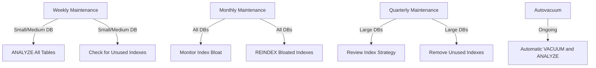

# PostgreSQL Index Maintenance

While PostgreSQL indexes significantly improve query performance, they require proper maintenance to ensure optimal efficiency. This guide covers essential index maintenance practices for keeping your PostgreSQL database running smoothly.

## Introduction to Index Maintenance

Indexes are crucial for PostgreSQL performance, but they don't remain optimal automatically. As data changes through inserts, updates, and deletes, indexes can become fragmented and bloated, reducing their effectiveness. Regular maintenance helps indexes continue to perform at their best.

## Monitoring Index Health

Before performing maintenance, you should understand how to check an index's health.

### Index Size and Bloat

```sql
SELECT
  schemaname,
  tablename,
  indexname,
  pg_size_pretty(pg_relation_size(schemaname || '.' || indexname::text)) as index_size
FROM pg_indexes
ORDER BY pg_relation_size(schemaname || '.' || indexname::text) DESC
LIMIT 10;
```

**Output:**
```
 schemaname |  tablename  |       indexname        | index_size 
------------+-------------+------------------------+------------
 public     | customers   | customers_pkey         | 16 MB
 public     | orders      | orders_customer_id_idx | 12 MB
 public     | products    | products_pkey          | 8 MB
 public     | order_items | order_items_pkey       | 6 MB
 ...
```

To identify bloated indexes, you can use the `pgstattuple` extension:

```sql
-- First, install the extension (requires superuser privileges)
CREATE EXTENSION pgstattuple;

-- Then check the index bloat
SELECT * FROM pgstattuple('customers_pkey');
```

**Output:**
```
 table_len | tuple_count | tuple_len | tuple_percent | dead_tuple_count | dead_tuple_len | dead_tuple_percent | free_space | free_percent 
-----------+-------------+-----------+---------------+------------------+----------------+--------------------+------------+--------------
   8912896 |       94328 |   7963648 |          89.3 |              421 |          38972 |                0.4 |     910276 |         10.2
```

High values in `dead_tuple_percent` and `free_percent` indicate bloat, suggesting the index might need rebuilding.

### Index Usage Statistics

PostgreSQL tracks index usage statistics. Check which indexes are being used (or not used):

```sql
SELECT
  schemaname,
  relname AS tablename,
  indexrelname AS indexname,
  idx_scan AS index_scans,
  idx_tup_read AS tuples_read,
  idx_tup_fetch AS tuples_fetched
FROM pg_stat_user_indexes
ORDER BY idx_scan DESC;
```

**Output:**
```
 schemaname |  tablename  |       indexname        | index_scans | tuples_read | tuples_fetched 
------------+-------------+------------------------+-------------+-------------+----------------
 public     | orders      | orders_customer_id_idx |      125783 |      392745 |         125783
 public     | customers   | customers_pkey         |       98246 |       98246 |          98246
 public     | products    | products_pkey          |       62341 |       62341 |          62341
 public     | categories  | categories_name_idx    |           0 |           0 |              0
```

Indexes with zero scans might be candidates for removal if they're not used for constraints.

## Common Index Maintenance Tasks

### Rebuilding Indexes

When an index becomes bloated, you can rebuild it using the `REINDEX` command:

```sql
-- Rebuild a single index
REINDEX INDEX customers_pkey;

-- Rebuild all indexes on a table
REINDEX TABLE customers;

-- Rebuild all indexes in a schema
REINDEX SCHEMA public;

-- Rebuild all indexes in the database
REINDEX DATABASE my_database;
```

The `REINDEX` command locks the table, preventing writes during the operation. For production environments, consider using the `CONCURRENTLY` option (PostgreSQL 12+):

```sql
REINDEX INDEX CONCURRENTLY customers_pkey;
```

### Alternative to REINDEX: CREATE INDEX CONCURRENTLY

For older PostgreSQL versions or when you need to minimize locking, use this approach:

```sql
-- Create a new index concurrently
CREATE INDEX CONCURRENTLY customers_email_idx_new ON customers(email);

-- Drop the old index
DROP INDEX customers_email_idx;

-- Rename the new index to the old index name
ALTER INDEX customers_email_idx_new RENAME TO customers_email_idx;
```

### Vacuuming and Analyzing

PostgreSQL's `VACUUM` process reclaims storage and updates statistics:

```sql
-- Basic vacuum
VACUUM customers;

-- Vacuum with analyze to update statistics
VACUUM ANALYZE customers;

-- Full vacuum (rewrites the entire table)
VACUUM FULL customers;
```

**Note:** `VACUUM FULL` requires an exclusive lock on the table and should be used with caution in production.

PostgreSQL also runs an autovacuum process that automatically vacuums tables when certain thresholds are met. You can adjust autovacuum settings in `postgresql.conf` or at the table level:

```sql
ALTER TABLE customers SET (
  autovacuum_vacuum_scale_factor = 0.1,
  autovacuum_analyze_scale_factor = 0.05
);
```

## Maintaining Partial and Expression Indexes

Partial and expression indexes require the same maintenance as regular indexes but may need special attention:

```sql
-- Check if statistics are up to date for expression indexes
ANALYZE customers;

-- Rebuild an expression index
REINDEX INDEX customers_lower_email_idx;
```

## Scheduled Maintenance

Create a maintenance schedule based on your database size and activity:



## Real-World Example: E-Commerce Database Maintenance

Let's consider an e-commerce database with tables for customers, products, orders, and order_items.

### Step 1: Identify heavily used indexes

```sql
SELECT
  indexrelname,
  relname AS tablename,
  idx_scan AS scans,
  pg_size_pretty(pg_relation_size(indexrelid::regclass)) AS size
FROM pg_stat_user_indexes
JOIN pg_index USING (indexrelid)
WHERE idx_scan > 0 
ORDER BY idx_scan DESC
LIMIT 5;
```

**Output:**
```
       indexrelname       |  tablename  | scans |  size  
--------------------------+-------------+-------+--------
 orders_customer_id_idx   | orders      | 38491 | 16 MB
 order_items_order_id_idx | order_items | 25632 | 24 MB
 products_category_id_idx | products    | 18743 | 8 MB
 customers_pkey           | customers   | 12483 | 12 MB
 products_pkey            | products    | 10284 | 6 MB
```

### Step 2: Check for bloat in these critical indexes

```sql
SELECT * FROM pgstattuple('orders_customer_id_idx');
```

**Output:**
```
 table_len | tuple_count | tuple_len | tuple_percent | dead_tuple_count | dead_tuple_len | dead_tuple_percent | free_space | free_percent 
-----------+-------------+-----------+---------------+------------------+----------------+--------------------+------------+--------------
  16777216 |      183421 |  13984736 |          83.4 |             5421 |         432168 |                2.6 |    2360312 |         14.1
```

This index shows signs of bloat (high `dead_tuple_percent` and `free_percent`).

### Step 3: Rebuild the bloated index

```sql
-- For minimal disruption in production
REINDEX INDEX CONCURRENTLY orders_customer_id_idx;
```

### Step 4: Update statistics

```sql
ANALYZE orders;
```

### Step 5: Check for unused indexes

```sql
SELECT
  schemaname,
  relname AS tablename,
  indexrelname AS indexname,
  idx_scan,
  pg_size_pretty(pg_relation_size(schemaname || '.' || indexrelname::text)) as index_size
FROM pg_stat_user_indexes
WHERE idx_scan = 0
ORDER BY pg_relation_size(schemaname || '.' || indexrelname::text) DESC
LIMIT 5;
```

**Output:**
```
 schemaname |   tablename    |         indexname          | idx_scan | index_size 
------------+----------------+----------------------------+----------+------------
 public     | order_history  | order_history_date_idx     |        0 | 18 MB
 public     | product_views  | product_views_timestamp_idx|        0 | 12 MB
 public     | user_logs      | user_logs_ip_address_idx   |        0 | 8 MB
```

Consider removing these unused indexes if they're not required for constraints or are used rarely.

## Best Practices for Index Maintenance

1. **Monitor index usage and size regularly**:
   - Track which indexes are used and how often
   - Monitor index bloat and size growth

2. **Run ANALYZE regularly** to keep statistics up-to-date

3. **REINDEX or rebuild bloated indexes**:
   - Use `CONCURRENTLY` option in production environments
   - Schedule during low traffic periods

4. **Review and remove unused indexes**:
   - Check if they're required for constraints first
   - Consider application changes that might use them in the future

5. **Optimize autovacuum settings**:
   - Adjust thresholds for tables with high update/delete rates
   - Monitor autovacuum activity with `pg_stat_activity`

6. **Test maintenance operations in non-production first**

7. **Document your maintenance strategy and schedule**

## Summary

Proper index maintenance is essential for PostgreSQL performance. Regular monitoring, rebuilding bloated indexes, updating statistics, and removing unused indexes are key maintenance tasks. By implementing a systematic maintenance strategy, you can ensure your PostgreSQL indexes remain efficient and effective.

## Additional Resources

- [PostgreSQL Documentation: Routine Reindexing](https://www.postgresql.org/docs/current/sql-reindex.html)
- [PostgreSQL Documentation: Routine Vacuuming](https://www.postgresql.org/docs/current/routine-vacuuming.html)
- [PostgreSQL Wiki: Index Maintenance](https://wiki.postgresql.org/wiki/Index_Maintenance)

## Exercises

1. Use the queries provided in this guide to check for bloated and unused indexes in your database.

2. Create a maintenance script that identifies bloated indexes and rebuilds them using the `CONCURRENTLY` option.

3. Configure table-specific autovacuum settings for your most frequently updated tables.

4. Set up a scheduled job to run `ANALYZE` on your database weekly.

5. Implement a monitoring system that alerts you when indexes grow beyond a certain size threshold.