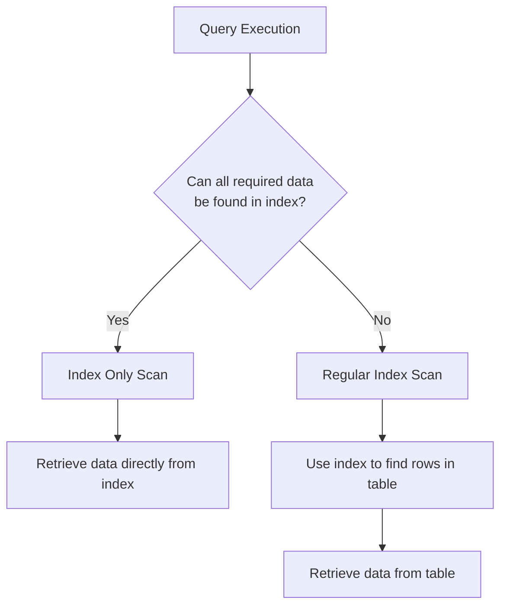

# PostgreSQL Index Only Scans

## Introduction

When you're working with databases, query performance becomes critical as your data grows. PostgreSQL offers various indexing strategies to speed up queries, and among these, **Index Only Scans** stand out as a particularly powerful optimization technique.

An Index Only Scan is a query execution method where PostgreSQL can retrieve all required information directly from the index itself, without needing to access the actual table data. This can significantly improve query performance, especially for large tables.

In this tutorial, we'll explore how Index Only Scans work, when PostgreSQL can use them, and how you can optimize your database to take advantage of this powerful feature.

## How Index Only Scans Work

### The Concept

In traditional index scans, PostgreSQL:
1. Finds matching entries in the index
2. Uses those entries to locate the corresponding rows in the table
3. Retrieves the required columns from those rows

With an Index Only Scan, the second and third steps are eliminated because all the data needed to satisfy the query is already contained in the index. This saves disk I/O operations and improves performance.



### Visibility Check

There's one complication: PostgreSQL's MVCC (Multi-Version Concurrency Control) system. Even when all needed columns are in the index, PostgreSQL must verify if each row is visible to the current transaction. This information is not stored in the index but in the table's visibility map.

To handle this, PostgreSQL:
1. Retrieves candidate rows from the index
2. Checks the visibility map to see if the row is definitely visible
3. If not definitely visible according to the map, it falls back to checking the actual table row

The visibility map is a small data structure that tracks which pages in a table contain only rows that are visible to all transactions. This map helps PostgreSQL avoid unnecessary table lookups during Index Only Scans.

## When Index Only Scans Are Possible

An Index Only Scan can be used when **all** of these conditions are met:

1. **All required columns are included in the index**  
   The query must only request columns that are part of the index.

2. **The query's WHERE clause uses columns from the index**  
   The filter conditions should reference indexed columns.

3. **The visibility map indicates rows are visible**  
   For optimal performance, the table should be recently vacuumed.

## Creating Indexes for Index Only Scans

### Covering Indexes

To make Index Only Scans possible, you need to create "covering indexes" that include all columns required by your query. In PostgreSQL, you can create such indexes using the `INCLUDE` clause (introduced in PostgreSQL 11) or by adding columns to the index key.

#### Using the INCLUDE Clause

```sql
CREATE INDEX idx_users_email ON users (email) INCLUDE (first_name, last_name);
```

This creates an index on the `email` column but also stores the `first_name` and `last_name` columns in the index leaf nodes, without making them part of the index key.

#### Adding Columns to the Index Key

```sql
CREATE INDEX idx_users_email_names ON users (email, first_name, last_name);
```

This approach also includes all three columns in the index, but all are part of the index key, which affects the index size and maintenance overhead.

## Practical Examples

Let's see Index Only Scans in action with some practical examples.

### Example 1: Basic Index Only Scan

First, let's create a sample table and populate it with data:

```sql
CREATE TABLE products (
    id SERIAL PRIMARY KEY,
    name VARCHAR(100),
    category VARCHAR(50),
    price DECIMAL(10, 2)
);

-- Insert sample data
INSERT INTO products (name, category, price)
SELECT 
    'Product ' || i,
    CASE WHEN i % 3 = 0 THEN 'Electronics' 
         WHEN i % 3 = 1 THEN 'Clothing' 
         ELSE 'Home & Garden' END,
    (random() * 1000)::DECIMAL(10, 2)
FROM generate_series(1, 10000) i;
```

Now, let's create a covering index for a common query pattern:

```sql
CREATE INDEX idx_products_category_price 
ON products (category, price) INCLUDE (name);
```

With this index, the following query can use an Index Only Scan:

```sql
EXPLAIN ANALYZE
SELECT name, price FROM products 
WHERE category = 'Electronics' AND price < 500;
```

Output:
```
                                                   QUERY PLAN
----------------------------------------------------------------------------------------------------------------
 Index Only Scan using idx_products_category_price on products  (cost=0.29..13.36 rows=166 width=36) (actual time=0.032..0.075 rows=168 loops=1)
   Index Cond: ((category = 'Electronics'::text) AND (price < 500.00))
   Heap Fetches: 12
   Planning Time: 0.103 ms
   Execution Time: 0.091 ms
```

Notice the "Index Only Scan" in the query plan, and "Heap Fetches: 12" indicates that only 12 rows needed visibility verification from the table.

### Example 2: Comparing Performance

Let's compare the performance with and without an Index Only Scan. First, we'll create a regular index:

```sql
CREATE INDEX idx_products_category 
ON products (category);
```

Now, let's run a query that uses this index:

```sql
EXPLAIN ANALYZE
SELECT name, price FROM products 
WHERE category = 'Electronics';
```

Output:
```
                                               QUERY PLAN
--------------------------------------------------------------------------------------------------------
 Index Scan using idx_products_category on products  (cost=0.29..542.85 rows=3333 width=36) (actual time=0.026..3.224 rows=3333 loops=1)
   Index Cond: (category = 'Electronics'::text)
   Planning Time: 0.089 ms
   Execution Time: 3.781 ms
```

This uses an Index Scan (not Index Only) because the `name` and `price` columns aren't in the index.

Now let's run the same query with our covering index:

```sql
EXPLAIN ANALYZE
SELECT name, price FROM products 
WHERE category = 'Electronics';
```

Output with the covering index:
```
                                                  QUERY PLAN
--------------------------------------------------------------------------------------------------------------
 Index Only Scan using idx_products_category_price on products  (cost=0.29..112.36 rows=3333 width=36) (actual time=0.027..0.987 rows=3333 loops=1)
   Index Cond: (category = 'Electronics'::text)
   Heap Fetches: 122
   Planning Time: 0.098 ms
   Execution Time: 1.354 ms
```

The execution time is significantly better with the Index Only Scan.

## Optimizing for Index Only Scans

To maximize the benefits of Index Only Scans:

1. **Run VACUUM regularly**  
   This updates the visibility map, enabling more Index Only Scans.

   ```sql
   VACUUM ANALYZE products;
   ```

2. **Create targeted covering indexes**  
   Analyze your query patterns and create indexes that include all needed columns.

3. **Monitor Index Only Scan effectiveness**  
   Check "Heap Fetches" in EXPLAIN ANALYZE output to see how many table lookups were still required.

4. **Update your statistics regularly**  
   This helps the query planner make better decisions.

   ```sql
   ANALYZE products;
   ```

## Common Pitfalls and Limitations

1. **Index size**  
   Including too many columns can make indexes large and slow to use.

2. **Update overhead**  
   Every included column means more index maintenance when those columns are updated.

3. **Unused indexes**  
   Creating too many specialized indexes can waste space and slow down writes.

4. **PostgreSQL version**  
   The `INCLUDE` clause is only available in PostgreSQL 11 and later.

## Summary

Index Only Scans are a powerful performance optimization in PostgreSQL that can dramatically speed up your queries by retrieving all needed data directly from indexes, avoiding expensive table lookups.

To take advantage of this feature:
- Design your indexes to include all columns needed by common queries
- Use the `INCLUDE` clause when appropriate to minimize index overhead
- Run VACUUM regularly to keep the visibility map updated
- Monitor query plans to verify Index Only Scans are being used

By understanding and implementing Index Only Scans effectively, you can significantly improve the performance of your PostgreSQL database, especially for read-heavy workloads on large tables.

## Additional Resources

- [PostgreSQL Documentation on Indexes](https://www.postgresql.org/docs/current/indexes.html)
- [PostgreSQL EXPLAIN documentation](https://www.postgresql.org/docs/current/sql-explain.html)
- [PostgreSQL VACUUM documentation](https://www.postgresql.org/docs/current/sql-vacuum.html)

## Exercises

1. Create a table with at least 10,000 rows and design an index that allows for Index Only Scans on your most common query pattern.

2. Compare the performance of the same query with a regular index versus a covering index using EXPLAIN ANALYZE.

3. Run VACUUM on your table and observe how the number of heap fetches changes for an Index Only Scan.

4. Experiment with different combinations of indexed and included columns to find the optimal balance between index size and query performance.