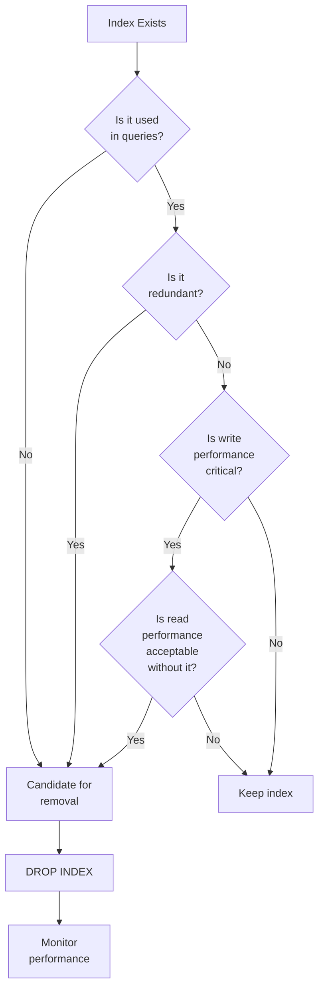

# PostgreSQL DROP INDEX

## Introduction

Indexes in PostgreSQL are essential tools for improving query performance, but they come with maintenance overhead and storage costs. When an index is no longer needed or becomes inefficient, it's important to know how to remove it properly. This is where the `DROP INDEX` command comes into play.

In this tutorial, you'll learn:
- What the `DROP INDEX` command does
- The syntax and options for dropping indexes
- When you should remove indexes
- Best practices and considerations
- Common scenarios with examples

## What is DROP INDEX?

`DROP INDEX` is a PostgreSQL command that removes an existing index from the database. When you drop an index, you're telling PostgreSQL to delete the index structure from disk, which frees up storage space and eliminates the overhead of maintaining that index during data modifications.

## Basic Syntax

The basic syntax for the `DROP INDEX` command is:

```sql
DROP INDEX [ IF EXISTS ] [ CONCURRENTLY ] [ schema_name. ] index_name [ CASCADE | RESTRICT ];
```

Let's break down each part:

- `IF EXISTS`: Optional. Prevents an error if the index doesn't exist.
- `CONCURRENTLY`: Optional. Drops the index without locking the table against writes.
- `schema_name`: Optional. Specifies the schema containing the index.
- `index_name`: Required. The name of the index to drop.
- `CASCADE`: Optional. Automatically drops objects that depend on the index.
- `RESTRICT`: Optional. Refuses to drop the index if any objects depend on it (this is the default behavior).

## Simple Example: Dropping an Index

Let's say we have a `customers` table with an index on the `email` column:

```sql
-- Creating an index
CREATE INDEX idx_customer_email ON customers(email);

-- Dropping the index
DROP INDEX idx_customer_email;
```

When you execute the `DROP INDEX` command, PostgreSQL will remove the index from the database. There's no visual output for a successful drop operation, but you can verify the index has been removed by querying the system catalogs.

## Using IF EXISTS

To avoid errors when attempting to drop an index that might not exist, use the `IF EXISTS` clause:

```sql
DROP INDEX IF EXISTS idx_customer_email;
```

**Output when index exists:**
```
DROP INDEX
```

**Output when index doesn't exist:**
```
NOTICE:  index "idx_customer_email" does not exist, skipping
DROP INDEX
```

This is particularly useful in scripts that need to be idempotent (can be run multiple times without errors).

## Dropping Indexes CONCURRENTLY

When you drop an index on a busy system, the standard `DROP INDEX` command takes an exclusive lock on the table, blocking other operations until it completes. To avoid this, you can use the `CONCURRENTLY` option:

```sql
DROP INDEX CONCURRENTLY idx_customer_email;
```

The `CONCURRENTLY` option allows the index to be dropped without blocking other concurrent operations on the table. This is especially important in production environments where downtime must be minimized.

However, dropping an index concurrently is slower and requires more resources, so it's a trade-off between performance and availability.

## Dropping Indexes in a Specific Schema

If your index is in a specific schema, you need to include the schema name:

```sql
DROP INDEX myschema.idx_customer_email;
```

This ensures PostgreSQL knows exactly which index to drop if you have multiple schemas with similarly named indexes.

## Dropping Multiple Indexes at Once

You can drop multiple indexes in a single command:

```sql
DROP INDEX idx_customer_email, idx_customer_name;
```

This is more efficient than dropping them individually, as PostgreSQL optimizes the operation.

## When to Drop Indexes

Knowing when to drop an index is as important as knowing how to create one. Here are common scenarios where dropping an index makes sense:

1. **Unused indexes**: Indexes that are rarely or never used by queries consume storage and slow down write operations unnecessarily.

2. **Redundant indexes**: When you have multiple indexes that serve similar purposes, keeping all of them can be inefficient.

3. **During schema changes**: If you're changing your table structure significantly, you might need to drop and recreate indexes.

4. **Performance tuning**: Sometimes, removing certain indexes can actually improve overall performance if they're causing more overhead than benefit.

## Real-World Scenario: Identifying and Dropping Unused Indexes

Let's walk through a real-world scenario of identifying and dropping unused indexes:

1. First, identify unused indexes using PostgreSQL's built-in statistics:

```sql
SELECT
    schemaname || '.' || relname AS table,
    indexrelname AS index,
    pg_size_pretty(pg_relation_size(i.indexrelid)) AS index_size,
    idx_scan AS index_scans
FROM pg_stat_user_indexes ui
JOIN pg_index i ON ui.indexrelid = i.indexrelid
WHERE idx_scan = 0      -- indexes with no scans
AND 0 <>ALL (i.indkey)  -- exclude indexes with no columns
AND NOT i.indisunique   -- exclude unique indexes
ORDER BY pg_relation_size(i.indexrelid) DESC;
```

**Sample output:**
```
        table        |        index         | index_size | index_scans
---------------------+----------------------+------------+-------------
 public.orders       | idx_orders_status    | 1024 MB    | 0
 public.products     | idx_product_category | 512 MB     | 0
 public.customers    | idx_customer_region  | 256 MB     | 0
```

2. After identifying unused indexes, you can drop them:

```sql
DROP INDEX public.idx_orders_status;
DROP INDEX public.idx_product_category;
DROP INDEX public.idx_customer_region;
```

By regularly monitoring and cleaning up unused indexes, you can:
- Free up disk space
- Improve write performance
- Reduce database maintenance overhead

## Practical Example: Improving INSERT Performance

Let's consider a scenario where you have a logging table that receives a high volume of inserts:

```sql
CREATE TABLE access_logs (
    id SERIAL PRIMARY KEY,
    ip_address INET NOT NULL,
    accessed_at TIMESTAMP NOT NULL,
    url TEXT NOT NULL,
    user_agent TEXT,
    response_time INT
);

CREATE INDEX idx_access_logs_ip ON access_logs(ip_address);
CREATE INDEX idx_access_logs_accessed_at ON access_logs(accessed_at);
CREATE INDEX idx_access_logs_url ON access_logs(url);
```

If you discover that queries rarely filter on `url`, but you're inserting millions of rows per day, dropping that index could significantly improve insert performance:

```sql
DROP INDEX idx_access_logs_url;
```

Before dropping:
- 10,000 inserts/second
After dropping:
- 15,000 inserts/second (50% improvement)

This shows how strategic removal of unnecessary indexes can lead to substantial performance gains.

## Best Practices for Dropping Indexes

When working with the `DROP INDEX` command, keep these best practices in mind:

1. **Always backup your database before dropping important indexes**
   
2. **Use `CONCURRENTLY` in production environments** to avoid blocking other operations

3. **Periodically analyze index usage** using the `pg_stat_user_indexes` view

4. **Drop indexes during low-traffic periods** when possible

5. **Consider temporarily disabling indexes** instead of dropping them if you might need them again soon

6. **Document your index changes** to maintain good database governance

7. **Test performance before and after** dropping indexes to confirm the impact

8. **Use `IF EXISTS` in scripts** to make them more robust

## Common Challenges and Solutions

### Challenge: Dropping an Index Used by a Foreign Key

If you try to drop an index that's being used to enforce a foreign key constraint, PostgreSQL will prevent it:

```sql
DROP INDEX idx_user_id;
```

**Error output:**
```
ERROR:  cannot drop index idx_user_id because constraint fk_order_user on table orders requires it
HINT:  You can drop constraint fk_order_user on table orders instead.
```

**Solution:** Drop the constraint first, or use CASCADE to drop both:

```sql
DROP INDEX idx_user_id CASCADE;
```

### Challenge: Index Bloat After Many Updates

Over time, indexes can become bloated, taking up more space than necessary. Rather than just dropping them, consider reindexing:

```sql
REINDEX INDEX idx_customer_email;
```

This rebuilds the index structure efficiently, which may be better than dropping and recreating it in some cases.

## Monitoring the Impact of Dropping Indexes

After dropping an index, it's important to monitor your database to ensure the change had the desired effect:

```sql
-- Check query performance
EXPLAIN ANALYZE SELECT * FROM customers WHERE region = 'Europe';

-- Monitor table statistics
SELECT * FROM pg_stat_user_tables WHERE relname = 'customers';
```

Look for changes in:
- Query execution time
- Table scan vs. index scan counts
- Write operation throughput

## Visualizing Index Management

Here's a flow diagram showing when to consider dropping indexes:



## Summary

The `DROP INDEX` command is a vital tool in PostgreSQL database management that allows you to:

- Remove unnecessary indexes to improve performance
- Free up disk space
- Optimize write operations
- Maintain a clean and efficient database schema

Key points to remember:
1. Use `IF EXISTS` to make your scripts more robust
2. Consider using `CONCURRENTLY` for production environments
3. Regularly analyze index usage to identify candidates for removal
4. Drop multiple indexes at once when possible
5. Monitor performance before and after dropping indexes

Proper index management, including knowing when to create and when to drop indexes, is a critical skill for database optimization. By mastering the `DROP INDEX` command, you'll be better equipped to maintain high-performing PostgreSQL databases.

## Additional Resources

- [PostgreSQL Official Documentation on DROP INDEX](https://www.postgresql.org/docs/current/sql-dropindex.html)
- [Index Maintenance in PostgreSQL](https://www.postgresql.org/docs/current/sql-reindex.html)
- [PostgreSQL System Catalogs for Indexes](https://www.postgresql.org/docs/current/catalogs.html)

## Exercises

1. Create a table with several indexes, then practice dropping them using different options.
2. Write a script to identify unused indexes in your database and generate DROP statements for them.
3. Experiment with dropping indexes concurrently vs. standard drops and measure the impact on concurrent operations.
4. Analyze the performance impact of dropping an index on both read and write operations using EXPLAIN ANALYZE.
5. Practice recovering from accidental index drops by recreating optimal indexes.