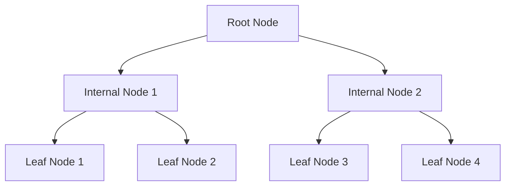

# PostgreSQL B-tree Indexes

## Introduction

When working with databases, performance is a critical factor, especially as your data grows. One of the most fundamental ways to improve query performance in PostgreSQL is through the use of indexes. Among the various index types available, B-tree indexes are the most common and versatile.

In this guide, we'll explore B-tree indexes in PostgreSQL - what they are, how they work, when to use them, and how to implement them effectively. By the end of this tutorial, you'll have a solid understanding of how to leverage B-tree indexes to significantly improve your database's performance.

## What are B-tree Indexes?

B-tree (Balanced tree) indexes are the default index type in PostgreSQL. They're designed to efficiently handle queries that use equality and range operators (`=`, `<`, `>`, `<=`, `>=`, `BETWEEN`, `IN`, `IS NULL`, `IS NOT NULL`), as well as pattern matching operators that work on the beginning of strings (`LIKE 'prefix%'`).

A B-tree index organizes data in a tree-like structure that maintains balance and enables quick data retrieval:



Each node in a B-tree contains sorted key values and pointers to child nodes or data rows. This structure allows PostgreSQL to quickly navigate to the exact location of the data you're looking for, without having to scan the entire table.

## When to Use B-tree Indexes

B-tree indexes are ideal for:

1. Columns frequently used in `WHERE`, `JOIN`, and `ORDER BY` clauses
2. Columns with high cardinality (many unique values)
3. Queries searching for specific values or ranges of values
4. Columns used in sorting operations

B-tree indexes are the default choice for most scenarios because of their versatility and efficiency.

## Creating B-tree Indexes in PostgreSQL

Let's look at how to create B-tree indexes in PostgreSQL with some practical examples.

### Basic Syntax

```sql
CREATE INDEX index_name ON table_name (column_name);
```

This creates a standard B-tree index by default. You don't need to explicitly specify `USING btree` since it's the default, but you can for clarity:

```sql
CREATE INDEX index_name ON table_name USING btree (column_name);
```

### Practical Examples

Let's create a sample table for our examples:

```sql
CREATE TABLE users (
    user_id SERIAL PRIMARY KEY,
    username VARCHAR(50) UNIQUE NOT NULL,
    email VARCHAR(100) UNIQUE NOT NULL,
    first_name VARCHAR(50) NOT NULL,
    last_name VARCHAR(50) NOT NULL,
    date_of_birth DATE,
    created_at TIMESTAMP DEFAULT CURRENT_TIMESTAMP
);
```

#### Example 1: Simple B-tree Index

Let's create an index on the `last_name` column, which might be frequently used in search queries:

```sql
CREATE INDEX idx_users_last_name ON users (last_name);
```

Now, queries like the following will be faster:

```sql
SELECT * FROM users WHERE last_name = 'Smith';
```

#### Example 2: Multi-Column B-tree Index

For queries that filter on multiple columns, we can create a multi-column index:

```sql
CREATE INDEX idx_users_name ON users (last_name, first_name);
```

This index will be useful for queries like:

```sql
SELECT * FROM users WHERE last_name = 'Smith' AND first_name = 'John';
```

It's important to note that the order of columns matters in multi-column indexes. This index will be efficient for queries filtering on `last_name` alone or `last_name` and `first_name` together, but not for queries filtering only on `first_name`.

#### Example 3: Index with INCLUDE Clause (PostgreSQL 11+)

For queries that not only filter but also select specific columns, you can use the `INCLUDE` clause to add non-key columns to the leaf nodes of the index:

```sql
CREATE INDEX idx_users_email_include_names 
ON users (email) 
INCLUDE (first_name, last_name);
```

This can improve performance for queries like:

```sql
SELECT email, first_name, last_name FROM users WHERE email = 'example@email.com';
```

Because all the required data is already in the index, PostgreSQL can perform an "index-only scan" without having to look up the actual table data.

## Analyzing B-tree Index Performance

To see if your indexes are being used effectively, you can use the `EXPLAIN ANALYZE` command:

```sql
EXPLAIN ANALYZE 
SELECT * FROM users WHERE last_name = 'Smith';
```

Output might look something like:

```
Index Scan using idx_users_last_name on users  
  (cost=0.29..8.31 rows=5 width=102) (actual time=0.019..0.022 rows=3 loops=1)
  Index Cond: (last_name = 'Smith'::text)
Planning Time: 0.062 ms
Execution Time: 0.039 ms
```

If you see "Index Scan" in the output, it means your index is being used. If you see "Sequential Scan" instead, PostgreSQL is scanning the entire table, which could indicate that your index isn't helpful for this particular query.

## Best Practices for B-tree Indexes

### 1. Don't Over-Index

Each index takes up disk space and slows down write operations (INSERT, UPDATE, DELETE). Only create indexes on columns that are frequently queried.

### 2. Consider Column Order in Multi-Column Indexes

In multi-column indexes, put the most frequently filtered column first, followed by columns often used together in the same query.

### 3. Regularly Maintain Your Indexes

Over time, indexes can become fragmented and less efficient. Use `REINDEX` to rebuild them:

```sql
REINDEX INDEX idx_users_last_name;
```

### 4. Monitor Index Usage

You can check if your indexes are being used with the pg_stat_user_indexes view:

```sql
SELECT idxname, idx_scan 
FROM pg_stat_user_indexes 
WHERE relname = 'users';
```

Low `idx_scan` values might indicate unused indexes that could be candidates for removal.

### 5. Use Partial Indexes for Specific Conditions

If you frequently query only a subset of your data, consider a partial index:

```sql
CREATE INDEX idx_active_users ON users (user_id) WHERE active = true;
```

This creates a smaller, more efficient index only on active users.

## When B-tree Indexes Might Not Be Ideal

While B-tree indexes are versatile, they're not always the best choice:

1. For full-text search, consider GIN or GiST indexes with tsvector
2. For geospatial data, consider GiST indexes
3. For exact matches on very large text fields, consider hash indexes
4. For queries with complex expressions, consider functional indexes

## Summary

B-tree indexes are the default and most versatile indexing method in PostgreSQL. They provide efficient data retrieval for equality and range operations, making them suitable for most common database queries.

Key points to remember:
- B-tree indexes work well for columns used in WHERE, JOIN, and ORDER BY clauses
- They're automatically created for PRIMARY KEY and UNIQUE constraints
- Multi-column indexes should be ordered based on query patterns
- Regularly analyze and maintain your indexes for optimal performance

By understanding and properly implementing B-tree indexes, you can significantly improve your PostgreSQL database's performance, especially as your data grows in size.

## Exercises

1. Create a table with at least 1000 rows and compare the performance of a query with and without a B-tree index.
2. Experiment with different column orders in a multi-column index and observe how it affects different query patterns.
3. Create a partial index for a specific condition and compare its size and performance to a full index.

## Additional Resources

- [PostgreSQL Documentation: Indexes](https://www.postgresql.org/docs/current/indexes.html)
- [PostgreSQL: Documentation: B-Tree Implementation](https://www.postgresql.org/docs/current/btree-implementation.html)
- [Use the Index, Luke!](https://use-the-index-luke.com/) - A guide to database performance for developers