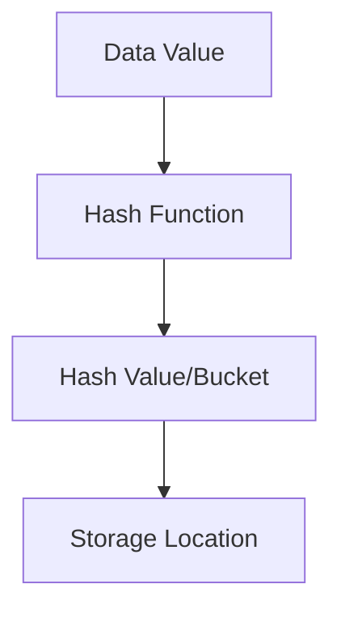

# PostgreSQL Hash Indexes

## Introduction

Hash indexes are one of the several indexing methods available in PostgreSQL. Unlike the default B-tree indexes which excel at range queries, hash indexes are specifically optimized for equality comparisons (`column = value`). In this guide, we'll explore how hash indexes work, when to use them, their advantages and limitations, and how to implement them in your PostgreSQL databases.

## What are Hash Indexes?

Hash indexes use a hash function to convert a key value into a bucket number, which is then used to locate the data. This makes them extremely efficient for simple equality operations but unsuitable for range or pattern matching queries.



A hash index works by:
1. Taking the indexed column value
2. Applying a hash function to convert it to a fixed-size value
3. Using that hash value to determine where the data is stored
4. Providing direct access to the data when queried with an exact match

## When to Use Hash Indexes

Hash indexes are ideal in specific scenarios:

- When you primarily perform equality (`=`) comparisons
- When you need faster lookup times than B-tree indexes for exact matches
- For columns with high cardinality (many unique values)
- When range queries are not needed on the indexed column

## Creating a Hash Index

The syntax for creating a hash index is straightforward:

```sql
CREATE INDEX index_name ON table_name USING HASH (column_name);
```

Let's create a practical example with a users table:

```sql
-- Create a users table
CREATE TABLE users (
    user_id SERIAL PRIMARY KEY,
    username VARCHAR(50) UNIQUE,
    email VARCHAR(100) UNIQUE,
    full_name VARCHAR(100),
    created_at TIMESTAMP DEFAULT CURRENT_TIMESTAMP
);

-- Create a hash index on the username column
CREATE INDEX idx_users_username_hash ON users USING HASH (username);
```

## Hash Index Performance

Let's compare the performance of hash indexes with B-tree indexes using a simple benchmark:

```sql
-- First, let's populate our table with sample data
INSERT INTO users (username, email, full_name)
SELECT 
    'user' || i,
    'user' || i || '@example.com',
    'User ' || i
FROM generate_series(1, 100000) AS i;

-- Let's analyze the table to update statistics
ANALYZE users;

-- Query using the hash index (equality comparison)
EXPLAIN ANALYZE SELECT * FROM users WHERE username = 'user5000';
```

The output might look like this:

```
Index Scan using idx_users_username_hash on users  
  (cost=0.00..8.02 rows=1 width=62)
  (actual time=0.016..0.017 rows=1 loops=1)
  Index Cond: (username = 'user5000'::text)
Planning time: 0.067 ms
Execution time: 0.041 ms
```

Now, let's create a B-tree index and compare:

```sql
-- Create a B-tree index on the same column
CREATE INDEX idx_users_username_btree ON users USING BTREE (username);

-- Query using the B-tree index
EXPLAIN ANALYZE SELECT * FROM users WHERE username = 'user5000';
```

The output might be:

```
Index Scan using idx_users_username_btree on users  
  (cost=0.42..8.44 rows=1 width=62)
  (actual time=0.021..0.022 rows=1 loops=1)
  Index Cond: (username = 'user5000'::text)
Planning time: 0.103 ms
Execution time: 0.046 ms
```

For equality searches on large tables, the hash index often performs slightly better than the B-tree index.

## Advantages of Hash Indexes

1. **Speed for equality searches**: Hash indexes can be faster than B-tree indexes for simple equality operations.
2. **Smaller size**: They can consume less disk space than B-tree indexes in some cases.
3. **Constant-time lookups**: Theoretically provide O(1) lookup performance regardless of table size.

## Limitations of Hash Indexes

1. **Equality only**: Hash indexes only support equality (`=`) operators, not inequality (`<`, `>`, `<=`, `>=`), range queries, or pattern matching.
2. **No sorting**: They don't store data in sorted order.
3. **No multi-column**: Prior to PostgreSQL 10, hash indexes only worked on a single column.
4. **Concurrency**: In older PostgreSQL versions, hash indexes were not WAL-logged, making them unsuitable for replication or crash recovery.

## Real-World Applications

### Example 1: Session Lookup

Hash indexes are perfect for session management where lookups are always by exact session ID:

```sql
CREATE TABLE sessions (
    session_id VARCHAR(128) PRIMARY KEY,
    user_id INTEGER REFERENCES users(user_id),
    data JSONB,
    expires_at TIMESTAMP,
    created_at TIMESTAMP DEFAULT CURRENT_TIMESTAMP
);

-- Create a hash index on session_id for fast lookups
CREATE INDEX idx_sessions_id_hash ON sessions USING HASH (session_id);
```

When a user makes a request with their session ID:

```sql
-- This query benefits from the hash index
SELECT * FROM sessions WHERE session_id = 'fd7e42f09a71';
```

### Example 2: Cache Implementation

Hash indexes are ideal for cache tables with exact key lookups:

```sql
CREATE TABLE cache (
    cache_key VARCHAR(255) NOT NULL,
    cache_value TEXT,
    expires_at TIMESTAMP,
    created_at TIMESTAMP DEFAULT CURRENT_TIMESTAMP
);

CREATE INDEX idx_cache_key_hash ON cache USING HASH (cache_key);
```

When retrieving a cached item:

```sql
-- Fast exact match using hash index
SELECT cache_value FROM cache 
WHERE cache_key = 'user:preferences:1001' AND expires_at > NOW();
```

## When to Avoid Hash Indexes

Avoid hash indexes when:

1. You need to perform range queries (`BETWEEN`, `<`, `>`)
2. You frequently use `LIKE` or pattern matching
3. You need to retrieve data in sorted order
4. You're using PostgreSQL version 9.6 or earlier (before they were WAL-logged)
5. The indexed column has low cardinality (few unique values)

## Practical Tips

1. **Test before implementing**: Always benchmark your specific workload before deciding on an index type.
2. **Monitor index usage**: Use `pg_stat_user_indexes` to check if your indexes are being used.
3. **Consider index size**: Monitor the size of your indexes using:

```sql
SELECT pg_size_pretty(pg_relation_size('idx_users_username_hash'));
```

4. **Maintenance**: Hash indexes benefit from occasional `VACUUM` and `ANALYZE` operations:

```sql
VACUUM ANALYZE users;
```

## Summary

Hash indexes in PostgreSQL provide a specialized indexing method optimized for equality comparisons. They offer faster lookups than B-tree indexes for exact matches but cannot handle range queries or sorting operations. PostgreSQL has made hash indexes fully production-ready since version 10, with WAL-logging and improved performance.

When designing your database schema, consider hash indexes for columns that will be queried frequently with exact matches, especially in high-volume lookup tables or caching systems.

## Additional Resources

- [PostgreSQL Official Documentation on Indexes](https://www.postgresql.org/docs/current/indexes.html)
- [PostgreSQL Hash Indexes Documentation](https://www.postgresql.org/docs/current/hash-indexes.html)

## Exercises

1. Create a table with at least 100,000 rows and compare the performance of hash vs. B-tree indexes for equality searches.
2. Implement a simple caching system using a PostgreSQL table with a hash index.
3. Use `EXPLAIN ANALYZE` to observe how the query planner uses hash indexes in different scenarios.
4. Create a benchmark that tests at what data volume hash indexes start to outperform B-tree indexes for your specific hardware.