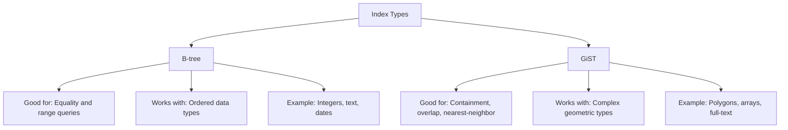

# PostgreSQL GiST Indexes

## Introduction

When working with PostgreSQL, choosing the right index type can significantly impact your database performance. While B-tree indexes work well for standard data types and equality/range comparisons, they aren't suitable for all scenarios. This is where Generalized Search Tree (GiST) indexes come in.

GiST (Generalized Search Tree) is a flexible indexing framework in PostgreSQL that allows you to define custom indexing methods. Unlike B-tree indexes that are designed primarily for ordered data, GiST indexes excel at handling complex data types and specialized queries, particularly for:

- Geometric and spatial data
- Full-text search
- Range queries on multiple columns
- Custom data types with complex comparison operations

This guide will help you understand when and how to use GiST indexes to optimize your PostgreSQL databases.

## Understanding GiST Indexes

### What is a GiST Index?

A GiST index is an extensible indexing mechanism that allows PostgreSQL to efficiently query data that doesn't fit neatly into the ordered comparison model of B-tree indexes.

GiST stands for "Generalized Search Tree," which indicates its flexibility - it can be adapted to handle many different types of searches. Under the hood, GiST provides a framework that can be extended to support various indexing strategies.

### How GiST Differs from B-tree

Let's compare GiST with the standard B-tree index:



## When to Use GiST Indexes

GiST indexes are particularly useful in the following scenarios:

1. **Geometric or Spatial Data**: When you need to search for points within an area, find overlapping regions, or perform distance calculations.
2. **Full-Text Search**: For natural language processing and document similarity searches.
3. **Range Types**: When working with ranges and needing to check for overlaps.
4. **Custom Data Types**: When you've defined your own data types with complex comparison semantics.

## Creating a GiST Index

The basic syntax for creating a GiST index is:

```sql
CREATE INDEX index_name ON table_name USING GIST (column_name);
```

For multiple columns:

```sql
CREATE INDEX index_name ON table_name USING GIST (column1, column2);
```

## Practical Examples

Let's explore some common use cases for GiST indexes with examples.

### Example 1: Spatial Data with PostGIS

PostGIS extends PostgreSQL with geometric data types and functions. GiST indexes are essential for efficient spatial queries.

First, let's create a table to store location data:

```sql
-- Enable PostGIS extension if not already enabled
CREATE EXTENSION IF NOT EXISTS postgis;

-- Create a table for storing points of interest
CREATE TABLE points_of_interest (
    id SERIAL PRIMARY KEY,
    name TEXT,
    location GEOMETRY(Point, 4326),
    description TEXT
);

-- Create a GiST index on the location column
CREATE INDEX idx_poi_location ON points_of_interest USING GIST (location);
```

Now, let's insert some sample data:

```sql
INSERT INTO points_of_interest (name, location, description)
VALUES 
    ('Eiffel Tower', ST_SetSRID(ST_MakePoint(2.2945, 48.8584), 4326), 'Famous landmark in Paris'),
    ('Statue of Liberty', ST_SetSRID(ST_MakePoint(-74.0445, 40.6892), 4326), 'Monument in New York'),
    ('Sydney Opera House', ST_SetSRID(ST_MakePoint(151.2153, -33.8568), 4326), 'Performing arts center');
```

Now we can perform efficient spatial queries:

```sql
-- Find all points of interest within 5km of a specific location (Central Paris)
SELECT name, description, 
       ST_Distance(
           location, 
           ST_SetSRID(ST_MakePoint(2.3522, 48.8566), 4326)::geography
       ) / 1000 AS distance_km
FROM points_of_interest
WHERE ST_DWithin(
    location::geography, 
    ST_SetSRID(ST_MakePoint(2.3522, 48.8566), 4326)::geography, 
    5000
)
ORDER BY distance_km;
```

The output might look like:

```
      name      |        description         | distance_km
----------------+----------------------------+-------------
 Eiffel Tower   | Famous landmark in Paris  |    4.1023
```

This query is highly efficient because the GiST index allows PostgreSQL to quickly identify which points are within the specified distance without scanning the entire table.

### Example 2: Range Types

GiST indexes are well-suited for range types, which represent a range of values (like a time period or a numeric range).

Let's create a table for hotel room bookings:

```sql
-- Create a table for room bookings with date ranges
CREATE TABLE room_bookings (
    booking_id SERIAL PRIMARY KEY,
    room_number INTEGER,
    stay_period DATERANGE,
    guest_name TEXT
);

-- Create a GiST index on the date range column
CREATE INDEX idx_room_bookings_stay_period ON room_bookings USING GIST (stay_period);
```

Now, let's add some sample bookings:

```sql
INSERT INTO room_bookings (room_number, stay_period, guest_name)
VALUES 
    (101, '[2023-05-01, 2023-05-05)', 'John Smith'),
    (102, '[2023-05-02, 2023-05-08)', 'Jane Doe'),
    (101, '[2023-05-10, 2023-05-15)', 'Robert Johnson');
```

We can efficiently check for availability or conflicts:

```sql
-- Check if room 101 is available for a specific date range
SELECT booking_id, room_number, stay_period, guest_name
FROM room_bookings
WHERE room_number = 101 
AND stay_period && '[2023-05-03, 2023-05-07)'::daterange;
```

The output would be:

```
 booking_id | room_number |      stay_period      | guest_name
------------+-------------+-----------------------+-------------
          1 |         101 | [2023-05-01,2023-05-05) | John Smith
```

This query is optimized by the GiST index, which allows for efficient range overlap checks.

### Example 3: Full-Text Search

GiST can be used for full-text search, although the specialized GIN index is often preferable for static data. Let's see a GiST example:

```sql
-- Create a table for documents
CREATE TABLE documents (
    id SERIAL PRIMARY KEY,
    title TEXT,
    content TEXT
);

-- Add a column for the text search vector
ALTER TABLE documents ADD COLUMN content_tsv TSVECTOR;

-- Create a function to update the search vector
CREATE FUNCTION documents_update_trigger() RETURNS trigger AS $$
BEGIN
    NEW.content_tsv := to_tsvector('english', NEW.title || ' ' || NEW.content);
    RETURN NEW;
END
$$ LANGUAGE plpgsql;

-- Create a trigger to keep the search vector updated
CREATE TRIGGER documents_update
BEFORE INSERT OR UPDATE ON documents
FOR EACH ROW EXECUTE FUNCTION documents_update_trigger();

-- Create a GiST index on the text search vector
CREATE INDEX idx_documents_content_tsv ON documents USING GIST (content_tsv);
```

Let's add some sample documents:

```sql
INSERT INTO documents (title, content)
VALUES 
    ('PostgreSQL Indexing', 'How to use different index types in PostgreSQL for better performance'),
    ('Database Optimization', 'Techniques for optimizing database queries and schema design'),
    ('GiST Indexes in PostgreSQL', 'Understanding and implementing GiST indexes for complex data types');
```

Now we can perform a full-text search:

```sql
-- Search for documents containing 'index' and 'performance'
SELECT id, title, content
FROM documents
WHERE content_tsv @@ to_tsquery('english', 'index & performance');
```

The output might be:

```
 id |       title        |                              content
----+--------------------+-------------------------------------------------------------------
  1 | PostgreSQL Indexing | How to use different index types in PostgreSQL for better performance
```

## Performance Considerations

When working with GiST indexes, keep these factors in mind:

1. **Size**: GiST indexes are typically larger than B-tree indexes.
2. **Build Time**: They can take longer to build initially.
3. **Update Cost**: Insertions and updates might be slower compared to B-tree indexes.
4. **Query Performance**: They excel at specialized queries but might be slower for simple equality checks.

To monitor GiST index performance, use:

```sql
-- Check index size
SELECT pg_size_pretty(pg_relation_size('idx_poi_location')) AS index_size;

-- Check index usage statistics
SELECT * FROM pg_stat_user_indexes WHERE indexrelname = 'idx_poi_location';
```

## Maintaining GiST Indexes

Like other indexes, GiST indexes benefit from regular maintenance:

```sql
-- Rebuild an index to remove bloat
REINDEX INDEX idx_poi_location;

-- Analyze to update statistics
ANALYZE points_of_interest;
```

## Common Use Cases

GiST indexes are particularly valuable in:

1. **Geographic Information Systems (GIS)**: For storing and querying maps, locations, and spatial relationships.
2. **Reservation Systems**: For checking availability and preventing double bookings using range overlaps.
3. **Document Management**: For similarity searches and content classification.
4. **Network Analysis**: For graph data structures and pathfinding algorithms.

## Summary

GiST indexes provide a powerful mechanism for optimizing queries on complex data types in PostgreSQL. They're particularly valuable when dealing with:

- Geometric and spatial data
- Range queries and overlap operations
- Full-text search
- Custom data types with non-standard comparison semantics

By understanding when and how to use GiST indexes, you can significantly improve the performance of your PostgreSQL database for specific use cases that go beyond what traditional B-tree indexes can efficiently handle.

## Additional Resources

To deepen your understanding of GiST indexes:

- [PostgreSQL Documentation on GiST Indexes](https://www.postgresql.org/docs/current/gist-intro.html)
- [PostGIS Documentation](https://postgis.net/documentation/)
- [PostgreSQL Text Search Documentation](https://www.postgresql.org/docs/current/textsearch.html)

## Exercises

1. Create a table to store rectangles and implement a GiST index to find all rectangles that contain a specific point.
2. Implement a reservation system using daterange and GiST indexes to check for availability.
3. Compare the performance of GiST and GIN indexes for full-text search on a large document collection.
4. Create a custom data type and implement GiST support for it to handle specialized queries.