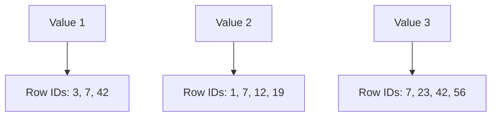

# PostgreSQL GIN Indexes

## Introduction

When working with complex data types in PostgreSQL, standard B-tree indexes aren't always the best choice. This is where GIN (Generalized Inverted Index) comes in - a powerful indexing technique specifically designed for handling composite values where a single column contains multiple searchable items.

GIN indexes are particularly useful when you need to query:
- Arrays
- JSON/JSONB data
- Full-text search documents
- Range types

Unlike B-tree indexes that work well for scalar values and simple equality/range operations, GIN indexes excel at answering "contains" queries like "Which documents contain these words?" or "Which rows have an array containing this element?"

## How GIN Indexes Work

GIN stands for Generalized Inverted Index. The term "inverted" refers to how the index is structured - instead of mapping row identifiers to values, it maps values to sets of row identifiers.



This structure makes GIN particularly efficient for searches where you need to find all rows containing specific elements, as the mapping directly points to relevant rows.

At a high level, GIN works by:
1. Extracting individual items from composite values (e.g., words from text, elements from arrays)
2. Creating an inverted index where each extracted item points to the rows containing it
3. Using fast set operations (intersections, unions) to process complex queries

## When to Use GIN Indexes

GIN indexes are ideal for the following scenarios:

1. **Full-text search**: When you need to search document content efficiently
2. **Array searching**: When querying for array elements using operators like `@>`, `<@`, `&&`
3. **JSONB data**: When you need to look up specific keys or values in JSON data
4. **Custom data types**: When working with complex data types that can be broken down into components

However, GIN indexes come with trade-offs:

- **Slower to build and update**: GIN indexes take longer to create and update compared to B-tree indexes
- **Larger storage size**: They typically require more disk space
- **Great for read-heavy workloads**: Optimal for databases with many searches but infrequent updates

## Creating GIN Indexes

The syntax for creating a GIN index is straightforward:

```sql
CREATE INDEX index_name ON table_name USING GIN (column_name);
```

For special data types, you might need to specify an operator class:

```sql
CREATE INDEX index_name ON table_name USING GIN (column_name operator_class);
```

Let's explore practical examples for different data types.

## GIN Indexes for Arrays

Arrays are a perfect use case for GIN indexes, especially when you frequently search for specific array elements.

### Example: Setting Up an Array Table

```sql
CREATE TABLE products (
  id SERIAL PRIMARY KEY,
  name TEXT,
  categories TEXT[]
);

-- Insert sample data
INSERT INTO products (name, categories) VALUES
  ('Laptop', ARRAY['electronics', 'computers', 'office']),
  ('Desk Chair', ARRAY['furniture', 'office']),
  ('Coffee Machine', ARRAY['appliances', 'kitchen', 'electronics']),
  ('Bookshelf', ARRAY['furniture', 'home']),
  ('Smartphone', ARRAY['electronics', 'mobile', 'gadgets']);
```

### Creating an Array GIN Index

```sql
CREATE INDEX idx_products_categories ON products USING GIN (categories);
```

### Using the Array GIN Index

Now you can efficiently run queries to find products by category:

```sql
-- Find products in the 'electronics' category
SELECT name FROM products WHERE categories @> ARRAY['electronics'];
```

**Output:**
```
  name    
----------
 Laptop
 Coffee Machine
 Smartphone
```

The `@>` operator checks if the left array contains the right array. Other useful array operators include:

- `<@`: Is contained by
- `&&`: Overlaps with (has elements in common)

With the GIN index, these operations become much faster, especially with large tables.

## GIN Indexes for JSONB

JSONB is PostgreSQL's binary JSON format, designed for efficient storage and querying of JSON data.

### Example: Setting Up a JSONB Table

```sql
CREATE TABLE user_profiles (
  id SERIAL PRIMARY KEY,
  profile JSONB
);

-- Insert sample data
INSERT INTO user_profiles (profile) VALUES
  ('{"name": "Alice", "age": 28, "skills": ["Python", "SQL"], "address": {"city": "New York", "zip": "10001"}}'),
  ('{"name": "Bob", "age": 34, "skills": ["JavaScript", "React"], "address": {"city": "Boston", "zip": "02108"}}'),
  ('{"name": "Charlie", "age": 23, "skills": ["Python", "Java", "C++"], "interests": ["hiking", "photography"]}'),
  ('{"name": "Diana", "age": 31, "skills": ["SQL", "Tableau"], "address": {"city": "New York", "zip": "10016"}}');
```

### Creating a JSONB GIN Index

For JSONB data, you can create different types of GIN indexes depending on your query patterns:

```sql
-- Index for containment operators (@>, ?, ?&, ?| operators)
CREATE INDEX idx_user_profiles_gin ON user_profiles USING GIN (profile);

-- Index for path-specific operations (more compact for specific key lookups)
CREATE INDEX idx_user_profiles_path_ops ON user_profiles USING GIN (profile jsonb_path_ops);
```

The difference between these two:
- The default GIN index supports all JSONB operators but is larger
- The `jsonb_path_ops` index only supports the containment operator `@>` but is more compact and faster for those queries

### Using the JSONB GIN Index

```sql
-- Find users who know Python
SELECT id, profile->'name' AS name 
FROM user_profiles 
WHERE profile @> '{"skills": ["Python"]}';
```

**Output:**
```
 id |   name    
----+-----------
  1 | "Alice"
  3 | "Charlie"
```

```sql
-- Find users who live in New York
SELECT id, profile->'name' AS name 
FROM user_profiles 
WHERE profile @> '{"address": {"city": "New York"}}';
```

**Output:**
```
 id |  name   
----+---------
  1 | "Alice"
  4 | "Diana"
```

## GIN Indexes for Full-Text Search

One of the most powerful applications of GIN indexes is for full-text search operations using PostgreSQL's built-in text search capabilities.

### Example: Setting Up a Text Search Table

```sql
CREATE TABLE articles (
  id SERIAL PRIMARY KEY,
  title TEXT,
  content TEXT,
  published_date DATE,
  
  -- These columns will hold the tsvector (text search vector) data
  title_tsv TSVECTOR,
  content_tsv TSVECTOR
);

-- Insert sample data
INSERT INTO articles (title, content, published_date) VALUES
  ('PostgreSQL Indexing Strategies', 'This article covers various indexing options in PostgreSQL including B-tree, GIN, and GiST indexes.', '2023-06-15'),
  ('Optimizing Database Performance', 'Learn how to improve your database performance through proper indexing, query optimization, and server configuration.', '2023-07-22'),
  ('Introduction to Full-Text Search', 'Full-text search allows you to find relevant documents based on natural language queries and ranking algorithms.', '2023-08-05'),
  ('JSON Data in PostgreSQL', 'PostgreSQL offers robust support for JSON data with specialized operators and indexing techniques.', '2023-09-10');

-- Update with tsvector data
UPDATE articles 
SET 
  title_tsv = to_tsvector('english', title),
  content_tsv = to_tsvector('english', content);
```

### Creating a Text Search GIN Index

```sql
-- Create GIN indexes on the tsvector columns
CREATE INDEX idx_articles_title_tsv ON articles USING GIN (title_tsv);
CREATE INDEX idx_articles_content_tsv ON articles USING GIN (content_tsv);
```

### Using the Text Search GIN Index

Now you can perform efficient full-text searches:

```sql
-- Search for articles about "indexing"
SELECT id, title 
FROM articles 
WHERE title_tsv @@ to_tsquery('english', 'indexing');
```

**Output:**
```
 id |              title              
----+---------------------------------
  1 | PostgreSQL Indexing Strategies
```

```sql
-- Search for articles about "performance" or "optimization" in content
SELECT id, title 
FROM articles 
WHERE content_tsv @@ to_tsquery('english', 'performance | optimization');
```

**Output:**
```
 id |              title               
----+----------------------------------
  2 | Optimizing Database Performance
```

### Maintaining Text Search Columns with Triggers

For production use, you'll want to automatically update the tsvector columns when the original text changes:

```sql
-- Create a function to update tsvector columns
CREATE OR REPLACE FUNCTION update_article_tsv() RETURNS TRIGGER AS $$
BEGIN
  NEW.title_tsv = to_tsvector('english', NEW.title);
  NEW.content_tsv = to_tsvector('english', NEW.content);
  RETURN NEW;
END;
$$ LANGUAGE plpgsql;

-- Create a trigger to call this function before insert or update
CREATE TRIGGER article_tsv_update
BEFORE INSERT OR UPDATE ON articles
FOR EACH ROW EXECUTE FUNCTION update_article_tsv();
```

## Performance Considerations

When working with GIN indexes, keep these performance considerations in mind:

1. **Index Size**: GIN indexes can be significantly larger than B-tree indexes, sometimes 2-3 times larger than the indexed data.

2. **Build Time**: Creating a GIN index on a large table can take considerable time. Consider building them during low-traffic periods or using `CREATE INDEX CONCURRENTLY`.

3. **Fast-Update Technique**: By default, GIN indexes use a "fast update" technique that delays index maintenance by storing pending entries in a separate list. You can control this behavior with the `fastupdate` storage parameter:

```sql
CREATE INDEX idx_name ON table_name USING GIN (column) WITH (fastupdate = off);
```

4. **GIN Pending List Limit**: You can adjust how often the pending list is processed:

```sql
SET gin_pending_list_limit = 4096;  -- Default is 4MB
```

5. **Maintenance**: Regular `VACUUM` and `ANALYZE` operations are important for GIN indexes to maintain good performance.

## Real-World Example: Product Search System

Let's bring everything together with a more complex example that models a product search system:

```sql
-- Create a product catalog table
CREATE TABLE product_catalog (
  id SERIAL PRIMARY KEY,
  name TEXT NOT NULL,
  description TEXT,
  categories TEXT[],
  attributes JSONB,
  created_at TIMESTAMP DEFAULT CURRENT_TIMESTAMP,
  
  -- Text search vectors
  name_tsv TSVECTOR,
  description_tsv TSVECTOR
);

-- Insert sample data
INSERT INTO product_catalog (name, description, categories, attributes) VALUES
  ('Pro Gaming Laptop', 'High-performance gaming laptop with RGB keyboard and powerful GPU for smooth gaming experience', 
   ARRAY['electronics', 'computers', 'gaming'], 
   '{"specs": {"cpu": "Intel i9", "ram": "32GB", "storage": "1TB SSD", "gpu": "RTX 4080"}, "color": "black", "weight_kg": 2.5}'),
  
  ('Ergonomic Office Chair', 'Comfortable office chair with lumbar support and adjustable height for long work sessions', 
   ARRAY['furniture', 'office', 'ergonomic'], 
   '{"material": "mesh", "color": "gray", "adjustable": true, "max_weight_kg": 150}'),
   
  ('Smart Coffee Machine', 'Programmable coffee maker with smartphone app control and multiple brewing options', 
   ARRAY['appliances', 'kitchen', 'smart home'], 
   '{"features": ["programmable", "app control", "temperature control"], "capacity_liters": 1.5, "color": "silver"}'),
   
  ('Wireless Gaming Mouse', 'Ultra-responsive wireless gaming mouse with customizable buttons and RGB lighting', 
   ARRAY['electronics', 'gaming', 'accessories'], 
   '{"dpi": 25600, "buttons": 8, "battery_life_hours": 70, "rgb": true, "color": "black"}');

-- Update tsvector columns
UPDATE product_catalog SET
  name_tsv = to_tsvector('english', name),
  description_tsv = to_tsvector('english', description);

-- Create appropriate GIN indexes
CREATE INDEX idx_product_categories ON product_catalog USING GIN (categories);
CREATE INDEX idx_product_attributes ON product_catalog USING GIN (attributes);
CREATE INDEX idx_product_name_tsv ON product_catalog USING GIN (name_tsv);
CREATE INDEX idx_product_description_tsv ON product_catalog USING GIN (description_tsv);

-- Create maintenance trigger
CREATE OR REPLACE FUNCTION update_product_tsv() RETURNS TRIGGER AS $$
BEGIN
  NEW.name_tsv = to_tsvector('english', NEW.name);
  NEW.description_tsv = to_tsvector('english', NEW.description);
  RETURN NEW;
END;
$$ LANGUAGE plpgsql;

CREATE TRIGGER product_tsv_update
BEFORE INSERT OR UPDATE ON product_catalog
FOR EACH ROW EXECUTE FUNCTION update_product_tsv();
```

Now, you can perform advanced searches that combine multiple aspects:

```sql
-- Find gaming products that have RGB features
SELECT name 
FROM product_catalog 
WHERE categories @> ARRAY['gaming'] 
AND (description_tsv @@ to_tsquery('english', 'rgb') 
     OR attributes @> '{"rgb": true}');
```

**Output:**
```
        name         
---------------------
 Pro Gaming Laptop
 Wireless Gaming Mouse
```

```sql
-- Find furniture items made of mesh material
SELECT name 
FROM product_catalog 
WHERE categories @> ARRAY['furniture'] 
AND attributes @> '{"material": "mesh"}';
```

**Output:**
```
         name          
-----------------------
 Ergonomic Office Chair
```

This example demonstrates how GIN indexes can power a flexible, high-performance product search system that combines full-text search, array containment, and JSONB querying.

## Monitoring GIN Index Usage

To ensure your GIN indexes are being used effectively, you can use the `EXPLAIN ANALYZE` command to inspect query execution plans:

```sql
EXPLAIN ANALYZE 
SELECT name FROM product_catalog 
WHERE categories @> ARRAY['gaming'];
```

You should see the GIN index being used in the execution plan:

```
                                          QUERY PLAN                                           
-----------------------------------------------------------------------------------------------
 Bitmap Heap Scan on product_catalog  (cost=8.02..12.04 rows=1 width=32) (actual time=0.017..0.018 rows=2 loops=1)
   Recheck Cond: (categories @> '{gaming}'::text[])
   Heap Blocks: exact=1
   ->  Bitmap Index Scan on idx_product_categories  (cost=0.00..8.02 rows=1 width=0) (actual time=0.011..0.011 rows=2 loops=1)
         Index Cond: (categories @> '{gaming}'::text[])
 Planning Time: 0.092 ms
 Execution Time: 0.043 ms
```

## Summary

GIN indexes are a powerful tool in PostgreSQL's indexing arsenal, providing efficient querying for:

- Array data using containment operators
- JSONB data for complex document querying
- Full-text search with high-performance text matching
- Other composite data types that can be broken down into searchable items

Key points to remember about GIN indexes:

1. They build "inverted" indexes mapping values to sets of row identifiers
2. They excel at answering "contains" questions
3. They're slower to build and update than B-tree indexes
4. They require more storage space
5. They're optimized for read-heavy workloads
6. They support various operators depending on the data type

By using GIN indexes appropriately, you can dramatically improve query performance for complex data types in PostgreSQL, enabling advanced search features that would otherwise be prohibitively expensive.

## Additional Resources

- [PostgreSQL Documentation on GIN Indexes](https://www.postgresql.org/docs/current/gin.html)
- [Full Text Search in PostgreSQL](https://www.postgresql.org/docs/current/textsearch.html)
- [Working with JSON in PostgreSQL](https://www.postgresql.org/docs/current/datatype-json.html)

## Practice Exercises

1. Create a table to store book information with a text array for genres and use a GIN index to query books by genre.

2. Implement a simple document storage system using JSONB and GIN indexes that allows searching by document attributes.

3. Build a recipe database with full-text search capabilities using tsvector and GIN indexes.

4. Compare the performance of queries with and without GIN indexes on a large dataset using `EXPLAIN ANALYZE`.

5. Create a hybrid search system that combines array searching, JSONB queries, and full-text search in a single application.