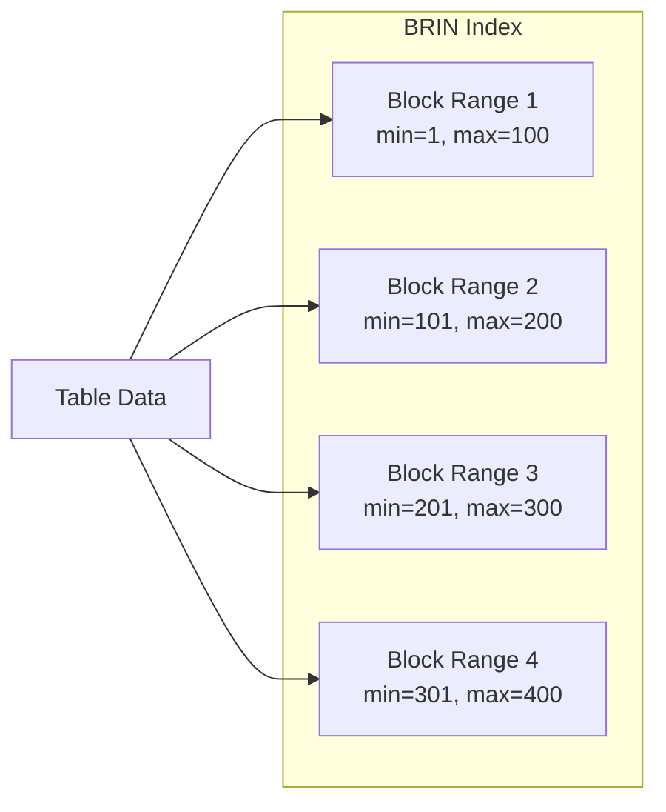

# PostgreSQL BRIN Indexes

## Introduction

When working with large PostgreSQL databases, efficient indexing becomes crucial for maintaining performance. Among PostgreSQL's various indexing options, BRIN (Block Range INdex) indexes offer a compelling solution for specific use cases, particularly with large tables where data has a natural correlation with physical storage order.

BRIN indexes were introduced in PostgreSQL 9.5 and provide a way to create very small but effective indexes for large tables when the data has a natural correlation with its physical location in the table. Unlike traditional B-tree indexes that store an entry for each row, BRIN indexes store summary information about ranges of blocks, making them significantly smaller and faster to maintain.

## What is a BRIN Index?

BRIN stands for **B**lock **R**ange **IN**dex. Unlike B-tree indexes which create separate entries for each value, BRIN indexes work by storing metadata about ranges of pages (blocks) in your table:

- BRIN divides your table into block ranges (by default, 128 blocks per range)
- For each range, it stores the minimum and maximum values for the indexed column(s)
- When querying, PostgreSQL can quickly eliminate entire block ranges that don't match the query conditions



## When to Use BRIN Indexes

BRIN indexes are particularly effective in the following scenarios:

1. **Very large tables** (typically gigabytes or terabytes in size)
2. **Data with physical correlation** (where the indexed column values correlate with physical storage order)
3. **When index size matters** (BRIN indexes are extremely compact)
4. **When some table scan is acceptable** (BRIN provides less precise filtering than B-tree)

Common use cases include:

- Time-series data ordered by timestamp
- Log tables with sequential IDs
- Geographic data sorted by location
- Any naturally ordered data where new rows are appended to the end of the table

## Creating a BRIN Index

The syntax for creating a BRIN index is straightforward:

```sql
CREATE INDEX index_name ON table_name USING brin (column_name);
```

You can also specify the block range size (number of blocks per range):

```sql
CREATE INDEX index_name ON table_name USING brin (column_name) 
WITH (pages_per_range = 32);
```

## Practical Examples

### Example 1: Time-Series Data

Let's create a table for storing temperature readings from IoT devices:

```sql
CREATE TABLE temperature_readings (
    reading_id SERIAL PRIMARY KEY,
    device_id INTEGER NOT NULL,
    timestamp TIMESTAMP NOT NULL,
    temperature NUMERIC(5,2) NOT NULL
);

-- Insert sample data (in real scenarios, this could be millions of rows)
INSERT INTO temperature_readings (device_id, timestamp, temperature)
SELECT 
    (random() * 100)::integer,
    '2023-01-01'::timestamp + (random() * 365 * interval '1 day'),
    (random() * 50)::numeric(5,2)
FROM generate_series(1, 1000000);

-- Create a BRIN index on the timestamp column
CREATE INDEX temperature_timestamp_brin_idx 
ON temperature_readings USING brin (timestamp);
```

Now we can query the data efficiently:

```sql
-- This query can use the BRIN index
EXPLAIN ANALYZE
SELECT * FROM temperature_readings
WHERE timestamp BETWEEN '2023-06-01' AND '2023-06-30';
```

The query planner might show output like:

```
Bitmap Heap Scan on temperature_readings
  Recheck Cond: ((timestamp >= '2023-06-01 00:00:00'::timestamp without time zone) AND (timestamp <= '2023-06-30 00:00:00'::timestamp without time zone))
  ->  Bitmap Index Scan on temperature_timestamp_brin_idx
        Index Cond: ((timestamp >= '2023-06-01 00:00:00'::timestamp without time zone) AND (timestamp <= '2023-06-30 00:00:00'::timestamp without time zone))
```

### Example 2: Log Data with Sequential IDs

For log tables where IDs are assigned sequentially:

```sql
CREATE TABLE application_logs (
    log_id BIGSERIAL PRIMARY KEY,
    app_name VARCHAR(100) NOT NULL,
    log_level VARCHAR(20) NOT NULL,
    message TEXT NOT NULL,
    created_at TIMESTAMP NOT NULL DEFAULT NOW()
);

-- Create a BRIN index on the log_id column
CREATE INDEX logs_id_brin_idx ON application_logs USING brin (log_id);

-- And another on the timestamp
CREATE INDEX logs_timestamp_brin_idx ON application_logs USING brin (created_at);
```

These indexes would be effective for queries like:

```sql
-- Find logs from a specific time period
SELECT * FROM application_logs 
WHERE created_at BETWEEN '2023-10-01' AND '2023-10-02';

-- Find logs with IDs in a specific range
SELECT * FROM application_logs 
WHERE log_id BETWEEN 1000000 AND 2000000;
```

## BRIN vs. B-tree Indexes: A Comparison

Let's compare BRIN and B-tree indexes to understand their trade-offs:

| Characteristic | BRIN | B-tree |
|----------------|------|--------|
| Size | Very small (can be 1000x smaller) | Larger (one entry per row) |
| Maintenance overhead | Low | Higher |
| Query precision | Lower (block ranges) | Higher (exact matches) |
| Best for | Range queries on correlated data | Point lookups, arbitrary data |
| Creation speed | Fast | Slower |
| Update impact | Low | Higher |

## Measuring BRIN Index Effectiveness

You can check the size of your indexes with:

```sql
SELECT pg_size_pretty(pg_relation_size('index_name'));
```

Compare the sizes of BRIN and B-tree indexes:

```sql
-- Create both types of indexes
CREATE INDEX temperature_timestamp_btree_idx 
ON temperature_readings USING btree (timestamp);

CREATE INDEX temperature_timestamp_brin_idx 
ON temperature_readings USING brin (timestamp);

-- Compare their sizes
SELECT 
    'B-tree' AS index_type,
    pg_size_pretty(pg_relation_size('temperature_timestamp_btree_idx')) AS size
UNION ALL
SELECT 
    'BRIN' AS index_type,
    pg_size_pretty(pg_relation_size('temperature_timestamp_brin_idx')) AS size;
```

The output might show:

```
 index_type |  size  
------------+--------
 B-tree     | 21 MB
 BRIN       | 48 kB
```

## Advanced BRIN Features

### Multi-Column BRIN Indexes

You can create BRIN indexes on multiple columns:

```sql
CREATE INDEX multi_column_brin_idx 
ON temperature_readings USING brin (device_id, timestamp);
```

### Different Operator Classes

BRIN supports different operator classes for different data types:

```sql
CREATE INDEX text_minmax_ops_idx 
ON documents USING brin (title text_minmax_ops);
```

### Custom Block Range Size

Adjust the block range size based on your data distribution:

```sql
CREATE INDEX custom_range_brin_idx 
ON temperature_readings USING brin (timestamp) 
WITH (pages_per_range = 64);
```

## Limitations and Considerations

When working with BRIN indexes, keep these limitations in mind:

1. **Correlation requirement**: BRIN indexes are only effective when data is correlated with physical storage order
2. **Less precise**: They eliminate ranges of blocks, not individual rows
3. **Not suitable for** high-cardinality columns with random distribution
4. **Sequential scans still occur**: After using the index, PostgreSQL still needs to scan relevant blocks

## Performance Tuning Tips

To get the most out of BRIN indexes:

1. **Analyze your table** after bulk loading data:
   ```sql
   ANALYZE temperature_readings;
   ```

2. **Consider table clustering** to improve data correlation:
   ```sql
   CLUSTER temperature_readings USING temperature_readings_pkey;
   ```

3. **Tune `pages_per_range`**: A smaller value gives more precise filtering but larger index size

4. **Use with partitioning** for even better performance on very large tables

## Summary

BRIN indexes provide a lightweight indexing solution that works exceptionally well for large tables with naturally ordered data. Their tiny size and low maintenance overhead make them perfect for specific use cases where traditional B-tree indexes would be impractical.

Key takeaways:

- BRIN indexes store metadata about ranges of table blocks
- They're significantly smaller than B-tree indexes
- They work best when data correlates with physical storage order
- They're ideal for time-series data, logs, and sequential datasets
- They sacrifice some precision for dramatically reduced size

By understanding and properly implementing BRIN indexes, you can significantly improve query performance on very large PostgreSQL tables while minimizing storage overhead.

## Additional Resources

- [PostgreSQL Documentation on BRIN Indexes](https://www.postgresql.org/docs/current/brin-intro.html)
- [PostgreSQL Wiki: BRIN Indexes](https://wiki.postgresql.org/wiki/BRIN_Indexes)

## Practice Exercises

1. Create a table with timestamp data and compare the size and performance of B-tree and BRIN indexes.
2. Experiment with different `pages_per_range` values and observe how they affect index size and query performance.
3. Try using BRIN indexes on a table where data is randomly distributed and observe the performance compared to when data is ordered.
4. Create a multi-column BRIN index and test queries that filter on both columns.