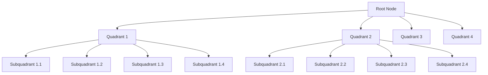

# PostgreSQL SP-GiST Indexes

## Introduction

When working with PostgreSQL, choosing the right index type can dramatically improve your query performance. SP-GiST (Space-Partitioned Generalized Search Tree) is one of PostgreSQL's specialized index types that excels at handling non-uniform data distributions and geometric data.

Unlike the more common B-tree indexes, SP-GiST indexes are designed for data that doesn't distribute evenly across a linear scale. They're particularly useful for geospatial data, IP addresses, text search, and other specialized data types where traditional indexes might struggle.

In this guide, we'll explore:
- What SP-GiST indexes are
- How they work
- When you should use them
- How to create and manage them effectively
- Real-world examples and use cases

## What is an SP-GiST Index?

SP-GiST stands for "Space-Partitioned Generalized Search Tree." This type of index uses a space-partitioning tree structure to organize data, which makes it especially efficient for non-uniform data distributions.

Key characteristics of SP-GiST indexes include:

- **Space partitioning**: Divides the search space into non-overlapping regions
- **Extensibility**: Allows for custom partitioning strategies
- **Support for non-standard data types**: Especially good for multi-dimensional data
- **Clustering properties**: Similar data points tend to be stored close together

SP-GiST indexes are part of PostgreSQL's extensible indexing framework, allowing developers to implement custom index types for specific data structures.

## How SP-GiST Indexes Work

SP-GiST uses a tree structure where each node represents a partition of the data space. Unlike B-tree indexes, which split based on key values, SP-GiST splits based on spatial properties of the data.



The diagram above illustrates how an SP-GiST index might partition 2D data using a quadtree approach, which is one of several partitioning strategies that SP-GiST supports.

### Key Partitioning Strategies

SP-GiST supports several partitioning strategies, including:

1. **Quadtree**: Divides 2D space into four quadrants
2. **k-d tree**: Alternates splitting on different dimensions
3. **Radix tree**: Splits based on bit patterns (useful for IP addresses)
4. **Trie**: Uses string prefixes for text data

These strategies allow SP-GiST to efficiently handle different types of non-uniform data.

## When to Use SP-GiST Indexes

SP-GiST indexes excel in the following scenarios:

1. **Geospatial data**: When working with points, lines, polygons, and other geometric data
2. **Network addresses**: IP address range queries
3. **Text search**: For prefix or suffix searches
4. **Non-uniform data**: Any data that clusters in an uneven way

SP-GiST is especially powerful when:
- Your data has natural clustering
- You need to perform range queries on non-uniform data
- You're working with multi-dimensional data
- Standard B-tree or hash indexes perform poorly

## Creating SP-GiST Indexes

Creating an SP-GiST index is similar to creating other index types in PostgreSQL:

```sql
CREATE INDEX index_name ON table_name USING spgist(column_name);
```

For more complex cases, you can specify operator classes:

```sql
CREATE INDEX idx_locations ON cities USING spgist(location);
```

### Supported Data Types

SP-GiST indexes support a variety of data types, including:

- Geometric types (`point`, `box`, `polygon`, etc.)
- Network address types (`inet`, `cidr`)
- Text types for prefix/suffix searches
- Range types

## Practical Examples

Let's explore some real-world examples of SP-GiST indexes in action.

### Example 1: Geospatial Queries

Imagine you have a table of points of interest:

```sql
CREATE TABLE points_of_interest (
    id SERIAL PRIMARY KEY,
    name TEXT,
    location POINT
);

-- Insert some sample data
INSERT INTO points_of_interest (name, location) VALUES
    ('Park', '(10.5, 20.3)'),
    ('Library', '(15.2, 25.1)'),
    ('Cafe', '(12.7, 18.9)');

-- Create an SP-GiST index on the location column
CREATE INDEX idx_poi_location ON points_of_interest USING spgist(location);
```

Now you can efficiently query for points within a certain distance:

```sql
-- Find all points of interest within 5 units of a specific location
SELECT name, location 
FROM points_of_interest 
WHERE location <-> point '(12, 20)' < 5;
```

The SP-GiST index makes this distance-based query much faster than a sequential scan.

### Example 2: IP Address Ranges

SP-GiST indexes are excellent for IP address range queries:

```sql
CREATE TABLE ip_blocks (
    id SERIAL PRIMARY KEY,
    network_range CIDR,
    description TEXT
);

-- Insert some sample network ranges
INSERT INTO ip_blocks (network_range, description) VALUES
    ('192.168.1.0/24', 'Office Network'),
    ('10.0.0.0/8', 'Internal Network'),
    ('172.16.0.0/12', 'VPN Network');

-- Create an SP-GiST index on the network_range column
CREATE INDEX idx_ip_network ON ip_blocks USING spgist(network_range);
```

Now you can efficiently find which network a specific IP belongs to:

```sql
-- Find the network that contains a specific IP address
SELECT description
FROM ip_blocks
WHERE network_range >> inet '192.168.1.25';
```

The SP-GiST index efficiently narrows down the search space based on the hierarchical nature of IP addresses.

### Example 3: Text Prefix Search

SP-GiST can be used for text search operations, especially prefix searches:

```sql
CREATE TABLE products (
    id SERIAL PRIMARY KEY,
    product_code TEXT,
    description TEXT
);

-- Insert some sample products
INSERT INTO products (product_code, description) VALUES
    ('ELEC001', 'Desktop Computer'),
    ('ELEC002', 'Laptop Computer'),
    ('FURN001', 'Office Desk');

-- Create an SP-GiST index for text pattern matching
CREATE INDEX idx_product_code ON products USING spgist(product_code text_pattern_ops);
```

Now prefix searches become more efficient:

```sql
-- Find all electronic products
SELECT product_code, description
FROM products
WHERE product_code LIKE 'ELEC%';
```

## Performance Considerations

When working with SP-GiST indexes, keep these performance considerations in mind:

### Advantages

- **Efficient for non-uniform data**: Performs well when data is clustered
- **Compact storage**: Can be more space-efficient than other indexes
- **Good for range queries**: Especially in multi-dimensional spaces

### Limitations

- **Update intensive workloads**: May be slower to update than B-tree indexes
- **Exact equality searches**: B-tree is often better for simple equality searches
- **Memory usage during building**: Can use significant memory during index creation

### Comparing Index Types

| Use Case | Best Index Type |
| --- | --- |
| Simple equality and range queries on uniform data | B-tree |
| Hash-based lookups | Hash |
| Full-text search | GIN or GiST |
| Geospatial data | SP-GiST or GiST |
| Multi-column indexes | B-tree or GiST |
| IP address ranges | SP-GiST |

## Monitoring and Maintenance

Like all PostgreSQL indexes, SP-GiST indexes require monitoring and maintenance:

```sql
-- Check index size
SELECT pg_size_pretty(pg_relation_size('idx_poi_location'));

-- Check index usage statistics
SELECT * FROM pg_stat_user_indexes WHERE indexrelname = 'idx_poi_location';
```

For maintenance, you can use:

```sql
-- Rebuild the index
REINDEX INDEX idx_poi_location;
```

## Summary

SP-GiST indexes are a powerful tool in PostgreSQL's indexing arsenal, especially for non-uniform, multi-dimensional, or hierarchical data. They excel at:

- Geospatial queries
- Network address range lookups
- Text prefix/suffix searches
- Any data with natural clustering properties

By using SP-GiST indexes appropriately, you can significantly improve query performance for specialized data types that don't perform well with traditional B-tree indexes.

Remember to analyze your specific use case, data distribution, and query patterns to determine if SP-GiST is the right choice for your application.

## Additional Resources

- [PostgreSQL Documentation on SP-GiST](https://www.postgresql.org/docs/current/spgist.html)
- [PostgreSQL Indexing Types](https://www.postgresql.org/docs/current/indexes-types.html)
- [Geospatial Indexing in PostgreSQL with PostGIS](https://postgis.net/docs/using_postgis_dbmanagement.html)

## Exercises

1. Create a table with point data and compare the performance of queries using SP-GiST and GiST indexes.
2. Implement an IP address filter system using SP-GiST indexes.
3. Benchmark the performance of text prefix searches with and without an SP-GiST index.
4. Create a spatial index for polygon data and test containment queries.
5. Explore how changing the fill factor affects SP-GiST index performance.