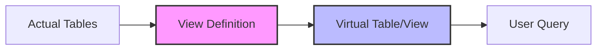

# PostgreSQL View Basics

## Introduction

Views in PostgreSQL are virtual tables that don't store data themselves but present data stored in other tables. Think of a view as a saved SQL query that you can reference like a table. Views provide an abstraction layer that can simplify complex queries, enhance security, and make your database interactions more convenient.

In this tutorial, you'll learn:
- What PostgreSQL views are and why they're useful
- How to create, modify, and delete views
- Different types of views and their applications
- Best practices for working with views

## What Is a PostgreSQL View?

A view is essentially a stored query that acts as a virtual table. When you query a view, PostgreSQL executes the underlying query and returns the results as if you were querying an actual table.



### Key Benefits of Views

1. **Simplification**: Hide complex query logic behind a simple interface
2. **Security**: Restrict access to specific columns or rows in tables
3. **Consistency**: Ensure consistent data access across applications
4. **Data abstraction**: Shield applications from underlying table structure changes

## Creating Your First View

The basic syntax for creating a view in PostgreSQL is:

```sql
CREATE VIEW view_name AS
SELECT column1, column2, ...
FROM table_name
WHERE condition;
```

Let's work with a simple example. Assume we have a `customers` table:

```sql
CREATE TABLE customers (
    customer_id SERIAL PRIMARY KEY,
    first_name VARCHAR(50),
    last_name VARCHAR(50),
    email VARCHAR(100),
    phone VARCHAR(20),
    address TEXT,
    created_at TIMESTAMP DEFAULT CURRENT_TIMESTAMP
);

-- Insert some sample data
INSERT INTO customers (first_name, last_name, email, phone, address)
VALUES 
('John', 'Doe', 'john.doe@example.com', '555-1234', '123 Main St'),
('Jane', 'Smith', 'jane.smith@example.com', '555-5678', '456 Oak Ave'),
('Bob', 'Johnson', 'bob.johnson@example.com', '555-9012', '789 Pine Rd');
```

Now, let's create a simple view that shows only customer names and emails:

```sql
CREATE VIEW customer_contacts AS
SELECT customer_id, first_name, last_name, email, phone
FROM customers;
```

To query this view:

```sql
SELECT * FROM customer_contacts;
```

Result:

```
 customer_id | first_name | last_name |         email         |  phone
-------------+------------+-----------+-----------------------+----------
           1 | John       | Doe       | john.doe@example.com  | 555-1234
           2 | Jane       | Smith     | jane.smith@example.com| 555-5678
           3 | Bob        | Johnson   | bob.johnson@example.com| 555-9012
```

## Querying Views

You can query views just like regular tables. All these operations are valid:

```sql
-- Select all customers
SELECT * FROM customer_contacts;

-- Select specific columns
SELECT first_name, email FROM customer_contacts;

-- Use WHERE clause
SELECT * FROM customer_contacts WHERE first_name = 'John';

-- Use ORDER BY
SELECT * FROM customer_contacts ORDER BY last_name;
```

## Creating Views with Joins

Views become particularly powerful when working with joined tables. Let's create an orders table and a view that joins customer data with their orders:

```sql
CREATE TABLE orders (
    order_id SERIAL PRIMARY KEY,
    customer_id INTEGER REFERENCES customers(customer_id),
    order_date TIMESTAMP DEFAULT CURRENT_TIMESTAMP,
    total_amount DECIMAL(10, 2)
);

-- Insert sample orders
INSERT INTO orders (customer_id, total_amount)
VALUES 
(1, 99.99),
(2, 149.50),
(1, 25.75);

-- Create a view joining customers and orders
CREATE VIEW customer_orders AS
SELECT c.customer_id, c.first_name, c.last_name, c.email,
       o.order_id, o.order_date, o.total_amount
FROM customers c
JOIN orders o ON c.customer_id = o.customer_id;
```

Now you can easily query customer order information:

```sql
SELECT * FROM customer_orders;
```

Result:

```
 customer_id | first_name | last_name |         email         | order_id |      order_date      | total_amount
-------------+------------+-----------+-----------------------+----------+----------------------+--------------
           1 | John       | Doe       | john.doe@example.com  |        1 | 2023-09-20 14:23:11 |        99.99
           2 | Jane       | Smith     | jane.smith@example.com|        2 | 2023-09-20 14:23:11 |       149.50
           1 | John       | Doe       | john.doe@example.com  |        3 | 2023-09-20 14:23:11 |        25.75
```

## Modifying Views

### Updating a View Definition

To change an existing view, use the `CREATE OR REPLACE VIEW` syntax:

```sql
CREATE OR REPLACE VIEW customer_contacts AS
SELECT customer_id, first_name, last_name, email, phone, address
FROM customers;
```

This version now includes the address column that was missing in our original view.

### Altering a View

You can also use `ALTER VIEW` to rename a view or change its owner:

```sql
-- Rename a view
ALTER VIEW customer_contacts RENAME TO customer_contact_info;

-- Change view schema
ALTER VIEW customer_contact_info SET SCHEMA marketing;
```

## Dropping Views

To remove a view, use the `DROP VIEW` command:

```sql
DROP VIEW customer_contacts;

-- Or if you're not sure if it exists:
DROP VIEW IF EXISTS customer_contacts;
```

## View Limitations and Considerations

### Updatable Views

By default, views in PostgreSQL can be updated (INSERT, UPDATE, DELETE) if they meet certain conditions:
- The view must reference only one table
- The view must include the primary key of that table
- The view cannot contain GROUP BY, HAVING, LIMIT, DISTINCT, etc.

For example, our `customer_contacts` view is updatable:

```sql
-- This works because customer_contacts is an updatable view
UPDATE customer_contacts
SET phone = '555-4321'
WHERE customer_id = 1;
```

### WITH CHECK OPTION

You can ensure that data modified through a view still meets the view's conditions by using `WITH CHECK OPTION`:

```sql
CREATE VIEW local_customers AS
SELECT * FROM customers
WHERE address LIKE '%Main St%'
WITH CHECK OPTION;
```

Now, if you try to update a customer's address to something that doesn't contain "Main St", PostgreSQL will reject the operation.

## Practical Use Cases

### 1. Data Aggregation Views

Views are excellent for complex reporting queries:

```sql
CREATE VIEW customer_spending_summary AS
SELECT 
    c.customer_id,
    c.first_name,
    c.last_name,
    COUNT(o.order_id) AS total_orders,
    SUM(o.total_amount) AS total_spent,
    AVG(o.total_amount) AS average_order
FROM customers c
LEFT JOIN orders o ON c.customer_id = o.customer_id
GROUP BY c.customer_id, c.first_name, c.last_name;
```

### 2. Security and Access Control

Views can restrict access to sensitive data:

```sql
CREATE VIEW safe_customer_data AS
SELECT customer_id, first_name, last_name, email
FROM customers;
-- Grant access to this view instead of the base table
```

### 3. Data Abstraction for Applications

Views can shield your application from database schema changes:

```sql
CREATE VIEW app_customer_data AS
SELECT 
    customer_id,
    first_name || ' ' || last_name AS full_name,
    email,
    phone
FROM customers;
```

If you later change the structure of the `customers` table, you can update the view rather than changing application code.

## Best Practices

1. **Use meaningful names**: Name views clearly to indicate their purpose
2. **Document your views**: Add comments to explain complex logic
3. **Consider performance**: Views with complex joins or aggregations can be slow
4. **Use materialized views** for performance-critical aggregations (covered in an advanced tutorial)
5. **Test updateable views** thoroughly to ensure they behave as expected

## Summary

PostgreSQL views provide a powerful abstraction layer that can simplify queries, enhance security, and make your database more maintainable. By creating virtual tables based on SQL queries, you can:

- Present complex data in a simplified format
- Restrict access to sensitive information
- Create a stable interface for applications
- Reuse common query logic

In this tutorial, you've learned the basics of creating, querying, modifying, and dropping views. You've also explored practical use cases and best practices for working with views effectively.

## Exercises

To reinforce your understanding of PostgreSQL views, try these exercises:

1. Create a view that shows customers who have placed orders above the average order value
2. Create a view joining three tables: customers, orders, and a new table `order_items`
3. Create a view with `WITH CHECK OPTION` and test its behavior with INSERT and UPDATE operations
4. Create a view that uses window functions to rank customers by their total spending

## Additional Resources

- [PostgreSQL Official Documentation on Views](https://www.postgresql.org/docs/current/sql-createview.html)
- [PostgreSQL Tutorial: Views](https://www.postgresqltutorial.com/postgresql-views/)
- Next tutorial: Advanced PostgreSQL Views and Materialized Views