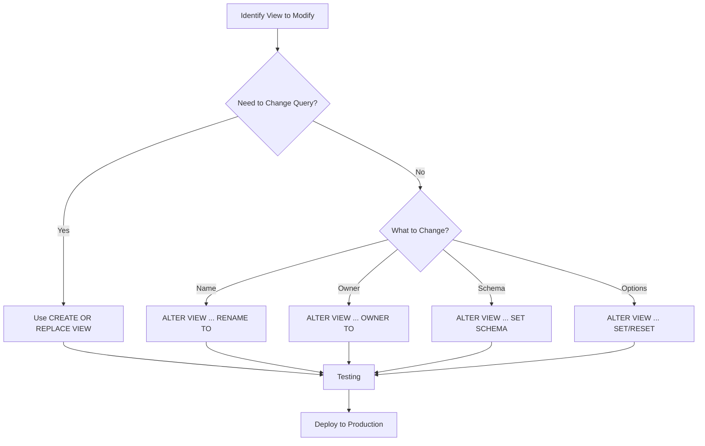

# PostgreSQL ALTER VIEW

## Introduction

Views in PostgreSQL are virtual tables defined by a query that provide a way to encapsulate complex queries and present data in a simplified manner. As your database and application requirements evolve, you may need to modify existing views to accommodate these changes. The `ALTER VIEW` statement in PostgreSQL provides a mechanism to modify the properties of existing views without having to drop and recreate them.

In this tutorial, we'll explore how to use the `ALTER VIEW` statement to modify views in PostgreSQL, including changing view names, adding columns, modifying the underlying query, and managing view options.

## Basic Syntax

The basic syntax of the `ALTER VIEW` statement is:

```sql
ALTER VIEW view_name action;
```

Where `action` can be one of several operations we'll explore in this tutorial.

## Renaming a View

One of the simplest operations you can perform with `ALTER VIEW` is renaming a view:

```sql
ALTER VIEW view_name RENAME TO new_view_name;
```

### Example

Let's say we have a view called `employee_details` and we want to rename it to `staff_details`:

```sql
ALTER VIEW employee_details RENAME TO staff_details;
```

## Changing the Owner of a View

You can change the owner of a view using:

```sql
ALTER VIEW view_name OWNER TO new_owner;
```

### Example

To change the owner of a view to a user named 'admin':

```sql
ALTER VIEW staff_details OWNER TO admin;
```

## Changing the Schema of a View

To move a view to a different schema:

```sql
ALTER VIEW view_name SET SCHEMA new_schema;
```

### Example

If you want to move the `staff_details` view from the public schema to an `hr` schema:

```sql
ALTER VIEW staff_details SET SCHEMA hr;
```

## Setting View Options

Views in PostgreSQL can have various options that control their behavior. You can set these options using:

```sql
ALTER VIEW view_name SET ( option_name = value );
```

### Example: Security Barrier

A common view option is `security_barrier`, which is used to enhance security for row-level security policies:

```sql
ALTER VIEW staff_details SET (security_barrier = true);
```

This option prevents potentially insecure operations in the view from leaking data that should be protected by row-level security policies.

## Removing View Options

You can also remove previously set options:

```sql
ALTER VIEW view_name RESET ( option_name );
```

### Example

To remove the `security_barrier` option:

```sql
ALTER VIEW staff_details RESET (security_barrier);
```

## Practical Example: Working with a Customer Order View

Let's work through a complete example to demonstrate how `ALTER VIEW` can be used in a real-world scenario.

First, we'll create a simple database schema for a store with tables for customers and orders:

```sql
CREATE TABLE customers (
    customer_id SERIAL PRIMARY KEY,
    first_name VARCHAR(50),
    last_name VARCHAR(50),
    email VARCHAR(100),
    created_at TIMESTAMP DEFAULT NOW()
);

CREATE TABLE orders (
    order_id SERIAL PRIMARY KEY,
    customer_id INTEGER REFERENCES customers(customer_id),
    order_date TIMESTAMP DEFAULT NOW(),
    total_amount DECIMAL(10, 2)
);
```

Now, let's create a view that combines information from both tables:

```sql
CREATE VIEW customer_orders AS
SELECT 
    c.customer_id,
    c.first_name,
    c.last_name,
    c.email,
    o.order_id,
    o.order_date,
    o.total_amount
FROM 
    customers c
JOIN 
    orders o ON c.customer_id = o.customer_id;
```

Let's say our application requirements change, and we need to:
1. Rename the view to be more descriptive
2. Set a security barrier on the view
3. Move it to a dedicated schema for reporting

We can accomplish this with the following `ALTER VIEW` statements:

```sql
-- Rename the view
ALTER VIEW customer_orders RENAME TO detailed_customer_orders;

-- Set security barrier
ALTER VIEW detailed_customer_orders SET (security_barrier = true);

-- Create reporting schema if it doesn't exist
CREATE SCHEMA IF NOT EXISTS reporting;

-- Move the view to the reporting schema
ALTER VIEW detailed_customer_orders SET SCHEMA reporting;
```

After these operations, we can access the modified view as `reporting.detailed_customer_orders`.

## Limitations of ALTER VIEW

It's important to understand that `ALTER VIEW` has some limitations:

1. You **cannot** use `ALTER VIEW` to modify the underlying query of a view directly. To change the query, you must use `CREATE OR REPLACE VIEW`.

2. To modify the columns of a view, you must also use `CREATE OR REPLACE VIEW`.

### Changing the View Definition

To change the actual query that defines a view, you need to use `CREATE OR REPLACE VIEW` instead of `ALTER VIEW`:

```sql
CREATE OR REPLACE VIEW reporting.detailed_customer_orders AS
SELECT 
    c.customer_id,
    c.first_name,
    c.last_name,
    c.email,
    o.order_id,
    o.order_date,
    o.total_amount,
    (o.total_amount * 0.1) AS tax_amount -- Added a calculated tax column
FROM 
    customers c
JOIN 
    orders o ON c.customer_id = o.customer_id;
```

## Using ALTER VIEW with Materialized Views

PostgreSQL also supports materialized views, which store the results of a query physically and need to be refreshed when the underlying data changes. You can use `ALTER MATERIALIZED VIEW` in a similar way:

```sql
-- Create a materialized view
CREATE MATERIALIZED VIEW sales_summary AS
SELECT 
    DATE_TRUNC('month', order_date) AS month,
    COUNT(*) AS order_count,
    SUM(total_amount) AS total_sales
FROM 
    orders
GROUP BY 
    DATE_TRUNC('month', order_date);

-- Rename the materialized view
ALTER MATERIALIZED VIEW sales_summary RENAME TO monthly_sales_summary;

-- Change the owner
ALTER MATERIALIZED VIEW monthly_sales_summary OWNER TO reporting_user;

-- Move to reporting schema
ALTER MATERIALIZED VIEW monthly_sales_summary SET SCHEMA reporting;
```

## Flow of View Modification

The following diagram illustrates the typical workflow when modifying views in PostgreSQL:



## Best Practices for Working with ALTER VIEW

When working with the `ALTER VIEW` statement, consider the following best practices:

1. **Backup your view definitions**: Before making changes to views, especially in production environments, save the original view definition using:
   ```sql
   pg_dump -t view_name -s database_name > view_backup.sql
   ```

2. **Test in development first**: Always test view modifications in a development or staging environment before applying them to production.

3. **Check dependencies**: Views may be used by other views, functions, or applications. Before modifying a view, check its dependencies:
   ```sql
   SELECT * FROM pg_depend 
   WHERE refobjid = 'view_name'::regclass::oid;
   ```

4. **Use transactions**: Wrap your view changes in transactions so you can roll back if needed:
   ```sql
   BEGIN;
   ALTER VIEW view_name ...;
   -- Test the modified view
   COMMIT; -- or ROLLBACK if there are issues
   ```

5. **Document changes**: Keep documentation of view changes for future reference, especially in team environments.

## Summary

The `ALTER VIEW` statement in PostgreSQL provides a way to modify certain properties of existing views without having to drop and recreate them. Key operations include:

- Renaming views
- Changing view owners
- Moving views to different schemas
- Setting or resetting view options

While `ALTER VIEW` cannot directly modify the underlying query of a view (for that, you need `CREATE OR REPLACE VIEW`), it's still a valuable tool for database administrators and developers when managing database objects.

By understanding how to use `ALTER VIEW` effectively, you can maintain your PostgreSQL database's structure more efficiently and adapt to changing requirements with minimal disruption.

## Additional Resources and Exercises

### Resources

- [PostgreSQL Official Documentation on ALTER VIEW](https://www.postgresql.org/docs/current/sql-alterview.html)
- [PostgreSQL Official Documentation on Views](https://www.postgresql.org/docs/current/sql-createview.html)

### Exercises

1. Create a view called `employee_summary` that shows employee names and departments, then use `ALTER VIEW` to rename it to `staff_summary`.

2. Create a view in the public schema, then use `ALTER VIEW` to move it to a custom schema.

3. Create a view with default options, then use `ALTER VIEW` to set the `check_option` to `local`.

4. Create a materialized view for reporting purposes, then use `ALTER MATERIALIZED VIEW` to move it to a reporting schema.

5. Practice using transactions with `ALTER VIEW` statements to ensure you can roll back changes if needed.