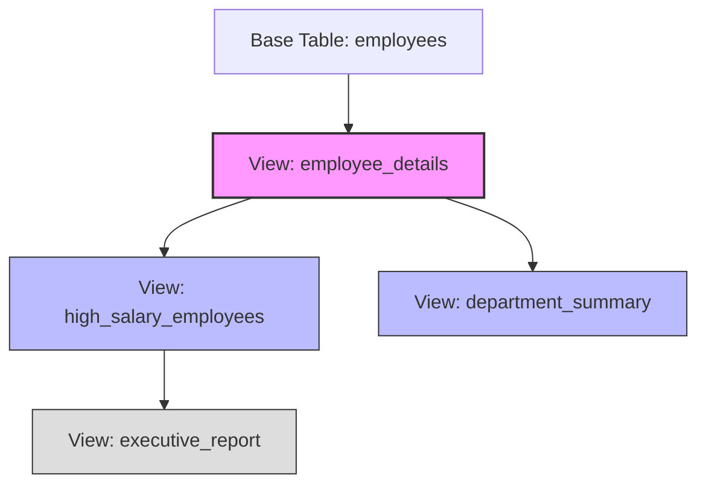

# PostgreSQL DROP VIEW

## Introduction

Views in PostgreSQL provide a powerful way to create virtual tables based on SQL queries. They help simplify complex queries, provide an abstraction layer, and enhance database security. However, there comes a time when you might need to remove views that are no longer needed. This is where the `DROP VIEW` command comes into play.

In this tutorial, we'll explore the PostgreSQL `DROP VIEW` statement, its syntax, options, and practical usage with examples. By the end, you'll understand how to safely remove views from your database.

## What is DROP VIEW?

The `DROP VIEW` statement is a PostgreSQL command used to remove one or more existing views from the database. When you drop a view, you're removing the view definition from the database catalog, but not affecting the underlying data that the view was querying.

## Basic Syntax

The basic syntax for dropping a view in PostgreSQL is:

```sql
DROP VIEW [ IF EXISTS ] view_name [, ...] [ CASCADE | RESTRICT ];
```

Let's break down these components:

- `DROP VIEW`: The main command
- `IF EXISTS`: Optional clause that prevents an error if the view doesn't exist
- `view_name`: The name of the view to be dropped (you can specify multiple views separated by commas)
- `CASCADE`: Optional keyword that automatically drops objects that depend on the view
- `RESTRICT`: Optional keyword that refuses to drop the view if there are objects that depend on it (this is the default behavior)

## Simple DROP VIEW Example

Let's start with a basic example. Suppose we have a view called `employee_details` that we want to remove:

```sql
DROP VIEW employee_details;
```

This command will remove the `employee_details` view from the database. If the view doesn't exist, PostgreSQL will return an error:

```
ERROR:  view "employee_details" does not exist
```

## Using IF EXISTS Clause

To avoid errors when dropping views that might not exist, use the `IF EXISTS` clause:

```sql
DROP VIEW IF EXISTS employee_details;
```

Output when the view doesn't exist:
```
NOTICE:  view "employee_details" does not exist, skipping
DROP VIEW
```

This is particularly useful in scripts or when you're not sure if the view exists.

## Dropping Multiple Views

You can drop multiple views in a single command by separating the view names with commas:

```sql
DROP VIEW IF EXISTS employee_details, department_summary, salary_report;
```

This will attempt to drop all three views in one command.

## CASCADE vs RESTRICT Options

The `CASCADE` and `RESTRICT` options control what happens when other database objects depend on the view you're trying to drop.

### RESTRICT Example

`RESTRICT` is the default behavior. It prevents you from dropping a view if other objects depend on it:

```sql
DROP VIEW employee_details RESTRICT;
```

If another view or object depends on `employee_details`, you'll get an error:

```
ERROR:  cannot drop view employee_details because other objects depend on it
DETAIL:  view high_salary_employees depends on view employee_details
HINT:  Use DROP ... CASCADE to drop the dependent objects too.
```

### CASCADE Example

The `CASCADE` option will automatically drop any objects that depend on the view:

```sql
DROP VIEW employee_details CASCADE;
```

Output example:
```
NOTICE:  drop cascades to view high_salary_employees
DROP VIEW
```

In this case, the dependent view `high_salary_employees` is also dropped automatically.

## Real-world Examples

Let's walk through some practical examples to understand how `DROP VIEW` works in real-world scenarios.

### Example 1: Creating and Dropping a Simple View

First, let's create a view and then drop it:

```sql
-- Create a simple employees table
CREATE TABLE employees (
    employee_id SERIAL PRIMARY KEY,
    first_name VARCHAR(50),
    last_name VARCHAR(50),
    department VARCHAR(50),
    salary NUMERIC(10, 2)
);

-- Insert some sample data
INSERT INTO employees (first_name, last_name, department, salary)
VALUES 
    ('John', 'Smith', 'HR', 60000),
    ('Jane', 'Doe', 'Engineering', 85000),
    ('Bob', 'Johnson', 'Sales', 72000);

-- Create a view for HR employees
CREATE VIEW hr_employees AS
SELECT employee_id, first_name, last_name, salary
FROM employees
WHERE department = 'HR';

-- Now drop the view
DROP VIEW hr_employees;
```

### Example 2: Handling View Dependencies

Let's create multiple views with dependencies and see how CASCADE works:

```sql
-- Create a base view
CREATE VIEW employee_details AS
SELECT employee_id, first_name, last_name, department, salary
FROM employees;

-- Create a dependent view
CREATE VIEW high_salary_employees AS
SELECT employee_id, first_name, last_name, salary
FROM employee_details
WHERE salary > 70000;

-- Try to drop the base view with RESTRICT (default)
DROP VIEW employee_details;
-- This will fail with an error about dependencies

-- Drop with CASCADE
DROP VIEW employee_details CASCADE;
-- This will drop both views
```

### Example 3: Checking If a View Exists Before Dropping

A common pattern in database migration scripts is to check if a view exists before attempting operations:

```sql
-- Check if view exists before dropping
DO $$
BEGIN
    IF EXISTS (
        SELECT FROM pg_catalog.pg_views
        WHERE schemaname = 'public' AND viewname = 'employee_details'
    ) THEN
        EXECUTE 'DROP VIEW employee_details';
    END IF;
END $$;
```

The better approach is to simply use the built-in `IF EXISTS` clause:

```sql
DROP VIEW IF EXISTS employee_details;
```

## Best Practices

When working with `DROP VIEW` in PostgreSQL, keep these best practices in mind:

1. **Always use `IF EXISTS`** in scripts or applications to prevent errors when the view doesn't exist.

2. **Be cautious with `CASCADE`**. While convenient, it can lead to unintended consequences by dropping objects you didn't realize were dependent on the view.

3. **Consider dependencies** before dropping views. Use the following query to check for dependencies:

```sql
SELECT dependent_ns.nspname as dependent_schema,
       dependent_view.relname as dependent_view
FROM pg_depend
JOIN pg_rewrite ON pg_depend.objid = pg_rewrite.oid
JOIN pg_class as dependent_view ON pg_rewrite.ev_class = dependent_view.oid
JOIN pg_class as source_table ON pg_depend.refobjid = source_table.oid
JOIN pg_namespace dependent_ns ON dependent_ns.oid = dependent_view.relnamespace
JOIN pg_namespace source_ns ON source_ns.oid = source_table.relnamespace
WHERE source_table.relname = 'view_name'
  AND source_ns.nspname = 'schema_name'
  AND dependent_view.relname != 'view_name';
```

4. **Document changes** when dropping views, especially in production environments.

5. **Create backups** before dropping important views. You can script the view creation with:

```sql
pg_dump -t 'view_name' --schema-only database_name > view_backup.sql
```

## Visualizing View Dependencies

Understanding view dependencies is crucial when using `DROP VIEW`. Here's a visualization of view dependencies:



In this diagram, dropping `employee_details` with `CASCADE` would also drop `high_salary_employees`, `department_summary`, and `executive_report`.

## Common Errors and How to Fix Them

### Error: View Does Not Exist

**Error message:**
```
ERROR:  view "employee_details" does not exist
```

**Solution:** Use the `IF EXISTS` clause:
```sql
DROP VIEW IF EXISTS employee_details;
```

### Error: Cannot Drop View Due to Dependencies

**Error message:**
```
ERROR:  cannot drop view employee_details because other objects depend on it
DETAIL:  view high_salary_employees depends on view employee_details
HINT:  Use DROP ... CASCADE to drop the dependent objects too.
```

**Solution:** Either:
1. Drop the dependent objects first, or
2. Use the `CASCADE` option:
```sql
DROP VIEW employee_details CASCADE;
```

### Error: Permission Denied

**Error message:**
```
ERROR:  permission denied for view employee_details
```

**Solution:** Ensure you have the necessary privileges. You typically need to be the owner of the view or have superuser privileges:
```sql
-- Grant privileges (run as superuser or view owner)
GRANT ALL ON employee_details TO username;
```

## Comparing DROP VIEW with Other Commands

| Command | Purpose | Usage |
|---------|---------|-------|
| `DROP VIEW` | Removes a view definition | When you no longer need a view |
| `CREATE OR REPLACE VIEW` | Updates a view definition | When you want to modify an existing view |
| `ALTER VIEW` | Changes view properties | When you need to rename or change ownership |
| `TRUNCATE TABLE` | Removes all rows from a table | Not applicable to views (views don't store data) |
| `DROP TABLE` | Removes a table and its data | For tables, not views |

## Summary

The PostgreSQL `DROP VIEW` statement is an essential command for database maintenance, allowing you to remove views that are no longer needed. We've covered:

- Basic syntax and options for `DROP VIEW`
- Using `IF EXISTS` to avoid errors
- Understanding the difference between `CASCADE` and `RESTRICT`
- Real-world examples of dropping views
- Best practices for safely managing view dependencies

Remember that views provide a layer of abstraction in your database design, so dropping them should be done carefully, especially in production environments. Always consider the impact on dependent objects and applications that might be using these views.

## Further Learning

To deepen your understanding of PostgreSQL views, consider exploring these related topics:

- Creating and managing materialized views
- Updating views with triggers
- View permissions and security
- Performance considerations for complex views

## Exercises

1. Create a simple view on a table, then drop it using the basic `DROP VIEW` syntax.
2. Create two views where one depends on the other, then experiment with both `CASCADE` and `RESTRICT` options.
3. Write a script that safely checks for and drops multiple views.
4. Create a complex hierarchy of views (at least 3 levels deep) and practice dropping views at different levels of the hierarchy.
5. Use PostgreSQL's system catalogs to find all views in your database and list their dependencies.