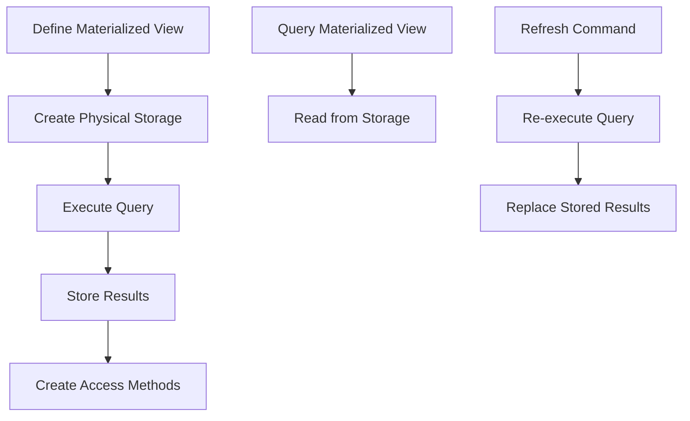

# PostgreSQL Materialized Views

## Introduction

Materialized views in PostgreSQL are a powerful feature that can significantly improve query performance for data-intensive applications. Unlike regular views, which run their defining query each time they are accessed, materialized views physically store the results of a query, creating a snapshot of the data at a specific point in time.

Think of a materialized view as a "pre-computed result set" or a "query cache" that you can refresh when needed. This makes them particularly useful for complex queries that are expensive to compute but don't need to reflect real-time data.

## Basic Concepts

### Regular Views vs. Materialized Views

Before diving into materialized views, let's understand how they differ from regular views:

| Feature | Regular View | Materialized View |
|---------|-------------|-------------------|
| Storage | Virtual - no data storage | Physical - stores query results |
| Query Execution | Executes the defining query every time it's accessed | Uses stored results; query only runs during refresh |
| Data Freshness | Always current | Data as of last refresh |
| Use Case | Simple transformations, security layer | Complex aggregations, reporting, data warehousing |

### When to Use Materialized Views

Materialized views are particularly useful when:

- You have complex queries with joins, aggregations, or window functions that are slow to execute
- The underlying data doesn't change frequently
- Your application can tolerate slightly outdated data
- You need to improve read performance for analytical queries

## Creating a Materialized View

The syntax for creating a materialized view is straightforward:

```sql
CREATE MATERIALIZED VIEW view_name
AS
  query
[WITH [NO] DATA];
```

The optional `WITH DATA` clause (default) populates the materialized view immediately, while `WITH NO DATA` creates an empty structure that you can populate later.

### Example: Creating a Basic Materialized View

Let's create a materialized view that aggregates order data:

```sql
-- First, let's assume we have these tables
CREATE TABLE customers (
  customer_id SERIAL PRIMARY KEY,
  name VARCHAR(100),
  email VARCHAR(100)
);

CREATE TABLE orders (
  order_id SERIAL PRIMARY KEY,
  customer_id INTEGER REFERENCES customers(customer_id),
  amount DECIMAL(10, 2),
  order_date DATE
);

-- Now, create a materialized view for customer order summaries
CREATE MATERIALIZED VIEW customer_order_summary
AS
  SELECT 
    c.customer_id,
    c.name,
    COUNT(o.order_id) AS total_orders,
    SUM(o.amount) AS total_spent,
    MAX(o.order_date) AS last_order_date
  FROM customers c
  LEFT JOIN orders o ON c.customer_id = o.customer_id
  GROUP BY c.customer_id, c.name
WITH DATA;
```

Now we can query this materialized view like a regular table:

```sql
SELECT * FROM customer_order_summary;
```

Example output:

```
 customer_id |      name      | total_orders | total_spent | last_order_date 
-------------+----------------+--------------+-------------+-----------------
           1 | John Smith     |           12 |     1423.87 | 2023-05-10
           2 | Sarah Johnson  |            8 |      876.25 | 2023-05-15
           3 | Miguel Gonzalez|           15 |     2352.40 | 2023-05-12
```

## Refreshing Materialized Views

Since materialized views store data at a point in time, you need to refresh them to get updated data. PostgreSQL provides two refresh options:

```sql
-- Complete refresh (rebuilds the entire view)
REFRESH MATERIALIZED VIEW [CONCURRENTLY] view_name;
```

The `CONCURRENTLY` option is particularly useful as it allows queries against the materialized view while it's being refreshed, but requires a unique index on the materialized view.

### Example: Refreshing a Materialized View

```sql
-- Complete refresh
REFRESH MATERIALIZED VIEW customer_order_summary;

-- Concurrent refresh (requires a unique index)
CREATE UNIQUE INDEX customer_order_summary_idx ON customer_order_summary (customer_id);
REFRESH MATERIALIZED VIEW CONCURRENTLY customer_order_summary;
```

## Querying Materialized Views

You can query a materialized view just like any table:

```sql
-- Get all customers who spent over $1000
SELECT name, total_spent 
FROM customer_order_summary 
WHERE total_spent > 1000;
```

Example output:

```
      name      | total_spent 
----------------+-------------
 John Smith     |     1423.87
 Miguel Gonzalez|     2352.40
```

## Practical Example: Sales Dashboard Data

Let's create a more complex materialized view that could power a sales dashboard:

```sql
CREATE MATERIALIZED VIEW sales_dashboard_data
AS
  SELECT 
    DATE_TRUNC('month', o.order_date) AS month,
    COUNT(DISTINCT o.customer_id) AS unique_customers,
    COUNT(o.order_id) AS orders,
    SUM(o.amount) AS revenue,
    SUM(o.amount) / COUNT(o.order_id) AS average_order_value,
    SUM(CASE WHEN o.amount > 100 THEN 1 ELSE 0 END) AS large_orders
  FROM orders o
  WHERE o.order_date >= CURRENT_DATE - INTERVAL '12 months'
  GROUP BY DATE_TRUNC('month', o.order_date)
  ORDER BY month DESC
WITH DATA;
```

With this materialized view, your dashboard can quickly show monthly sales performance without executing the expensive aggregation queries each time.

## Setting Up Automated Refreshes

While PostgreSQL doesn't have a built-in scheduling mechanism, you can use external tools like `cron` (Linux/Unix) or scheduled jobs (Windows) to refresh materialized views automatically.

For example, a cron job that refreshes a materialized view every night at 2 AM might look like:

```bash
0 2 * * * psql -c "REFRESH MATERIALIZED VIEW sales_dashboard_data;" -d your_database
```

## Performance Considerations

When working with materialized views, keep these tips in mind:

1. **Indexing**: Create appropriate indexes on your materialized views to speed up queries.
2. **Refresh timing**: Balance data freshness with performance by choosing appropriate refresh intervals.
3. **Storage requirements**: Remember that materialized views consume disk space.
4. **Maintenance windows**: Schedule refreshes during low-traffic periods if possible.

## Real-World Use Cases

### Geographic Data Aggregation

Spatial queries can be computationally expensive. Materialized views are perfect for pre-computing geographic aggregations:

```sql
CREATE MATERIALIZED VIEW regional_sales
AS
  SELECT 
    r.region_name,
    COUNT(o.order_id) AS total_orders,
    SUM(o.amount) AS total_revenue
  FROM orders o
  JOIN customer_addresses ca ON o.customer_id = ca.customer_id
  JOIN regions r ON ST_Contains(r.geometry, ca.location)
  GROUP BY r.region_name
WITH DATA;
```

### Time-Series Analytics

For time-series data, materialized views can pre-calculate trending information:

```sql
CREATE MATERIALIZED VIEW daily_temperature_stats
AS
  SELECT
    DATE_TRUNC('day', measurement_time) AS day,
    location_id,
    MIN(temperature) AS min_temp,
    MAX(temperature) AS max_temp,
    AVG(temperature) AS avg_temp
  FROM weather_measurements
  WHERE measurement_time >= CURRENT_DATE - INTERVAL '30 days'
  GROUP BY DATE_TRUNC('day', measurement_time), location_id
WITH DATA;
```

## Common Mistakes and Best Practices

### Common Mistakes

1. **Refreshing too frequently**: If you refresh as often as the data changes, you lose the performance benefits.
2. **Using materialized views for real-time data**: They are not suitable for data that needs to be up-to-the-second accurate.
3. **Forgetting to create indexes**: Materialized views need indexes just like tables.

### Best Practices

1. **Document refresh schedules**: Make sure your team knows when data was last refreshed.
2. **Create a refresh strategy**: Determine how often each materialized view needs refreshing.
3. **Monitor storage growth**: Large materialized views can consume significant disk space.
4. **Use with other caching mechanisms**: Combine with application-level caching for best performance.

## How Materialized Views Work Internally

Under the hood, PostgreSQL stores materialized views similarly to tables:



## Summary

Materialized views are a powerful PostgreSQL feature that can dramatically improve query performance for complex, expensive queries. By storing pre-computed results, they provide a balance between data freshness and query speed.

Key takeaways:
- Use materialized views for complex queries where results don't need to be real-time
- Refresh strategically based on your data change frequency
- Index materialized views appropriately
- Consider automated refresh schedules

## Exercises

1. Create a materialized view that shows the top 10 customers by order volume.
2. Implement a strategy to refresh a materialized view only when the underlying data has changed.
3. Compare the performance of a complex query run directly versus through a materialized view.
4. Create a materialized view with a unique index and practice refreshing it concurrently.

## Additional Resources

- [PostgreSQL Official Documentation on Materialized Views](https://www.postgresql.org/docs/current/rules-materializedviews.html)
- [PostgreSQL Wiki: Materialized Views](https://wiki.postgresql.org/wiki/Materialized_Views)
- [Database Indexing Strategies](https://use-the-index-luke.com/)