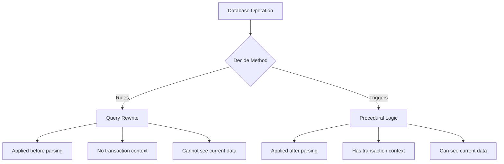

# PostgreSQL View Rules

## Introduction

When working with PostgreSQL views, you might need more control over how the database processes operations on these views. This is where **PostgreSQL view rules** come into play. Rules are powerful mechanisms that allow you to customize the behavior of views by intercepting and transforming queries.

In this tutorial, we'll explore how rules work with views, how to create and manage them, and practical applications to solve real-world problems.

## What Are PostgreSQL Rules?

Rules in PostgreSQL are part of the query rewrite system that intercepts operations (SELECT, INSERT, UPDATE, DELETE) on database objects and replaces them with alternative actions.

When applied to views, rules allow you to:

- Make views updatable
- Implement custom logic for view operations
- Redirect operations to different tables
- Add validation and constraints to view operations

## Basic Syntax for Creating Rules on Views

The basic syntax for creating a rule on a view is:

```sql
CREATE OR REPLACE RULE rule_name AS
    ON event TO view_name
    WHERE condition
    DO [ ALSO | INSTEAD ] { NOTHING | command | (command; command ...) }
```

Let's break down these components:

- `rule_name`: A unique name for the rule
- `event`: The operation to intercept (SELECT, INSERT, UPDATE, DELETE)
- `view_name`: The name of the view the rule applies to
- `condition`: An optional condition that must be true for the rule to apply
- `ALSO | INSTEAD`: Determines if the rule actions replace or supplement the original operation
- `command`: The SQL commands to execute

## Understanding DO INSTEAD Rules

The most common type of rule used with views is the `DO INSTEAD` rule, which replaces the original operation with alternative commands.

### Example: Making a View Updatable

Let's start with a simple example. First, we'll create base tables and a view:

```sql
-- Create employee table
CREATE TABLE employees (
    employee_id SERIAL PRIMARY KEY,
    name VARCHAR(100),
    department VARCHAR(50),
    salary NUMERIC(10, 2)
);

-- Create a view for HR department that shows employee information
CREATE VIEW hr_employees AS
    SELECT employee_id, name, department, salary
    FROM employees;
```

By default, this view is not updatable. Let's add rules to make it updatable:

```sql
-- Rule for INSERT operations on the view
CREATE OR REPLACE RULE hr_employees_insert AS
    ON INSERT TO hr_employees
    DO INSTEAD
    INSERT INTO employees (name, department, salary)
    VALUES (NEW.name, NEW.department, NEW.salary);

-- Rule for UPDATE operations on the view
CREATE OR REPLACE RULE hr_employees_update AS
    ON UPDATE TO hr_employees
    DO INSTEAD
    UPDATE employees
    SET name = NEW.name,
        department = NEW.department,
        salary = NEW.salary
    WHERE employee_id = OLD.employee_id;

-- Rule for DELETE operations on the view
CREATE OR REPLACE RULE hr_employees_delete AS
    ON DELETE TO hr_employees
    DO INSTEAD
    DELETE FROM employees
    WHERE employee_id = OLD.employee_id;
```

Now we can perform data manipulation operations on our view:

```sql
-- Insert through the view
INSERT INTO hr_employees (name, department, salary) 
VALUES ('John Doe', 'Engineering', 75000);

-- Update through the view
UPDATE hr_employees 
SET salary = 80000 
WHERE name = 'John Doe';

-- Delete through the view
DELETE FROM hr_employees 
WHERE name = 'John Doe';
```

## The _RETURN Rule

When you create a view in PostgreSQL, the system automatically creates a rule named `_RETURN` that defines how the view content is generated. You can examine this rule using:

```sql
\d+ hr_employees
```

Output:

```
                      View "public.hr_employees"
   Column    |          Type          | Collation | Nullable | Default 
-------------+------------------------+-----------+----------+---------
 employee_id | integer                |           |          | 
 name        | character varying(100) |           |          | 
 department  | character varying(50)  |           |          | 
 salary      | numeric(10,2)          |           |          | 
Rules:
    _RETURN AS
    SELECT employees.employee_id,
           employees.name,
           employees.department,
           employees.salary
    FROM employees;
```

This rule is what transforms a SELECT query against the view into a query against the underlying tables.

## Conditional Rules

You can add conditions to your rules to make them apply only in specific situations:

```sql
-- Only allow updates to salary if it's an increase
CREATE OR REPLACE RULE hr_employees_update_salary AS
    ON UPDATE TO hr_employees
    WHERE NEW.salary > OLD.salary
    DO INSTEAD
    UPDATE employees
    SET salary = NEW.salary
    WHERE employee_id = OLD.employee_id;

-- If it's a salary decrease, do nothing
CREATE OR REPLACE RULE hr_employees_reject_salary_decrease AS
    ON UPDATE TO hr_employees
    WHERE NEW.salary < OLD.salary
    DO INSTEAD NOTHING;
```

With these rules in place, attempts to decrease an employee's salary will be silently ignored.

## Advanced Example: Data Auditing with Rules

Let's create a more complex example that uses rules to implement an auditing system:

```sql
-- Create an audit log table
CREATE TABLE employee_audit_log (
    log_id SERIAL PRIMARY KEY,
    employee_id INTEGER,
    action VARCHAR(10),
    changed_by VARCHAR(100),
    change_time TIMESTAMP,
    old_data JSONB,
    new_data JSONB
);

-- Create a view with auditing capabilities
CREATE VIEW audited_employees AS
    SELECT employee_id, name, department, salary
    FROM employees;

-- Rule for INSERT with audit
CREATE OR REPLACE RULE audited_employees_insert AS
    ON INSERT TO audited_employees
    DO INSTEAD (
        INSERT INTO employees (name, department, salary)
        VALUES (NEW.name, NEW.department, NEW.salary);
        
        INSERT INTO employee_audit_log (
            employee_id, action, changed_by, change_time, old_data, new_data
        ) VALUES (
            currval('employees_employee_id_seq'), 
            'INSERT',
            current_user,
            current_timestamp,
            NULL,
            jsonb_build_object(
                'name', NEW.name,
                'department', NEW.department,
                'salary', NEW.salary
            )
        );
    );

-- Rule for UPDATE with audit
CREATE OR REPLACE RULE audited_employees_update AS
    ON UPDATE TO audited_employees
    DO INSTEAD (
        INSERT INTO employee_audit_log (
            employee_id, action, changed_by, change_time, old_data, new_data
        ) VALUES (
            OLD.employee_id,
            'UPDATE',
            current_user,
            current_timestamp,
            jsonb_build_object(
                'name', OLD.name,
                'department', OLD.department,
                'salary', OLD.salary
            ),
            jsonb_build_object(
                'name', NEW.name,
                'department', NEW.department,
                'salary', NEW.salary
            )
        );
        
        UPDATE employees
        SET name = NEW.name,
            department = NEW.department,
            salary = NEW.salary
        WHERE employee_id = OLD.employee_id;
    );
```

With this setup, every time we insert or update records through the `audited_employees` view, a corresponding audit record is created.

## Using DO ALSO Rules

While `DO INSTEAD` rules replace the original operation, `DO ALSO` rules allow the original operation to proceed and add additional actions:

```sql
-- Create a notification table
CREATE TABLE system_notifications (
    notification_id SERIAL PRIMARY KEY,
    event_type VARCHAR(50),
    message TEXT,
    created_at TIMESTAMP DEFAULT current_timestamp
);

-- Create a rule that adds a notification when a high-salary employee is added
CREATE OR REPLACE RULE notify_high_salary AS
    ON INSERT TO hr_employees
    WHERE NEW.salary > 100000
    DO ALSO
    INSERT INTO system_notifications (event_type, message)
    VALUES (
        'high_salary_alert', 
        format('Employee %s added with salary $%s', NEW.name, NEW.salary)
    );
```

This rule adds a notification record whenever a high-salary employee is added, in addition to performing the insert operation defined by our previous rules.

## Rules vs. Triggers

PostgreSQL offers both rules and triggers to customize database behavior. Here's how they compare:



Key differences:
- Rules modify the query before it's executed (query rewrite)
- Triggers execute procedural code during query execution
- Rules are generally better for simple view updates
- Triggers are better for complex logic and validation

## Best Practices for View Rules

When working with view rules in PostgreSQL, follow these best practices:

1. **Keep rules simple**: Complex rule chains can be difficult to debug
2. **Document your rules**: Leave comments explaining the purpose of each rule
3. **Consider triggers for complex logic**: For validation or complex business logic, triggers might be more appropriate
4. **Test thoroughly**: Rules can have unexpected interactions
5. **Use OR REPLACE**: Always use `CREATE OR REPLACE RULE` for easier maintenance
6. **Name rules consistently**: Follow a naming convention like `viewname_action`

## Troubleshooting Rules

When rules don't work as expected, here are some troubleshooting steps:

1. **Examine rule definitions**: Use `\d+ view_name` to see all rules on a view
2. **Check rule application order**: Rules are applied alphabetically by name
3. **Use EXPLAIN**: Analyze the query plan to see how rules rewrite your queries
4. **Check for conflicts**: Multiple rules on the same operation can conflict

Example of using EXPLAIN to see how rules affect a query:

```sql
EXPLAIN INSERT INTO hr_employees (name, department, salary) 
VALUES ('Alice Smith', 'Marketing', 65000);
```

## Rule Limitations

While rules are powerful, they have some limitations:

- Rules can't access session state (like triggers can)
- Rules don't have access to procedural language features
- Complex chains of rules can be difficult to debug
- Rule performance can be less predictable than triggers
- Some operations can't be implemented with rules alone

## Summary

PostgreSQL view rules provide a powerful way to modify the behavior of views by intercepting and transforming queries. Key takeaways:

- Rules intercept operations on database objects and can replace them with alternative actions
- DO INSTEAD rules are commonly used to make views updatable
- Rules can implement conditional logic and multiple operations
- Well-designed rules can implement complex behaviors like auditing
- Rules have specific use cases where they excel over triggers

## Additional Resources

- [PostgreSQL Documentation on Rules](https://www.postgresql.org/docs/current/rules.html)
- [PostgreSQL Documentation on Views](https://www.postgresql.org/docs/current/sql-createview.html)
- [The Rule System in PostgreSQL](https://www.postgresql.org/docs/current/rules-views.html)

## Exercises

1. Create a view on the employees table that only shows employees in a specific department, and add rules to make it updatable.
2. Implement a rule that prevents deletion of employees with more than 5 years of service.
3. Create a logging system using rules that tracks all changes to employee salary information.
4. Design a view with rules that distributes INSERTs across multiple tables based on department value.
5. Implement a rule-based approval system where updates to salary above a certain threshold are stored in a pending_changes table instead of being applied directly.