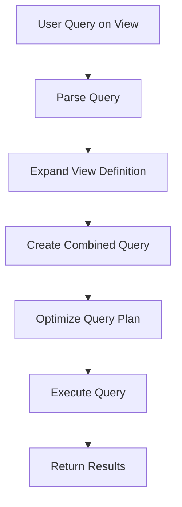

# PostgreSQL View Performance

## Introduction

Views in PostgreSQL provide an excellent way to abstract complex queries and present data in a simplified manner. However, as with any database feature, using views improperly can lead to performance issues. This guide explores how PostgreSQL views work under the hood, their performance implications, and techniques to optimize them for better efficiency.

Views are essentially stored queries that can be referenced like tables. When you query a view, PostgreSQL executes the underlying query defined in the view and returns the results. While this abstraction is powerful, it's important to understand how views affect query performance.

## How PostgreSQL Processes Views

When you query a view, PostgreSQL follows these general steps:

1. Parse the query against the view
2. Expand the view definition into the query
3. Optimize the combined query
4. Execute the optimized query plan

Let's visualize this process:



## Performance Considerations for Views

### View Expansion

When you query a view, PostgreSQL expands the view definition and integrates it with your query. This process is called **view expansion**.

```sql
-- Create a simple view
CREATE VIEW employee_details AS
SELECT e.employee_id, e.first_name, e.last_name, d.department_name
FROM employees e
JOIN departments d ON e.department_id = d.department_id;

-- Query the view
SELECT first_name, last_name 
FROM employee_details 
WHERE department_name = 'Marketing';
```

Behind the scenes, PostgreSQL expands this into:

```sql
SELECT e.first_name, e.last_name 
FROM employees e
JOIN departments d ON e.department_id = d.department_id
WHERE d.department_name = 'Marketing';
```

This expansion is transparent to users but affects performance. The query planner works with the expanded query, not with the view as a separate entity.

### Query Planning with Views

PostgreSQL's query planner is intelligent enough to optimize the combined query after view expansion. This means:

1. It can push down conditions (WHERE clauses) into the view definition
2. It may choose to reorder joins based on statistics
3. It can still use indexes from the underlying tables

Let's check this with an EXPLAIN statement:

```sql
EXPLAIN ANALYZE
SELECT first_name, last_name 
FROM employee_details 
WHERE department_name = 'Marketing';
```

Output:
```
                                                   QUERY PLAN
-----------------------------------------------------------------------------------------------------------------
 Hash Join  (cost=1.11..2.19 rows=2 width=14) (actual time=0.026..0.028 rows=2 loops=1)
   Hash Cond: (e.department_id = d.department_id)
   ->  Seq Scan on employees e  (cost=0.00..1.04 rows=4 width=18) (actual time=0.004..0.005 rows=4 loops=1)
   ->  Hash  (cost=1.10..1.10 rows=1 width=4) (actual time=0.009..0.009 rows=1 loops=1)
         Buckets: 1024  Batches: 1  Memory Usage: 9kB
         ->  Seq Scan on departments d  (cost=0.00..1.10 rows=1 width=4) (actual time=0.004..0.005 rows=1 loops=1)
               Filter: (department_name = 'Marketing'::text)
               Rows Removed by Filter: 3
 Planning Time: 0.115 ms
 Execution Time: 0.058 ms
```

Notice how the filter on `department_name` is applied directly to the underlying `departments` table.

## Common Performance Issues with Views

### 1. Nested Views

One of the most common performance issues occurs when views reference other views, creating nested views.

```sql
-- First view
CREATE VIEW department_summary AS
SELECT department_id, department_name, COUNT(*) as employee_count
FROM employees
GROUP BY department_id, department_name;

-- Second view (nested)
CREATE VIEW large_departments AS
SELECT * FROM department_summary
WHERE employee_count > 10;
```

When you query `large_departments`, PostgreSQL must first expand `department_summary`, then expand that into the reference to the base tables. This can lead to complex query plans and reduced performance.

### 2. Unnecessary Columns

Views that select more columns than needed can impact performance:

```sql
-- Inefficient view with too many columns
CREATE VIEW employee_full AS
SELECT e.*, d.*, s.* 
FROM employees e
JOIN departments d ON e.department_id = d.department_id
JOIN salaries s ON e.employee_id = s.employee_id;

-- Query that only needs names
SELECT first_name, last_name FROM employee_full;
```

Even though the query only needs two columns, PostgreSQL must process all columns from the view definition.

### 3. Complex Aggregations

Views with complex aggregations, window functions, or sorting can be expensive:

```sql
CREATE VIEW department_stats AS
SELECT 
    department_name,
    COUNT(*) as employee_count,
    AVG(salary) as avg_salary,
    MAX(salary) as max_salary,
    MIN(salary) as min_salary,
    PERCENTILE_CONT(0.5) WITHIN GROUP (ORDER BY salary) as median_salary,
    RANK() OVER (ORDER BY AVG(salary) DESC) as salary_rank
FROM employees e
JOIN departments d ON e.department_id = d.department_id
JOIN salaries s ON e.employee_id = s.employee_id
GROUP BY department_name;
```

Such views can be particularly expensive when they're used as the basis for further filtering or joining.

## Performance Optimization Techniques

### 1. Materialized Views

For views with complex calculations or aggregations, consider using materialized views:

```sql
CREATE MATERIALIZED VIEW department_stats_mat AS
SELECT 
    department_name,
    COUNT(*) as employee_count,
    AVG(salary) as avg_salary
FROM employees e
JOIN departments d ON e.department_id = d.department_id
JOIN salaries s ON e.employee_id = s.employee_id
GROUP BY department_name;
```

Materialized views store the results of the query physically, rather than executing the query each time. You'll need to refresh them when the underlying data changes:

```sql
-- Full refresh
REFRESH MATERIALIZED VIEW department_stats_mat;

-- Concurrent refresh (allows queries during refresh)
REFRESH MATERIALIZED VIEW CONCURRENTLY department_stats_mat;
```

### 2. Indexing Strategies

Create appropriate indexes on the underlying tables to support view queries:

```sql
-- Create index to support department name filtering
CREATE INDEX idx_department_name ON departments(department_name);

-- Create index to support join operations
CREATE INDEX idx_employee_department_id ON employees(department_id);
```

Remember that PostgreSQL can use these indexes when querying views, as long as the query planner can determine they're applicable after view expansion.

### 3. Use WITH CHECK OPTION

For views that are used for DML operations (INSERT, UPDATE, DELETE), consider using `WITH CHECK OPTION` to prevent operations that would make rows disappear from the view:

```sql
CREATE VIEW active_employees AS
SELECT * FROM employees 
WHERE status = 'active'
WITH CHECK OPTION;
```

This prevents updates that would change an employee's status to inactive, which would cause performance confusion if rows suddenly disappear.

### 4. Avoid Unnecessary Nesting

Instead of nesting views, consider rewriting queries to reference base tables directly:

```sql
-- Instead of this
SELECT * FROM large_departments WHERE department_name LIKE 'S%';

-- Consider this
SELECT department_id, department_name, COUNT(*) as employee_count
FROM employees
GROUP BY department_id, department_name
HAVING COUNT(*) > 10 AND department_name LIKE 'S%';
```

### 5. Use EXPLAIN ANALYZE

Regularly use `EXPLAIN ANALYZE` to examine the query plans for your view-based queries:

```sql
EXPLAIN ANALYZE
SELECT * FROM employee_details 
WHERE department_name = 'Marketing';
```

This helps identify performance bottlenecks and verify that your optimizations are effective.

## Practical Example: Optimizing a Report View

Let's walk through a complete example of optimizing a reporting view.

### Initial View (Unoptimized)

```sql
-- Create base tables
CREATE TABLE sales (
    sale_id SERIAL PRIMARY KEY,
    product_id INT,
    customer_id INT,
    sale_date DATE,
    quantity INT,
    unit_price DECIMAL(10, 2)
);

CREATE TABLE products (
    product_id SERIAL PRIMARY KEY,
    product_name VARCHAR(100),
    category VARCHAR(50)
);

CREATE TABLE customers (
    customer_id SERIAL PRIMARY KEY,
    customer_name VARCHAR(100),
    region VARCHAR(50)
);

-- Initial view (potentially slow)
CREATE VIEW sales_report AS
SELECT 
    s.sale_id,
    p.product_name,
    c.customer_name,
    c.region,
    s.sale_date,
    s.quantity,
    s.unit_price,
    (s.quantity * s.unit_price) AS total_amount,
    EXTRACT(MONTH FROM s.sale_date) AS month,
    EXTRACT(YEAR FROM s.sale_date) AS year
FROM sales s
JOIN products p ON s.product_id = p.product_id
JOIN customers c ON s.customer_id = c.customer_id;
```

### Performance Issues

When using this view for monthly reports, we notice slow performance:

```sql
-- Slow query
SELECT 
    product_name,
    SUM(total_amount) as monthly_sales
FROM sales_report
WHERE year = 2023 AND month = 7
GROUP BY product_name
ORDER BY monthly_sales DESC;
```

### Optimization Steps

1. **Analyze the query plan**:

```sql
EXPLAIN ANALYZE
SELECT 
    product_name,
    SUM(total_amount) as monthly_sales
FROM sales_report
WHERE year = 2023 AND month = 7
GROUP BY product_name
ORDER BY monthly_sales DESC;
```

2. **Create appropriate indexes**:

```sql
-- Add indexes to support the view
CREATE INDEX idx_sales_date ON sales(sale_date);
CREATE INDEX idx_sales_product_id ON sales(product_id);
CREATE INDEX idx_sales_customer_id ON sales(customer_id);
```

3. **Create a materialized view for reporting**:

```sql
CREATE MATERIALIZED VIEW monthly_sales_report AS
SELECT 
    p.product_name,
    EXTRACT(MONTH FROM s.sale_date) AS month,
    EXTRACT(YEAR FROM s.sale_date) AS year,
    SUM(s.quantity * s.unit_price) AS total_sales
FROM sales s
JOIN products p ON s.product_id = p.product_id
GROUP BY p.product_name, month, year;

-- Create an index on the materialized view
CREATE INDEX idx_monthly_sales_report_date ON monthly_sales_report(year, month);
```

4. **Set up a refresh schedule** using a cron job or similar:

```sql
-- Refresh the materialized view nightly
REFRESH MATERIALIZED VIEW monthly_sales_report;
```

5. **Update the query to use the materialized view**:

```sql
-- Now much faster
SELECT 
    product_name,
    total_sales as monthly_sales
FROM monthly_sales_report
WHERE year = 2023 AND month = 7
ORDER BY monthly_sales DESC;
```

## Best Practices Summary

1. **Understand view expansion**: Remember that PostgreSQL expands views into the main query.
2. **Keep view definitions simple**: Avoid overly complex view definitions when possible.
3. **Use materialized views** for expensive calculations or aggregations.
4. **Create appropriate indexes** on underlying tables.
5. **Avoid deeply nested views** that reference other views.
6. **Use EXPLAIN ANALYZE** to identify performance bottlenecks.
7. **Consider partitioning** underlying tables for large datasets.
8. **Refresh materialized views** on a schedule appropriate to your data change frequency.
9. **Limit column selection** to only what's needed.
10. **Use appropriate JOIN types** in view definitions.

## Summary

PostgreSQL views are a powerful abstraction tool that can simplify complex queries and data access. However, they come with performance considerations that every database developer should understand. By following the best practices outlined in this guide, you can create views that are both useful and performant.

Remember that the PostgreSQL query planner is sophisticated and can optimize many view-based queries effectively. Your job is to help it by designing views that align with how the data will be used and by providing the necessary indexes and structures for efficient execution.

## Additional Resources

- [PostgreSQL Official Documentation on Views](https://www.postgresql.org/docs/current/rules-views.html)
- [PostgreSQL Query Planning](https://www.postgresql.org/docs/current/planner-optimizer.html)
- [Materialized Views in PostgreSQL](https://www.postgresql.org/docs/current/rules-materializedviews.html)

## Exercises

1. Create a view on a sample database, then use `EXPLAIN ANALYZE` to examine how PostgreSQL processes queries against it.
2. Convert a regular view to a materialized view and compare performance.
3. Identify a performance bottleneck in a view-based query and optimize it using the techniques discussed.
4. Create appropriate indexes to speed up a complex view and measure the performance improvement.
5. Practice writing efficient view definitions that avoid common performance pitfalls.