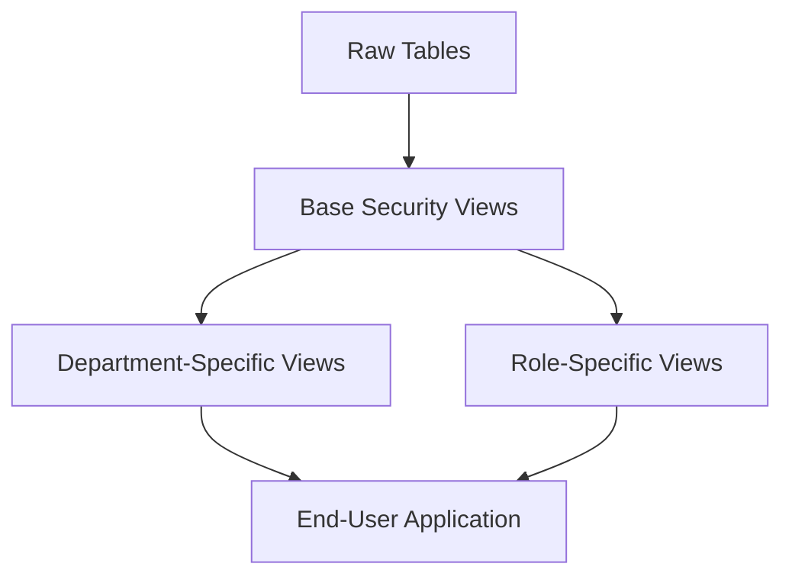

# PostgreSQL View Security

## Introduction

When working with databases, security is a critical concern. PostgreSQL views offer an elegant solution for implementing security controls without modifying your underlying table structure. By using views, you can restrict access to specific columns or rows, simplifying your security model while still providing users with the data they need.

In this tutorial, we'll explore how to leverage PostgreSQL views to enhance database security, control access permissions, and implement row-level security policies. We'll cover practical examples that demonstrate how views serve as a security layer between your raw data and application users.

## Why Use Views for Security?

Views provide several security benefits:

1. **Column-level security**: Show only specific columns to certain users
2. **Row-level security**: Filter rows based on user roles or other criteria
3. **Data transformation**: Mask or transform sensitive data before displaying
4. **Simplified permissions**: Grant permissions on views rather than complex table-level permissions

## Basic View Security Concepts

### Creating a Secure View

Let's start with a simple example. Imagine we have an `employees` table containing sensitive information:

```sql
CREATE TABLE employees (
    employee_id SERIAL PRIMARY KEY,
    first_name VARCHAR(50),
    last_name VARCHAR(50),
    email VARCHAR(100),
    phone VARCHAR(20),
    salary NUMERIC(10,2),
    ssn VARCHAR(11),
    department_id INTEGER
);
```

To restrict access to sensitive fields like `salary` and `ssn`, we can create a view:

```sql
CREATE VIEW employee_public_info AS
    SELECT employee_id, first_name, last_name, email, department_id
    FROM employees;
```

Now we can grant access to this view instead of the underlying table:

```sql
-- Revoke direct table access
REVOKE ALL ON employees FROM analyst_role;

-- Grant access to the limited view
GRANT SELECT ON employee_public_info TO analyst_role;
```

### View Permission Management

PostgreSQL allows you to set different permissions on views than on their underlying tables:

```sql
-- Create role for HR department
CREATE ROLE hr_staff;

-- Create role for general staff
CREATE ROLE general_staff;

-- HR view with salary information
CREATE VIEW employee_hr_view AS
    SELECT employee_id, first_name, last_name, email, phone, salary, department_id
    FROM employees;

-- Give HR staff access to the HR view
GRANT SELECT ON employee_hr_view TO hr_staff;

-- Give general staff access to the limited public view
GRANT SELECT ON employee_public_info TO general_staff;
```

## Advanced View Security Techniques

### Row-Level Security with Views

Views can implement row-level security by filtering data based on specific conditions:

```sql
-- Create a view that only shows employees in the same department as the current user
CREATE VIEW department_colleagues AS
    SELECT employee_id, first_name, last_name, email, department_id
    FROM employees
    WHERE department_id = (
        SELECT department_id 
        FROM employees 
        WHERE email = current_user
    );
```

### Using Session Variables for Dynamic Filtering

You can use session variables to create dynamic security filters:

```sql
-- Set a session variable for the current user's department
SET app.current_department_id = 5;

-- Create a view that filters based on the session variable
CREATE VIEW department_employees AS
    SELECT employee_id, first_name, last_name, email, department_id
    FROM employees
    WHERE department_id = current_setting('app.current_department_id')::integer;
```

### Updatable Secure Views

By default, views that meet certain criteria are updatable. This allows you to use views not just for reading but also for safely modifying data:

```sql
-- Create an updatable view for employee contact information
CREATE VIEW employee_contacts AS
    SELECT employee_id, first_name, last_name, email, phone
    FROM employees;

-- Allow updates to specific columns through the view
GRANT SELECT, UPDATE (email, phone) ON employee_contacts TO support_staff;
```

Now support staff can update contact information without seeing or modifying salary information.

## Using Row Security Policies with Views

PostgreSQL's Row Security Policies (RLS) can be combined with views to create powerful security mechanisms:

```sql
-- Enable row level security on the employees table
ALTER TABLE employees ENABLE ROW LEVEL SECURITY;

-- Create a policy that only allows users to see rows in their department
CREATE POLICY department_access ON employees
    FOR SELECT
    USING (department_id = (SELECT department_id FROM user_departments WHERE username = current_user));

-- Create a view on top of this secured table
CREATE VIEW my_department_employees AS
    SELECT employee_id, first_name, last_name, email
    FROM employees;
```

## Handling Security in View Hierarchies

Views can be built upon other views, creating a hierarchy of security layers:

```sql
-- Base view with limited columns
CREATE VIEW employee_base AS
    SELECT employee_id, first_name, last_name, department_id
    FROM employees;

-- Department-specific view built on the base view
CREATE VIEW engineering_employees AS
    SELECT employee_id, first_name, last_name
    FROM employee_base
    WHERE department_id = 3;

-- Grant access to the most specific view
GRANT SELECT ON engineering_employees TO engineering_team;
```

## Data Masking with Views

Views can mask sensitive data while still providing useful information:

```sql
-- Create a view that masks credit card numbers
CREATE VIEW masked_payments AS
    SELECT 
        payment_id,
        customer_id,
        'XXXX-XXXX-XXXX-' || RIGHT(credit_card_number, 4) AS masked_card,
        amount,
        payment_date
    FROM payments;
```

## Implementing Security Context with Views

Let's create a more comprehensive example that demonstrates implementing a complete security model:



Here's how to implement this in PostgreSQL:

```sql
-- Create users table with roles
CREATE TABLE users (
    username VARCHAR(50) PRIMARY KEY,
    role VARCHAR(20),
    department_id INTEGER
);

-- Base security view
CREATE VIEW secure_employee_base AS
    SELECT 
        e.employee_id, 
        e.first_name, 
        e.last_name,
        e.email,
        e.department_id,
        CASE 
            WHEN EXISTS (SELECT 1 FROM users WHERE username = current_user AND role = 'hr') 
            THEN e.salary
            ELSE NULL
        END AS salary
    FROM employees e;

-- Department-specific view with row filtering
CREATE VIEW my_department_view AS
    SELECT 
        employee_id, 
        first_name, 
        last_name,
        email,
        department_id,
        salary
    FROM secure_employee_base
    WHERE department_id = (
        SELECT department_id 
        FROM users 
        WHERE username = current_user
    );

-- Function to check permissions before operations
CREATE FUNCTION check_employee_access() RETURNS TRIGGER AS $$
BEGIN
    IF NOT EXISTS (
        SELECT 1 FROM users 
        WHERE username = current_user 
        AND (role = 'hr' OR department_id = NEW.department_id)
    ) THEN
        RAISE EXCEPTION 'You do not have permission to modify this employee';
    END IF;
    RETURN NEW;
END;
$$ LANGUAGE plpgsql;

-- Add trigger to the view
CREATE TRIGGER employee_security_trigger
    BEFORE INSERT OR UPDATE ON my_department_view
    FOR EACH ROW
    EXECUTE FUNCTION check_employee_access();
```

## Best Practices for View Security

1. **Layer your security model**: Use a combination of column restrictions, row filtering, and permission grants
2. **Avoid exposing the underlying tables**: Grant permissions only on views, not tables
3. **Implement row-level security**: Use WHERE clauses or RLS policies to filter rows
4. **Use SECURITY DEFINER views cautiously**: These views run with the privileges of the view owner, not the user
5. **Audit your view security**: Regularly review who has access to which views
6. **Update security for schema changes**: Remember to update view definitions when table schemas change

### Security Definer vs. Invoker Views

PostgreSQL supports two types of security contexts for views:

```sql
-- Security definer view - runs with privileges of the creator
CREATE VIEW hr_data_security_definer 
    WITH (security_barrier=true, security_invoker=false) AS
    SELECT employee_id, first_name, last_name, salary
    FROM employees;

-- Security invoker view - runs with privileges of the user
CREATE VIEW department_data_security_invoker
    WITH (security_invoker=true) AS
    SELECT employee_id, first_name, last_name, department_id
    FROM employees;
```

The `security_barrier` option helps prevent security issues with certain types of function calls within views.

## Potential Security Pitfalls

When using views for security, be aware of these common issues:

1. **Function leakage**: Functions in views can sometimes bypass security restrictions
2. **Security barrier views**: Use `WITH (security_barrier=true)` for critical security views
3. **Permission inheritance**: When a user has access to an underlying table, view restrictions alone may not be enough
4. **Materialized views**: These may contain stale data that doesn't reflect current security constraints

For example, this view might have a security issue:

```sql
-- Potentially insecure view due to function execution order
CREATE VIEW employee_search AS
    SELECT employee_id, first_name, last_name, salary
    FROM employees
    WHERE some_function(salary) = TRUE;
```

The correct approach would be:

```sql
-- More secure with security barrier
CREATE VIEW employee_search WITH (security_barrier=true) AS
    SELECT employee_id, first_name, last_name, salary
    FROM employees
    WHERE some_function(salary) = TRUE;
```

## Summary

PostgreSQL views provide a powerful mechanism for implementing security controls in your database. By using views strategically, you can:

- Restrict access to sensitive columns
- Filter rows based on user roles or context
- Apply data masking to protect sensitive information
- Simplify permission management
- Implement complex security models without modifying application code

Views serve as a crucial security layer between your raw data and your application users. When combined with PostgreSQL's permission system and row-level security features, they allow you to create sophisticated security models that protect your data while ensuring users can access what they need.

## Additional Resources

- [PostgreSQL Documentation on Views](https://www.postgresql.org/docs/current/sql-createview.html)
- [Row Security Policies in PostgreSQL](https://www.postgresql.org/docs/current/ddl-rowsecurity.html)
- [PostgreSQL Grant and Privileges](https://www.postgresql.org/docs/current/sql-grant.html)

## Exercises

1. Create a view that shows employee information but masks all but the last four digits of phone numbers.
2. Implement a department-specific view that only shows employees in the same department as the current user.
3. Create a view hierarchy with three levels of security: public information, department-specific information, and HR-only information.
4. Implement row-level security on a customer table so that sales representatives can only see their own customers through a view.
5. Create an updatable view that allows managers to update employee projects but not salaries.