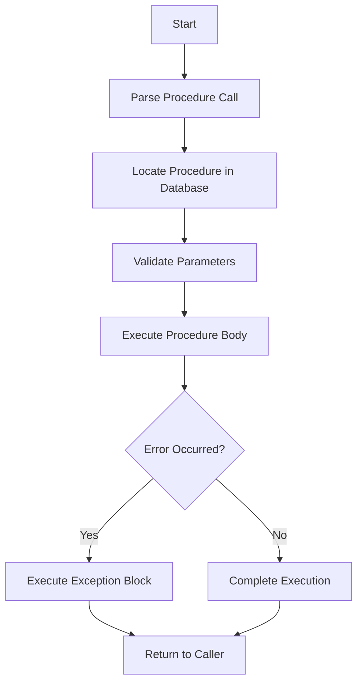

# PostgreSQL Stored Procedure Basics

## Introduction

Stored procedures are named blocks of SQL and procedural code that are stored in a database and can be executed on demand. In PostgreSQL, stored procedures allow you to encapsulate and reuse logic directly within the database server, which can improve performance, security, and maintainability of your database applications.

PostgreSQL's implementation of stored procedures was fully standardized in version 11 (released in 2018), which added true SQL-standard `PROCEDURE` objects alongside the existing `FUNCTION` objects that PostgreSQL has had for many years.

In this tutorial, we'll explore the basics of PostgreSQL stored procedures, including:
- The difference between functions and procedures
- Creating your first stored procedure
- Parameters and return values
- Transaction control
- Error handling
- Practical examples

## Functions vs. Procedures in PostgreSQL

Before PostgreSQL 11, developers used functions for all procedural logic. The key differences between functions and procedures are:

| Function | Procedure |
|----------|-----------|
| Must return a value (even if it's `void`) | Doesn't return a value |
| Cannot manage transactions (commit/rollback) | Can manage transactions |
| Created with `CREATE FUNCTION` | Created with `CREATE PROCEDURE` |
| Called with `SELECT` statement | Called with `CALL` statement |

## Creating Your First Stored Procedure

Let's create a simple stored procedure in PostgreSQL:

```sql
CREATE OR REPLACE PROCEDURE hello_world()
LANGUAGE plpgsql
AS $$
BEGIN
    RAISE NOTICE 'Hello, World!';
END;
$$;
```

To execute this procedure, use the `CALL` statement:

```sql
CALL hello_world();
```

Output:
```
NOTICE:  Hello, World!
CALL
```

The procedure runs and displays a notice message.

## Procedure Parameters

Stored procedures can accept input parameters, which makes them more flexible:

```sql
CREATE OR REPLACE PROCEDURE greet_user(user_name VARCHAR)
LANGUAGE plpgsql
AS $$
BEGIN
    RAISE NOTICE 'Hello, %!', user_name;
END;
$$;
```

Let's call this procedure with a parameter:

```sql
CALL greet_user('John');
```

Output:
```
NOTICE:  Hello, John!
CALL
```

### Parameter Modes

PostgreSQL supports three parameter modes:

1. `IN` - Input parameters (default if not specified)
2. `OUT` - Output parameters
3. `INOUT` - Both input and output

Example with different parameter modes:

```sql
CREATE OR REPLACE PROCEDURE calculate_rectangle_properties(
    IN width NUMERIC,
    IN length NUMERIC,
    OUT area NUMERIC,
    INOUT perimeter NUMERIC
)
LANGUAGE plpgsql
AS $$
BEGIN
    area := width * length;
    perimeter := 2 * (width + length);
END;
$$;
```

To call this procedure:

```sql
DO $$
DECLARE
    v_area NUMERIC;
    v_perimeter NUMERIC := 0;
BEGIN
    CALL calculate_rectangle_properties(5, 10, v_area, v_perimeter);
    RAISE NOTICE 'Area: %, Perimeter: %', v_area, v_perimeter;
END;
$$;
```

Output:
```
NOTICE:  Area: 50, Perimeter: 30
```

## Transaction Control in Procedures

One of the main advantages of procedures over functions is the ability to control transactions:

```sql
CREATE OR REPLACE PROCEDURE transfer_funds(
    sender_id INT,
    receiver_id INT,
    amount NUMERIC
)
LANGUAGE plpgsql
AS $$
BEGIN
    -- Deduct from sender
    UPDATE accounts SET balance = balance - amount
    WHERE account_id = sender_id;
    
    -- Add to receiver
    UPDATE accounts SET balance = balance + amount
    WHERE account_id = receiver_id;
    
    -- Commit the transaction
    COMMIT;
    
    RAISE NOTICE 'Successfully transferred % from account % to account %',
        amount, sender_id, receiver_id;
EXCEPTION
    WHEN OTHERS THEN
        -- Rollback the transaction on error
        ROLLBACK;
        RAISE NOTICE 'Transaction failed: %', SQLERRM;
END;
$$;
```

## Error Handling in Stored Procedures

PostgreSQL's PL/pgSQL language offers robust error handling through the `EXCEPTION` block:

```sql
CREATE OR REPLACE PROCEDURE safe_division(
    a NUMERIC,
    b NUMERIC,
    OUT result NUMERIC
)
LANGUAGE plpgsql
AS $$
BEGIN
    -- Attempt division
    result := a / b;
    
    RAISE NOTICE 'Division result: %', result;
EXCEPTION
    WHEN division_by_zero THEN
        RAISE NOTICE 'Cannot divide by zero!';
        result := NULL;
    WHEN numeric_value_out_of_range THEN
        RAISE NOTICE 'Numeric value out of range!';
        result := NULL;
END;
$$;
```

Let's test this procedure with different inputs:

```sql
DO $$
DECLARE
    v_result NUMERIC;
BEGIN
    CALL safe_division(10, 2, v_result);
    RAISE NOTICE 'Result 1: %', v_result;
    
    CALL safe_division(10, 0, v_result);
    RAISE NOTICE 'Result 2: %', v_result;
END;
$$;
```

Output:
```
NOTICE:  Division result: 5
NOTICE:  Result 1: 5
NOTICE:  Cannot divide by zero!
NOTICE:  Result 2: <null>
```

## Control Structures in Stored Procedures

PL/pgSQL offers various control structures to build complex logic:

### IF-ELSIF-ELSE

```sql
CREATE OR REPLACE PROCEDURE check_grade(score INT)
LANGUAGE plpgsql
AS $$
BEGIN
    IF score >= 90 THEN
        RAISE NOTICE 'Grade: A';
    ELSIF score >= 80 THEN
        RAISE NOTICE 'Grade: B';
    ELSIF score >= 70 THEN
        RAISE NOTICE 'Grade: C';
    ELSIF score >= 60 THEN
        RAISE NOTICE 'Grade: D';
    ELSE
        RAISE NOTICE 'Grade: F';
    END IF;
END;
$$;
```

### CASE Statement

```sql
CREATE OR REPLACE PROCEDURE check_day_type(day_name TEXT)
LANGUAGE plpgsql
AS $$
BEGIN
    CASE lower(day_name)
        WHEN 'saturday' THEN
            RAISE NOTICE 'It''s a weekend day!';
        WHEN 'sunday' THEN
            RAISE NOTICE 'It''s a weekend day!';
        ELSE
            RAISE NOTICE 'It''s a weekday!';
    END CASE;
END;
$$;
```

### Loops

```sql
CREATE OR REPLACE PROCEDURE count_down(start_num INT)
LANGUAGE plpgsql
AS $$
DECLARE
    counter INT := start_num;
BEGIN
    WHILE counter > 0 LOOP
        RAISE NOTICE '%', counter;
        counter := counter - 1;
    END LOOP;
    
    RAISE NOTICE 'Blast off!';
END;
$$;
```

## Practical Example: Employee Management System

Let's create a more complex practical example for an employee management system:

```sql
-- First, let's create our tables
CREATE TABLE IF NOT EXISTS departments (
    dept_id SERIAL PRIMARY KEY,
    dept_name VARCHAR(100) NOT NULL
);

CREATE TABLE IF NOT EXISTS employees (
    emp_id SERIAL PRIMARY KEY,
    first_name VARCHAR(50) NOT NULL,
    last_name VARCHAR(50) NOT NULL,
    dept_id INT REFERENCES departments(dept_id),
    salary NUMERIC(10, 2) NOT NULL,
    hire_date DATE NOT NULL
);

-- Procedure to add a new department
CREATE OR REPLACE PROCEDURE add_department(dept_name VARCHAR)
LANGUAGE plpgsql
AS $$
BEGIN
    INSERT INTO departments (dept_name)
    VALUES (dept_name);
    
    RAISE NOTICE 'Department "%" added successfully', dept_name;
EXCEPTION
    WHEN unique_violation THEN
        RAISE NOTICE 'Department "%" already exists', dept_name;
END;
$$;

-- Procedure to hire an employee
CREATE OR REPLACE PROCEDURE hire_employee(
    p_first_name VARCHAR,
    p_last_name VARCHAR,
    p_dept_name VARCHAR,
    p_salary NUMERIC,
    p_hire_date DATE DEFAULT CURRENT_DATE
)
LANGUAGE plpgsql
AS $$
DECLARE
    v_dept_id INT;
BEGIN
    -- Find department ID
    SELECT dept_id INTO v_dept_id
    FROM departments
    WHERE dept_name = p_dept_name;
    
    -- Create department if it doesn't exist
    IF v_dept_id IS NULL THEN
        CALL add_department(p_dept_name);
        
        -- Get the new department ID
        SELECT dept_id INTO v_dept_id
        FROM departments
        WHERE dept_name = p_dept_name;
    END IF;
    
    -- Add the employee
    INSERT INTO employees (first_name, last_name, dept_id, salary, hire_date)
    VALUES (p_first_name, p_last_name, v_dept_id, p_salary, p_hire_date);
    
    RAISE NOTICE 'Employee % % hired successfully in department %',
        p_first_name, p_last_name, p_dept_name;
END;
$$;

-- Procedure to give a raise to employees in a department
CREATE OR REPLACE PROCEDURE give_department_raise(
    p_dept_name VARCHAR,
    p_percentage NUMERIC
)
LANGUAGE plpgsql
AS $$
DECLARE
    v_dept_id INT;
    v_affected_rows INT;
BEGIN
    -- Find department ID
    SELECT dept_id INTO v_dept_id
    FROM departments
    WHERE dept_name = p_dept_name;
    
    IF v_dept_id IS NULL THEN
        RAISE EXCEPTION 'Department "%" does not exist', p_dept_name;
    END IF;
    
    -- Update employees' salaries
    UPDATE employees
    SET salary = salary * (1 + p_percentage / 100)
    WHERE dept_id = v_dept_id;
    
    GET DIAGNOSTICS v_affected_rows = ROW_COUNT;
    
    RAISE NOTICE 'Gave a % percent raise to % employees in the % department',
        p_percentage, v_affected_rows, p_dept_name;
    
    COMMIT;
EXCEPTION
    WHEN OTHERS THEN
        ROLLBACK;
        RAISE NOTICE 'Error giving raises: %', SQLERRM;
END;
$$;
```

Let's see these procedures in action:

```sql
-- Add some departments and employees
CALL add_department('Engineering');
CALL add_department('Marketing');

-- Hire employees
CALL hire_employee('John', 'Doe', 'Engineering', 75000);
CALL hire_employee('Jane', 'Smith', 'Engineering', 82000);
CALL hire_employee('Michael', 'Johnson', 'Marketing', 65000);

-- Give raises to the Engineering department
CALL give_department_raise('Engineering', 5);
```

Output:
```
NOTICE:  Department "Engineering" added successfully
NOTICE:  Department "Marketing" added successfully
NOTICE:  Employee John Doe hired successfully in department Engineering
NOTICE:  Employee Jane Smith hired successfully in department Engineering
NOTICE:  Employee Michael Johnson hired successfully in department Marketing
NOTICE:  Gave a 5 percent raise to 2 employees in the Engineering department
```

## Flow Diagram: Stored Procedure Execution



## Summary

PostgreSQL stored procedures provide a powerful way to encapsulate business logic within your database. In this tutorial, we covered:

- The basics of creating stored procedures
- Parameter modes (IN, OUT, INOUT)
- Transaction control capabilities
- Error handling techniques
- Control structures like IF-ELSE and loops
- A practical example of an employee management system

Stored procedures offer several benefits:
- Improved performance by reducing network traffic
- Enhanced security through controlled access to data
- Code reusability across applications
- Transaction management capabilities
- Centralized business logic

## Additional Resources and Exercises

### Further Learning
- PostgreSQL official documentation on [Stored Procedures](https://www.postgresql.org/docs/current/sql-createprocedure.html)
- Learn more about [PL/pgSQL](https://www.postgresql.org/docs/current/plpgsql.html)
- Explore [Function Overloading](https://www.postgresql.org/docs/current/xfunc-overload.html)

### Exercises

1. **Basic Practice**: Create a stored procedure that adds two numbers and displays the result.

2. **Parameter Practice**: Modify the above procedure to accept different parameter modes (IN, OUT, INOUT).

3. **Conditional Logic**: Create a procedure that evaluates a student's grade based on their score using IF-ELSE or CASE statements.

4. **Transaction Management**: Implement a bank transaction procedure that transfers money between accounts with proper error handling.

5. **Real-world Application**: Extend the employee management system by creating procedures to:
   - Calculate department-specific statistics (average salary, employee count)
   - Generate quarterly performance reports
   - Implement an employee promotion workflow