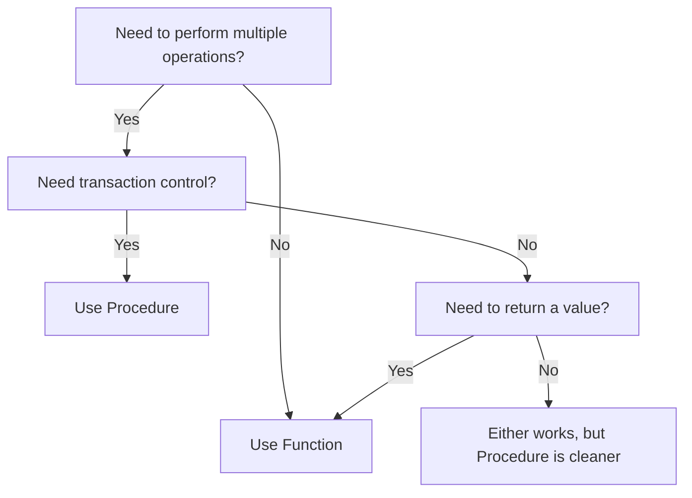

# PostgreSQL CREATE PROCEDURE

## Introduction

Procedures (also known as stored procedures) are a powerful feature in PostgreSQL that allow you to encapsulate a series of SQL statements and operations into a single, reusable unit. Unlike functions, procedures don't necessarily return a value but can perform multiple database operations, including transactions.

PostgreSQL introduced the `CREATE PROCEDURE` command in version 11, providing better compatibility with the SQL standard and other database systems. Procedures are particularly useful when you need to execute a series of statements that modify data, as they can contain transaction control commands (`COMMIT`, `ROLLBACK`) within their body.

## Basic Syntax

The basic syntax for creating a procedure in PostgreSQL is:

```sql
CREATE [OR REPLACE] PROCEDURE procedure_name (parameter_name parameter_type [, ...])
LANGUAGE language_name
AS $$
  -- procedure body
$$;
```

Let's break down the key components:

- `OR REPLACE`: Optional clause that allows you to update an existing procedure without dropping it first
- `procedure_name`: Name of the procedure
- `parameter_name parameter_type`: Input and output parameters for the procedure
- `language_name`: The language used in the procedure body (common options are `plpgsql`, `sql`)
- `procedure body`: The code that will be executed when the procedure is called

## Creating a Simple Procedure

Let's start with a simple example:

```sql
CREATE OR REPLACE PROCEDURE create_employee(
  employee_name VARCHAR,
  employee_salary NUMERIC
)
LANGUAGE plpgsql
AS $$
BEGIN
  INSERT INTO employees (name, salary, created_at)
  VALUES (employee_name, employee_salary, NOW());
  
  RAISE NOTICE 'Employee % successfully created', employee_name;
END;
$$;
```

This procedure inserts a new employee into the `employees` table with the given name and salary, and sets the `created_at` column to the current timestamp.

## Calling a Procedure

You can call a procedure using the `CALL` statement:

```sql
CALL create_employee('John Doe', 50000);
```

**Output:**
```
NOTICE: Employee John Doe successfully created
CALL
```

## Parameter Modes

PostgreSQL procedures support three parameter modes:

- `IN`: Input parameters (default)
- `OUT`: Output parameters
- `INOUT`: Parameters that are both input and output

Let's create a procedure that demonstrates these different modes:

```sql
CREATE OR REPLACE PROCEDURE calculate_statistics(
  IN min_salary NUMERIC,
  OUT employee_count INTEGER,
  OUT avg_salary NUMERIC,
  INOUT max_salary NUMERIC
)
LANGUAGE plpgsql
AS $$
BEGIN
  -- Get count of employees with salary >= min_salary
  SELECT COUNT(*), AVG(salary), GREATEST(max_salary, MAX(salary))
  INTO employee_count, avg_salary, max_salary
  FROM employees
  WHERE salary >= min_salary;
  
  RAISE NOTICE 'Processed statistics for % employees', employee_count;
END;
$$;
```

You can call this procedure with:

```sql
DO $$
DECLARE
  count INTEGER;
  avg NUMERIC;
  max_value NUMERIC := 0; -- Initial value for INOUT parameter
BEGIN
  CALL calculate_statistics(40000, count, avg, max_value);
  RAISE NOTICE 'Results: count=%, avg=%, max=%', count, avg, max_value;
END;
$$;
```

**Output:**
```
NOTICE: Processed statistics for 12 employees
NOTICE: Results: count=12, avg=52500.00, max=95000.00
```

## Transactions Within Procedures

One of the main advantages of procedures over functions is the ability to manage transactions within the procedure body. This allows procedures to commit or rollback changes separately from the calling transaction.

Here's an example of a procedure that uses transaction control:

```sql
CREATE OR REPLACE PROCEDURE transfer_funds(
  sender_id INTEGER,
  receiver_id INTEGER,
  amount NUMERIC
)
LANGUAGE plpgsql
AS $$
DECLARE
  sender_balance NUMERIC;
BEGIN
  -- Start a transaction
  BEGIN
    -- Check sender's balance
    SELECT balance INTO sender_balance 
    FROM accounts 
    WHERE id = sender_id;
    
    IF sender_balance < amount THEN
      RAISE EXCEPTION 'Insufficient funds: balance is %', sender_balance;
    END IF;
    
    -- Update sender's account
    UPDATE accounts 
    SET balance = balance - amount 
    WHERE id = sender_id;
    
    -- Update receiver's account
    UPDATE accounts 
    SET balance = balance + amount 
    WHERE id = receiver_id;
    
    RAISE NOTICE 'Successfully transferred % from account % to account %', 
                 amount, sender_id, receiver_id;
    
    -- Commit the transaction
    COMMIT;
  EXCEPTION WHEN OTHERS THEN
    -- Rollback in case of any error
    ROLLBACK;
    RAISE;
  END;
END;
$$;
```

This procedure transfers funds between accounts and uses a transaction to ensure that both updates happen together or not at all.

## Procedure vs. Function: Key Differences

Understanding when to use a procedure versus a function is important:



Key differences include:
- Procedures can include transaction control statements (`COMMIT`, `ROLLBACK`)
- Functions must return a value, procedures don't need to
- Procedures are called with `CALL`, functions are used in expressions
- Procedures cannot be used in SQL queries, functions can

## Best Practices

When creating procedures in PostgreSQL, keep these best practices in mind:

1. **Use meaningful names** that describe what the procedure does
2. **Document your procedures** with comments explaining their purpose and parameters
3. **Handle exceptions properly** to avoid unexpected behavior
4. **Validate input parameters** to prevent errors or security issues
5. **Use transactions** appropriately to ensure data integrity
6. **Keep procedures focused** on a single responsibility
7. **Consider security implications** when granting execute permissions

## Real-World Example: Order Processing System

Here's a more complex real-world example of a procedure for a basic order processing system:

```sql
CREATE OR REPLACE PROCEDURE process_order(
  p_customer_id INTEGER,
  p_items JSONB,
  OUT p_order_id INTEGER
)
LANGUAGE plpgsql
AS $$
DECLARE
  v_total_amount NUMERIC := 0;
  v_item JSONB;
  v_product_id INTEGER;
  v_quantity INTEGER;
  v_price NUMERIC;
  v_inventory_count INTEGER;
BEGIN
  -- Start transaction
  BEGIN
    -- Create order record
    INSERT INTO orders (customer_id, order_date, status, total_amount)
    VALUES (p_customer_id, NOW(), 'PENDING', 0)
    RETURNING id INTO p_order_id;
    
    -- Process each item in the order
    FOR v_item IN SELECT * FROM jsonb_array_elements(p_items)
    LOOP
      v_product_id := (v_item->>'product_id')::INTEGER;
      v_quantity := (v_item->>'quantity')::INTEGER;
      
      -- Check inventory
      SELECT price, inventory_count 
      INTO v_price, v_inventory_count
      FROM products 
      WHERE id = v_product_id;
      
      IF v_inventory_count < v_quantity THEN
        RAISE EXCEPTION 'Insufficient inventory for product ID %', v_product_id;
      END IF;
      
      -- Create order item
      INSERT INTO order_items (order_id, product_id, quantity, price)
      VALUES (p_order_id, v_product_id, v_quantity, v_price);
      
      -- Update inventory
      UPDATE products
      SET inventory_count = inventory_count - v_quantity
      WHERE id = v_product_id;
      
      -- Add to total
      v_total_amount := v_total_amount + (v_price * v_quantity);
    END LOOP;
    
    -- Update order total
    UPDATE orders
    SET total_amount = v_total_amount,
        status = 'CONFIRMED'
    WHERE id = p_order_id;
    
    RAISE NOTICE 'Order % processed successfully. Total amount: %', 
                 p_order_id, v_total_amount;
    
    COMMIT;
  EXCEPTION WHEN OTHERS THEN
    ROLLBACK;
    RAISE;
  END;
END;
$$;
```

To call this procedure:

```sql
DO $$
DECLARE
  order_id INTEGER;
  items JSONB := '[
    {"product_id": 101, "quantity": 2},
    {"product_id": 203, "quantity": 1}
  ]';
BEGIN
  CALL process_order(42, items, order_id);
  RAISE NOTICE 'Created order with ID: %', order_id;
END;
$$;
```

**Output:**
```
NOTICE: Order 1256 processed successfully. Total amount: 159.97
NOTICE: Created order with ID: 1256
```

## Managing Procedures

### Listing All Procedures

You can list all procedures in your database using this query:

```sql
SELECT 
  n.nspname AS schema,
  p.proname AS procedure_name,
  pg_get_function_arguments(p.oid) AS parameters
FROM pg_proc p
JOIN pg_namespace n ON p.pronamespace = n.oid
WHERE p.prokind = 'p'
ORDER BY schema, procedure_name;
```

### Dropping a Procedure

To remove a procedure:

```sql
DROP PROCEDURE [IF EXISTS] procedure_name [CASCADE | RESTRICT];
```

Example:
```sql
DROP PROCEDURE IF EXISTS create_employee CASCADE;
```

## Summary

PostgreSQL procedures provide a powerful way to encapsulate business logic and perform complex operations on your database. They offer several advantages over functions when you need transaction control or need to perform multiple data modification operations.

Key points to remember:
- Procedures are created with the `CREATE PROCEDURE` command
- They are called using the `CALL` statement
- Procedures can contain transaction control statements
- They support IN, OUT, and INOUT parameters
- They're ideal for encapsulating data modification operations

## Exercises

1. Create a procedure to archive old records from a `users` table to a `users_archive` table based on a date parameter.
2. Develop a procedure that generates a report by aggregating data from multiple tables and stores the results in a report table.
3. Create a procedure that implements a simple approval workflow, moving items through different status stages and recording the history of each change.
4. Extend the transfer_funds procedure to include logging of all transactions in a separate audit table.

## Additional Resources

- [PostgreSQL Official Documentation on Procedures](https://www.postgresql.org/docs/current/sql-createprocedure.html)
- [PL/pgSQL Language Documentation](https://www.postgresql.org/docs/current/plpgsql.html)
- [PostgreSQL Transaction Management](https://www.postgresql.org/docs/current/tutorial-transactions.html)