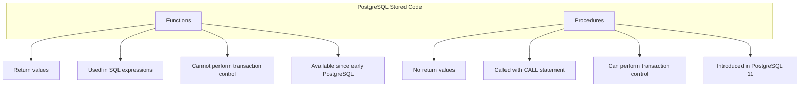

# PostgreSQL Functions vs Procedures

## Introduction

PostgreSQL offers two primary ways to encapsulate business logic within the database itself: **functions** and **stored procedures**. While they might seem similar at first glance, they serve different purposes and have distinct capabilities. In this guide, we'll explore the differences between these two features, understand when to use each one, and learn how to implement them effectively.

PostgreSQL has supported functions for many years, but stored procedures were only introduced in PostgreSQL 11 (released in 2018), bringing PostgreSQL more in line with the SQL standard and other database systems.

## Understanding Functions in PostgreSQL

Functions in PostgreSQL are reusable blocks of code that:

- **Always return a value** (even if it's NULL or a void type)
- Can be used in SQL statements as part of expressions
- Cannot perform transaction control (COMMIT, ROLLBACK)
- Can be written in various languages (SQL, PL/pgSQL, PL/Python, etc.)

### Basic Syntax for Creating a Function

```sql
CREATE [OR REPLACE] FUNCTION function_name(parameter_list)
RETURNS return_type
LANGUAGE language_name
AS $$
    -- function body
$$;
```

### A Simple Function Example

Let's create a function that calculates the area of a circle:

```sql
CREATE OR REPLACE FUNCTION calculate_circle_area(radius NUMERIC)
RETURNS NUMERIC
LANGUAGE plpgsql
AS $$
BEGIN
    RETURN pi() * radius * radius;
END;
$$;
```

To call this function:

```sql
SELECT calculate_circle_area(5);
```

Output:
```
 calculate_circle_area
----------------------
 78.53981633974483
```

## Understanding Stored Procedures in PostgreSQL

Stored procedures in PostgreSQL are also reusable blocks of code, but with some key differences:

- **Do not return a value** (although they can have OUT parameters)
- Are called using the `CALL` statement, not in SQL expressions
- Can perform transaction control (COMMIT, ROLLBACK)
- Primarily designed for transaction management and administrative tasks
- Introduced in PostgreSQL 11

### Basic Syntax for Creating a Procedure

```sql
CREATE [OR REPLACE] PROCEDURE procedure_name(parameter_list)
LANGUAGE language_name
AS $$
    -- procedure body
$$;
```

### A Simple Procedure Example

Let's create a procedure that inserts a new product and logs the action:

```sql
CREATE TABLE products (
    product_id SERIAL PRIMARY KEY,
    name VARCHAR(100) NOT NULL,
    price NUMERIC(10, 2) NOT NULL
);

CREATE TABLE audit_log (
    log_id SERIAL PRIMARY KEY,
    action_type VARCHAR(50) NOT NULL,
    table_name VARCHAR(50) NOT NULL,
    record_id INTEGER NOT NULL,
    action_time TIMESTAMP DEFAULT CURRENT_TIMESTAMP
);

CREATE OR REPLACE PROCEDURE add_product(
    product_name VARCHAR,
    product_price NUMERIC
)
LANGUAGE plpgsql
AS $$
DECLARE
    new_product_id INTEGER;
BEGIN
    -- Insert the new product
    INSERT INTO products (name, price)
    VALUES (product_name, product_price)
    RETURNING product_id INTO new_product_id;
    
    -- Log the action
    INSERT INTO audit_log (action_type, table_name, record_id)
    VALUES ('INSERT', 'products', new_product_id);
    
    -- Commit the transaction
    COMMIT;
    
    RAISE NOTICE 'Product added with ID: %', new_product_id;
END;
$$;
```

To call this procedure:

```sql
CALL add_product('Wireless Mouse', 24.99);
```

Output:
```
NOTICE:  Product added with ID: 1
CALL
```

## Key Differences Between Functions and Procedures

Let's clarify the main differences between these two database objects:



### 1. Return Values

- **Functions**: Must return a value (even if it's `void`)
- **Procedures**: Do not return values directly, but can use OUT parameters

### 2. Transaction Control

- **Functions**: Cannot commit or roll back transactions
- **Procedures**: Can contain transaction control statements (COMMIT, ROLLBACK, SAVEPOINT)

### 3. Usage Context

- **Functions**: Can be called in SQL statements as part of expressions
- **Procedures**: Must be called using the `CALL` statement

### 4. Parameter Modes

Both support parameter modes like `IN`, `OUT`, and `INOUT`, but they're used differently:
- **Functions**: Return values through the `RETURNS` clause and `OUT` parameters
- **Procedures**: Can only use `OUT` parameters since they don't have a `RETURNS` clause

## When to Use Functions vs Procedures

### Use Functions When:

- You need to return a value or dataset
- You want to use the result in SQL expressions
- You need to implement business logic that doesn't modify data
- You want to create custom operators or data types

### Use Procedures When:

- You need to perform multiple data modification operations in a single unit
- You need transaction control (COMMIT, ROLLBACK)
- You're implementing ETL processes or administrative tasks
- You're migrating from other database systems that use stored procedures

## Practical Examples

### Example 1: User Management System

**Function to validate a user email:**

```sql
CREATE OR REPLACE FUNCTION is_valid_email(email VARCHAR)
RETURNS BOOLEAN
LANGUAGE plpgsql
AS $$
BEGIN
    RETURN email ~* '^[A-Za-z0-9._%-]+@[A-Za-z0-9.-]+\.[A-Za-z]{2,4}$';
END;
$$;
```

Usage:

```sql
SELECT * FROM users WHERE is_valid_email(email_address);
```

**Procedure to register a new user:**

```sql
CREATE OR REPLACE PROCEDURE register_user(
    username VARCHAR,
    email VARCHAR,
    password VARCHAR,
    OUT user_id INTEGER
)
LANGUAGE plpgsql
AS $$
BEGIN
    -- Validate email
    IF NOT (email ~* '^[A-Za-z0-9._%-]+@[A-Za-z0-9.-]+\.[A-Za-z]{2,4}$') THEN
        RAISE EXCEPTION 'Invalid email format';
    END IF;
    
    -- Insert user
    INSERT INTO users (username, email, password_hash, created_at)
    VALUES (username, email, crypt(password, gen_salt('bf')), NOW())
    RETURNING id INTO user_id;
    
    -- Insert into user_settings with defaults
    INSERT INTO user_settings (user_id, theme, notifications_enabled)
    VALUES (user_id, 'default', true);
    
    -- Log the registration
    INSERT INTO user_activity_log (user_id, activity_type, ip_address)
    VALUES (user_id, 'REGISTRATION', current_setting('request.header.x-forwarded-for', true));
    
    COMMIT;
END;
$$;
```

Usage:

```sql
CALL register_user('johndoe', 'john@example.com', 'secure_password123', NULL);
```

### Example 2: Inventory Management

**Function to calculate inventory value:**

```sql
CREATE OR REPLACE FUNCTION calculate_inventory_value()
RETURNS NUMERIC
LANGUAGE plpgsql
AS $$
DECLARE
    total_value NUMERIC;
BEGIN
    SELECT SUM(price * quantity) INTO total_value
    FROM inventory;
    
    RETURN total_value;
END;
$$;
```

Usage:

```sql
SELECT calculate_inventory_value() AS total_inventory_value;
```

**Procedure to restock inventory:**

```sql
CREATE OR REPLACE PROCEDURE restock_inventory(
    item_id INTEGER,
    quantity INTEGER,
    supplier_id INTEGER
)
LANGUAGE plpgsql
AS $$
DECLARE
    current_quantity INTEGER;
    item_name VARCHAR;
BEGIN
    -- Get current quantity and name
    SELECT name, quantity INTO item_name, current_quantity
    FROM inventory
    WHERE id = item_id;
    
    IF NOT FOUND THEN
        RAISE EXCEPTION 'Item with ID % not found', item_id;
    END IF;
    
    -- Update inventory
    UPDATE inventory
    SET 
        quantity = quantity + restock_inventory.quantity,
        last_restocked = CURRENT_TIMESTAMP
    WHERE id = item_id;
    
    -- Create restock record
    INSERT INTO restock_history (item_id, quantity, supplier_id, restock_date)
    VALUES (item_id, restock_inventory.quantity, supplier_id, CURRENT_TIMESTAMP);
    
    -- Log notification if inventory was low
    IF current_quantity < 10 THEN
        INSERT INTO notifications (type, message, created_at)
        VALUES (
            'INVENTORY_RESTOCKED',
            format('Low inventory item "%s" restocked with %s units', item_name, restock_inventory.quantity),
            CURRENT_TIMESTAMP
        );
    END IF;
    
    COMMIT;
    
    RAISE NOTICE 'Successfully restocked % units of item %', quantity, item_name;
END;
$$;
```

Usage:

```sql
CALL restock_inventory(101, 50, 3);
```

## Advanced Techniques

### Error Handling

Both functions and procedures support error handling with the `EXCEPTION` block:

```sql
CREATE OR REPLACE PROCEDURE transfer_funds(
    from_account_id INTEGER,
    to_account_id INTEGER,
    amount NUMERIC
)
LANGUAGE plpgsql
AS $$
DECLARE
    from_balance NUMERIC;
BEGIN
    -- Check if amount is positive
    IF amount <= 0 THEN
        RAISE EXCEPTION 'Transfer amount must be positive';
    END IF;
    
    -- Get current balance
    SELECT balance INTO from_balance
    FROM accounts
    WHERE account_id = from_account_id
    FOR UPDATE;
    
    -- Check if account exists
    IF NOT FOUND THEN
        RAISE EXCEPTION 'Source account % not found', from_account_id;
    END IF;
    
    -- Check sufficient funds
    IF from_balance < amount THEN
        RAISE EXCEPTION 'Insufficient funds (balance: %, required: %)', 
                        from_balance, amount;
    END IF;
    
    -- Perform transfer
    UPDATE accounts
    SET balance = balance - amount
    WHERE account_id = from_account_id;
    
    UPDATE accounts
    SET balance = balance + amount
    WHERE account_id = to_account_id;
    
    -- Check if destination account exists
    IF NOT FOUND THEN
        ROLLBACK;
        RAISE EXCEPTION 'Destination account % not found', to_account_id;
    END IF;
    
    -- Record transaction
    INSERT INTO transactions (from_account, to_account, amount, transaction_date)
    VALUES (from_account_id, to_account_id, amount, CURRENT_TIMESTAMP);
    
    COMMIT;
    
EXCEPTION
    WHEN OTHERS THEN
        ROLLBACK;
        RAISE;
END;
$$;
```

### Returning Data from Procedures

While procedures don't directly return values, you can use `OUT` parameters:

```sql
CREATE OR REPLACE PROCEDURE get_account_details(
    IN p_account_id INTEGER,
    OUT p_account_number VARCHAR,
    OUT p_balance NUMERIC,
    OUT p_owner_name VARCHAR
)
LANGUAGE plpgsql
AS $$
BEGIN
    SELECT account_number, balance, owner_name
    INTO p_account_number, p_balance, p_owner_name
    FROM accounts
    JOIN account_owners USING (account_id)
    WHERE account_id = p_account_id;
    
    IF NOT FOUND THEN
        RAISE EXCEPTION 'Account % not found', p_account_id;
    END IF;
END;
$$;
```

Usage:

```sql
DO $$
DECLARE
    acc_number VARCHAR;
    acc_balance NUMERIC;
    owner VARCHAR;
BEGIN
    CALL get_account_details(1001, acc_number, acc_balance, owner);
    RAISE NOTICE 'Account: %, Balance: $%, Owner: %', 
                acc_number, acc_balance, owner;
END;
$$;
```

## Migration Considerations

If you're migrating from another database system to PostgreSQL, be aware of these differences:

1. **Oracle PL/SQL**: Functions and procedures in Oracle behave differently than in PostgreSQL.
2. **SQL Server T-SQL**: SQL Server stored procedures can return result sets directly; in PostgreSQL, you would use a function that returns a `SETOF` or a `TABLE`.
3. **MySQL**: MySQL stored procedures can return result sets; in PostgreSQL, use functions for this purpose.

## Best Practices

1. **Naming Conventions**:
   - Use verb_noun naming for procedures: `create_user()`, `process_order()`
   - Use noun_verb or descriptive names for functions: `user_exists()`, `calculate_total()`

2. **Security Considerations**:
   - Use `SECURITY DEFINER` carefully (similar to "run as owner")
   - Set search_path explicitly in SECURITY DEFINER functions

3. **Transaction Management**:
   - Explicitly handle transactions in procedures
   - Consider using subtransactions (SAVEPOINT) for complex operations

4. **Documentation**:
   - Use comments to document parameters and behavior
   - Consider adding examples in comments

## Summary

Functions and stored procedures in PostgreSQL provide powerful ways to encapsulate business logic within your database:

- **Functions** are ideal for calculations, validations, and returning data
- **Procedures** excel at transaction management and multi-step operations

The choice between them depends on your specific needs:
- Need to return values and use in SQL expressions? Use functions.
- Need transaction control and complex data modifications? Use procedures.

By understanding the differences and best practices outlined in this guide, you'll be better equipped to design efficient and maintainable PostgreSQL database applications.

## Exercises

1. Create a function that calculates the average order value for a specific customer.
2. Create a procedure that processes an order (updates inventory, creates invoice, etc.).
3. Convert an existing function that modifies data to a procedure with proper transaction handling.
4. Write a procedure with multiple OUT parameters to retrieve various statistics about a product.

## Additional Resources

- [PostgreSQL Official Documentation on Functions](https://www.postgresql.org/docs/current/sql-createfunction.html)
- [PostgreSQL Official Documentation on Procedures](https://www.postgresql.org/docs/current/sql-createprocedure.html)
- [PL/pgSQL Language Reference](https://www.postgresql.org/docs/current/plpgsql.html)