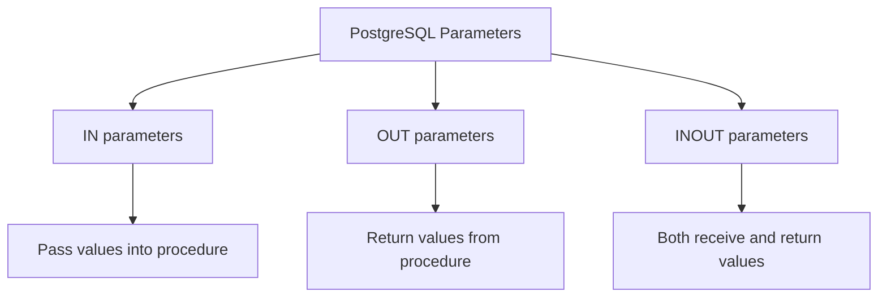

# PostgreSQL Parameters

## Introduction

When writing stored procedures in PostgreSQL, you'll often need to make your code more flexible by accepting input values and returning results. This is where parameters come in - they allow your stored procedures to interact with the outside world, making them truly useful in real applications.

Parameters in PostgreSQL stored procedures are similar to arguments in standard programming functions. They provide a way to pass data into your procedure and retrieve computed results. In this tutorial, we'll explore how to define, use, and work with parameters in PostgreSQL stored procedures.

## Understanding PostgreSQL Parameters

### Types of Parameters

In PostgreSQL stored procedures, parameters can be categorized into three types:



- **IN parameters**: Used to pass values into the procedure (default type)
- **OUT parameters**: Used to return values from the procedure 
- **INOUT parameters**: Used both to receive input and return output

Let's explore each of these with examples.

## Basic Parameter Syntax

The basic syntax for defining parameters in a PostgreSQL procedure is:

```sql
CREATE OR REPLACE PROCEDURE procedure_name(
    parameter_name parameter_type,
    parameter_name parameter_type,
    ...
)
LANGUAGE plpgsql
AS $$
BEGIN
    -- Procedure body
END;
$$;
```

For functions, the syntax is slightly different:

```sql
CREATE OR REPLACE FUNCTION function_name(
    parameter_name parameter_type,
    parameter_name parameter_type,
    ...
)
RETURNS return_type
LANGUAGE plpgsql
AS $$
BEGIN
    -- Function body
    RETURN result;
END;
$$;
```

## Working with IN Parameters

IN parameters are the most common type. They allow you to pass values into your stored procedure.

### Example: Calculating Total Price with Tax

```sql
CREATE OR REPLACE FUNCTION calculate_total_price(
    price_in NUMERIC,
    tax_rate_in NUMERIC
)
RETURNS NUMERIC
LANGUAGE plpgsql
AS $$
DECLARE
    total_price NUMERIC;
BEGIN
    total_price := price_in * (1 + tax_rate_in / 100);
    RETURN total_price;
END;
$$;
```

Let's test our function:

```sql
SELECT calculate_total_price(100, 10);
```

Output:
```
 calculate_total_price 
-----------------------
                   110
```

In this example, we pass two IN parameters: `price_in` and `tax_rate_in`. The function calculates the total price including tax and returns the result.

## Working with OUT Parameters

OUT parameters provide a way to return multiple values from a procedure or function.

### Example: Splitting Full Name into First and Last Name

```sql
CREATE OR REPLACE FUNCTION split_full_name(
    full_name_in VARCHAR,
    OUT first_name_out VARCHAR,
    OUT last_name_out VARCHAR
)
LANGUAGE plpgsql
AS $$
BEGIN
    first_name_out := split_part(full_name_in, ' ', 1);
    last_name_out := split_part(full_name_in, ' ', 2);
END;
$$;
```

Let's test it:

```sql
SELECT * FROM split_full_name('John Doe');
```

Output:
```
 first_name_out | last_name_out 
----------------+---------------
 John           | Doe
```

Notice that we use `SELECT * FROM` to get the results of all OUT parameters. We can also select specific OUT parameters:

```sql
SELECT first_name_out FROM split_full_name('John Doe');
```

Output:
```
 first_name_out 
----------------
 John
```

## Working with INOUT Parameters

INOUT parameters serve both as input and output values.

### Example: Doubling a Number

```sql
CREATE OR REPLACE PROCEDURE double_number(
    INOUT num NUMERIC
)
LANGUAGE plpgsql
AS $$
BEGIN
    num := num * 2;
END;
$$;
```

Let's test the procedure:

```sql
DO $$
DECLARE
    my_num NUMERIC := 5;
BEGIN
    CALL double_number(my_num);
    RAISE NOTICE 'Doubled number: %', my_num;
END;
$$;
```

Output:
```
NOTICE:  Doubled number: 10
```

## Default Parameter Values

PostgreSQL allows you to set default values for parameters, making them optional when calling the function.

### Example: Greeting Function with Default Value

```sql
CREATE OR REPLACE FUNCTION greet(
    name_in VARCHAR DEFAULT 'Guest'
)
RETURNS VARCHAR
LANGUAGE plpgsql
AS $$
BEGIN
    RETURN 'Hello, ' || name_in || '!';
END;
$$;
```

We can call this function with or without parameters:

```sql
SELECT greet('Alice');
SELECT greet();
```

Output:
```
    greet     
--------------
 Hello, Alice!

    greet     
-------------
 Hello, Guest!
```

## Named Parameter Notation

When calling functions with multiple parameters, you can use named parameter notation for clarity:

```sql
SELECT calculate_total_price(
    price_in := 100, 
    tax_rate_in := 10
);
```

This makes your code more readable, especially when dealing with functions that have many parameters or when you want to use default values for some parameters.

## Variable-Length Parameter Lists

PostgreSQL supports variable-length parameter lists using the `VARIADIC` keyword.

### Example: Summing Multiple Numbers

```sql
CREATE OR REPLACE FUNCTION sum_values(VARIADIC nums NUMERIC[])
RETURNS NUMERIC
LANGUAGE plpgsql
AS $$
DECLARE
    total NUMERIC := 0;
    num NUMERIC;
BEGIN
    FOREACH num IN ARRAY nums LOOP
        total := total + num;
    END LOOP;
    
    RETURN total;
END;
$$;
```

Let's test it:

```sql
SELECT sum_values(1, 2, 3, 4, 5);
```

Output:
```
 sum_values 
------------
         15
```

## Practical Example: Customer Order Management

Let's create a more complex, real-world example involving order management:

First, let's create some tables:

```sql
CREATE TABLE customers (
    customer_id SERIAL PRIMARY KEY,
    name VARCHAR(100),
    email VARCHAR(100)
);

CREATE TABLE orders (
    order_id SERIAL PRIMARY KEY,
    customer_id INTEGER REFERENCES customers(customer_id),
    order_date DATE,
    total_amount NUMERIC
);
```

Now, let's create a procedure to add a new customer and place an order:

```sql
CREATE OR REPLACE PROCEDURE create_customer_order(
    customer_name_in VARCHAR,
    customer_email_in VARCHAR,
    order_amount_in NUMERIC,
    OUT customer_id_out INTEGER,
    OUT order_id_out INTEGER
)
LANGUAGE plpgsql
AS $$
BEGIN
    -- Insert new customer
    INSERT INTO customers (name, email)
    VALUES (customer_name_in, customer_email_in)
    RETURNING customer_id INTO customer_id_out;
    
    -- Insert new order
    INSERT INTO orders (customer_id, order_date, total_amount)
    VALUES (customer_id_out, CURRENT_DATE, order_amount_in)
    RETURNING order_id INTO order_id_out;
    
    -- Commit the transaction
    COMMIT;
END;
$$;
```

Let's test our procedure:

```sql
DO $$
DECLARE
    new_customer_id INTEGER;
    new_order_id INTEGER;
BEGIN
    CALL create_customer_order(
        'Jane Smith', 
        'jane@example.com', 
        125.99,
        new_customer_id,
        new_order_id
    );
    
    RAISE NOTICE 'Created customer ID: % with order ID: %', 
                  new_customer_id, new_order_id;
END;
$$;
```

Output:
```
NOTICE:  Created customer ID: 1 with order ID: 1
```

## Parameter Type Conversion

PostgreSQL will automatically convert parameter values to the declared type if possible. However, it's best practice to pass values of the correct type to avoid unexpected behavior.

```sql
-- This works due to automatic type conversion
SELECT calculate_total_price('100', '10');

-- This is better practice
SELECT calculate_total_price(100, 10);
```

## Best Practices for Working with Parameters

1. **Use descriptive parameter names**: Choose names that clearly indicate the purpose of the parameter (e.g., `customer_id_in` rather than just `cid`).

2. **Add suffixes to indicate parameter direction**: Using suffixes like `_in`, `_out`, or `_inout` helps clarify the parameter's purpose.

3. **Validate input parameters**: Always validate input parameters to ensure they meet your requirements before using them.

   ```sql
   CREATE OR REPLACE FUNCTION safe_divide(
       numerator_in NUMERIC,
       denominator_in NUMERIC
   )
   RETURNS NUMERIC
   LANGUAGE plpgsql
   AS $$
   BEGIN
       IF denominator_in = 0 THEN
           RAISE EXCEPTION 'Division by zero is not allowed';
       END IF;
       
       RETURN numerator_in / denominator_in;
   END;
   $$;
   ```

4. **Use default values** for optional parameters to make your functions more flexible.

5. **Document your parameters**: Clearly document what each parameter does, its expected type, and any constraints.

## Summary

Parameters are a fundamental aspect of PostgreSQL stored procedures and functions, allowing you to create flexible and reusable database code. In this tutorial, we've explored:

- The three types of parameters: IN, OUT, and INOUT
- How to define and use each parameter type
- Setting default parameter values
- Using named parameter notation
- Working with variable-length parameter lists
- Real-world examples of parameters in action

By mastering parameters, you'll be able to create more powerful and flexible stored procedures that can adapt to different situations and requirements.

## Exercises

To reinforce your learning, try these exercises:

1. Create a function that accepts a product name and price as IN parameters and returns the price with a 15% discount.

2. Write a procedure that accepts a customer ID as an IN parameter and returns the total number of orders and the average order amount as OUT parameters.

3. Create a function that accepts a variable number of integers and returns the largest value.

4. Modify the `create_customer_order` procedure to include an optional discount parameter with a default value of 0.

## Additional Resources

- [PostgreSQL Official Documentation on Functions](https://www.postgresql.org/docs/current/sql-createfunction.html)
- [PostgreSQL PL/pgSQL Tutorial](https://www.postgresql.org/docs/current/plpgsql.html)
- [PostgreSQL Stored Procedures](https://www.postgresql.org/docs/current/sql-createprocedure.html)