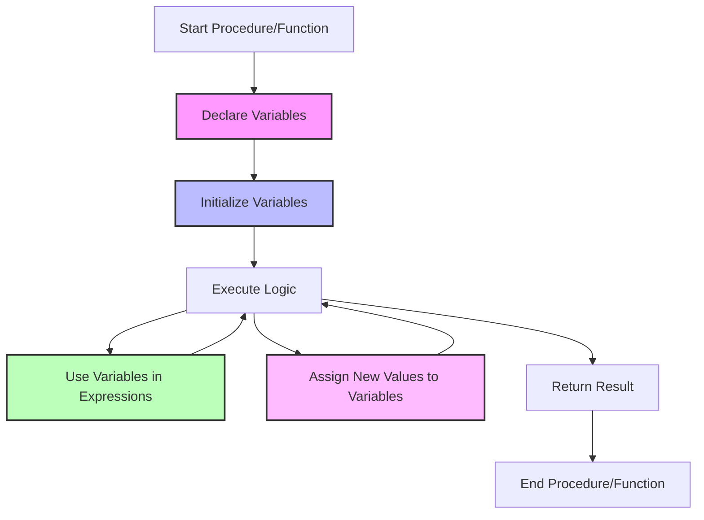

# PostgreSQL Variables

## Introduction

Variables are essential components in programming that allow you to store, manipulate, and reference data throughout your code. In PostgreSQL's procedural language PL/pgSQL, variables serve as temporary containers for values during the execution of stored procedures and functions.

This guide will help you understand how to declare, initialize, and work with variables in PostgreSQL stored procedures, giving you the foundation to write more complex and powerful database logic.

## Variable Basics

### What Are Variables?

In PostgreSQL's PL/pgSQL, variables work similarly to variables in other programming languages:

- They store temporary data values
- They have specific data types
- They can be assigned values and used in expressions
- They exist only within the scope of the procedure or function

Variables allow you to break down complex operations into manageable steps by holding intermediate results.

## Declaring Variables

Before using a variable in a stored procedure or function, you must declare it in the declaration section. Variable declarations come after the `DECLARE` keyword at the beginning of a block.

Basic syntax:

```sql
DECLARE
  variable_name data_type [NOT NULL] [:= initial_value];
```

### Simple Variable Declaration Examples

```sql
DECLARE
  user_id integer;
  user_name varchar(50);
  is_active boolean;
  current_date date;
  price numeric(10,2);
```

## Variable Assignment

You can assign values to variables using the assignment operator (`:=`) or the `INTO` clause with a `SELECT` statement.

### Assignment Using `:=`

```sql
DO $$
DECLARE
  user_name varchar(50);
  greeting text;
BEGIN
  user_name := 'Alice';
  greeting := 'Hello, ' || user_name || '!';
  
  RAISE NOTICE '%', greeting;
END $$;
```

Output:
```
NOTICE:  Hello, Alice!
```

### Assignment Using `SELECT INTO`

```sql
DO $$
DECLARE
  product_count integer;
  max_price numeric(10,2);
BEGIN
  SELECT count(*), max(price)
  INTO product_count, max_price
  FROM products;
  
  RAISE NOTICE 'There are % products. The most expensive costs $%.2f', 
    product_count, max_price;
END $$;
```

Output (assuming some data):
```
NOTICE:  There are 25 products. The most expensive costs $129.99
```

## Variable Data Types

PostgreSQL supports many data types for variables, including:

- Numeric types: `integer`, `numeric`, `real`, etc.
- Character types: `varchar`, `text`, `char`, etc.
- Date/time types: `date`, `time`, `timestamp`, etc.
- Boolean type: `boolean`
- Arrays
- Custom types and more

### Example with Different Data Types

```sql
DO $$
DECLARE
  product_id integer := 101;
  product_name varchar(100) := 'Ergonomic Keyboard';
  unit_price numeric(10,2) := 79.99;
  in_stock boolean := true;
  created_at timestamp := now();
  tags text[] := array['computer', 'accessories', 'ergonomic'];
BEGIN
  RAISE NOTICE 'Product: %, Price: $%, In Stock: %, Created: %',
    product_name, unit_price, in_stock, created_at;
    
  RAISE NOTICE 'Tags: %', array_to_string(tags, ', ');
END $$;
```

Output:
```
NOTICE:  Product: Ergonomic Keyboard, Price: $79.99, In Stock: true, Created: 2023-09-15 10:23:45.123456
NOTICE:  Tags: computer, accessories, ergonomic
```

## Variable Scope

Variables in PL/pgSQL have block-level scope. They exist only within the block (procedure, function, or anonymous block) where they are declared.

```sql
DO $$
DECLARE
  outer_var text := 'I am in the outer block';
BEGIN
  RAISE NOTICE 'Outer block: %', outer_var;
  
  -- Nested block with its own variables
  DECLARE
    inner_var text := 'I am in the inner block';
  BEGIN
    RAISE NOTICE 'Inner block: outer_var = %, inner_var = %', 
      outer_var, inner_var;
  END;
  
  -- inner_var is not accessible here
  RAISE NOTICE 'Back in outer block: %', outer_var;
  -- This would cause an error: RAISE NOTICE '%', inner_var;
END $$;
```

Output:
```
NOTICE:  Outer block: I am in the outer block
NOTICE:  Inner block: outer_var = I am in the outer block, inner_var = I am in the inner block
NOTICE:  Back in outer block: I am in the outer block
```

## Special Variables

### The `FOUND` Variable

PL/pgSQL provides a special boolean variable named `FOUND` that indicates whether the most recent SQL statement affected any rows.

```sql
DO $$
DECLARE
  user_email varchar(100);
  user_exists boolean;
BEGIN
  -- Try to find a user with ID 101
  SELECT email INTO user_email
  FROM users
  WHERE user_id = 101;
  
  -- Check if the user was found
  IF FOUND THEN
    RAISE NOTICE 'User found with email: %', user_email;
  ELSE
    RAISE NOTICE 'No user with ID 101 exists';
  END IF;
END $$;
```

### The `ROW_COUNT` Variable

The `GET DIAGNOSTICS` statement allows you to get information about the most recently executed SQL statement, including the number of rows affected.

```sql
DO $$
DECLARE
  rows_affected integer;
BEGIN
  UPDATE products
  SET price = price * 1.1
  WHERE category = 'Electronics';
  
  GET DIAGNOSTICS rows_affected = ROW_COUNT;
  
  RAISE NOTICE '% products were updated', rows_affected;
END $$;
```

## Row Variables

You can declare a variable with the same structure as a table row or a custom type.

```sql
DO $$
DECLARE
  product_rec products%ROWTYPE;
BEGIN
  SELECT * INTO product_rec
  FROM products
  WHERE product_id = 101;
  
  RAISE NOTICE 'Product name: %, Price: $%', 
    product_rec.product_name, product_rec.price;
END $$;
```

## Record Variables

For more flexibility, you can use the `RECORD` type which can hold a row from any query result.

```sql
DO $$
DECLARE
  rec RECORD;
BEGIN
  FOR rec IN SELECT product_id, product_name, price 
             FROM products 
             WHERE price > 100
             ORDER BY price DESC
             LIMIT 5
  LOOP
    RAISE NOTICE 'High-priced product: % (ID: %) costs $%.2f', 
      rec.product_name, rec.product_id, rec.price;
  END LOOP;
END $$;
```

## Practical Examples

### Example 1: Customer Order Summary

This example uses variables to calculate and display a summary of a customer's order:

```sql
CREATE OR REPLACE FUNCTION get_order_summary(p_order_id integer)
RETURNS void AS $$
DECLARE
  v_customer_name varchar(100);
  v_order_date timestamp;
  v_item_count integer;
  v_subtotal numeric(10,2);
  v_tax numeric(10,2);
  v_total numeric(10,2);
  tax_rate constant numeric := 0.08; -- 8% tax rate as a constant
BEGIN
  -- Get basic order information
  SELECT c.customer_name, o.order_date
  INTO v_customer_name, v_order_date
  FROM orders o
  JOIN customers c ON o.customer_id = c.customer_id
  WHERE o.order_id = p_order_id;
  
  -- Calculate order totals
  SELECT count(*), sum(quantity * unit_price)
  INTO v_item_count, v_subtotal
  FROM order_items
  WHERE order_id = p_order_id;
  
  -- Calculate tax and total
  v_tax := v_subtotal * tax_rate;
  v_total := v_subtotal + v_tax;
  
  -- Display the summary
  RAISE NOTICE 'Order Summary for Order #%:', p_order_id;
  RAISE NOTICE 'Customer: %', v_customer_name;
  RAISE NOTICE 'Date: %', v_order_date;
  RAISE NOTICE 'Items: %', v_item_count;
  RAISE NOTICE 'Subtotal: $%.2f', v_subtotal;
  RAISE NOTICE 'Tax (8%%): $%.2f', v_tax;
  RAISE NOTICE 'Total: $%.2f', v_total;
END;
$$ LANGUAGE plpgsql;
```

Usage:
```sql
SELECT get_order_summary(1001);
```

Output:
```
NOTICE:  Order Summary for Order #1001:
NOTICE:  Customer: John Smith
NOTICE:  Date: 2023-09-10 15:23:10
NOTICE:  Items: 3
NOTICE:  Subtotal: $158.97
NOTICE:  Tax (8%): $12.72
NOTICE:  Total: $171.69
```

### Example 2: User Registration with Validation

This example uses variables for a user registration procedure that includes validation:

```sql
CREATE OR REPLACE PROCEDURE register_user(
  p_username varchar(50),
  p_email varchar(100),
  p_password varchar(100)
)
AS $$
DECLARE
  v_username_exists boolean;
  v_email_exists boolean;
  v_user_id integer;
  v_hashed_password text;
  v_created_at timestamp := now();
BEGIN
  -- Check if username already exists
  SELECT EXISTS(SELECT 1 FROM users WHERE username = p_username)
  INTO v_username_exists;
  
  IF v_username_exists THEN
    RAISE EXCEPTION 'Username % is already taken', p_username;
  END IF;
  
  -- Check if email already exists
  SELECT EXISTS(SELECT 1 FROM users WHERE email = p_email)
  INTO v_email_exists;
  
  IF v_email_exists THEN
    RAISE EXCEPTION 'Email % is already registered', p_email;
  END IF;
  
  -- Hash the password (in practice, use a proper hashing library)
  v_hashed_password := crypt(p_password, gen_salt('bf'));
  
  -- Insert the new user
  INSERT INTO users (username, email, password_hash, created_at)
  VALUES (p_username, p_email, v_hashed_password, v_created_at)
  RETURNING user_id INTO v_user_id;
  
  RAISE NOTICE 'User registered successfully. User ID: %', v_user_id;
END;
$$ LANGUAGE plpgsql;
```

Usage:
```sql
CALL register_user('alice_smith', 'alice@example.com', 'securePassword123');
```

## Variable Best Practices

1. **Use Descriptive Names**: Choose variable names that clearly indicate their purpose (e.g., `customer_name` instead of `cn`).

2. **Use Proper Prefixes**: Consider using prefixes like `v_` for local variables and `p_` for parameters to distinguish between them.

3. **Initialize Variables**: Always initialize variables when appropriate to avoid unexpected NULL values.

4. **Use Constants**: For values that shouldn't change, use the `constant` keyword:
   ```sql
   DECLARE
     pi constant numeric := 3.14159;
   ```

5. **Limit Variable Scope**: Declare variables in the narrowest scope needed to minimize potential conflicts.

6. **Use ROWTYPE and RECORD**: Leverage these variable types to work with entire rows of data efficiently.

## Flow Control with Variables

Variables are often used in conjunction with flow control statements like `IF`, `CASE`, and loops to make decisions based on their values.

### IF Statement with Variables

```sql
DO $$
DECLARE
  score integer := 85;
  grade char(1);
BEGIN
  IF score >= 90 THEN
    grade := 'A';
  ELSIF score >= 80 THEN
    grade := 'B';
  ELSIF score >= 70 THEN
    grade := 'C';
  ELSIF score >= 60 THEN
    grade := 'D';
  ELSE
    grade := 'F';
  END IF;
  
  RAISE NOTICE 'Score: %, Grade: %', score, grade;
END $$;
```

### CASE Statement with Variables

```sql
DO $$
DECLARE
  day_of_week integer := EXTRACT(DOW FROM CURRENT_DATE);
  day_name text;
BEGIN
  day_name := CASE day_of_week
    WHEN 0 THEN 'Sunday'
    WHEN 1 THEN 'Monday'
    WHEN 2 THEN 'Tuesday'
    WHEN 3 THEN 'Wednesday'
    WHEN 4 THEN 'Thursday'
    WHEN 5 THEN 'Friday'
    WHEN 6 THEN 'Saturday'
  END;
  
  RAISE NOTICE 'Today is %', day_name;
END $$;
```

## Variables in Loops

Variables are frequently used in loops to track iteration progress or accumulate results.

```sql
DO $$
DECLARE
  counter integer := 1;
  factorial integer := 1;
  n integer := 5;
BEGIN
  WHILE counter <= n LOOP
    factorial := factorial * counter;
    counter := counter + 1;
  END LOOP;
  
  RAISE NOTICE 'Factorial of % is %', n, factorial;
END $$;
```

## Variable Visualization

The following diagram illustrates how variables work within PL/pgSQL blocks:



## Summary

PostgreSQL variables are powerful tools in stored procedures and functions that allow you to:

1. Store temporary data during procedure execution
2. Break down complex operations into manageable steps
3. Control the flow of your procedure based on conditions
4. Work with data from database tables efficiently
5. Write more modular and maintainable database code

By understanding how to declare, initialize, and manipulate variables, you can create more sophisticated database logic within your PostgreSQL database.

## Additional Exercises

Try these exercises to practice working with PostgreSQL variables:

1. Write a stored procedure that calculates the average, minimum, and maximum prices of products in a given category.

2. Create a function that generates a sequential ID with a custom prefix (e.g., "ORD-0001", "ORD-0002").

3. Implement a procedure that transfers money between two bank accounts, ensuring the balance never goes below zero.

4. Write a block that uses variables to track statistics while processing a result set (e.g., counting records that match certain criteria).

5. Create a recursive function using variables to calculate the Fibonacci sequence up to a specified term.

## Further Reading

- [PostgreSQL Official Documentation: PL/pgSQL Variables](https://www.postgresql.org/docs/current/plpgsql-declarations.html)
- [PostgreSQL Control Structures](https://www.postgresql.org/docs/current/plpgsql-control-structures.html)
- [Advanced PL/pgSQL Techniques](https://www.postgresql.org/docs/current/plpgsql-implementation.html)