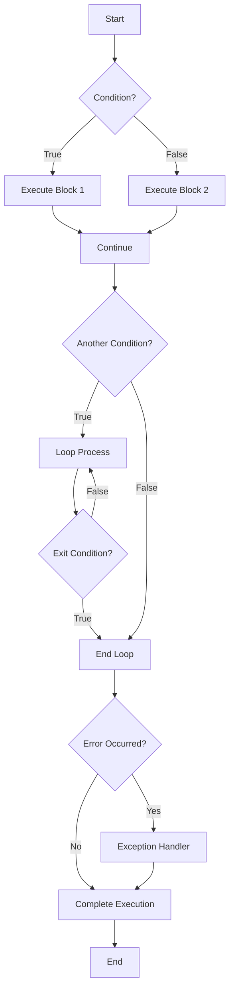

# PostgreSQL Control Flow

## Introduction

Control flow statements are essential components of procedural programming in PostgreSQL. They enable you to dictate the execution path of your stored procedures based on conditions, repeat code blocks, and handle errors. In PostgreSQL, control flow is implemented through PL/pgSQL, the built-in procedural language.

This guide explores the various control flow mechanisms available in PostgreSQL stored procedures, including conditional statements, loops, and error handling. Understanding these concepts will allow you to write more sophisticated and reliable database procedures.

## Conditional Statements

Conditional statements allow your procedure to make decisions based on specified conditions. PostgreSQL provides several conditional constructs.

### IF Statements

The basic `IF` statement executes a block of code if a condition is true.

```sql
DO $$
DECLARE
  user_role TEXT := 'admin';
BEGIN
  IF user_role = 'admin' THEN
    RAISE NOTICE 'Administrator privileges granted';
  END IF;
END $$;
```

Output:
```
NOTICE:  Administrator privileges granted
DO
```

### IF-THEN-ELSE Statements

You can extend the `IF` statement with an `ELSE` clause to execute alternative code when the condition is false.

```sql
DO $$
DECLARE
  score INTEGER := 75;
BEGIN
  IF score >= 80 THEN
    RAISE NOTICE 'Grade: A';
  ELSE
    RAISE NOTICE 'Grade: B or lower';
  END IF;
END $$;
```

Output:
```
NOTICE:  Grade: B or lower
DO
```

### IF-THEN-ELSIF Statements

For multiple conditions, use the `ELSIF` clause.

```sql
DO $$
DECLARE
  score INTEGER := 75;
BEGIN
  IF score >= 90 THEN
    RAISE NOTICE 'Grade: A';
  ELSIF score >= 80 THEN
    RAISE NOTICE 'Grade: B';
  ELSIF score >= 70 THEN
    RAISE NOTICE 'Grade: C';
  ELSIF score >= 60 THEN
    RAISE NOTICE 'Grade: D';
  ELSE
    RAISE NOTICE 'Grade: F';
  END IF;
END $$;
```

Output:
```
NOTICE:  Grade: C
DO
```

### CASE Statements

The `CASE` statement provides a more elegant way to handle multiple conditions, especially when comparing a single expression against multiple values.

```sql
DO $$
DECLARE
  day_of_week TEXT := 'Monday';
  message TEXT;
BEGIN
  CASE day_of_week
    WHEN 'Monday' THEN
      message := 'Start of work week';
    WHEN 'Friday' THEN
      message := 'End of work week';
    WHEN 'Saturday' THEN
      message := 'Weekend!';
    WHEN 'Sunday' THEN
      message := 'Weekend!';
    ELSE
      message := 'Regular work day';
  END CASE;
  
  RAISE NOTICE 'Day status: %', message;
END $$;
```

Output:
```
NOTICE:  Day status: Start of work week
DO
```

### Searched CASE Statements

PostgreSQL also supports searched `CASE` statements that evaluate independent Boolean expressions.

```sql
DO $$
DECLARE
  temperature INTEGER := 28;
  weather_status TEXT;
BEGIN
  CASE
    WHEN temperature < 0 THEN
      weather_status := 'Freezing';
    WHEN temperature < 10 THEN
      weather_status := 'Cold';
    WHEN temperature < 20 THEN
      weather_status := 'Cool';
    WHEN temperature < 30 THEN
      weather_status := 'Warm';
    ELSE
      weather_status := 'Hot';
  END CASE;
  
  RAISE NOTICE 'Weather status: %', weather_status;
END $$;
```

Output:
```
NOTICE:  Weather status: Warm
DO
```

## Loops

Loops allow you to execute a block of code repeatedly. PostgreSQL offers several loop constructs to meet different requirements.

### Basic Loop

The simplest form is the basic loop, which repeats until explicitly exited with an `EXIT` statement.

```sql
DO $$
DECLARE
  counter INTEGER := 0;
BEGIN
  LOOP
    counter := counter + 1;
    RAISE NOTICE 'Counter: %', counter;
    
    IF counter >= 3 THEN
      EXIT;  -- Exit the loop
    END IF;
  END LOOP;
  
  RAISE NOTICE 'Loop completed!';
END $$;
```

Output:
```
NOTICE:  Counter: 1
NOTICE:  Counter: 2
NOTICE:  Counter: 3
NOTICE:  Loop completed!
DO
```

### WHILE Loop

The `WHILE` loop continues as long as a specified condition is true.

```sql
DO $$
DECLARE
  counter INTEGER := 0;
BEGIN
  WHILE counter < 3 LOOP
    counter := counter + 1;
    RAISE NOTICE 'Counter: %', counter;
  END LOOP;
  
  RAISE NOTICE 'WHILE loop completed!';
END $$;
```

Output:
```
NOTICE:  Counter: 1
NOTICE:  Counter: 2
NOTICE:  Counter: 3
NOTICE:  WHILE loop completed!
DO
```

### FOR Loop (Integer Range)

The integer `FOR` loop iterates over a range of integers.

```sql
DO $$
BEGIN
  FOR i IN 1..3 LOOP
    RAISE NOTICE 'Iteration: %', i;
  END LOOP;
  
  -- Reverse order with BY clause
  FOR i IN REVERSE 3..1 LOOP
    RAISE NOTICE 'Reverse iteration: %', i;
  END LOOP;
END $$;
```

Output:
```
NOTICE:  Iteration: 1
NOTICE:  Iteration: 2
NOTICE:  Iteration: 3
NOTICE:  Reverse iteration: 3
NOTICE:  Reverse iteration: 2
NOTICE:  Reverse iteration: 1
DO
```

### FOR Loop (Query Results)

The query-based `FOR` loop iterates over the results of a query.

```sql
-- Create a temporary table for the example
CREATE TEMP TABLE employees (
  id SERIAL PRIMARY KEY,
  name TEXT,
  department TEXT
);

-- Insert sample data
INSERT INTO employees (name, department) VALUES 
  ('Alice', 'Engineering'),
  ('Bob', 'Marketing'),
  ('Charlie', 'Engineering');

-- Use FOR loop to iterate through query results
DO $$
DECLARE
  emp RECORD;
BEGIN
  FOR emp IN SELECT * FROM employees WHERE department = 'Engineering' ORDER BY id LOOP
    RAISE NOTICE 'Engineer: % (ID: %)', emp.name, emp.id;
  END LOOP;
END $$;

-- Clean up
DROP TABLE employees;
```

Output:
```
NOTICE:  Engineer: Alice (ID: 1)
NOTICE:  Engineer: Charlie (ID: 3)
DO
```

### FOREACH Loop (Array)

The `FOREACH` loop iterates over elements in an array.

```sql
DO $$
DECLARE
  fruits TEXT[] := ARRAY['Apple', 'Banana', 'Cherry'];
  fruit TEXT;
BEGIN
  FOREACH fruit IN ARRAY fruits LOOP
    RAISE NOTICE 'Fruit: %', fruit;
  END LOOP;
END $$;
```

Output:
```
NOTICE:  Fruit: Apple
NOTICE:  Fruit: Banana
NOTICE:  Fruit: Cherry
DO
```

### Loop Control

PostgreSQL provides several statements to control loop execution:

- `EXIT`: Exits the innermost loop
- `EXIT WHEN`: Exits when a condition is met
- `CONTINUE`: Skips to the next iteration
- `CONTINUE WHEN`: Skips to the next iteration when a condition is met

```sql
DO $$
DECLARE
  i INTEGER;
BEGIN
  -- EXIT WHEN example
  i := 1;
  LOOP
    RAISE NOTICE 'Loop iteration: %', i;
    i := i + 1;
    EXIT WHEN i > 3;
  END LOOP;
  
  -- CONTINUE example
  FOR i IN 1..5 LOOP
    -- Skip even numbers
    CONTINUE WHEN i % 2 = 0;
    RAISE NOTICE 'Odd number: %', i;
  END LOOP;
END $$;
```

Output:
```
NOTICE:  Loop iteration: 1
NOTICE:  Loop iteration: 2
NOTICE:  Loop iteration: 3
NOTICE:  Odd number: 1
NOTICE:  Odd number: 3
NOTICE:  Odd number: 5
DO
```

## Error Handling

Error handling is crucial for writing robust stored procedures. PostgreSQL provides mechanisms to catch and handle exceptions.

### Basic Exception Handling

The `EXCEPTION` block catches errors that occur during procedure execution.

```sql
DO $$
BEGIN
  -- This will cause a division by zero error
  RAISE NOTICE 'Result: %', 1/0;
EXCEPTION
  WHEN division_by_zero THEN
    RAISE NOTICE 'Error: Cannot divide by zero';
END $$;
```

Output:
```
NOTICE:  Error: Cannot divide by zero
DO
```

### Handling Multiple Exceptions

You can handle different types of exceptions separately.

```sql
DO $$
BEGIN
  -- This will cause an error
  PERFORM 1/0;
EXCEPTION
  WHEN division_by_zero THEN
    RAISE NOTICE 'Error: Cannot divide by zero';
  WHEN numeric_value_out_of_range THEN
    RAISE NOTICE 'Error: Numeric value out of range';
  WHEN OTHERS THEN
    RAISE NOTICE 'Error: Unexpected error occurred';
END $$;
```

Output:
```
NOTICE:  Error: Cannot divide by zero
DO
```

### Getting Error Information

You can retrieve information about the current exception.

```sql
DO $$
BEGIN
  -- This will cause an error
  PERFORM 1/0;
EXCEPTION
  WHEN OTHERS THEN
    RAISE NOTICE 'Error details: %, SQLSTATE: %', SQLERRM, SQLSTATE;
END $$;
```

Output:
```
NOTICE:  Error details: division by zero, SQLSTATE: 22012
DO
```

### Raising Custom Exceptions

You can raise custom exceptions with the `RAISE` statement.

```sql
DO $$
DECLARE
  age INTEGER := 15;
BEGIN
  IF age < 18 THEN
    RAISE EXCEPTION 'Age % is under 18 years', age
      USING HINT = 'Minimum age requirement is 18 years';
  END IF;
EXCEPTION
  WHEN OTHERS THEN
    RAISE NOTICE 'Error: %, Hint: %', SQLERRM, SQLERRM;
END $$;
```

Output:
```
NOTICE:  Error: Age 15 is under 18 years, Hint: Age 15 is under 18 years
DO
```

## Practical Examples

Let's look at some real-world applications of control flow in PostgreSQL stored procedures.

### Example 1: Managing Customer Orders

This procedure demonstrates how to manage order status based on inventory availability.

```sql
-- Create tables for the example
CREATE TEMP TABLE products (
  product_id SERIAL PRIMARY KEY,
  name TEXT,
  stock INTEGER
);

CREATE TEMP TABLE orders (
  order_id SERIAL PRIMARY KEY,
  product_id INTEGER REFERENCES products(product_id),
  quantity INTEGER,
  status TEXT
);

-- Insert sample data
INSERT INTO products (name, stock) VALUES 
  ('Laptop', 5),
  ('Phone', 0),
  ('Tablet', 2);

-- Procedure to process an order
CREATE OR REPLACE PROCEDURE process_order(
  p_product_id INTEGER,
  p_quantity INTEGER,
  OUT p_status TEXT
)
LANGUAGE plpgsql
AS $$
DECLARE
  v_available_stock INTEGER;
BEGIN
  -- Get available stock
  SELECT stock INTO v_available_stock 
  FROM products 
  WHERE product_id = p_product_id;
  
  -- Check if product exists
  IF NOT FOUND THEN
    p_status := 'REJECTED - Product not found';
    RETURN;
  END IF;
  
  -- Process based on stock availability
  CASE
    WHEN v_available_stock >= p_quantity THEN
      -- Update stock
      UPDATE products 
      SET stock = stock - p_quantity 
      WHERE product_id = p_product_id;
      
      -- Create order with APPROVED status
      INSERT INTO orders (product_id, quantity, status)
      VALUES (p_product_id, p_quantity, 'APPROVED');
      
      p_status := 'APPROVED';
      
    WHEN v_available_stock > 0 THEN
      -- Create order with PARTIAL status
      INSERT INTO orders (product_id, quantity, status)
      VALUES (p_product_id, v_available_stock, 'PARTIAL');
      
      -- Update stock to zero
      UPDATE products 
      SET stock = 0 
      WHERE product_id = p_product_id;
      
      p_status := 'PARTIAL - Only ' || v_available_stock || ' units available';
      
    ELSE
      -- Create order with BACKORDER status
      INSERT INTO orders (product_id, quantity, status)
      VALUES (p_product_id, p_quantity, 'BACKORDER');
      
      p_status := 'BACKORDER - Out of stock';
  END CASE;
  
  COMMIT;
EXCEPTION
  WHEN OTHERS THEN
    ROLLBACK;
    p_status := 'ERROR - ' || SQLERRM;
END;
$$;

-- Test the procedure with different scenarios
DO $$
DECLARE
  status TEXT;
BEGIN
  -- Scenario 1: Order can be fulfilled
  CALL process_order(1, 2, status);  -- Laptop with sufficient stock
  RAISE NOTICE 'Order 1 status: %', status;
  
  -- Scenario 2: Order can be partially fulfilled
  CALL process_order(3, 3, status);  -- Tablet with partial stock
  RAISE NOTICE 'Order 2 status: %', status;
  
  -- Scenario 3: Order cannot be fulfilled
  CALL process_order(2, 1, status);  -- Phone out of stock
  RAISE NOTICE 'Order 3 status: %', status;
  
  -- Scenario 4: Product doesn't exist
  CALL process_order(99, 1, status);  -- Non-existent product
  RAISE NOTICE 'Order 4 status: %', status;
END $$;

-- Clean up
DROP PROCEDURE process_order;
DROP TABLE orders, products;
```

Output:
```
NOTICE:  Order 1 status: APPROVED
NOTICE:  Order 2 status: PARTIAL - Only 2 units available
NOTICE:  Order 3 status: BACKORDER - Out of stock
NOTICE:  Order 4 status: REJECTED - Product not found
DO
```

### Example 2: Batch Processing with Error Handling

This example demonstrates using loops and error handling for batch processing.

```sql
-- Create a table for the example
CREATE TEMP TABLE transactions (
  id SERIAL PRIMARY KEY,
  amount NUMERIC,
  status TEXT DEFAULT 'pending'
);

-- Insert sample data
INSERT INTO transactions (amount) VALUES 
  (100.50),
  (-20.00),  -- Negative amount (will cause error)
  (500.75),
  (-10.25),  -- Negative amount (will cause error)
  (300.00);

-- Procedure to process transactions
CREATE OR REPLACE PROCEDURE batch_process_transactions()
LANGUAGE plpgsql
AS $$
DECLARE
  v_transaction RECORD;
  v_success_count INTEGER := 0;
  v_error_count INTEGER := 0;
BEGIN
  -- Create log table if it doesn't exist
  CREATE TEMP TABLE IF NOT EXISTS process_log (
    transaction_id INTEGER,
    message TEXT,
    processed_at TIMESTAMP
  );
  
  -- Process each pending transaction
  FOR v_transaction IN 
    SELECT id, amount FROM transactions 
    WHERE status = 'pending'
    ORDER BY id
  LOOP
    BEGIN
      -- Validate amount (simulate business rule)
      IF v_transaction.amount <= 0 THEN
        RAISE EXCEPTION 'Transaction amount must be positive: %', v_transaction.amount;
      END IF;
      
      -- Process transaction (in a real scenario, this might involve
      -- calling external services or performing complex calculations)
      UPDATE transactions 
      SET status = 'processed' 
      WHERE id = v_transaction.id;
      
      -- Log success
      INSERT INTO process_log (transaction_id, message, processed_at)
      VALUES (v_transaction.id, 'Successfully processed', NOW());
      
      v_success_count := v_success_count + 1;
      
    EXCEPTION
      WHEN OTHERS THEN
        -- Mark as failed
        UPDATE transactions 
        SET status = 'failed' 
        WHERE id = v_transaction.id;
        
        -- Log error
        INSERT INTO process_log (transaction_id, message, processed_at)
        VALUES (v_transaction.id, 'Failed: ' || SQLERRM, NOW());
        
        v_error_count := v_error_count + 1;
        
        -- Continue with next transaction
        CONTINUE;
    END;
  END LOOP;
  
  RAISE NOTICE 'Batch processing completed: % successful, % failed', 
    v_success_count, v_error_count;
    
  -- Show processing log
  RAISE NOTICE 'Processing log:';
  FOR v_transaction IN 
    SELECT * FROM process_log ORDER BY transaction_id
  LOOP
    RAISE NOTICE 'Transaction #%: %', 
      v_transaction.transaction_id, v_transaction.message;
  END LOOP;
  
EXCEPTION
  WHEN OTHERS THEN
    RAISE NOTICE 'Batch process failed: %', SQLERRM;
END;
$$;

-- Run the batch processing
CALL batch_process_transactions();

-- Check results
SELECT id, amount, status FROM transactions ORDER BY id;

-- Clean up
DROP PROCEDURE batch_process_transactions;
DROP TABLE transactions, process_log;
```

Output:
```
NOTICE:  Batch processing completed: 3 successful, 2 failed
NOTICE:  Processing log:
NOTICE:  Transaction #1: Successfully processed
NOTICE:  Transaction #2: Failed: Transaction amount must be positive: -20.00
NOTICE:  Transaction #3: Successfully processed
NOTICE:  Transaction #4: Failed: Transaction amount must be positive: -10.25
NOTICE:  Transaction #5: Successfully processed
CALL

 id  | amount  |  status   
-----+---------+-----------
  1  | 100.50  | processed
  2  | -20.00  | failed
  3  | 500.75  | processed
  4  | -10.25  | failed
  5  | 300.00  | processed
(5 rows)
```

## Control Flow Visualization

The following diagram visualizes the decision-making process in PostgreSQL control flow statements:



## Summary

PostgreSQL's control flow mechanisms provide powerful tools for writing sophisticated stored procedures. In this guide, we've covered:

1. **Conditional Statements**: IF-THEN-ELSE, CASE statements for decision making
2. **Loops**: Various loop types (basic, WHILE, FOR, FOREACH) for repetitive tasks
3. **Error Handling**: Exception blocks to catch and manage errors

By mastering these control flow constructs, you can write more robust, efficient, and maintainable database procedures. Control flow allows you to implement complex business logic directly within the database, reducing network overhead and enforcing consistent data processing rules.

## Additional Resources

For further learning on PostgreSQL control flow:

- [PostgreSQL Official Documentation on PL/pgSQL Control Structures](https://www.postgresql.org/docs/current/plpgsql-control-structures.html)
- [PostgreSQL Official Documentation on PL/pgSQL Error Handling](https://www.postgresql.org/docs/current/plpgsql-errors-and-messages.html)

## Exercises

1. Create a stored procedure that calculates factorial using a loop.
2. Write a procedure that transfers funds between accounts with proper error handling.
3. Implement a batch processing procedure that updates customer statuses based on their activity level.
4. Create a procedure that uses CASE statements to categorize products based on their price range.
5. Write a procedure that recursively calculates the Fibonacci sequence up to a given number, using exception handling to prevent stack overflow.