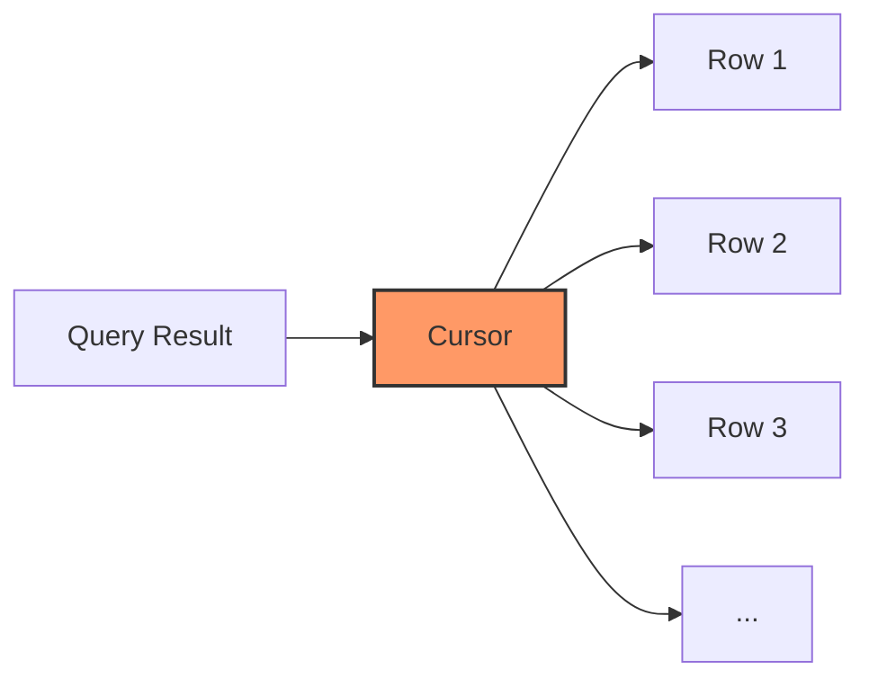

# PostgreSQL Cursors

## Introduction

In PostgreSQL, a cursor is a database object that allows you to retrieve and process query results one row at a time, rather than fetching the entire result set at once. This is particularly useful when dealing with large result sets that might consume excessive memory if loaded entirely.

Cursors act like pointers to a specific row within a result set, enabling you to navigate through the data sequentially. They are especially valuable within stored procedures and functions when you need to perform row-by-row processing.



## Why Use Cursors?

Cursors are beneficial in several scenarios:

1. **Memory Efficiency**: When dealing with large result sets, processing row by row reduces memory usage.
2. **Incremental Processing**: Perform complex operations on each row individually.
3. **Batch Processing**: Execute operations on subsets of data rather than the entire dataset.
4. **Data Transformation**: Transform data from one structure to another in a controlled manner.

## Basic Cursor Operations

Working with cursors in PostgreSQL involves four main operations:

1. **Declaring** a cursor
2. **Opening** the cursor
3. **Fetching** data from the cursor
4. **Closing** the cursor

Let's examine each operation in detail.

## Declaring Cursors

To use a cursor, you first need to declare it within a transaction block or a stored procedure. The declaration specifies the query associated with the cursor.

```sql
DECLARE cursor_name CURSOR FOR query;
```

For example:

```sql
DECLARE employee_cursor CURSOR FOR 
    SELECT id, first_name, last_name, salary 
    FROM employees 
    WHERE department_id = 10;
```

## Cursor Options

When declaring a cursor, you can specify additional options:

- `SCROLL` / `NO SCROLL`: Determines if the cursor can move backward
- `BINARY` / `NO BINARY`: Specifies if data should be in binary format
- `INSENSITIVE` / `SENSITIVE`: Controls if the cursor reflects changes made to the underlying data

Example with options:

```sql
DECLARE employee_cursor SCROLL CURSOR FOR 
    SELECT id, first_name, last_name, salary 
    FROM employees 
    WHERE department_id = 10;
```

## Opening a Cursor

In PostgreSQL, cursors are automatically opened when declared. However, in PL/pgSQL, you can explicitly open a cursor with parameters:

```sql
OPEN cursor_name [ ( arguments ) ];
```

For example:

```sql
OPEN employee_cursor;
```

Or with parameters:

```sql
OPEN employee_cursor(10); -- passing department_id as a parameter
```

## Fetching Data from a Cursor

Once a cursor is open, you can fetch rows from it using the `FETCH` command:

```sql
FETCH [ direction { FROM | IN } ] cursor_name INTO target;
```

Direction options include:
- `NEXT`: Get the next row (default)
- `PRIOR`: Get the previous row
- `FIRST`: Get the first row
- `LAST`: Get the last row
- `ABSOLUTE n`: Get the n-th row
- `RELATIVE n`: Get n rows forward/backward from current position

Example:

```sql
FETCH NEXT FROM employee_cursor INTO employee_id, first_name, last_name, employee_salary;
```

## Closing a Cursor

When you're done with a cursor, it's important to close it to free up resources:

```sql
CLOSE cursor_name;
```

Example:

```sql
CLOSE employee_cursor;
```

## Complete Cursor Example

Here's a complete example of using a cursor in a PL/pgSQL function:

```sql
CREATE OR REPLACE FUNCTION process_high_salary_employees(department_id INT, salary_threshold NUMERIC)
RETURNS TABLE(employee_id INT, full_name TEXT, salary NUMERIC) AS $$
DECLARE
    emp_cursor CURSOR FOR 
        SELECT id, first_name, last_name, salary 
        FROM employees 
        WHERE department_id = $1 AND salary > $2;
    emp_id INT;
    emp_first_name TEXT;
    emp_last_name TEXT;
    emp_salary NUMERIC;
BEGIN
    -- Open cursor
    OPEN emp_cursor;
    
    LOOP
        -- Fetch row
        FETCH emp_cursor INTO emp_id, emp_first_name, emp_last_name, emp_salary;
        
        -- Exit when no more rows
        EXIT WHEN NOT FOUND;
        
        -- Process the row
        employee_id := emp_id;
        full_name := emp_first_name || ' ' || emp_last_name;
        salary := emp_salary;
        
        -- Return the row
        RETURN NEXT;
    END LOOP;
    
    -- Close cursor
    CLOSE emp_cursor;
END;
$$ LANGUAGE plpgsql;
```

Usage:

```sql
SELECT * FROM process_high_salary_employees(10, 5000);
```

Output:

```
 employee_id |    full_name    |  salary
-------------+-----------------+----------
         101 | Jane Smith      | 6200.00
         105 | Michael Johnson | 5800.00
         107 | Sarah Williams  | 5500.00
```

## Working with Parameterized Cursors

Cursors can be parameterized, which is useful when you need to reuse a cursor with different values:

```sql
CREATE OR REPLACE FUNCTION get_employees_by_department(p_department_id INT)
RETURNS VOID AS $$
DECLARE
    dep_cursor REFCURSOR;
    emp_record RECORD;
BEGIN
    -- Open cursor with parameter
    OPEN dep_cursor FOR 
        SELECT * FROM employees 
        WHERE department_id = p_department_id;
    
    LOOP
        FETCH dep_cursor INTO emp_record;
        EXIT WHEN NOT FOUND;
        
        -- Process each record
        RAISE NOTICE 'Employee: % %', emp_record.first_name, emp_record.last_name;
    END LOOP;
    
    CLOSE dep_cursor;
END;
$$ LANGUAGE plpgsql;
```

## Real-World Applications

### 1. Data Migration

Cursors are excellent for data migration between tables or databases, especially when transformations are needed:

```sql
CREATE OR REPLACE FUNCTION migrate_customer_data()
RETURNS VOID AS $$
DECLARE
    cust_cursor CURSOR FOR 
        SELECT * FROM legacy_customers;
    cust_record RECORD;
    new_customer_id INT;
BEGIN
    OPEN cust_cursor;
    
    LOOP
        FETCH cust_cursor INTO cust_record;
        EXIT WHEN NOT FOUND;
        
        -- Transform and insert data into new schema
        INSERT INTO customers (first_name, last_name, email, phone)
        VALUES (
            cust_record.fname, 
            cust_record.lname,
            LOWER(cust_record.email), -- standardize email format
            REGEXP_REPLACE(cust_record.phone, '[^0-9]', '', 'g') -- clean phone number
        )
        RETURNING id INTO new_customer_id;
        
        -- Migrate related data
        INSERT INTO addresses (customer_id, address_type, street, city, state, zip)
        SELECT
            new_customer_id,
            'primary',
            cust_record.address,
            cust_record.city,
            cust_record.state,
            cust_record.zip;
    END LOOP;
    
    CLOSE cust_cursor;
END;
$$ LANGUAGE plpgsql;
```

### 2. Batch Processing

When processing large datasets, you might want to commit changes in batches to avoid long-running transactions:

```sql
CREATE OR REPLACE FUNCTION archive_old_orders(p_days_old INT)
RETURNS INT AS $$
DECLARE
    orders_cursor CURSOR FOR 
        SELECT order_id FROM orders 
        WHERE order_date < CURRENT_DATE - p_days_old;
    order_rec RECORD;
    batch_size INT := 100;
    counter INT := 0;
    total_archived INT := 0;
BEGIN
    OPEN orders_cursor;
    
    LOOP
        -- Start a subtransaction for each batch
        BEGIN
            FOR i IN 1..batch_size LOOP
                FETCH orders_cursor INTO order_rec;
                EXIT WHEN NOT FOUND;
                
                -- Archive order
                INSERT INTO archived_orders 
                    SELECT * FROM orders WHERE order_id = order_rec.order_id;
                
                -- Delete from active orders
                DELETE FROM orders WHERE order_id = order_rec.order_id;
                
                counter := counter + 1;
                total_archived := total_archived + 1;
            END LOOP;
            
            -- Commit this batch
            IF counter > 0 THEN
                RAISE NOTICE 'Archived % orders in this batch', counter;
                counter := 0;
            END IF;
        END;
        
        EXIT WHEN NOT FOUND;
    END LOOP;
    
    CLOSE orders_cursor;
    RETURN total_archived;
END;
$$ LANGUAGE plpgsql;
```

### 3. Report Generation

Cursors can be used to generate complex reports that require row-by-row processing:

```sql
CREATE OR REPLACE FUNCTION generate_department_salary_report()
RETURNS TABLE(department_name TEXT, total_employees INT, avg_salary NUMERIC, min_salary NUMERIC, max_salary NUMERIC) AS $$
DECLARE
    dept_cursor CURSOR FOR 
        SELECT id, name FROM departments ORDER BY name;
    dept_rec RECORD;
    emp_count INT;
    avg_emp_salary NUMERIC;
    min_emp_salary NUMERIC;
    max_emp_salary NUMERIC;
BEGIN
    OPEN dept_cursor;
    
    LOOP
        FETCH dept_cursor INTO dept_rec;
        EXIT WHEN NOT FOUND;
        
        -- Get department statistics
        SELECT 
            COUNT(*), 
            AVG(salary), 
            MIN(salary), 
            MAX(salary)
        INTO
            emp_count,
            avg_emp_salary,
            min_emp_salary,
            max_emp_salary
        FROM employees
        WHERE department_id = dept_rec.id;
        
        -- Skip departments with no employees
        IF emp_count > 0 THEN
            department_name := dept_rec.name;
            total_employees := emp_count;
            avg_salary := ROUND(avg_emp_salary, 2);
            min_salary := min_emp_salary;
            max_salary := max_emp_salary;
            
            RETURN NEXT;
        END IF;
    END LOOP;
    
    CLOSE dept_cursor;
END;
$$ LANGUAGE plpgsql;
```

## Performance Considerations

While cursors are powerful, they come with performance implications:

1. **Memory Usage**: Cursors use less memory than fetching entire result sets, but still consume server resources.
2. **Network Overhead**: Each `FETCH` operation requires a round trip to the database server.
3. **Locking**: Long-running cursor operations may impact concurrency.
4. **Alternatives**: For simple operations, consider using:
   - `LIMIT/OFFSET` for pagination
   - Set-based operations instead of row-by-row processing

## Best Practices

Follow these best practices when working with cursors:

1. Always close cursors when done with them.
2. Use cursors only when row-by-row processing is necessary.
3. Consider the `WITH HOLD` option for cursors that need to survive transaction boundaries.
4. Be mindful of the performance implications of cursor operations.
5. For large datasets, consider using server-side cursors with appropriate fetch size.

## Summary

PostgreSQL cursors provide a powerful way to process query results one row at a time, offering benefits in memory efficiency and flexibility for complex data processing tasks. They are particularly useful in stored procedures when dealing with large result sets or when you need to perform operations on individual rows.

Key points to remember:
- Cursors allow row-by-row processing of query results
- They follow a declare, open, fetch, close lifecycle
- They're ideal for batch processing, data migration, and complex reports
- While powerful, be mindful of their performance implications

## Exercises

1. Create a stored procedure that uses a cursor to find and update all products with prices below a specified threshold, applying a percentage increase.

2. Write a function that uses a cursor to generate a report of the top three customers by sales volume for each region in your database.

3. Implement a batch processing function that uses a cursor to archive orders older than a year, processing 100 records at a time and reporting progress.

4. Create a data validation procedure that uses a cursor to check all employee records for missing data and logs issues to an audit table.

## Additional Resources

- [PostgreSQL Official Documentation on Cursors](https://www.postgresql.org/docs/current/plpgsql-cursors.html)
- [PL/pgSQL Control Structures](https://www.postgresql.org/docs/current/plpgsql-control-structures.html)
- [PostgreSQL Performance Tuning](https://www.postgresql.org/docs/current/performance-tips.html)