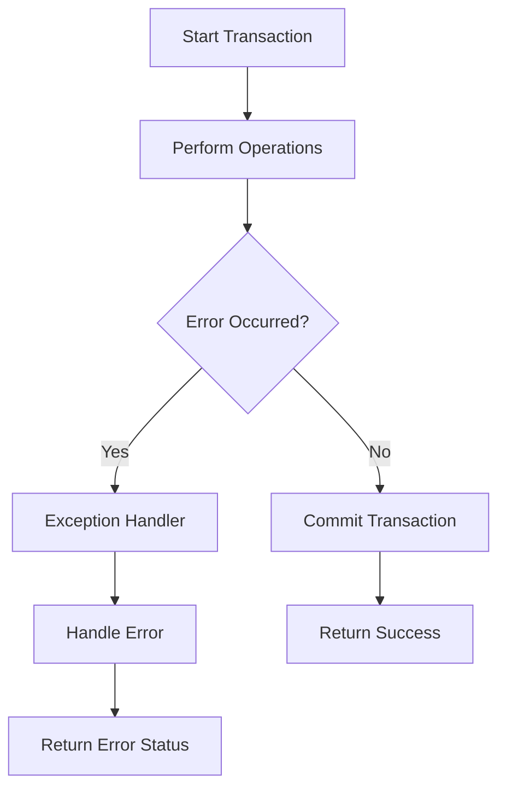

# PostgreSQL Exception Handling

## Introduction

When writing PostgreSQL stored procedures, it's essential to anticipate and handle errors that might occur during execution. Exception handling allows your code to gracefully respond to errors rather than failing abruptly. This is particularly important in production environments where reliability and data integrity are crucial.

In this tutorial, we'll explore how PostgreSQL implements exception handling within PL/pgSQL stored procedures and functions. You'll learn how to catch errors, handle different types of exceptions, and create custom exception handlers to make your database code more robust.

## The Basics of Exception Handling

In PostgreSQL's PL/pgSQL language, exception handling follows a try-catch pattern similar to many programming languages. The syntax uses the `EXCEPTION` keyword to define a block that catches and handles errors.

### Exception Block Structure

```sql
BEGIN
  -- Regular code goes here
  -- This is where you perform your operations
EXCEPTION
  WHEN condition THEN
    -- Handle the exception
  WHEN another_condition THEN
    -- Handle another exception
  ...
END;
```

When an error occurs in the main block, execution immediately jumps to the exception section, where you can handle the error based on its type.

## Common Exception Conditions

PostgreSQL provides several predefined exception conditions that you can use in your WHEN clauses:

| Condition | Description |
|-----------|-------------|
| `DIVISION_BY_ZERO` | Occurs when dividing by zero |
| `NO_DATA_FOUND` | No row was returned in a `SELECT INTO` statement |
| `TOO_MANY_ROWS` | More than one row was returned in a `SELECT INTO` statement |
| `UNIQUE_VIOLATION` | A unique constraint was violated |
| `FOREIGN_KEY_VIOLATION` | A foreign key constraint was violated |
| `NOT_NULL_VIOLATION` | A NOT NULL constraint was violated |
| `CHECK_VIOLATION` | A check constraint was violated |
| `SQLSTATE 'xxxxx'` | Matches any exception with the specified SQLSTATE code |
| `OTHERS` | Catches all other exceptions |

### Basic Example

Let's look at a simple example of exception handling in a function that divides two numbers:

```sql
CREATE OR REPLACE FUNCTION safe_divide(
  numerator NUMERIC, 
  denominator NUMERIC
) 
RETURNS NUMERIC AS $$
BEGIN
  -- Attempt the division
  RETURN numerator / denominator;
EXCEPTION
  WHEN DIVISION_BY_ZERO THEN
    RAISE NOTICE 'Division by zero detected!';
    RETURN NULL;
END;
$$ LANGUAGE plpgsql;
```

Example usage and output:

```
SELECT safe_divide(10, 2);
-- Output: 5

SELECT safe_divide(10, 0);
-- NOTICE: Division by zero detected!
-- Output: NULL
```

In this example, when someone tries to divide by zero, instead of the query failing with an error, our function catches the exception, displays a notice, and returns NULL.

## Handling Multiple Exception Types

You can handle different types of exceptions differently within the same exception block:

```sql
CREATE OR REPLACE FUNCTION get_employee_salary(employee_id INT)
RETURNS NUMERIC AS $$
DECLARE
  salary NUMERIC;
BEGIN
  -- Get the salary
  SELECT salary_amount INTO STRICT salary
  FROM employee_salaries
  WHERE id = employee_id;
  
  RETURN salary;
EXCEPTION
  WHEN NO_DATA_FOUND THEN
    RAISE NOTICE 'Employee with ID % not found', employee_id;
    RETURN 0;
  WHEN TOO_MANY_ROWS THEN
    RAISE NOTICE 'Multiple salary records found for employee ID %', employee_id;
    RETURN -1;
  WHEN OTHERS THEN
    RAISE NOTICE 'Unexpected error occurred: %', SQLERRM;
    RETURN -2;
END;
$$ LANGUAGE plpgsql;
```

In this example:
- `NO_DATA_FOUND` handles the case when no employee is found
- `TOO_MANY_ROWS` handles the case when multiple records are found (which shouldn't happen with a unique ID)
- `OTHERS` catches any other unexpected errors

## Getting Error Information

When an exception occurs, PostgreSQL provides several variables to help you get more information about the error:

- `SQLSTATE`: Contains the error code (e.g., '23505' for unique violations)
- `SQLERRM`: Contains the error message
- `SQLCONTEXT`: Contains the context of the error (PostgreSQL 14 and later)

You can use these variables in your exception handlers:

```sql
EXCEPTION
  WHEN OTHERS THEN
    RAISE NOTICE 'Error code: %, Error message: %', SQLSTATE, SQLERRM;
    -- Handle the error
```

## The RAISE Statement

The `RAISE` statement allows you to:
1. Generate custom errors
2. Add more context to existing errors
3. Log information during exception handling

### RAISE Severity Levels

PostgreSQL supports different severity levels for RAISE:

- `DEBUG` - Messages for developers
- `LOG` - General information
- `NOTICE` - Information that might be useful to users
- `WARNING` - Potential problems that don't stop execution
- `EXCEPTION` - Errors that stop execution

### Example of Custom Error Generation

```sql
CREATE OR REPLACE FUNCTION withdraw_money(
  account_id INT,
  amount NUMERIC
)
RETURNS BOOLEAN AS $$
DECLARE
  current_balance NUMERIC;
BEGIN
  -- Get current balance
  SELECT balance INTO current_balance
  FROM accounts
  WHERE id = account_id;
  
  -- Check if withdrawal is possible
  IF current_balance < amount THEN
    RAISE EXCEPTION 'Insufficient funds: balance is %, tried to withdraw %',
      current_balance, amount
      USING HINT = 'Please withdraw a smaller amount.';
  END IF;
  
  -- Process withdrawal
  UPDATE accounts
  SET balance = balance - amount
  WHERE id = account_id;
  
  RETURN TRUE;
EXCEPTION
  WHEN NO_DATA_FOUND THEN
    RAISE EXCEPTION 'Account with ID % not found', account_id;
  WHEN OTHERS THEN
    RAISE NOTICE 'Transaction failed: %', SQLERRM;
    RETURN FALSE;
END;
$$ LANGUAGE plpgsql;
```

This function demonstrates:
1. Using `RAISE EXCEPTION` to generate a custom error
2. Adding context (current_balance and amount) to the error message
3. Using the `USING HINT` clause to provide additional information
4. Catching and handling both specific and general exceptions

## Creating Custom Exception Types

PostgreSQL allows you to define custom exception types using `SQLSTATE` codes:

```sql
CREATE OR REPLACE FUNCTION process_order(order_id INT)
RETURNS VOID AS $$
DECLARE
  -- Define custom exception
  insufficient_inventory EXCEPTION;
  inventory_count INT;
  required_count INT;
BEGIN
  -- Check inventory
  SELECT inventory.count, orders.quantity 
  INTO inventory_count, required_count
  FROM inventory 
  JOIN orders ON inventory.product_id = orders.product_id
  WHERE orders.id = order_id;
  
  IF inventory_count < required_count THEN
    RAISE EXCEPTION 'Not enough inventory'
      USING ERRCODE = '45000'; -- Custom error code
  END IF;
  
  -- Process the order
  -- ...
EXCEPTION
  WHEN SQLSTATE '45000' THEN
    RAISE NOTICE 'Inventory shortage detected. Current: %, Required: %',
      inventory_count, required_count;
    RETURN;
END;
$$ LANGUAGE plpgsql;
```

For custom exceptions, you can use SQLSTATE codes in the range '45000' to '49999', which are reserved for user-defined error codes.

## Try-Catch Pattern with Sub-Blocks

You can create nested exception handling blocks to implement more complex error handling logic:

```sql
CREATE OR REPLACE FUNCTION complex_process()
RETURNS VOID AS $$
BEGIN
  -- Main process
  BEGIN
    -- Step 1: Do something
    PERFORM some_function();
  EXCEPTION
    WHEN specific_error THEN
      -- Handle this specific error for step 1
      RAISE NOTICE 'Handling specific error in step 1';
  END;
  
  -- Continue with step 2 even if step 1 had errors
  BEGIN
    -- Step 2: Do something else
    PERFORM another_function();
  EXCEPTION
    WHEN another_error THEN
      -- Handle errors for step 2
      RAISE NOTICE 'Handling specific error in step 2';
  END;
  
EXCEPTION
  WHEN OTHERS THEN
    -- Global error handler
    RAISE NOTICE 'Global error handler: %', SQLERRM;
END;
$$ LANGUAGE plpgsql;
```

This pattern allows you to:
1. Handle specific errors at each step
2. Continue execution even if some steps fail
3. Have a global error handler for unhandled exceptions

## Real-World Example: Transaction Management

Let's look at a practical example involving transaction management, which is a common use case for exception handling:

```sql
CREATE OR REPLACE FUNCTION transfer_funds(
  from_account_id INT,
  to_account_id INT,
  amount NUMERIC
)
RETURNS BOOLEAN AS $$
DECLARE
  from_balance NUMERIC;
BEGIN
  -- Start a transaction
  BEGIN
    -- Check sender's balance
    SELECT balance INTO from_balance
    FROM accounts
    WHERE id = from_account_id
    FOR UPDATE; -- Lock the row
    
    IF from_balance < amount THEN
      RAISE EXCEPTION 'Insufficient funds';
    END IF;
    
    -- Update sender's account
    UPDATE accounts
    SET balance = balance - amount
    WHERE id = from_account_id;
    
    -- Update receiver's account
    UPDATE accounts
    SET balance = balance + amount
    WHERE id = to_account_id;
    
    -- If everything succeeds, commit the transaction
    RETURN TRUE;
  EXCEPTION
    WHEN OTHERS THEN
      -- If any error occurs, rollback and return the error
      RAISE NOTICE 'Transaction failed: %', SQLERRM;
      RETURN FALSE;
  END;
END;
$$ LANGUAGE plpgsql;
```

In this example:
1. We use exception handling to ensure the transaction either completes fully or not at all
2. We handle errors that might occur during the transfer process
3. The `FOR UPDATE` clause locks the row to prevent concurrent transactions from modifying it

## Transaction Management Flow

Here's a visualization of how exception handling works with transactions:



## Best Practices for Exception Handling

1. **Be Specific**: Catch specific exceptions rather than using `OTHERS` whenever possible.
2. **Provide Context**: Include relevant information in error messages to aid debugging.
3. **Log Errors**: Use `RAISE NOTICE` or `RAISE LOG` to record error information.
4. **Don't Ignore Exceptions**: Always handle exceptions appropriately.
5. **Use Transactions**: Wrap operations that must succeed or fail together in transactions.
6. **Handle Nested Exceptions**: Use sub-blocks for complicated procedures with multiple potential failure points.
7. **Return Meaningful Values**: Make your functions return values that indicate success or failure.

## Error Propagation

If you don't handle an exception, it propagates up the call stack:

```sql
CREATE OR REPLACE FUNCTION inner_function()
RETURNS VOID AS $$
BEGIN
  -- This will raise a division by zero error
  PERFORM 1/0;
END;
$$ LANGUAGE plpgsql;

CREATE OR REPLACE FUNCTION outer_function()
RETURNS VOID AS $$
BEGIN
  -- Call inner function
  PERFORM inner_function();
  
  -- This line won't execute if inner_function raises an exception
  RAISE NOTICE 'This line will not be reached if there is an error';
EXCEPTION
  -- Catch and rethrow with additional information
  WHEN OTHERS THEN
    RAISE EXCEPTION 'Error in outer_function: %', SQLERRM;
END;
$$ LANGUAGE plpgsql;
```

In this example, the division by zero error in `inner_function()` will propagate to `outer_function()`, where it's caught and wrapped with additional context.

## Exercises

1. **Basic Exception Handling**:
   Create a function that attempts to insert a record into a table and handles unique constraint violations gracefully.

2. **Custom Exception Types**:
   Define a function with a custom exception for a business rule violation (e.g., minimum order amount).

3. **Transaction Management**:
   Implement a function that performs multiple related database operations within a transaction, with proper rollback on failure.

4. **Nested Exception Handling**:
   Create a complex procedure with multiple steps, each with its own exception handler.

## Summary

Exception handling in PostgreSQL allows you to write more robust stored procedures that can gracefully handle errors. Key points to remember:

- Use the `EXCEPTION` keyword to define exception handlers
- Catch specific exceptions with `WHEN` conditions
- Access error details using `SQLSTATE` and `SQLERRM`
- Generate custom errors with `RAISE EXCEPTION`
- Use nested blocks for more complex error handling logic
- Combine exception handling with transactions for data integrity

By implementing proper exception handling, you'll create database code that's more reliable, easier to debug, and provides better user experience by giving meaningful error messages instead of cryptic database errors.

## Additional Resources

- [PostgreSQL Documentation on Error Handling](https://www.postgresql.org/docs/current/plpgsql-errors-and-messages.html)
- [PostgreSQL SQLSTATE Error Codes](https://www.postgresql.org/docs/current/errcodes-appendix.html)
- [PL/pgSQL Control Structures](https://www.postgresql.org/docs/current/plpgsql-control-structures.html)