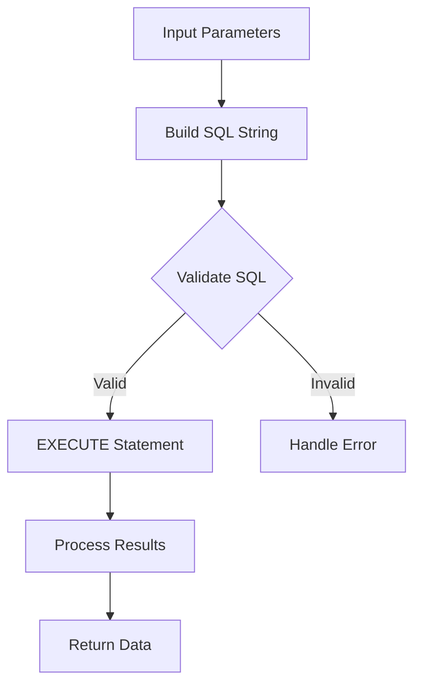

# PostgreSQL Dynamic SQL

## Introduction

Dynamic SQL is a powerful feature in PostgreSQL that allows you to build and execute SQL statements at runtime rather than having them predefined during development. This provides flexibility when you need to create SQL statements that change based on input parameters, conditions, or other runtime factors.

In traditional SQL within stored procedures, your queries are fixed at the time you write them. Dynamic SQL, on the other hand, lets you construct queries as strings and execute them programmatically, opening up a wide range of possibilities for creating more adaptable database applications.

This guide will walk you through the fundamentals of dynamic SQL in PostgreSQL, demonstrating how to effectively use this technique in your stored procedures.

## Why Use Dynamic SQL?

Before diving into the syntax, let's understand when dynamic SQL is useful:

1. **Variable table or column names**: When you need to operate on tables or columns that aren't known until runtime
2. **Conditional query parts**: When portions of your query need to change based on parameters
3. **Dynamic sorting**: When sort criteria need to be determined at runtime
4. **Bulk operations**: When generating multiple similar statements with different parameters
5. **Complex permissions handling**: When access control requires different query structures

## Basic Dynamic SQL with EXECUTE

The `EXECUTE` command is the foundation of dynamic SQL in PostgreSQL. It allows you to run a string as an SQL statement.

Here's a simple example:

```sql
DO $$
DECLARE
    table_name TEXT := 'employees';
    query TEXT;
BEGIN
    query := 'SELECT COUNT(*) FROM ' || table_name;
    EXECUTE query;
END $$;
```

However, just executing isn't very useful by itself. Let's capture the results:

```sql
DO $$
DECLARE
    table_name TEXT := 'employees';
    query TEXT;
    employee_count INTEGER;
BEGIN
    query := 'SELECT COUNT(*) FROM ' || table_name;
    EXECUTE query INTO employee_count;
    RAISE NOTICE 'Employee count: %', employee_count;
END $$;
```

## Using EXECUTE with Parameters

One challenge with dynamic SQL is securely including parameter values. PostgreSQL offers a safer way to pass parameters using the `USING` clause:

```sql
DO $$
DECLARE
    department TEXT := 'Engineering';
    min_salary INTEGER := 60000;
    query TEXT;
    employee_count INTEGER;
BEGIN
    query := 'SELECT COUNT(*) FROM employees WHERE department = $1 AND salary > $2';
    EXECUTE query INTO employee_count USING department, min_salary;
    RAISE NOTICE 'Engineers earning over $60K: %', employee_count;
END $$;
```

Using placeholders (`$1`, `$2`) with the `USING` clause is preferred over string concatenation because:
- It prevents SQL injection attacks
- It handles data type conversions automatically
- It properly escapes special characters

## Creating a Dynamic SQL Function

Let's create a reusable function that demonstrates dynamic SQL in action:

```sql
CREATE OR REPLACE FUNCTION get_filtered_employees(
    p_table_name TEXT,
    p_department TEXT,
    p_sort_column TEXT DEFAULT 'last_name',
    p_sort_direction TEXT DEFAULT 'ASC'
) RETURNS TABLE (
    id INTEGER,
    first_name TEXT,
    last_name TEXT,
    department TEXT,
    salary NUMERIC
) AS $$
DECLARE
    query TEXT;
BEGIN
    -- Validate sort direction
    IF p_sort_direction NOT IN ('ASC', 'DESC') THEN
        RAISE EXCEPTION 'Sort direction must be either ASC or DESC';
    END IF;
    
    -- Build the query
    query := 'SELECT id, first_name, last_name, department, salary FROM ' || 
             quote_ident(p_table_name) || 
             ' WHERE department = $1 ' ||
             'ORDER BY ' || quote_ident(p_sort_column) || ' ' || p_sort_direction;
    
    -- Log the generated query for debugging
    RAISE NOTICE 'Executing query: %', query;
    
    -- Execute and return results
    RETURN QUERY EXECUTE query USING p_department;
END;
$$ LANGUAGE plpgsql;
```

This function demonstrates several important concepts:

1. `quote_ident()` for safely handling table and column names
2. Parameter validation
3. Using `RETURN QUERY EXECUTE` to return result sets
4. Debugging with `RAISE NOTICE`

### Example Usage

```sql
-- Get Engineering employees sorted by salary in descending order
SELECT * FROM get_filtered_employees('employees', 'Engineering', 'salary', 'DESC');

-- Get Marketing employees with default sorting (last_name ASC)
SELECT * FROM get_filtered_employees('employees', 'Marketing');
```

## Dynamic SQL for Conditional Query Construction

Sometimes you need to build entirely different queries based on input parameters. Here's how to handle that:

```sql
CREATE OR REPLACE FUNCTION search_employees(
    p_search_type TEXT,
    p_search_value TEXT
) RETURNS TABLE (
    id INTEGER,
    first_name TEXT,
    last_name TEXT,
    department TEXT
) AS $$
DECLARE
    query TEXT;
BEGIN
    IF p_search_type = 'name' THEN
        query := 'SELECT id, first_name, last_name, department FROM employees ' ||
                 'WHERE first_name ILIKE $1 OR last_name ILIKE $1';
        RETURN QUERY EXECUTE query USING '%' || p_search_value || '%';
        
    ELSIF p_search_type = 'department' THEN
        query := 'SELECT id, first_name, last_name, department FROM employees ' ||
                 'WHERE department = $1';
        RETURN QUERY EXECUTE query USING p_search_value;
        
    ELSIF p_search_type = 'salary_range' THEN
        -- Assuming p_search_value is in format 'min-max'
        DECLARE
            min_salary TEXT;
            max_salary TEXT;
        BEGIN
            min_salary := split_part(p_search_value, '-', 1);
            max_salary := split_part(p_search_value, '-', 2);
            
            query := 'SELECT id, first_name, last_name, department FROM employees ' ||
                     'WHERE salary BETWEEN $1::numeric AND $2::numeric';
            RETURN QUERY EXECUTE query USING min_salary, max_salary;
        END;
        
    ELSE
        RAISE EXCEPTION 'Unknown search type: %', p_search_type;
    END IF;
END;
$$ LANGUAGE plpgsql;
```

### Example Usage

```sql
-- Search by name
SELECT * FROM search_employees('name', 'smith');

-- Search by department
SELECT * FROM search_employees('department', 'Engineering');

-- Search by salary range
SELECT * FROM search_employees('salary_range', '50000-75000');
```

## Dynamic SQL for Administrative Tasks

Dynamic SQL is particularly powerful for database administration tasks:

```sql
CREATE OR REPLACE FUNCTION analyze_tables(p_schema TEXT) 
RETURNS VOID AS $$
DECLARE
    table_rec RECORD;
    query TEXT;
BEGIN
    FOR table_rec IN 
        SELECT table_name 
        FROM information_schema.tables 
        WHERE table_schema = p_schema
        AND table_type = 'BASE TABLE'
    LOOP
        query := 'ANALYZE ' || quote_ident(p_schema) || '.' || quote_ident(table_rec.table_name);
        EXECUTE query;
        RAISE NOTICE 'Analyzed table: %.%', p_schema, table_rec.table_name;
    END LOOP;
END;
$$ LANGUAGE plpgsql;
```

This function dynamically builds and executes `ANALYZE` statements for all tables in a given schema.

## Advanced Dynamic SQL with Prepared Statements

For statements you'll execute multiple times, prepare them once and execute many times:

```sql
CREATE OR REPLACE FUNCTION bulk_update_salaries(
    p_department TEXT,
    p_increase_percentage NUMERIC
) RETURNS INTEGER AS $$
DECLARE
    query TEXT;
    affected_rows INTEGER;
BEGIN
    query := 'UPDATE employees SET salary = salary * (1 + $1/100) WHERE department = $2';
    
    -- Create a prepared statement
    EXECUTE 'PREPARE salary_update AS ' || query;
    
    -- Execute the prepared statement
    EXECUTE 'EXECUTE salary_update($1, $2)' 
      INTO affected_rows 
      USING p_increase_percentage, p_department;
    
    -- Deallocate the prepared statement
    EXECUTE 'DEALLOCATE salary_update';
    
    RETURN affected_rows;
END;
$$ LANGUAGE plpgsql;
```

## Security Considerations

Dynamic SQL introduces potential security risks if not handled properly:

1. **SQL Injection**: Always use parameterized queries with `USING` instead of concatenating user input directly.

2. **Identifier Validation**: Use `quote_ident()` for table and column names from user input.

3. **Privilege Escalation**: Be cautious about who can run dynamic SQL functions. They potentially have the ability to execute arbitrary SQL commands.

4. **Input Validation**: Always validate inputs before constructing SQL statements.

## Visual Flow of Dynamic SQL Execution



## Common Pitfalls and How to Avoid Them

1. **String Quotes**: Be careful with quote management in dynamic SQL strings:

```sql
-- Incorrect
query := 'SELECT * FROM employees WHERE name = ' || input_name;

-- Correct
query := 'SELECT * FROM employees WHERE name = $1';
EXECUTE query USING input_name;
```

2. **Type Conversion**: Sometimes explicit casting is needed:

```sql
query := 'SELECT * FROM employees WHERE hire_date > $1::date';
EXECUTE query USING input_date;
```

3. **Performance**: Dynamic SQL can't use prepared statement caching effectively, potentially leading to performance issues with frequent execution.

4. **Error Handling**: Errors in dynamic SQL can be harder to debug. Use `RAISE NOTICE` to log generated SQL during development.

## Real-World Example: Dynamic Report Generator

Here's a complete example of a dynamic report generator that creates custom reports based on user parameters:

```sql
CREATE OR REPLACE FUNCTION generate_custom_report(
    p_table_name TEXT,
    p_columns TEXT[],
    p_filter_column TEXT DEFAULT NULL,
    p_filter_value TEXT DEFAULT NULL,
    p_group_by TEXT DEFAULT NULL,
    p_order_by TEXT DEFAULT NULL,
    p_limit INTEGER DEFAULT 100
) RETURNS SETOF RECORD AS $$
DECLARE
    query TEXT;
    column_list TEXT;
BEGIN
    -- Validate table exists
    IF NOT EXISTS (
        SELECT 1 FROM information_schema.tables 
        WHERE table_name = p_table_name
    ) THEN
        RAISE EXCEPTION 'Table % does not exist', p_table_name;
    END IF;
    
    -- Build column list with validation
    SELECT string_agg(quote_ident(col), ', ')
    INTO column_list
    FROM unnest(p_columns) AS col;
    
    -- Start building the query
    query := 'SELECT ' || column_list || ' FROM ' || quote_ident(p_table_name);
    
    -- Add filter if provided
    IF p_filter_column IS NOT NULL AND p_filter_value IS NOT NULL THEN
        query := query || ' WHERE ' || quote_ident(p_filter_column) || ' = $1';
    END IF;
    
    -- Add GROUP BY if provided
    IF p_group_by IS NOT NULL THEN
        query := query || ' GROUP BY ' || quote_ident(p_group_by);
    END IF;
    
    -- Add ORDER BY if provided
    IF p_order_by IS NOT NULL THEN
        query := query || ' ORDER BY ' || quote_ident(p_order_by);
    END IF;
    
    -- Add LIMIT
    query := query || ' LIMIT ' || p_limit;
    
    -- Log the generated query
    RAISE NOTICE 'Executing report query: %', query;
    
    -- Execute with or without filter parameter
    IF p_filter_column IS NOT NULL AND p_filter_value IS NOT NULL THEN
        RETURN QUERY EXECUTE query USING p_filter_value;
    ELSE
        RETURN QUERY EXECUTE query;
    END IF;
END;
$$ LANGUAGE plpgsql;
```

### Using the Report Generator

```sql
-- Basic employee report with selected columns
SELECT * FROM generate_custom_report(
    'employees', 
    ARRAY['first_name', 'last_name', 'department', 'salary'],
    'department', 
    'Engineering',
    NULL,
    'salary DESC',
    10
) AS (first_name TEXT, last_name TEXT, department TEXT, salary NUMERIC);

-- Sales summary report with grouping
SELECT * FROM generate_custom_report(
    'sales', 
    ARRAY['product_category', 'COUNT(*) as total_sales', 'SUM(amount) as revenue'],
    NULL, 
    NULL,
    'product_category',
    'revenue DESC',
    5
) AS (product_category TEXT, total_sales BIGINT, revenue NUMERIC);
```

## Summary

Dynamic SQL in PostgreSQL provides a powerful way to create flexible database operations that can adapt to changing requirements at runtime. Key takeaways include:

1. Use `EXECUTE` to run dynamically constructed SQL statements
2. Always use parameters with the `USING` clause for values rather than string concatenation
3. Use `quote_ident()` for table and column names
4. Validate input before constructing SQL strings
5. Be aware of security implications, particularly SQL injection risks
6. Use prepared statements for repeated execution when possible
7. Dynamic SQL enables powerful administrative tasks and flexible reporting

While dynamic SQL has many advantages, it should be used judiciously. Static SQL is often simpler to debug, maintain, and optimize. Use dynamic SQL when you truly need the flexibility it provides.

## Exercises

1. Create a function that can sort a given table by any column in any direction.
2. Develop a dynamic pivot query that transforms rows into columns based on user input.
3. Build a generic audit logging function that can track changes to any table.
4. Create a function that dynamically generates CREATE TABLE statements based on a template and parameters.
5. Develop a search function that can search across multiple tables for a given term.

## Additional Resources

- [PostgreSQL Documentation: EXECUTE Command](https://www.postgresql.org/docs/current/sql-execute.html)
- [PostgreSQL Documentation: PL/pgSQL - SQL Procedures Language](https://www.postgresql.org/docs/current/plpgsql.html)
- [PostgreSQL Documentation: Functions Returning Sets](https://www.postgresql.org/docs/current/plpgsql-control-structures.html#PLPGSQL-STATEMENTS-RETURNING)
- [PostgreSQL Documentation: Security Considerations](https://www.postgresql.org/docs/current/plpgsql-implementation.html#PLPGSQL-SECURITY)