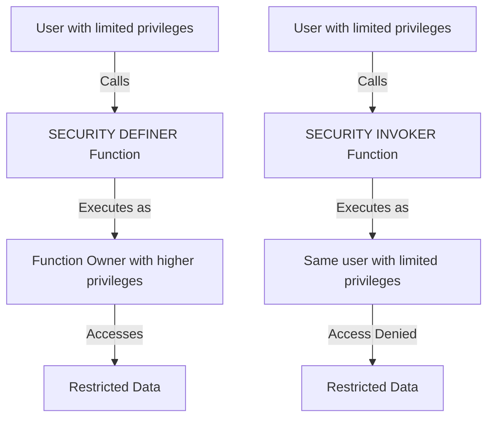

# PostgreSQL Procedure Security

## Introduction

When working with stored procedures in PostgreSQL, security should be a top priority. Procedures often execute privileged operations on your database, and without proper security measures, they can become potential entry points for attackers. This guide will help you understand the security aspects of PostgreSQL stored procedures and implement best practices to protect your database.

## Understanding Execution Context

In PostgreSQL, stored procedures run with the privileges of the user who invokes them, not the user who created them. This behavior is different from that of functions, which can be defined with different execution contexts.

```sql
-- This procedure will run with the privileges of the invoking user
CREATE PROCEDURE update_customer_address(customer_id INT, new_address TEXT)
LANGUAGE SQL
AS $$
  UPDATE customers SET address = new_address WHERE id = customer_id;
$$;
```

## Security Definer vs. Security Invoker

PostgreSQL allows you to specify the execution context for functions using `SECURITY DEFINER` or `SECURITY INVOKER` options.

```sql
-- Function that runs with the privileges of the function creator
CREATE FUNCTION get_sensitive_data(client_id INT) 
RETURNS TABLE (id INT, name TEXT, credit_score INT)
LANGUAGE SQL
SECURITY DEFINER
AS $$
  SELECT id, name, credit_score FROM clients WHERE id = client_id;
$$;

-- Function that runs with the privileges of the invoking user
CREATE FUNCTION update_user_data(user_id INT, new_email TEXT) 
RETURNS VOID
LANGUAGE SQL
SECURITY INVOKER
AS $$
  UPDATE users SET email = new_email WHERE id = user_id;
$$;
```

### When to Use SECURITY DEFINER

Use `SECURITY DEFINER` when you need a function to perform operations that the calling user might not have direct permissions to execute, but should be allowed to do through a controlled interface.

### Security Risks with SECURITY DEFINER

Functions defined with `SECURITY DEFINER` can pose security risks if not carefully implemented:

1. They execute with the privileges of the function owner
2. They could potentially be exploited if not properly secured

Let's visualize the execution context:



## Best Practices for Procedure Security

### 1. Use Schema Qualification

Always use schema-qualified names for objects referenced within your procedures to prevent search path attacks.

```sql
-- Bad practice (vulnerable to search path attacks)
CREATE FUNCTION unsafe_get_user(user_id INT) 
RETURNS TABLE (id INT, username TEXT)
SECURITY DEFINER
AS $$
  SELECT id, username FROM users WHERE id = user_id; -- Not schema-qualified
$$;

-- Good practice
CREATE FUNCTION safe_get_user(user_id INT) 
RETURNS TABLE (id INT, username TEXT)
SECURITY DEFINER
AS $$
  SELECT id, username FROM public.users WHERE id = user_id; -- Schema-qualified
$$;
```

### 2. Set a Restricted Search Path

For `SECURITY DEFINER` functions, explicitly set the search path to control which schemas are searched.

```sql
CREATE FUNCTION get_sensitive_data(client_id INT) 
RETURNS TABLE (id INT, name TEXT, credit_score INT)
LANGUAGE SQL
SECURITY DEFINER
SET search_path = pg_catalog, public
AS $$
  SELECT id, name, credit_score FROM public.clients WHERE id = client_id;
$$;
```

### 3. Implement Input Validation

Always validate inputs to prevent SQL injection:

```sql
CREATE OR REPLACE FUNCTION validate_and_update_user(
    user_id INTEGER,
    new_name TEXT
) RETURNS VOID AS $$
BEGIN
    -- Input validation
    IF new_name IS NULL OR length(new_name) < 3 THEN
        RAISE EXCEPTION 'Invalid name: must be at least 3 characters';
    END IF;
    
    -- Ensure user_id is positive
    IF user_id <= 0 THEN
        RAISE EXCEPTION 'Invalid user ID: must be positive';
    END IF;
    
    -- Perform the update
    UPDATE users SET name = new_name WHERE id = user_id;
END;
$$ LANGUAGE plpgsql SECURITY DEFINER
SET search_path = pg_catalog, public;
```

### 4. Use Parameter Types Carefully

Avoid using general types like `TEXT` for identifiers. Instead, use appropriate types to enable PostgreSQL's type checking.

```sql
-- Less secure: using TEXT for an ID
CREATE PROCEDURE update_user_unsafe(user_id TEXT, new_email TEXT)
LANGUAGE SQL
AS $$
  UPDATE users SET email = new_email WHERE id = user_id::INTEGER;
$$;

-- More secure: using the correct type
CREATE PROCEDURE update_user_safe(user_id INTEGER, new_email TEXT)
LANGUAGE SQL
AS $$
  UPDATE users SET email = new_email WHERE id = user_id;
$$;
```

### 5. Implement Row-Level Security for Additional Protection

Use row-level security policies to restrict access to data at the row level:

```sql
-- Create a table with RLS enabled
CREATE TABLE confidential_clients (
    id SERIAL PRIMARY KEY,
    name TEXT,
    account_manager TEXT,
    data TEXT
);

-- Enable row-level security
ALTER TABLE confidential_clients ENABLE ROW LEVEL SECURITY;

-- Create a policy that allows account managers to see only their clients
CREATE POLICY account_manager_policy ON confidential_clients
    USING (account_manager = current_user);

-- Create a secure function to access the data
CREATE FUNCTION get_client_data(client_id INT) 
RETURNS TEXT
LANGUAGE SQL
SECURITY INVOKER
AS $$
  SELECT data FROM confidential_clients WHERE id = client_id;
$$;
```

### 6. Grant Minimum Required Privileges

Grant only the privileges that are absolutely necessary:

```sql
-- Create a role with minimal privileges
CREATE ROLE app_user;

-- Grant execute permission only on specific procedures
GRANT EXECUTE ON PROCEDURE update_customer_address TO app_user;

-- Grant SELECT on specific tables only
GRANT SELECT ON customers TO app_user;
```

### 7. Regular Auditing of Stored Procedures

Regularly review your stored procedures to ensure they maintain security best practices:

```sql
-- Query to find all SECURITY DEFINER functions in your database
SELECT 
    n.nspname as schema,
    p.proname as function_name,
    pg_get_function_arguments(p.oid) as arguments,
    u.usename as owner
FROM 
    pg_proc p
JOIN 
    pg_namespace n ON p.pronamespace = n.oid
JOIN 
    pg_user u ON p.proowner = u.usesysid
WHERE 
    p.prosecdef = true -- SECURITY DEFINER
ORDER BY 
    schema, function_name;
```

## Real-World Example: Secure Banking Procedure

Let's create a secure procedure for transferring money between accounts:

```sql
-- First, create our accounts table
CREATE TABLE bank_accounts (
    account_id SERIAL PRIMARY KEY,
    owner_name TEXT NOT NULL,
    balance DECIMAL(15,2) NOT NULL,
    account_type TEXT NOT NULL
);

-- Enable row-level security
ALTER TABLE bank_accounts ENABLE ROW LEVEL SECURITY;

-- Create a policy so users can only see their own accounts
CREATE POLICY account_owner_policy ON bank_accounts
    USING (owner_name = current_user);

-- Create a secure money transfer function
CREATE OR REPLACE FUNCTION transfer_money(
    from_account INTEGER,
    to_account INTEGER,
    amount DECIMAL(15,2)
) RETURNS BOOLEAN AS $$
DECLARE
    from_account_balance DECIMAL(15,2);
    from_account_owner TEXT;
BEGIN
    -- Input validation
    IF amount <= 0 THEN
        RAISE EXCEPTION 'Transfer amount must be positive';
    END IF;
    
    -- Check if from_account exists and belongs to current user
    SELECT balance, owner_name INTO from_account_balance, from_account_owner
    FROM bank_accounts
    WHERE account_id = from_account;
    
    IF NOT FOUND THEN
        RAISE EXCEPTION 'Source account not found or access denied';
    END IF;
    
    IF from_account_owner != current_user AND current_user != 'bank_admin' THEN
        RAISE EXCEPTION 'You do not have permission to transfer from this account';
    END IF;
    
    -- Check sufficient funds
    IF from_account_balance < amount THEN
        RAISE EXCEPTION 'Insufficient funds for transfer';
    END IF;
    
    -- Check if to_account exists
    IF NOT EXISTS (SELECT 1 FROM bank_accounts WHERE account_id = to_account) THEN
        RAISE EXCEPTION 'Destination account not found';
    END IF;
    
    -- Perform the transfer within a transaction
    BEGIN
        -- Deduct from source account
        UPDATE bank_accounts
        SET balance = balance - amount
        WHERE account_id = from_account;
        
        -- Add to destination account
        UPDATE bank_accounts
        SET balance = balance + amount
        WHERE account_id = to_account;
        
        RETURN TRUE;
    EXCEPTION
        WHEN OTHERS THEN
            RAISE;
    END;
END;
$$ LANGUAGE plpgsql SECURITY INVOKER;

-- Example usage:
-- SELECT transfer_money(1, 2, 100.00);
```

## Common Security Vulnerabilities to Avoid

### 1. SQL Injection

Never concatenate user input directly in SQL strings:

```sql
-- VULNERABLE CODE - DO NOT USE!
CREATE FUNCTION unsafe_search(search_term TEXT) 
RETURNS SETOF users AS $$
BEGIN
    -- This is vulnerable to SQL injection!
    RETURN QUERY EXECUTE 'SELECT * FROM users WHERE username LIKE ''' || search_term || '''';
END;
$$ LANGUAGE plpgsql;

-- SAFE CODE - Use parameters
CREATE FUNCTION safe_search(search_term TEXT) 
RETURNS SETOF users AS $$
BEGIN
    -- This is safe from SQL injection
    RETURN QUERY EXECUTE 'SELECT * FROM users WHERE username LIKE $1'
    USING search_term;
END;
$$ LANGUAGE plpgsql;
```

### 2. Information Disclosure

Avoid revealing sensitive information in error messages:

```sql
-- Bad practice
CREATE FUNCTION unsafe_get_user(user_id INT) RETURNS users AS $$
DECLARE
    user_record users;
BEGIN
    SELECT * INTO user_record FROM users WHERE id = user_id;
    IF NOT FOUND THEN
        RAISE EXCEPTION 'User with ID % does not exist in table %', user_id, 'users';
    END IF;
    RETURN user_record;
END;
$$ LANGUAGE plpgsql;

-- Good practice
CREATE FUNCTION safe_get_user(user_id INT) RETURNS users AS $$
DECLARE
    user_record users;
BEGIN
    SELECT * INTO user_record FROM users WHERE id = user_id;
    IF NOT FOUND THEN
        RAISE EXCEPTION 'User not found';  -- Generic error message
    END IF;
    RETURN user_record;
END;
$$ LANGUAGE plpgsql;
```

## Summary

Securing PostgreSQL stored procedures is essential for maintaining the integrity and confidentiality of your database. By following these best practices, you can significantly reduce the risk of security vulnerabilities:

1. Use schema qualification for all object references
2. Set a restricted search path for SECURITY DEFINER functions
3. Validate all inputs thoroughly
4. Use parameter types appropriately
5. Implement row-level security when needed
6. Grant minimum required privileges
7. Regularly audit your stored procedures
8. Prevent SQL injection vulnerabilities
9. Avoid information disclosure in error messages

Remember that database security is an ongoing process that requires vigilance and regular updates to your security measures.

## Exercises for Practice

1. Create a secure procedure that allows users to change their password with appropriate validation.
2. Implement a logging system for sensitive operations performed through stored procedures.
3. Audit an existing procedure for security vulnerabilities using the techniques described in this guide.
4. Create a role-based procedure that shows different information depending on the user's role.

## Additional Resources

- [PostgreSQL Official Documentation on Security](https://www.postgresql.org/docs/current/ddl-security.html)
- [PostgreSQL Row Security Policies](https://www.postgresql.org/docs/current/ddl-rowsecurity.html)
- [OWASP Database Security Cheat Sheet](https://cheatsheetseries.owasp.org/cheatsheets/Database_Security_Cheat_Sheet.html)