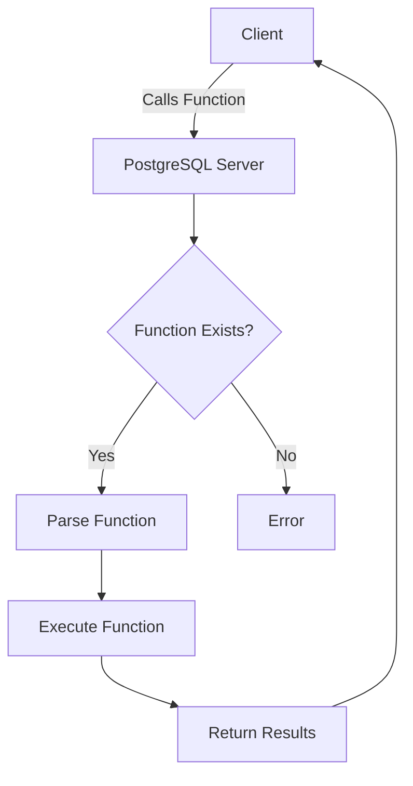

# PostgreSQL Function Basics

## Introduction

Functions in PostgreSQL allow you to encapsulate logic that can be reused across your database operations. They're like mini-programs that run within your database, accepting input parameters, performing operations, and returning results. PostgreSQL functions can be written in SQL, PL/pgSQL (PostgreSQL's procedural language), or other languages like Python, Perl, or JavaScript.

In this tutorial, we'll focus on the fundamentals of PostgreSQL functions, covering their syntax, how to create them, and practical examples that demonstrate their power.

## Why Use PostgreSQL Functions?

Before diving into the details, let's understand why functions are valuable:

- **Code Reusability**: Write logic once, use it multiple times
- **Abstraction**: Hide complex operations behind a simple interface
- **Maintainability**: Update logic in one place rather than throughout your codebase
- **Security**: Control access to underlying data while allowing operations on it
- **Performance**: Reduce network traffic by executing multiple operations server-side

## Function Syntax Basics

The basic syntax for creating a function in PostgreSQL is:

```sql
CREATE [OR REPLACE] FUNCTION function_name(parameter_list)
RETURNS return_type
AS $$
BEGIN
  -- function body
  RETURN value;
END;
$$ LANGUAGE plpgsql;
```

Let's break down each part:

- **CREATE [OR REPLACE] FUNCTION**: This statement creates a new function or replaces an existing one.
- **function_name**: The name of your function, following PostgreSQL's naming rules.
- **parameter_list**: Input parameters with their data types, e.g., `param1 INTEGER, param2 TEXT`.
- **RETURNS return_type**: The data type of the value the function will return.
- **AS $$ ... $$**: The function body enclosed in dollar-quoted string literals.
- **LANGUAGE plpgsql**: Specifies the language the function is written in.

## Creating Your First PostgreSQL Function

Let's start with a simple example:

```sql
CREATE OR REPLACE FUNCTION add_numbers(a INTEGER, b INTEGER)
RETURNS INTEGER
AS $$
BEGIN
  RETURN a + b;
END;
$$ LANGUAGE plpgsql;
```

This function takes two integers, adds them together, and returns the result.

To call this function:

```sql
SELECT add_numbers(5, 3);
```

Output:
```
 add_numbers
-------------
           8
```

## Functions with SQL-Only Syntax

For simple functions that just return the result of a SQL expression, you can use a more concise syntax:

```sql
CREATE OR REPLACE FUNCTION multiply_numbers(a INTEGER, b INTEGER)
RETURNS INTEGER
AS $$
  SELECT a * b;
$$ LANGUAGE sql;
```

Calling this function:

```sql
SELECT multiply_numbers(4, 5);
```

Output:
```
 multiply_numbers
------------------
               20
```

## Function Parameters

PostgreSQL functions support several parameter modes:

- **IN**: Input-only parameters (default)
- **OUT**: Output-only parameters
- **INOUT**: Both input and output parameters
- **VARIADIC**: Variable number of parameters

### Default Parameters

You can specify default values for parameters:

```sql
CREATE OR REPLACE FUNCTION greet(name TEXT DEFAULT 'Guest')
RETURNS TEXT
AS $$
BEGIN
  RETURN 'Hello, ' || name || '!';
END;
$$ LANGUAGE plpgsql;
```

Now you can call the function with or without a parameter:

```sql
SELECT greet('Alice');
SELECT greet();
```

Output:
```
    greet     
--------------
 Hello, Alice!

    greet    
-------------
 Hello, Guest!
```

### OUT Parameters

OUT parameters provide a way to return multiple values:

```sql
CREATE OR REPLACE FUNCTION get_rectangle_properties(
  width NUMERIC,
  height NUMERIC,
  OUT area NUMERIC,
  OUT perimeter NUMERIC
)
AS $$
BEGIN
  area := width * height;
  perimeter := 2 * (width + height);
END;
$$ LANGUAGE plpgsql;
```

When calling this function, you'll get a row with both values:

```sql
SELECT * FROM get_rectangle_properties(5.0, 3.0);
```

Output:
```
 area | perimeter
------+-----------
 15.0 |      16.0
```

## Return Types

PostgreSQL functions can return various types:

### Scalar Values

The examples above return scalar values (single values of a specific type).

### Composite Types (Records)

Functions can return composite types, including existing table rows:

```sql
CREATE OR REPLACE FUNCTION create_person(p_name TEXT, p_age INTEGER)
RETURNS record
AS $$
DECLARE
  person record;
BEGIN
  person := (p_name, p_age);
  RETURN person;
END;
$$ LANGUAGE plpgsql;
```

### Table Types (Sets of Rows)

Functions can return sets of rows using `RETURNS TABLE` or `RETURNS SETOF`:

```sql
CREATE OR REPLACE FUNCTION get_numbers(n INTEGER)
RETURNS TABLE(num INTEGER, square INTEGER, cube INTEGER)
AS $$
BEGIN
  FOR i IN 1..n LOOP
    num := i;
    square := i * i;
    cube := i * i * i;
    RETURN NEXT;
  END LOOP;
END;
$$ LANGUAGE plpgsql;
```

When calling this function, you'll get a table:

```sql
SELECT * FROM get_numbers(3);
```

Output:
```
 num | square | cube
-----+--------+------
   1 |      1 |    1
   2 |      4 |    8
   3 |      9 |   27
```

## Practical Examples

Let's look at some practical examples of PostgreSQL functions.

### Example 1: Age Calculator

This function calculates the age in years based on a birthdate:

```sql
CREATE OR REPLACE FUNCTION calculate_age(birthdate DATE)
RETURNS INTEGER
AS $$
BEGIN
  RETURN EXTRACT(YEAR FROM AGE(CURRENT_DATE, birthdate));
END;
$$ LANGUAGE plpgsql;
```

Usage:

```sql
SELECT calculate_age('1990-05-15');
```

Output (as of 2025):
```
 calculate_age
--------------
           35
```

### Example 2: Email Validator

This function validates an email address using a simple regex pattern:

```sql
CREATE OR REPLACE FUNCTION is_valid_email(email TEXT)
RETURNS BOOLEAN
AS $$
BEGIN
  RETURN email ~* '^[A-Za-z0-9._%+-]+@[A-Za-z0-9.-]+\.[A-Za-z]{2,}$';
END;
$$ LANGUAGE plpgsql;
```

Usage:

```sql
SELECT is_valid_email('user@example.com'), is_valid_email('invalid-email');
```

Output:
```
 is_valid_email | is_valid_email
----------------+----------------
 true           | false
```

### Example 3: Transaction Function

This function transfers money from one account to another within a transaction:

```sql
CREATE OR REPLACE FUNCTION transfer_money(
  sender_id INTEGER,
  receiver_id INTEGER,
  amount NUMERIC
)
RETURNS BOOLEAN
AS $$
DECLARE
  sender_balance NUMERIC;
BEGIN
  -- Check sender balance
  SELECT balance INTO sender_balance FROM accounts WHERE id = sender_id;
  
  IF sender_balance < amount THEN
    RAISE EXCEPTION 'Insufficient funds';
  END IF;
  
  -- Update sender account
  UPDATE accounts SET balance = balance - amount WHERE id = sender_id;
  
  -- Update receiver account
  UPDATE accounts SET balance = balance + amount WHERE id = receiver_id;
  
  RETURN TRUE;
EXCEPTION
  WHEN OTHERS THEN
    RAISE NOTICE 'Transaction failed: %', SQLERRM;
    RETURN FALSE;
END;
$$ LANGUAGE plpgsql;
```

This function demonstrates error handling and transactions in PostgreSQL.

## Function Organization

As your database grows, you might want to organize functions using schemas:

```sql
CREATE SCHEMA utils;

CREATE OR REPLACE FUNCTION utils.format_phone(phone TEXT)
RETURNS TEXT
AS $$
BEGIN
  RETURN REGEXP_REPLACE(phone, '(\d{3})(\d{3})(\d{4})', '(\1) \2-\3');
END;
$$ LANGUAGE plpgsql;
```

Call it with:

```sql
SELECT utils.format_phone('1234567890');
```

Output:
```
 format_phone
--------------
 (123) 456-7890
```

## Function Lifecycle

### Creating Functions

We've seen the `CREATE FUNCTION` syntax above. Remember that function names can be overloaded with different parameter types.

### Replacing Functions

Use `CREATE OR REPLACE FUNCTION` to update an existing function:

```sql
CREATE OR REPLACE FUNCTION add_numbers(a INTEGER, b INTEGER)
RETURNS INTEGER
AS $$
BEGIN
  -- Updated function body
  RETURN a + b + 0; -- No functional change, just demonstrating replacement
END;
$$ LANGUAGE plpgsql;
```

### Dropping Functions

To remove a function:

```sql
DROP FUNCTION [IF EXISTS] function_name(parameter_types);
```

For example:

```sql
DROP FUNCTION IF EXISTS add_numbers(INTEGER, INTEGER);
```

## Function Information

You can get information about your functions from the PostgreSQL catalog:

```sql
SELECT proname, prosrc 
FROM pg_proc 
WHERE proname = 'add_numbers';
```

Or use the `\df` command in `psql`:

```
\df add_numbers
```

## Function Flow Control

PL/pgSQL provides several flow control structures:

### Conditional Logic

```sql
CREATE OR REPLACE FUNCTION get_grade(score INTEGER)
RETURNS CHAR
AS $$
BEGIN
  IF score >= 90 THEN
    RETURN 'A';
  ELSIF score >= 80 THEN
    RETURN 'B';
  ELSIF score >= 70 THEN
    RETURN 'C';
  ELSIF score >= 60 THEN
    RETURN 'D';
  ELSE
    RETURN 'F';
  END IF;
END;
$$ LANGUAGE plpgsql;
```

### Loops

```sql
CREATE OR REPLACE FUNCTION factorial(n INTEGER)
RETURNS INTEGER
AS $$
DECLARE
  result INTEGER := 1;
BEGIN
  FOR i IN 1..n LOOP
    result := result * i;
  END LOOP;
  
  RETURN result;
END;
$$ LANGUAGE plpgsql;
```

## Common Mistakes and Best Practices

### Common Mistakes

1. **Forgetting to handle NULL values**: Always consider how your function behaves with NULL inputs.
2. **Not considering edge cases**: Test your functions with extreme values.
3. **Ignoring error handling**: Add proper exception handling for robust functions.

### Best Practices

1. **Add function comments**: Document what your function does, its parameters, and return values.
2. **Use schema for organization**: Group related functions in schemas.
3. **Test thoroughly**: Write test cases for your functions.
4. **Consider security**: Use `SECURITY DEFINER` carefully.
5. **Be aware of transaction context**: Understand how your function behaves within transactions.

## Function Performance Considerations

- **IMMUTABLE, STABLE, or VOLATILE**: Declare your function with the appropriate volatility for optimization.
- **Cost estimation**: You can provide a `COST` hint to the query planner.
- **Parallel safety**: Mark functions as `PARALLEL SAFE` when appropriate.

```sql
CREATE OR REPLACE FUNCTION square(n INTEGER)
RETURNS INTEGER
AS $$
  SELECT n * n;
$$ LANGUAGE sql IMMUTABLE;
```

## Function Diagram

Here's a visualization of the PostgreSQL function execution process:



## Summary

PostgreSQL functions are powerful tools for encapsulating logic and improving database performance and maintainability. In this tutorial, we've covered:

- Basic function syntax and creation
- Different types of parameters
- Various return types
- Practical examples
- Function organization and lifecycle
- Flow control within functions
- Best practices for function development

With this foundation, you're ready to start creating and using functions in your PostgreSQL databases.

## Additional Resources

- Practice by writing functions to solve specific problems in your database
- Experiment with more complex return types
- Learn about triggers, which use functions to respond to database events
- Explore other procedural languages supported by PostgreSQL

As you continue your PostgreSQL journey, functions will become an essential tool in your database development toolkit.