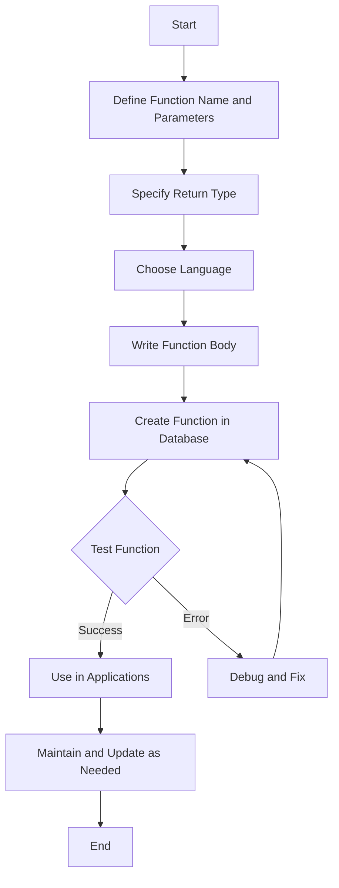

# PostgreSQL CREATE FUNCTION

## Introduction

Functions in PostgreSQL allow you to encapsulate reusable SQL code, making your database operations more modular, maintainable, and efficient. By defining your own functions, you can extend PostgreSQL's capabilities to suit your specific needs.

In this tutorial, we'll explore how to create custom functions in PostgreSQL, starting with basic syntax and progressing to more complex examples.

## Basic Syntax

The basic syntax for creating a function in PostgreSQL is:

```sql
CREATE [OR REPLACE] FUNCTION function_name(parameter_list)
RETURNS return_type
LANGUAGE language_name
AS $$
  -- function body
$$;
```

Let's break down the components:

- `CREATE [OR REPLACE] FUNCTION`: This statement creates a new function or replaces an existing one.
- `function_name`: The name you give to your function.
- `parameter_list`: Input parameters the function accepts (optional).
- `RETURNS return_type`: The data type that the function will return.
- `LANGUAGE language_name`: The language used to write the function body (commonly SQL, PL/pgSQL, or PL/Python).
- `AS $$ ... $$`: The function body enclosed in dollar-quoted string literals.

## Creating a Simple Function

Let's start with a simple example: a function that adds two numbers.

```sql
CREATE OR REPLACE FUNCTION add_numbers(a integer, b integer)
RETURNS integer
LANGUAGE SQL
AS $$
  SELECT a + b;
$$;
```

### Testing the Function

To call this function:

```sql
SELECT add_numbers(5, 3);
```

**Output:**
```
 add_numbers
-------------
           8
```

## Function Languages

PostgreSQL supports several programming languages for writing functions:

1. **SQL**: Simple, single-query functions.
2. **PL/pgSQL**: PostgreSQL's procedural language, similar to Oracle's PL/SQL.
3. **PL/Python**, **PL/Perl**, **PL/Tcl**: External programming languages (requires extension installation).

For most beginners, SQL and PL/pgSQL are the most accessible options.

## PL/pgSQL Functions

PL/pgSQL extends the SQL language with control structures like loops and conditionals. It's especially useful for more complex functions.

Here's the basic structure of a PL/pgSQL function:

```sql
CREATE OR REPLACE FUNCTION function_name(parameters)
RETURNS return_type
LANGUAGE plpgsql
AS $$
DECLARE
  -- variable declarations
BEGIN
  -- function body
  RETURN value;
END;
$$;
```

### Example: Calculate Discount

```sql
CREATE OR REPLACE FUNCTION calculate_discount(price numeric, discount_percent numeric)
RETURNS numeric
LANGUAGE plpgsql
AS $$
DECLARE
  discounted_price numeric;
BEGIN
  discounted_price := price - (price * discount_percent / 100);
  RETURN ROUND(discounted_price, 2);
END;
$$;
```

### Testing the Function

```sql
SELECT calculate_discount(100, 15);
```

**Output:**
```
 calculate_discount
-------------------
              85.00
```

## Function Parameters

PostgreSQL functions can have different types of parameters:

### IN Parameters (Default)

Input parameters that provide values to the function.

```sql
CREATE OR REPLACE FUNCTION greet_user(IN user_name text)
RETURNS text
LANGUAGE plpgsql
AS $$
BEGIN
  RETURN 'Hello, ' || user_name || '!';
END;
$$;
```

### OUT Parameters

Output parameters that return values from the function.

```sql
CREATE OR REPLACE FUNCTION get_circle_metrics(IN radius numeric, OUT area numeric, OUT circumference numeric)
RETURNS record
LANGUAGE plpgsql
AS $$
BEGIN
  area := PI() * radius * radius;
  circumference := 2 * PI() * radius;
END;
$$;
```

Testing:

```sql
SELECT * FROM get_circle_metrics(5);
```

**Output:**
```
      area      | circumference
----------------+---------------
 78.5398163397448 | 31.4159265358979
```

### INOUT Parameters

Parameters that serve as both input and output.

```sql
CREATE OR REPLACE FUNCTION double_value(INOUT x numeric)
RETURNS numeric
LANGUAGE plpgsql
AS $$
BEGIN
  x := x * 2;
END;
$$;
```

Testing:

```sql
SELECT double_value(10);
```

**Output:**
```
 double_value
-------------
          20
```

## Return Types

PostgreSQL functions can return various types:

### Scalar Values

A single value of a specific data type.

```sql
CREATE OR REPLACE FUNCTION get_current_year()
RETURNS integer
LANGUAGE SQL
AS $$
  SELECT EXTRACT(YEAR FROM CURRENT_DATE)::integer;
$$;
```

### Tables

A function can return a complete result set (table).

```sql
CREATE OR REPLACE FUNCTION get_products_by_category(category_name text)
RETURNS TABLE(product_id integer, product_name text, price numeric)
LANGUAGE SQL
AS $$
  SELECT product_id, product_name, price
  FROM products
  WHERE category = category_name;
$$;
```

To call this function:

```sql
SELECT * FROM get_products_by_category('Electronics');
```

### Set of Rows (SETOF)

A set of rows of a specific type.

```sql
CREATE OR REPLACE FUNCTION get_expensive_products(min_price numeric)
RETURNS SETOF products
LANGUAGE SQL
AS $$
  SELECT * FROM products WHERE price >= min_price;
$$;
```

## Practical Examples

Let's explore some practical examples of PostgreSQL functions:

### Example 1: Generate Full Name

```sql
CREATE OR REPLACE FUNCTION get_full_name(first_name text, last_name text)
RETURNS text
LANGUAGE plpgsql
AS $$
BEGIN
  RETURN COALESCE(first_name, '') || ' ' || COALESCE(last_name, '');
END;
$$;
```

Usage:

```sql
SELECT get_full_name('John', 'Doe');
```

**Output:**
```
 get_full_name
--------------
 John Doe
```

### Example 2: Age Calculator

```sql
CREATE OR REPLACE FUNCTION calculate_age(birth_date date)
RETURNS integer
LANGUAGE plpgsql
AS $$
BEGIN
  RETURN EXTRACT(YEAR FROM age(CURRENT_DATE, birth_date))::integer;
END;
$$;
```

Usage:

```sql
SELECT calculate_age('1990-05-15');
```

**Output:**
```
 calculate_age
--------------
           35
```

### Example 3: Email Validator

```sql
CREATE OR REPLACE FUNCTION is_valid_email(email text)
RETURNS boolean
LANGUAGE plpgsql
AS $$
BEGIN
  RETURN email ~* '^[A-Za-z0-9._%-]+@[A-Za-z0-9.-]+\.[A-Za-z]{2,4}$';
END;
$$;
```

Usage:

```sql
SELECT is_valid_email('user@example.com');
```

**Output:**
```
 is_valid_email
---------------
 true
```

### Example 4: Inventory Management

```sql
CREATE OR REPLACE FUNCTION update_inventory(product_id_param integer, quantity_change integer)
RETURNS text
LANGUAGE plpgsql
AS $$
DECLARE
  current_stock integer;
  new_stock integer;
BEGIN
  -- Get current stock
  SELECT stock INTO current_stock
  FROM inventory
  WHERE product_id = product_id_param;
  
  IF NOT FOUND THEN
    RETURN 'Product not found';
  END IF;
  
  -- Calculate new stock
  new_stock := current_stock + quantity_change;
  
  -- Ensure stock doesn't go negative
  IF new_stock < 0 THEN
    RETURN 'Insufficient stock';
  END IF;
  
  -- Update inventory
  UPDATE inventory
  SET stock = new_stock
  WHERE product_id = product_id_param;
  
  RETURN 'Stock updated. New stock: ' || new_stock;
END;
$$;
```

## Function Behavior Options

PostgreSQL offers various function behavior options:

### IMMUTABLE

Functions that always return the same result given the same arguments.

```sql
CREATE OR REPLACE FUNCTION square(x numeric)
RETURNS numeric
LANGUAGE SQL
IMMUTABLE
AS $$
  SELECT x * x;
$$;
```

### STABLE

Functions that don't modify the database and return the same result for the same arguments within a single scan.

```sql
CREATE OR REPLACE FUNCTION get_current_hour()
RETURNS integer
LANGUAGE SQL
STABLE
AS $$
  SELECT EXTRACT(HOUR FROM CURRENT_TIME)::integer;
$$;
```

### VOLATILE (Default)

Functions that can modify the database or depend on factors beyond their arguments.

```sql
CREATE OR REPLACE FUNCTION insert_log_entry(log_message text)
RETURNS void
LANGUAGE SQL
VOLATILE
AS $$
  INSERT INTO logs (message, created_at)
  VALUES (log_message, NOW());
$$;
```

## Using Control Structures in PL/pgSQL

PL/pgSQL provides control structures for more complex logic:

### IF Statement

```sql
CREATE OR REPLACE FUNCTION get_temperature_status(temp numeric)
RETURNS text
LANGUAGE plpgsql
AS $$
BEGIN
  IF temp < 0 THEN
    RETURN 'Freezing';
  ELSIF temp < 15 THEN
    RETURN 'Cold';
  ELSIF temp < 25 THEN
    RETURN 'Moderate';
  ELSE
    RETURN 'Hot';
  END IF;
END;
$$;
```

### CASE Statement

```sql
CREATE OR REPLACE FUNCTION get_grade(score integer)
RETURNS char
LANGUAGE plpgsql
AS $$
BEGIN
  RETURN CASE
    WHEN score >= 90 THEN 'A'
    WHEN score >= 80 THEN 'B'
    WHEN score >= 70 THEN 'C'
    WHEN score >= 60 THEN 'D'
    ELSE 'F'
  END;
END;
$$;
```

### Loop Structures

```sql
CREATE OR REPLACE FUNCTION generate_fibonacci(n integer)
RETURNS TABLE(position integer, value bigint)
LANGUAGE plpgsql
AS $$
DECLARE
  i integer := 3;
  fib1 bigint := 0;
  fib2 bigint := 1;
  fib3 bigint;
BEGIN
  IF n >= 1 THEN
    position := 1;
    value := fib1;
    RETURN NEXT;
  END IF;
  
  IF n >= 2 THEN
    position := 2;
    value := fib2;
    RETURN NEXT;
  END IF;
  
  WHILE i <= n LOOP
    fib3 := fib1 + fib2;
    position := i;
    value := fib3;
    RETURN NEXT;
    
    fib1 := fib2;
    fib2 := fib3;
    i := i + 1;
  END LOOP;
  
  RETURN;
END;
$$;
```

## Function Management

### Dropping a Function

```sql
DROP FUNCTION IF EXISTS function_name(parameter_types);
```

### Listing All Functions

```sql
SELECT routine_name, routine_type
FROM information_schema.routines
WHERE routine_type = 'FUNCTION'
AND routine_schema = 'public';
```

### Viewing Function Definition

```sql
SELECT pg_get_functiondef(oid)
FROM pg_proc
WHERE proname = 'function_name';
```

## Function Flowchart

Here's a flowchart that illustrates the process of creating and executing a PostgreSQL function:



## Summary

PostgreSQL functions are powerful tools that allow you to encapsulate logic within your database. They can enhance performance by reducing network traffic, ensure data integrity by centralizing business rules, and improve maintainability by promoting code reuse.

In this tutorial, we've covered:
- Basic function syntax and creation
- Different function languages (SQL and PL/pgSQL)
- Parameter types (IN, OUT, INOUT)
- Return types (scalar, table, set)
- Function behavior options (IMMUTABLE, STABLE, VOLATILE)
- Control structures for complex logic
- Function management tasks

By mastering PostgreSQL functions, you'll be able to write more efficient and maintainable database code.

## Exercises

1. Create a function that calculates the average of three numbers.
2. Write a function that converts temperatures between Celsius and Fahrenheit.
3. Develop a function that returns the list of even numbers up to a given limit.
4. Create a function that validates a phone number format.
5. Write a function that calculates the total price of items in a shopping cart, including tax and discount.

## Additional Resources

- [PostgreSQL Official Documentation on Functions](https://www.postgresql.org/docs/current/sql-createfunction.html)
- [PL/pgSQL Control Structures](https://www.postgresql.org/docs/current/plpgsql-control-structures.html)
- [PostgreSQL Procedural Languages](https://www.postgresql.org/docs/current/xplang.html)