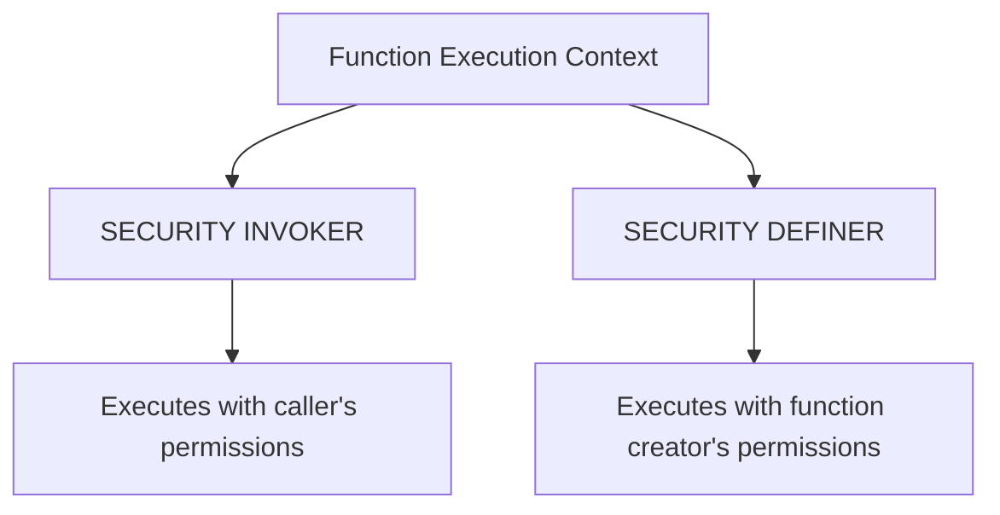

# PostgreSQL Function Performance

## Introduction

PostgreSQL functions are powerful tools that allow you to encapsulate complex logic within your database. However, like any powerful tool, they come with performance considerations. This guide will help you understand how PostgreSQL functions perform, what factors affect their performance, and how to optimize them for better efficiency.

Whether you're building a small application or scaling a large system, understanding function performance is crucial for maintaining responsive database operations. We'll explore various techniques to measure, analyze, and improve your PostgreSQL function performance.

## Understanding PostgreSQL Function Types

Before diving into performance optimization, let's understand the different types of PostgreSQL functions and how they impact performance:

### SQL Functions vs. Procedural Functions

PostgreSQL supports two main categories of functions:

1. **SQL Functions** - Written in standard SQL
2. **Procedural Functions** - Written in procedural languages like PL/pgSQL, PL/Python, etc.

```sql
-- SQL Function example
CREATE OR REPLACE FUNCTION get_product_count() 
RETURNS INTEGER AS $$
    SELECT COUNT(*) FROM products;
$$ LANGUAGE SQL;

-- PL/pgSQL Function example
CREATE OR REPLACE FUNCTION get_discounted_price(price NUMERIC, discount_percent INTEGER)
RETURNS NUMERIC AS $$
BEGIN
    RETURN price - (price * discount_percent / 100);
END;
$$ LANGUAGE plpgsql;
```

**Performance Impact:**
- SQL functions are generally faster for simple operations
- Procedural functions offer more flexibility but can introduce overhead

## Function Volatility Categories

PostgreSQL classifies functions into three volatility categories:

1. **IMMUTABLE** - Always returns the same result for the same input
2. **STABLE** - Returns the same result for the same input within a single table scan
3. **VOLATILE** - Default category; can return different results on each call

```sql
-- IMMUTABLE function example
CREATE OR REPLACE FUNCTION add_numbers(a INTEGER, b INTEGER) 
RETURNS INTEGER AS $$
    SELECT a + b;
$$ LANGUAGE SQL IMMUTABLE;

-- STABLE function example
CREATE OR REPLACE FUNCTION get_current_user_email() 
RETURNS TEXT AS $$
    SELECT email FROM users WHERE id = current_user_id();
$$ LANGUAGE SQL STABLE;

-- VOLATILE function example
CREATE OR REPLACE FUNCTION get_random_number() 
RETURNS INTEGER AS $$
    SELECT floor(random() * 100)::INTEGER;
$$ LANGUAGE SQL VOLATILE;
```

**Performance Impact:**
- The planner can optimize IMMUTABLE and STABLE functions more aggressively
- VOLATILE functions must be evaluated for every row and cannot be optimized as effectively

## Key Performance Factors

### 1. Function Execution Context

PostgreSQL functions execute in one of two contexts:



**Performance Impact:**
- SECURITY DEFINER can be faster in certain scenarios but has security implications
- SECURITY INVOKER may require additional permission checks

### 2. Function Call Overhead

Each function call in PostgreSQL introduces some overhead:

```sql
-- This query makes one function call
SELECT count_active_users();

-- This query doesn't use a function call
SELECT COUNT(*) FROM users WHERE status = 'active';
```

**Performance Impact:**
- Function call overhead becomes significant when called repeatedly in large queries
- Inlining functions can help reduce this overhead

### 3. Data Transfer Overhead

When functions process large datasets, data transfer becomes a concern:

```sql
-- Processes data within the database
CREATE OR REPLACE FUNCTION sum_large_table() 
RETURNS BIGINT AS $$
    SELECT SUM(value) FROM large_table;
$$ LANGUAGE SQL;

-- vs. fetching all data and processing in application
-- (pseudocode for illustration)
-- app_code: rows = fetch_all("SELECT value FROM large_table"); sum(rows);
```

**Performance Impact:**
- Moving data between the database and application layer is costly
- Processing data within database functions can be much faster for large datasets

## Measuring Function Performance

### Using EXPLAIN ANALYZE

The `EXPLAIN ANALYZE` command is your best friend for measuring function performance:

```sql
EXPLAIN ANALYZE SELECT my_function(column1) FROM my_table;
```

Example output:

```
                                                  QUERY PLAN
------------------------------------------------------------------------------------------------------
 Seq Scan on my_table  (cost=0.00..20.70 rows=1070 width=4) (actual time=0.019..0.144 rows=1000 loops=1)
   Output: my_function(column1)
 Planning Time: 0.083 ms
 Execution Time: 0.215 ms
```

### Benchmarking with pgbench

For more comprehensive testing, use `pgbench`:

```bash
pgbench -c 10 -t 1000 -f my_function_test.sql mydatabase
```

Where `my_function_test.sql` could contain:

```sql
\set id random(1, 10000)
SELECT my_function(:id);
```

## Performance Optimization Techniques

### 1. Use the Right Volatility Category

Always specify the most restrictive volatility category possible:

```sql
-- Before optimization
CREATE FUNCTION calculate_tax(price NUMERIC) 
RETURNS NUMERIC AS $$
    RETURN price * 0.08;
$$ LANGUAGE plpgsql;

-- After optimization
CREATE FUNCTION calculate_tax(price NUMERIC) 
RETURNS NUMERIC AS $$
    RETURN price * 0.08;
$$ LANGUAGE plpgsql IMMUTABLE;
```

### 2. Use SQL Functions When Possible

For simple operations, SQL functions typically outperform procedural ones:

```sql
-- Slower PL/pgSQL version
CREATE FUNCTION get_total_sales_plpgsql() 
RETURNS NUMERIC AS $$
BEGIN
    RETURN (SELECT SUM(amount) FROM sales);
END;
$$ LANGUAGE plpgsql;

-- Faster SQL version
CREATE FUNCTION get_total_sales_sql() 
RETURNS NUMERIC AS $$
    SELECT SUM(amount) FROM sales;
$$ LANGUAGE SQL;
```

### 3. Minimize Function Calls in Loops

Reduce the number of function calls, especially in loops:

```sql
-- Inefficient approach
CREATE FUNCTION process_all_users() RETURNS VOID AS $$
DECLARE
    user_record RECORD;
BEGIN
    FOR user_record IN SELECT * FROM users LOOP
        PERFORM calculate_user_stats(user_record.id); -- Called for each user
    END LOOP;
END;
$$ LANGUAGE plpgsql;

-- More efficient approach
CREATE FUNCTION process_all_users_efficient() RETURNS VOID AS $$
BEGIN
    -- Process all users in a single operation
    UPDATE user_stats us
    SET 
        total_orders = s.order_count,
        total_spent = s.total_amount
    FROM (
        SELECT 
            user_id, 
            COUNT(*) as order_count,
            SUM(amount) as total_amount
        FROM orders
        GROUP BY user_id
    ) s
    WHERE us.user_id = s.user_id;
END;
$$ LANGUAGE plpgsql;
```

### 4. Use SET RETURNING FUNCTIONS

For returning multiple rows, use set-returning functions:

```sql
-- Inefficient approach with multiple function calls
SELECT get_product_info(id) FROM product_ids;

-- More efficient set-returning function
CREATE FUNCTION get_all_product_info(product_ids INTEGER[])
RETURNS TABLE (
    id INTEGER,
    name TEXT,
    price NUMERIC
) AS $$
    SELECT p.id, p.name, p.price
    FROM products p
    WHERE p.id = ANY(product_ids);
$$ LANGUAGE SQL;

-- Usage
SELECT * FROM get_all_product_info(ARRAY[1, 2, 3, 4, 5]);
```

### 5. Consider Function Inlining

Inline functions can eliminate call overhead:

```sql
-- Function that's a candidate for inlining
CREATE OR REPLACE FUNCTION get_price_with_tax(price NUMERIC)
RETURNS NUMERIC AS $$
    SELECT price * 1.08;
$$ LANGUAGE SQL IMMUTABLE;

-- PostgreSQL might inline this function when used in queries
SELECT id, name, get_price_with_tax(price) 
FROM products;
```

PostgreSQL can automatically inline simple SQL functions, but not procedural ones.

### 6. Use Caching Techniques

For expensive calculations that are called frequently:

```sql
-- Function with internal caching
CREATE OR REPLACE FUNCTION get_cached_exchange_rate(
    from_currency TEXT,
    to_currency TEXT
) RETURNS NUMERIC AS $$
DECLARE
    cached_rate NUMERIC;
    cached_time TIMESTAMP;
    current_rate NUMERIC;
BEGIN
    -- Check if we have a cached value less than 1 hour old
    SELECT rate, updated_at INTO cached_rate, cached_time
    FROM exchange_rate_cache
    WHERE source = from_currency AND target = to_currency
    ORDER BY updated_at DESC
    LIMIT 1;
    
    IF cached_time IS NULL OR cached_time < NOW() - INTERVAL '1 hour' THEN
        -- Cache miss or stale data - fetch new rate (simplified)
        SELECT rate INTO current_rate
        FROM fetch_current_exchange_rate(from_currency, to_currency);
        
        -- Update cache
        INSERT INTO exchange_rate_cache(source, target, rate, updated_at)
        VALUES (from_currency, to_currency, current_rate, NOW());
        
        RETURN current_rate;
    ELSE
        -- Cache hit
        RETURN cached_rate;
    END IF;
END;
$$ LANGUAGE plpgsql;
```

## Real-World Example: Optimizing an Order Processing Function

Let's walk through optimizing a real-world example:

### Original Version

```sql
-- Original inefficient function
CREATE OR REPLACE FUNCTION process_order(order_id INTEGER) 
RETURNS BOOLEAN AS $$
DECLARE
    order_total NUMERIC;
    product_record RECORD;
    inventory_count INTEGER;
BEGIN
    -- Calculate order total
    SELECT SUM(p.price * oi.quantity) INTO order_total
    FROM order_items oi
    JOIN products p ON p.id = oi.product_id
    WHERE oi.order_id = process_order.order_id;
    
    -- Update order total
    UPDATE orders SET total_amount = order_total WHERE id = order_id;
    
    -- Process each order item individually
    FOR product_record IN 
        SELECT oi.product_id, oi.quantity 
        FROM order_items oi 
        WHERE oi.order_id = process_order.order_id
    LOOP
        -- Check inventory for each product
        SELECT stock_count INTO inventory_count 
        FROM inventory 
        WHERE product_id = product_record.product_id;
        
        IF inventory_count < product_record.quantity THEN
            RETURN FALSE; -- Not enough inventory
        END IF;
        
        -- Update inventory
        UPDATE inventory 
        SET stock_count = stock_count - product_record.quantity
        WHERE product_id = product_record.product_id;
    END LOOP;
    
    -- Mark order as processed
    UPDATE orders SET status = 'processed' WHERE id = order_id;
    RETURN TRUE;
END;
$$ LANGUAGE plpgsql;
```

### Optimized Version

```sql
-- Optimized function
CREATE OR REPLACE FUNCTION process_order_optimized(order_id INTEGER) 
RETURNS BOOLEAN AS $$
DECLARE
    insufficient_inventory BOOLEAN;
BEGIN
    -- Update order total in a single operation
    UPDATE orders o
    SET total_amount = subquery.order_total
    FROM (
        SELECT SUM(p.price * oi.quantity) AS order_total
        FROM order_items oi
        JOIN products p ON p.id = oi.product_id
        WHERE oi.order_id = process_order_optimized.order_id
    ) AS subquery
    WHERE o.id = process_order_optimized.order_id;
    
    -- Check inventory for all products at once
    SELECT EXISTS (
        SELECT 1
        FROM order_items oi
        JOIN inventory inv ON inv.product_id = oi.product_id
        WHERE oi.order_id = process_order_optimized.order_id
        AND inv.stock_count < oi.quantity
    ) INTO insufficient_inventory;
    
    IF insufficient_inventory THEN
        RETURN FALSE;
    END IF;
    
    -- Update all inventory records at once
    UPDATE inventory inv
    SET stock_count = inv.stock_count - oi.quantity
    FROM order_items oi
    WHERE inv.product_id = oi.product_id
    AND oi.order_id = process_order_optimized.order_id;
    
    -- Mark order as processed
    UPDATE orders SET status = 'processed' WHERE id = order_id;
    RETURN TRUE;
END;
$$ LANGUAGE plpgsql;
```

**Performance Improvements:**
1. Reduced number of database round-trips
2. Eliminated loops by using set-based operations
3. Combined multiple operations into single SQL statements

## Common Pitfalls to Avoid

1. **Excessive Logging**: Debug logging is useful but can severely impact performance
2. **Row-by-Row Processing**: Avoid processing rows individually when set-based operations are possible
3. **Function Call Chains**: Be cautious with functions that call other functions
4. **Unnecessary Type Conversions**: Type conversions add overhead
5. **Not Using Indexes**: Ensure functions utilize indexed columns for lookups

## Summary

PostgreSQL functions are essential tools for database development, but they require careful consideration for optimal performance. The key takeaways include:

1. Choose the appropriate function type and volatility category
2. Minimize function call overhead, especially in loops
3. Process data sets, not individual rows
4. Use EXPLAIN ANALYZE to identify performance bottlenecks
5. Consider the execution context and security implications
6. Use caching for expensive operations
7. Take advantage of PostgreSQL's optimizer by providing accurate function metadata

By following these best practices, you can ensure your PostgreSQL functions deliver both the functionality you need and the performance your applications require.

## Additional Resources

- [PostgreSQL Official Documentation on Functions](https://www.postgresql.org/docs/current/xfunc.html)
- [PostgreSQL Performance Optimization](https://www.postgresql.org/docs/current/performance-tips.html)
- [PL/pgSQL Development Best Practices](https://www.postgresql.org/docs/current/plpgsql-implementation.html)

## Exercises

1. Take an existing function from your project and analyze its performance using EXPLAIN ANALYZE.
2. Convert a PL/pgSQL function to an SQL function and compare the performance.
3. Identify a function that processes rows in a loop and refactor it to use set-based operations.
4. Create a function with appropriate volatility marking and test how it affects query planning.
5. Implement a caching mechanism for an expensive function and measure the performance improvement.