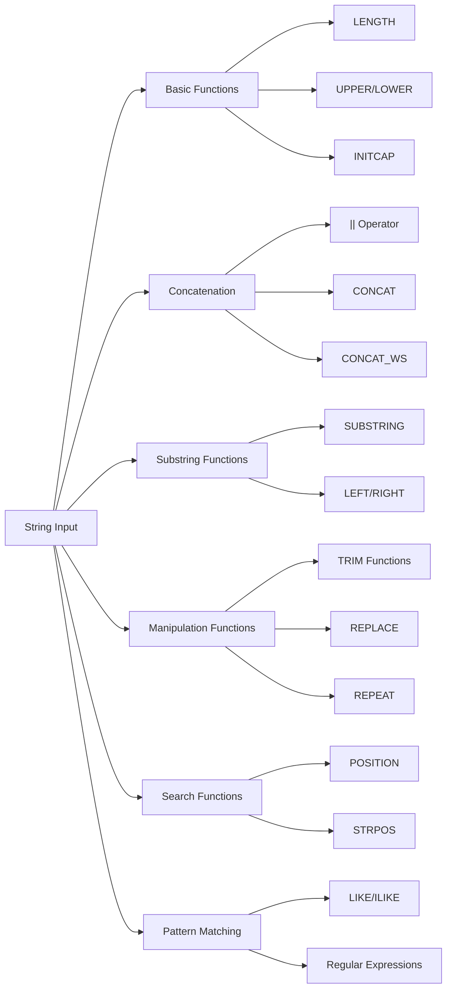

# PostgreSQL String Functions

## Introduction

Working with text data is a common requirement in database applications. PostgreSQL provides a rich set of string functions that allow you to manipulate, transform, and analyze text data efficiently. These functions can help you with tasks like formatting output, cleaning data, searching for patterns, and extracting specific portions of text.

In this tutorial, we'll explore the most useful PostgreSQL string functions with practical examples that will help you handle text data like a pro.

## Basic String Functions

Let's start with some fundamental string manipulation functions that you'll use frequently.

### LENGTH

The `LENGTH` function returns the number of characters in a string.

```sql
SELECT LENGTH('Hello, PostgreSQL!');
```

**Output:**
```
 length
--------
     18
```

### UPPER and LOWER

These functions convert strings to uppercase or lowercase.

```sql
SELECT 
  UPPER('Hello, PostgreSQL!') as uppercase,
  LOWER('Hello, PostgreSQL!') as lowercase;
```

**Output:**
```
      uppercase      |      lowercase
---------------------+---------------------
 HELLO, POSTGRESQL!  | hello, postgresql!
```

### INITCAP

The `INITCAP` function converts the first letter of each word to uppercase and the rest to lowercase.

```sql
SELECT INITCAP('hello WORLD');
```

**Output:**
```
  initcap
-----------
 Hello World
```

## String Concatenation

### Concatenation Operator (||)

PostgreSQL uses the `||` operator to concatenate strings.

```sql
SELECT 'Hello' || ' ' || 'World' as greeting;
```

**Output:**
```
  greeting
-------------
 Hello World
```

### CONCAT and CONCAT_WS

The `CONCAT` function joins multiple strings together, while `CONCAT_WS` (concatenate with separator) joins strings with a specified separator.

```sql
SELECT 
  CONCAT('Hello', ' ', 'World') as concat_result,
  CONCAT_WS('-', 'PostgreSQL', 'String', 'Functions') as concat_ws_result;
```

**Output:**
```
 concat_result |    concat_ws_result
---------------+------------------------
 Hello World   | PostgreSQL-String-Functions
```

## Substring Functions

### SUBSTRING

Extract a portion of a string with the `SUBSTRING` function.

```sql
-- Syntax: SUBSTRING(string FROM start FOR length)
SELECT SUBSTRING('PostgreSQL' FROM 1 FOR 4);
```

**Output:**
```
 substring
-----------
 Post
```

You can also use a simpler syntax:

```sql
-- Syntax: SUBSTRING(string, start, length)
SELECT SUBSTRING('PostgreSQL', 1, 4);
```

**Output:**
```
 substring
-----------
 Post
```

### LEFT and RIGHT

Extract characters from the beginning or end of a string.

```sql
SELECT 
  LEFT('PostgreSQL', 5) as left_result,
  RIGHT('PostgreSQL', 3) as right_result;
```

**Output:**
```
 left_result | right_result
-------------+--------------
 Postg       | SQL
```

## String Manipulation

### TRIM, LTRIM, RTRIM

Remove characters (spaces by default) from both ends, left side, or right side of a string.

```sql
SELECT 
  TRIM('  PostgreSQL  ') as trim_result,
  LTRIM('  PostgreSQL  ') as ltrim_result,
  RTRIM('  PostgreSQL  ') as rtrim_result;
```

**Output:**
```
 trim_result | ltrim_result  | rtrim_result
-------------+---------------+--------------
 PostgreSQL  | PostgreSQL    |   PostgreSQL
```

You can also specify which characters to trim:

```sql
SELECT TRIM(BOTH 'x' FROM 'xxxPostgreSQLxxx');
```

**Output:**
```
 trim
-----------
 PostgreSQL
```

### REPLACE

Replace all occurrences of a substring within a string.

```sql
SELECT REPLACE('PostgreSQL is great', 'great', 'awesome');
```

**Output:**
```
        replace
------------------------
 PostgreSQL is awesome
```

### REPEAT

Repeat a string a specified number of times.

```sql
SELECT REPEAT('SQL ', 3);
```

**Output:**
```
    repeat
---------------
 SQL SQL SQL
```

## String Search Functions

### POSITION

Find the position of a substring within a string.

```sql
SELECT POSITION('SQL' IN 'PostgreSQL');
```

**Output:**
```
 position
----------
        9
```

### STRPOS

An alternative to `POSITION` with a different syntax.

```sql
SELECT STRPOS('PostgreSQL', 'SQL');
```

**Output:**
```
 strpos
--------
      9
```

## Pattern Matching

### LIKE and ILIKE

The `LIKE` operator performs pattern matching with wildcards:
- `%` matches any sequence of characters
- `_` matches any single character

```sql
SELECT 
  'PostgreSQL' LIKE 'Post%' as starts_with_post,
  'PostgreSQL' LIKE '%SQL' as ends_with_sql,
  'PostgreSQL' LIKE '%gre%' as contains_gre;
```

**Output:**
```
 starts_with_post | ends_with_sql | contains_gre
------------------+---------------+--------------
 true             | true          | true
```

`ILIKE` performs case-insensitive pattern matching:

```sql
SELECT 'PostgreSQL' ILIKE 'post%';
```

**Output:**
```
 ?column?
----------
 true
```

### Regular Expressions

PostgreSQL supports powerful regular expression matching with the `~`, `~*`, `!~`, and `!~*` operators.

```sql
-- Case-sensitive regex match
SELECT 'PostgreSQL' ~ 'SQL$' as regex_match;

-- Case-insensitive regex match
SELECT 'PostgreSQL' ~* 'sql$' as regex_match_insensitive;
```

**Output:**
```
 regex_match
-------------
 true

 regex_match_insensitive
-------------------------
 true
```

## Advanced String Functions

### REGEXP_REPLACE

Replace text that matches a regular expression pattern.

```sql
SELECT REGEXP_REPLACE('PostgreSQL 12', '[0-9]+', 'VERSION', 'g');
```

**Output:**
```
    regexp_replace
-----------------------
 PostgreSQL VERSION
```

### REGEXP_MATCHES

Extract substrings that match a regular expression pattern.

```sql
SELECT REGEXP_MATCHES('Email: user@example.com', '[a-zA-Z0-9._%+-]+@[a-zA-Z0-9.-]+\.[a-zA-Z]{2,}');
```

**Output:**
```
    regexp_matches
-----------------------
 {user@example.com}
```

### REGEXP_SPLIT_TO_TABLE

Split a string into rows using a regular expression as the delimiter.

```sql
SELECT REGEXP_SPLIT_TO_TABLE('apple,banana;orange', '[,;]');
```

**Output:**
```
 regexp_split_to_table
-----------------------
 apple
 banana
 orange
```

## Practical Examples

### Example 1: Formatting Names

Let's say you have a table with customer names in inconsistent formats and you want to standardize them.

```sql
CREATE TEMP TABLE customers (
  id SERIAL PRIMARY KEY,
  full_name VARCHAR(100)
);

INSERT INTO customers (full_name) VALUES
  ('john doe'),
  ('JANE SMITH'),
  ('  robert brown  '),
  ('Maria GARCIA');

SELECT 
  id,
  full_name as original_name,
  INITCAP(TRIM(full_name)) as formatted_name
FROM customers;
```

**Output:**
```
 id | original_name  |  formatted_name
----+----------------+------------------
  1 | john doe       | John Doe
  2 | JANE SMITH     | Jane Smith
  3 |   robert brown | Robert Brown
  4 | Maria GARCIA   | Maria Garcia
```

### Example 2: Extracting Information from Email Addresses

Suppose you need to extract the domain name from email addresses:

```sql
CREATE TEMP TABLE users (
  id SERIAL PRIMARY KEY,
  email VARCHAR(100)
);

INSERT INTO users (email) VALUES
  ('user1@example.com'),
  ('contact@postgresql.org'),
  ('support@mycompany.co.uk');

SELECT 
  email,
  SUBSTRING(email FROM POSITION('@' IN email) + 1) as domain
FROM users;
```

**Output:**
```
        email        |      domain
---------------------+------------------
 user1@example.com   | example.com
 contact@postgresql.org | postgresql.org
 support@mycompany.co.uk | mycompany.co.uk
```

### Example 3: Cleaning and Standardizing Phone Numbers

```sql
CREATE TEMP TABLE contacts (
  id SERIAL PRIMARY KEY,
  phone VARCHAR(50)
);

INSERT INTO contacts (phone) VALUES
  ('(555) 123-4567'),
  ('555.987.6543'),
  ('555-789-0123'),
  ('5551234567');

SELECT 
  phone as original_phone,
  REGEXP_REPLACE(phone, '[^0-9]', '', 'g') as cleaned_phone
FROM contacts;
```

**Output:**
```
 original_phone  | cleaned_phone
-----------------+---------------
 (555) 123-4567  | 5551234567
 555.987.6543    | 5559876543
 555-789-0123    | 5557890123
 5551234567      | 5551234567
```

## String Function Performance Tips

When working with string functions in PostgreSQL, keep these performance considerations in mind:

1. **Indexing**: Standard B-tree indexes don't work well for `LIKE` expressions with wildcards at the beginning (e.g., `%SQL`). Consider using trigram indexes with the `pg_trgm` extension for these cases.

2. **Large Text Fields**: Be cautious when applying string functions to large text fields, as this can impact performance.

3. **Collation**: String operations depend on the collation (sorting rules) of your database. Be aware of this when working with multilingual data.



## Summary

PostgreSQL provides a comprehensive set of string functions that enable you to manipulate and work with text data efficiently. In this tutorial, we've covered:

- Basic string functions like `LENGTH`, `UPPER`, `LOWER`, and `INITCAP`
- String concatenation using the `||` operator, `CONCAT`, and `CONCAT_WS`
- Substring extraction using `SUBSTRING`, `LEFT`, and `RIGHT`
- String manipulation with `TRIM`, `REPLACE`, and `REPEAT`
- String searching with `POSITION` and `STRPOS`
- Pattern matching using `LIKE`, `ILIKE`, and regular expressions
- Advanced string functions with regular expressions
- Practical examples showing real-world applications

By mastering these string functions, you'll be well-equipped to handle text data processing tasks in your PostgreSQL database applications.

## Exercises

1. Create a query that extracts the username from email addresses (the part before the @ symbol).
2. Write a query that masks credit card numbers so that only the last 4 digits are visible (e.g., "XXXX-XXXX-XXXX-1234").
3. Create a function that converts snake_case identifiers to camelCase.
4. Write a query that identifies palindromes (words that read the same backward as forward).
5. Create a query that generates a slug from a title (e.g., "PostgreSQL String Functions" → "postgresql-string-functions").