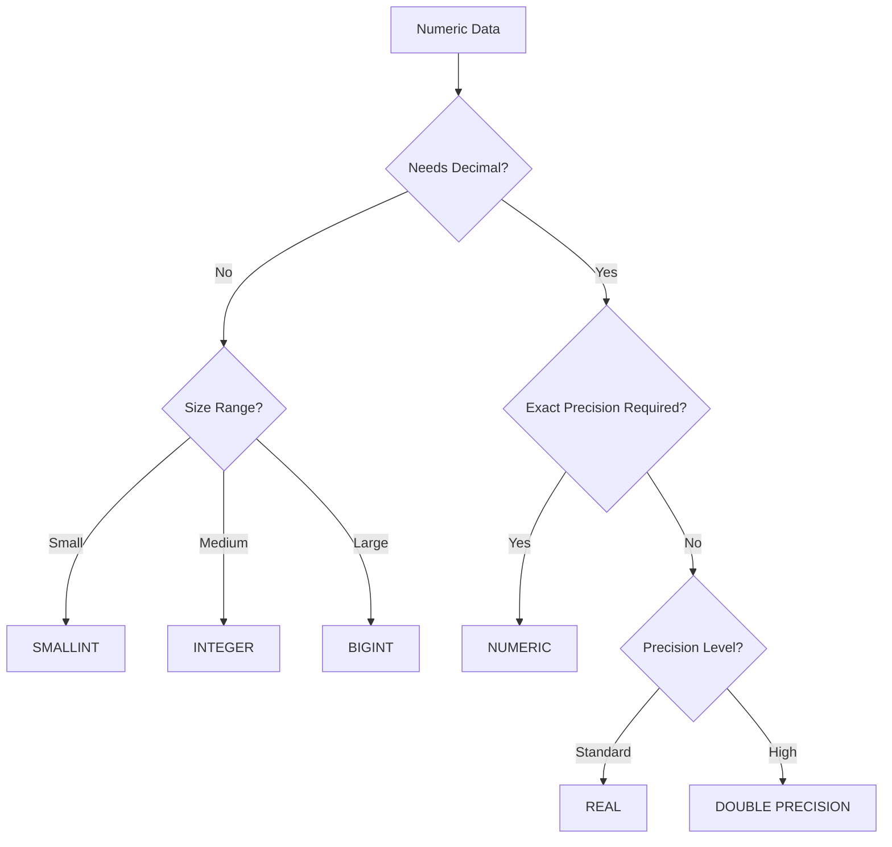

# PostgreSQL Numeric Functions

## Introduction

PostgreSQL provides a rich set of numeric functions that allow you to perform various mathematical operations on numeric data in your database. These functions are essential tools for data manipulation, statistical analysis, and mathematical computations directly within your database queries.

In this guide, we'll explore the most commonly used numeric functions in PostgreSQL, understand their syntax, and see practical examples of how they can be applied in real-world scenarios.

## Basic Mathematical Functions

PostgreSQL offers standard mathematical functions that perform fundamental arithmetic operations on numeric values.

### Absolute Value Function

The `ABS()` function returns the absolute value of a number.

```sql
SELECT ABS(-15.7);
```

Output:
```
 abs
-----
 15.7
```

### Rounding Functions

PostgreSQL provides several rounding functions to handle decimal precision:

#### ROUND()

The `ROUND()` function rounds a number to the specified decimal places.

```sql
-- Round to nearest integer
SELECT ROUND(42.4);

-- Round to 2 decimal places
SELECT ROUND(42.4382, 2);
```

Output:
```
 round
-------
    42

 round
-------
  42.44
```

#### CEIL() and FLOOR()

These functions round up or down to the nearest integer.

```sql
-- Round up to the nearest integer
SELECT CEIL(42.1);

-- Round down to the nearest integer
SELECT FLOOR(42.9);
```

Output:
```
 ceil
------
   43

 floor
-------
    42
```

#### TRUNC()

The `TRUNC()` function truncates a number to a specified number of decimal places without rounding.

```sql
SELECT TRUNC(42.8);
SELECT TRUNC(42.8382, 2);
```

Output:
```
 trunc
-------
    42

 trunc
-------
  42.83
```

## Trigonometric Functions

PostgreSQL supports various trigonometric functions for angular calculations.

```sql
-- Sine function (input in radians)
SELECT SIN(0.5);

-- Cosine function
SELECT COS(0.5);

-- Tangent function
SELECT TAN(0.5);
```

Output:
```
        sin         
--------------------
 0.4794255386042030

        cos         
--------------------
 0.8775825618903728

        tan         
--------------------
 0.5463024898437905
```

For calculations using degrees instead of radians, you can convert between them:

```sql
-- Convert degrees to radians
SELECT RADIANS(45);

-- Convert radians to degrees
SELECT DEGREES(1);
```

Output:
```
      radians       
--------------------
 0.7853981633974483

      degrees       
--------------------
 57.2957795130823209
```

## Logarithmic and Exponential Functions

PostgreSQL provides functions for logarithmic and exponential calculations.

### Logarithmic Functions

```sql
-- Natural logarithm (base e)
SELECT LN(100);

-- Base 10 logarithm
SELECT LOG10(100);

-- Logarithm with custom base
SELECT LOG(2, 8);
```

Output:
```
         ln         
--------------------
 4.6051701859880914

        log10       
--------------------
                  2

         log        
--------------------
                  3
```

### Exponential Functions

```sql
-- e raised to the given power
SELECT EXP(1);  -- e^1 = e ≈ 2.718

-- Power function
SELECT POWER(2, 3);  -- 2^3 = 8
```

Output:
```
         exp        
--------------------
 2.7182818284590452

        power       
--------------------
                  8
```

## Statistical Functions

PostgreSQL includes several functions for statistical calculations within queries.

### Square Root

```sql
SELECT SQRT(25);
```

Output:
```
 sqrt
------
    5
```

### Random Numbers

The `RANDOM()` function generates a random value between 0 and 1.

```sql
-- Generate a random number between 0 and 1
SELECT RANDOM();

-- Generate a random integer between 1 and 100
SELECT FLOOR(RANDOM() * 100) + 1;
```

Output (will vary):
```
       random       
--------------------
 0.3145887600287795

 floor
-------
    37
```

## Practical Examples

Let's explore some practical examples of using numeric functions in real-world scenarios.

### Example 1: Calculating Discounts in an E-commerce System

Suppose you have a `products` table and you want to apply different discount rates:

```sql
CREATE TABLE products (
    product_id SERIAL PRIMARY KEY,
    name VARCHAR(100),
    price NUMERIC(10, 2)
);

INSERT INTO products (name, price) VALUES
    ('Laptop', 1200.00),
    ('Smartphone', 800.00),
    ('Headphones', 150.00);

-- Calculate prices with 15% discount, rounded to 2 decimal places
SELECT 
    name,
    price,
    ROUND(price * 0.85, 2) AS discounted_price,
    ROUND(price * 0.15, 2) AS savings
FROM products;
```

Output:
```
    name     |  price  | discounted_price | savings
-------------+---------+------------------+---------
 Laptop      | 1200.00 |          1020.00 |  180.00
 Smartphone  |  800.00 |           680.00 |  120.00
 Headphones  |  150.00 |           127.50 |   22.50
```

### Example 2: Calculating Distance Between Coordinates

Using the Pythagorean theorem to calculate distance between points:

```sql
CREATE TABLE locations (
    location_id SERIAL PRIMARY KEY,
    name VARCHAR(100),
    x_coord NUMERIC,
    y_coord NUMERIC
);

INSERT INTO locations (name, x_coord, y_coord) VALUES
    ('Store A', 10, 20),
    ('Store B', 13, 24),
    ('Store C', 5, 12);

-- Calculate distance between Store A and other stores
WITH store_a AS (
    SELECT x_coord, y_coord FROM locations WHERE name = 'Store A'
)
SELECT 
    l.name,
    ROUND(
        SQRT(
            POWER(l.x_coord - store_a.x_coord, 2) + 
            POWER(l.y_coord - store_a.y_coord, 2)
        )::numeric, 
    2) AS distance
FROM locations l, store_a
WHERE l.name != 'Store A'
ORDER BY distance;
```

Output:
```
  name   | distance
---------+----------
 Store B |     5.00
 Store C |     9.43
```

### Example 3: Financial Calculations

Let's calculate compound interest using PostgreSQL numeric functions:

```sql
-- Function to calculate compound interest
-- P * (1 + r)^t
CREATE OR REPLACE FUNCTION compound_interest(
    principal NUMERIC, 
    rate NUMERIC, 
    years INTEGER
) RETURNS NUMERIC AS $$
BEGIN
    RETURN ROUND(principal * POWER(1 + rate/100, years), 2);
END;
$$ LANGUAGE plpgsql;

-- Calculate investment growth over time
SELECT 
    years,
    compound_interest(1000, 5, years) AS balance
FROM generate_series(0, 10) AS years;
```

Output:
```
 years |  balance
-------+----------
     0 |  1000.00
     1 |  1050.00
     2 |  1102.50
     3 |  1157.63
     4 |  1215.51
     5 |  1276.28
     6 |  1340.10
     7 |  1407.10
     8 |  1477.46
     9 |  1551.33
    10 |  1628.89
```

## Working with Numeric Data Types

PostgreSQL offers several numeric data types to store numeric values:

| Data Type | Description | Storage Size | Range |
|-----------|-------------|--------------|-------|
| SMALLINT | Small-range integer | 2 bytes | -32768 to 32767 |
| INTEGER | Typical choice for integer | 4 bytes | -2147483648 to 2147483647 |
| BIGINT | Large-range integer | 8 bytes | -9223372036854775808 to 9223372036854775807 |
| NUMERIC(p,s) | Exact numeric with user-specified precision | Variable | Up to 131072 digits before decimal point; up to 16383 digits after decimal point |
| REAL | Variable-precision, inexact | 4 bytes | 6 decimal digits precision |
| DOUBLE PRECISION | Variable-precision, inexact | 8 bytes | 15 decimal digits precision |

When working with numeric functions, it's important to choose the appropriate data type:

```sql
-- Demonstrating different numeric types
SELECT 
    42::SMALLINT AS small_int,
    42::INTEGER AS integer,
    42::BIGINT AS big_int,
    42.42::NUMERIC(10,2) AS numeric_val,
    42.42::REAL AS real_val,
    42.42::DOUBLE PRECISION AS double_val;
```

## Performance Considerations

When working with numeric functions in PostgreSQL, keep these performance tips in mind:

1. **Data Type Selection**: Choose the smallest data type that can safely store your values to optimize performance and storage.

2. **Indexing**: For columns frequently used in mathematical operations or comparisons, consider adding appropriate indexes.

3. **Precision Control**: Be aware that floating-point operations (REAL, DOUBLE PRECISION) may introduce small inaccuracies due to their inexact nature. Use NUMERIC for exact calculations, especially for financial data.



## Summary

PostgreSQL numeric functions provide powerful tools for performing mathematical operations directly within your database. They enable you to:

- Perform basic arithmetic and rounding operations
- Calculate trigonometric values
- Compute logarithmic and exponential expressions
- Generate random numbers
- Perform statistical calculations

By using these functions effectively, you can minimize data transfer between applications and databases, improve performance, and simplify your code.

## Practice Exercises

1. Create a query that converts temperatures from Celsius to Fahrenheit using the formula `F = C * 9/5 + 32`.

2. Write a query that calculates the monthly payment for a loan using the formula `P = L[i(1+i)^n]/[(1+i)^n-1]` where:
   - P = Monthly payment
   - L = Loan amount
   - i = Monthly interest rate (annual rate divided by 12)
   - n = Number of payments (years * 12)

3. Create a table to track product ratings and write a query that calculates the average rating rounded to the nearest half point (e.g., 4.0, 4.5, 5.0).

## Additional Resources

To deepen your understanding of PostgreSQL numeric functions, consider exploring:

- PostgreSQL's official documentation on [Mathematical Functions](https://www.postgresql.org/docs/current/functions-math.html)
- Learn more about [Numeric Types](https://www.postgresql.org/docs/current/datatype-numeric.html) in PostgreSQL
- Explore [Window Functions](https://www.postgresql.org/docs/current/tutorial-window.html) for advanced statistical calculations

Remember that mastering numeric functions allows you to perform complex calculations directly in your database, which can significantly improve application performance by reducing data transfers and processing requirements.