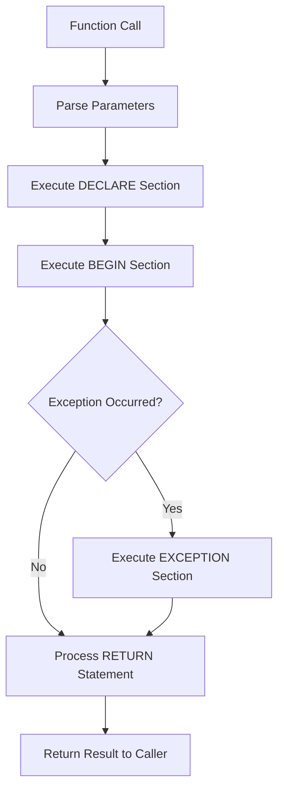

# PostgreSQL PL/pgSQL Functions

## Introduction

PL/pgSQL (Procedural Language/PostgreSQL Structured Query Language) is PostgreSQL's built-in procedural programming language that extends standard SQL with control structures, variables, and complex calculations. PL/pgSQL functions allow you to encapsulate business logic directly within your database, improving performance and maintainability.

In this tutorial, we'll explore how to create, use, and manage PL/pgSQL functions in PostgreSQL. We'll start with the basics and gradually move to more advanced concepts with practical examples.

## Why Use PL/pgSQL Functions?

Before diving into the syntax, let's understand why PL/pgSQL functions are valuable:

- **Performance**: Functions execute on the database server, reducing network traffic and improving performance
- **Reusability**: Write code once and call it from multiple places
- **Security**: Control access permissions at the function level
- **Transactions**: Execute multiple operations as a single atomic unit
- **Encapsulation**: Hide complex business logic behind a simple interface

## Basic Syntax of PL/pgSQL Functions

Here's the basic syntax for creating a PL/pgSQL function:

```sql
CREATE [OR REPLACE] FUNCTION function_name(parameter_list)
RETURNS return_type
AS $$
DECLARE
    -- Variable declarations
BEGIN
    -- Function body
    RETURN value; -- Return statement
END;
$$ LANGUAGE plpgsql;
```

Let's break down each component:

- `CREATE [OR REPLACE] FUNCTION`: Defines a new function or replaces an existing one
- `function_name`: The name of your function
- `parameter_list`: Input parameters with their data types
- `RETURNS return_type`: Specifies what data type the function returns
- `DECLARE`: Optional section for declaring variables
- `BEGIN...END`: Contains the function's executable code
- `RETURN value`: Specifies the return value
- `LANGUAGE plpgsql`: Tells PostgreSQL to use the PL/pgSQL language

## Your First PL/pgSQL Function

Let's create a simple function that adds two numbers:

```sql
CREATE OR REPLACE FUNCTION add_numbers(a integer, b integer)
RETURNS integer
AS $$
BEGIN
    RETURN a + b;
END;
$$ LANGUAGE plpgsql;
```

To call this function:

```sql
SELECT add_numbers(5, 3);
```

Output:

```
 add_numbers 
-------------
           8
```

## Variable Declaration and Assignment

In PL/pgSQL, you can declare variables in the `DECLARE` section and assign values to them:

```sql
CREATE OR REPLACE FUNCTION calculate_rectangle_area(length numeric, width numeric)
RETURNS numeric
AS $$
DECLARE
    area numeric;
BEGIN
    area := length * width;
    RETURN area;
END;
$$ LANGUAGE plpgsql;
```

Notice the following:
- Variables are declared in the `DECLARE` section
- The assignment operator in PL/pgSQL is `:=` (not `=`)
- Variable types must match or be compatible with assigned values

Let's call this function:

```sql
SELECT calculate_rectangle_area(5.5, 3.2);
```

Output:

```
 calculate_rectangle_area 
-------------------------
                    17.6
```

## Control Structures

PL/pgSQL provides several control structures for flow control.

### IF Statements

```sql
CREATE OR REPLACE FUNCTION get_grade(score integer)
RETURNS text
AS $$
DECLARE
    grade text;
BEGIN
    IF score >= 90 THEN
        grade := 'A';
    ELSIF score >= 80 THEN
        grade := 'B';
    ELSIF score >= 70 THEN
        grade := 'C';
    ELSIF score >= 60 THEN
        grade := 'D';
    ELSE
        grade := 'F';
    END IF;
    
    RETURN grade;
END;
$$ LANGUAGE plpgsql;
```

Let's test this function:

```sql
SELECT get_grade(85);
```

Output:

```
 get_grade 
-----------
 B
```

### CASE Statements

The `CASE` statement provides an alternative way to implement conditional logic:

```sql
CREATE OR REPLACE FUNCTION get_season(month integer)
RETURNS text
AS $$
DECLARE
    season text;
BEGIN
    CASE
        WHEN month IN (12, 1, 2) THEN
            season := 'Winter';
        WHEN month IN (3, 4, 5) THEN
            season := 'Spring';
        WHEN month IN (6, 7, 8) THEN
            season := 'Summer';
        WHEN month IN (9, 10, 11) THEN
            season := 'Fall';
        ELSE
            season := 'Invalid month';
    END CASE;
    
    RETURN season;
END;
$$ LANGUAGE plpgsql;
```

Testing:

```sql
SELECT get_season(7);
```

Output:

```
 get_season 
-----------
 Summer
```

### Loops

PL/pgSQL supports several types of loops for repetitive tasks.

#### FOR Loop

```sql
CREATE OR REPLACE FUNCTION sum_numbers(n integer)
RETURNS integer
AS $$
DECLARE
    total integer := 0;
BEGIN
    FOR i IN 1..n LOOP
        total := total + i;
    END LOOP;
    
    RETURN total;
END;
$$ LANGUAGE plpgsql;
```

Testing:

```sql
SELECT sum_numbers(5);
```

Output:

```
 sum_numbers 
-------------
          15
```

#### WHILE Loop

```sql
CREATE OR REPLACE FUNCTION factorial(n integer)
RETURNS bigint
AS $$
DECLARE
    result bigint := 1;
    i integer := 1;
BEGIN
    WHILE i <= n LOOP
        result := result * i;
        i := i + 1;
    END LOOP;
    
    RETURN result;
END;
$$ LANGUAGE plpgsql;
```

Testing:

```sql
SELECT factorial(5);
```

Output:

```
 factorial 
-----------
       120
```

## Working with Database Tables

One of the most powerful aspects of PL/pgSQL functions is their ability to interact with database tables.

Let's create a sample `employees` table:

```sql
CREATE TABLE employees (
    id SERIAL PRIMARY KEY,
    name VARCHAR(100),
    department VARCHAR(50),
    salary NUMERIC(10, 2)
);

INSERT INTO employees (name, department, salary) VALUES
    ('Alice', 'Engineering', 85000),
    ('Bob', 'Marketing', 65000),
    ('Charlie', 'Engineering', 95000),
    ('Diana', 'HR', 70000),
    ('Evan', 'Marketing', 75000);
```

### Returning Query Results

Let's create a function that returns employees from a specific department:

```sql
CREATE OR REPLACE FUNCTION get_employees_by_department(dept VARCHAR)
RETURNS TABLE (
    employee_id INTEGER,
    employee_name VARCHAR,
    employee_salary NUMERIC
)
AS $$
BEGIN
    RETURN QUERY
    SELECT id, name, salary
    FROM employees
    WHERE department = dept
    ORDER BY salary DESC;
END;
$$ LANGUAGE plpgsql;
```

Testing:

```sql
SELECT * FROM get_employees_by_department('Engineering');
```

Output:

```
 employee_id | employee_name | employee_salary 
-------------+---------------+-----------------
           3 | Charlie       |         95000.00
           1 | Alice         |         85000.00
```

### Modifying Data

Functions can also insert, update, or delete data:

```sql
CREATE OR REPLACE FUNCTION give_raise(dept VARCHAR, raise_percent NUMERIC)
RETURNS INTEGER
AS $$
DECLARE
    affected_rows INTEGER;
BEGIN
    UPDATE employees
    SET salary = salary * (1 + raise_percent / 100)
    WHERE department = dept;
    
    GET DIAGNOSTICS affected_rows = ROW_COUNT;
    
    RETURN affected_rows;
END;
$$ LANGUAGE plpgsql;
```

This function increases the salary of all employees in a specified department by a given percentage and returns the number of affected rows.

Testing:

```sql
SELECT give_raise('Marketing', 10);
```

Output:

```
 give_raise 
-----------
         2
```

Now if we check the employees table:

```sql
SELECT * FROM employees WHERE department = 'Marketing';
```

Output:

```
 id | name  | department | salary  
----+-------+------------+---------
  2 | Bob   | Marketing  | 71500.00
  5 | Evan  | Marketing  | 82500.00
```

## Error Handling with EXCEPTION

PL/pgSQL provides exception handling to manage errors gracefully:

```sql
CREATE OR REPLACE FUNCTION divide_safely(a numeric, b numeric)
RETURNS numeric
AS $$
BEGIN
    RETURN a / b;
EXCEPTION
    WHEN division_by_zero THEN
        RAISE NOTICE 'Division by zero detected!';
        RETURN 0;
    WHEN others THEN
        RAISE NOTICE 'An unknown error occurred: %', SQLERRM;
        RETURN NULL;
END;
$$ LANGUAGE plpgsql;
```

Testing:

```sql
SELECT divide_safely(10, 2);
SELECT divide_safely(10, 0);
```

Output:

```
 divide_safely 
--------------
            5

NOTICE:  Division by zero detected!
 divide_safely 
--------------
            0
```

## Advanced Techniques

### Returning Multiple Values with Composite Types

You can return multiple values using composite types:

```sql
CREATE OR REPLACE FUNCTION get_stats(numbers NUMERIC[])
RETURNS TABLE (
    min_val NUMERIC,
    max_val NUMERIC,
    avg_val NUMERIC
)
AS $$
BEGIN
    RETURN QUERY
    SELECT
        MIN(n),
        MAX(n),
        AVG(n)
    FROM unnest(numbers) AS n;
END;
$$ LANGUAGE plpgsql;
```

Testing:

```sql
SELECT * FROM get_stats(ARRAY[1, 5, 10, 15, 20]);
```

Output:

```
 min_val | max_val | avg_val 
---------+---------+---------
       1 |      20 |    10.2
```

### Using Cursors for Row-by-Row Processing

Cursors allow you to process query results one row at a time:

```sql
CREATE OR REPLACE FUNCTION process_employees()
RETURNS VOID
AS $$
DECLARE
    emp_cursor CURSOR FOR 
        SELECT id, name, salary FROM employees
        ORDER BY salary DESC;
    emp_record RECORD;
    counter INTEGER := 1;
BEGIN
    OPEN emp_cursor;
    
    LOOP
        FETCH emp_cursor INTO emp_record;
        EXIT WHEN NOT FOUND;
        
        RAISE NOTICE 'Employee #%: % with salary $%',
            counter, emp_record.name, emp_record.salary;
        
        counter := counter + 1;
    END LOOP;
    
    CLOSE emp_cursor;
END;
$$ LANGUAGE plpgsql;
```

When executed with `SELECT process_employees();`, this function will output notices for each employee.

## Real-World Example: Customer Loyalty System

Let's create a more complex example of a customer loyalty system:

First, let's create our tables:

```sql
CREATE TABLE customers (
    id SERIAL PRIMARY KEY,
    name VARCHAR(100),
    email VARCHAR(100),
    points INTEGER DEFAULT 0,
    membership_level VARCHAR(20) DEFAULT 'Bronze'
);

CREATE TABLE purchases (
    id SERIAL PRIMARY KEY,
    customer_id INTEGER REFERENCES customers(id),
    amount NUMERIC(10, 2),
    purchase_date DATE DEFAULT CURRENT_DATE
);
```

Now, let's create a function that awards points based on purchase amount and updates the membership level:

```sql
CREATE OR REPLACE FUNCTION record_purchase_and_update_points(
    p_customer_id INTEGER,
    p_amount NUMERIC
)
RETURNS TEXT
AS $$
DECLARE
    points_earned INTEGER;
    new_total_points INTEGER;
    old_level VARCHAR(20);
    new_level VARCHAR(20);
BEGIN
    -- Insert the purchase record
    INSERT INTO purchases (customer_id, amount)
    VALUES (p_customer_id, p_amount);
    
    -- Calculate points (1 point per $10 spent)
    points_earned := FLOOR(p_amount / 10);
    
    -- Get current data
    SELECT points, membership_level INTO new_total_points, old_level
    FROM customers
    WHERE id = p_customer_id;
    
    -- Update points
    new_total_points := new_total_points + points_earned;
    
    -- Determine new membership level
    IF new_total_points >= 1000 THEN
        new_level := 'Platinum';
    ELSIF new_total_points >= 500 THEN
        new_level := 'Gold';
    ELSIF new_total_points >= 100 THEN
        new_level := 'Silver';
    ELSE
        new_level := 'Bronze';
    END IF;
    
    -- Update customer record
    UPDATE customers
    SET 
        points = new_total_points,
        membership_level = new_level
    WHERE id = p_customer_id;
    
    -- Return a status message
    IF old_level <> new_level THEN
        RETURN format('Purchase recorded. Added %s points. Membership upgraded from %s to %s!', 
                     points_earned, old_level, new_level);
    ELSE
        RETURN format('Purchase recorded. Added %s points. Current membership remains %s.',
                     points_earned, new_level);
    END IF;
END;
$$ LANGUAGE plpgsql;
```

Let's test this with some sample data:

```sql
-- Add a customer
INSERT INTO customers (name, email) VALUES ('John Doe', 'john@example.com');

-- Record some purchases
SELECT record_purchase_and_update_points(1, 250);
SELECT record_purchase_and_update_points(1, 500);
SELECT record_purchase_and_update_points(1, 750);

-- Check the customer status
SELECT * FROM customers WHERE id = 1;
```

The output of the final purchase might be:

```
 record_purchase_and_update_points 
---------------------------------------------
 Purchase recorded. Added 75 points. Membership upgraded from Silver to Gold!
```

And the customer record:

```
 id | name     | email           | points | membership_level 
----+----------+-----------------+--------+-----------------
  1 | John Doe | john@example.com|    150 | Gold
```

## Function Management

### Viewing Existing Functions

You can view your existing functions using the following query:

```sql
SELECT routine_name, routine_definition
FROM information_schema.routines
WHERE routine_type = 'FUNCTION'
AND routine_schema = 'public';
```

### Dropping Functions

To remove a function:

```sql
DROP FUNCTION function_name(parameter_types);
```

For example:

```sql
DROP FUNCTION add_numbers(integer, integer);
```

### Function Dependencies

Be careful when dropping functions as other database objects might depend on them. You can check for dependencies with:

```sql
SELECT dependent_ns.nspname as dependent_schema,
       dependent_view.relname as dependent_view
FROM pg_depend
JOIN pg_rewrite ON pg_depend.objid = pg_rewrite.oid
JOIN pg_class as dependent_view ON pg_rewrite.ev_class = dependent_view.oid
JOIN pg_class as source_table ON pg_depend.refobjid = source_table.oid
JOIN pg_namespace dependent_ns ON dependent_ns.oid = dependent_view.relnamespace
JOIN pg_namespace source_ns ON source_ns.oid = source_table.relnamespace
WHERE source_ns.nspname = 'public'
AND source_table.relname = 'your_function_name';
```

## Function Flow Visualization

Here's a simplified visualization of PL/pgSQL function execution flow:



## Best Practices

1. **Use meaningful names** for functions and parameters
2. **Add comments** to complex functions using `/* */` or `--`
3. **Handle exceptions** to prevent unexpected errors
4. **Use transactions** for complex data modifications
5. **Avoid excessive logic** in database functions; balance between database and application logic
6. **Test thoroughly** with various inputs, including edge cases
7. **Grant appropriate permissions** to control who can execute functions
8. **Use schema qualification** when referencing tables and other objects

## Summary

PL/pgSQL functions are a powerful feature of PostgreSQL that allow you to encapsulate complex business logic directly within your database. They offer numerous benefits including improved performance, code reusability, and simplified data operations.

In this tutorial, we've covered:
- Basic syntax and structure of PL/pgSQL functions
- Control structures including IF, CASE, and various loop types
- Working with database tables and handling errors
- Advanced techniques like composite returns and cursors
- A real-world example of a customer loyalty system
- Function management and best practices

By mastering PL/pgSQL functions, you'll be able to create more efficient and maintainable database applications.

## Exercises

1. Create a function that calculates the average salary by department
2. Modify the `give_raise` function to only give raises to employees whose salary is below a specified threshold
3. Create a function that generates a report of the top N highest-paid employees
4. Implement a function that transfers money between two accounts and ensures the transaction is atomic
5. Create a stored procedure that logs all changes to the employees table

## Additional Resources

- [PostgreSQL Official Documentation on PL/pgSQL](https://www.postgresql.org/docs/current/plpgsql.html)
- [PostgreSQL Function Performance Optimization](https://www.postgresql.org/docs/current/plpgsql-implementation.html)
- [PostgreSQL Triggers](https://www.postgresql.org/docs/current/plpgsql-trigger.html) - For learning about event-based function execution