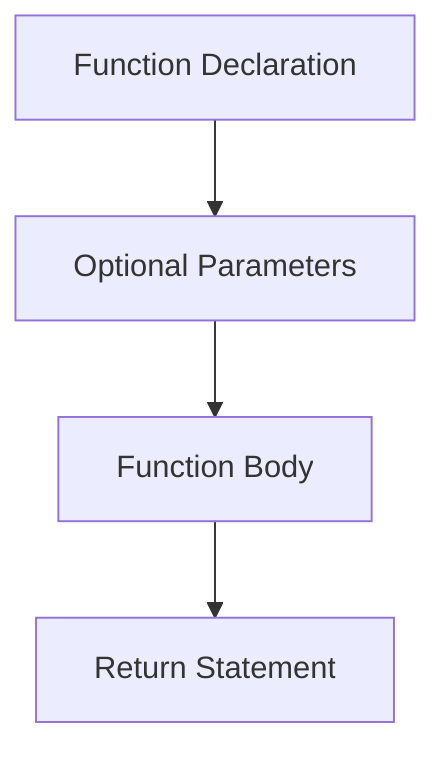

# PostgreSQL User-Defined Functions

## Introduction

PostgreSQL user-defined functions (UDFs) are custom functions that allow you to extend the database's functionality by encapsulating your own logic directly within the database. They're like mini-programs that run inside your PostgreSQL server, enabling you to perform complex operations, calculations, and data manipulations without needing to transfer data to an external application.

Whether you need to standardize business logic, simplify complex queries, or improve performance, PostgreSQL UDFs provide a powerful way to enhance your database capabilities.

## Why Use PostgreSQL User-Defined Functions?

Before diving into the syntax and examples, let's understand the benefits of creating your own functions:

- **Code Reusability**: Write logic once and use it in multiple queries
- **Abstraction**: Hide complex operations behind simple function calls
- **Performance**: Reduce network traffic by processing data where it lives
- **Security**: Control access to underlying tables while allowing function execution
- **Consistency**: Ensure business rules are applied uniformly
- **Maintainability**: Update logic in one place rather than in multiple queries

## Function Basics

### Function Structure

A PostgreSQL user-defined function typically consists of:



### Creating Your First Function

Let's start with a simple function that adds two numbers:

```sql
CREATE OR REPLACE FUNCTION add_numbers(a integer, b integer)
RETURNS integer AS $$
BEGIN
    RETURN a + b;
END;
$$ LANGUAGE plpgsql;
```

To use this function:

```sql
SELECT add_numbers(5, 3);
```

Output:
```
 add_numbers
-------------
           8
```

### Understanding the Syntax

Let's break down the key components:

- `CREATE OR REPLACE FUNCTION` - Creates a new function or replaces an existing one
- `add_numbers(a integer, b integer)` - Function name and parameters with types
- `RETURNS integer` - The data type that the function will return
- `AS $$...$$` - The function body enclosed in dollar quotes
- `BEGIN...END` - The function's logic (in PL/pgSQL)
- `LANGUAGE plpgsql` - The procedural language used (PostgreSQL has several options)

## Function Languages

PostgreSQL supports multiple languages for writing functions:

| Language | Use Case | Performance | Complexity |
|----------|----------|-------------|------------|
| SQL | Simple data operations | High | Low |
| PL/pgSQL | Procedural logic | High | Medium |
| PL/Python | Complex algorithms | Medium | Medium |
| PL/Perl | Text processing | Medium | Medium |
| PL/Java | Integration with Java | Medium | High |

### SQL Functions

The simplest functions can be written in pure SQL:

```sql
CREATE OR REPLACE FUNCTION get_customer_count()
RETURNS integer AS $$
    SELECT COUNT(*) FROM customers;
$$ LANGUAGE SQL;
```

Usage:
```sql
SELECT get_customer_count();
```

Output:
```
 get_customer_count
-------------------
                42
```

### PL/pgSQL Functions

PL/pgSQL is a procedural language that adds features like variables, control structures, and error handling:

```sql
CREATE OR REPLACE FUNCTION calculate_order_total(order_id integer)
RETURNS numeric AS $$
DECLARE
    total numeric := 0;
BEGIN
    SELECT SUM(price * quantity)
    INTO total
    FROM order_items
    WHERE order_items.order_id = calculate_order_total.order_id;
    
    RETURN total;
END;
$$ LANGUAGE plpgsql;
```

Usage:
```sql
SELECT calculate_order_total(1001);
```

Output:
```
 calculate_order_total
----------------------
               129.97
```

## Function Parameters

PostgreSQL functions support different types of parameters:

### Input Parameters

Basic input parameters that provide values to your function:

```sql
CREATE OR REPLACE FUNCTION get_employee_name(employee_id integer)
RETURNS varchar AS $$
DECLARE
    employee_name varchar;
BEGIN
    SELECT first_name || ' ' || last_name 
    INTO employee_name
    FROM employees 
    WHERE id = employee_id;
    
    RETURN employee_name;
END;
$$ LANGUAGE plpgsql;
```

### Default Parameters

You can specify default values for parameters:

```sql
CREATE OR REPLACE FUNCTION calculate_bonus(
    employee_id integer,
    performance_rating integer DEFAULT 3,
    bonus_percentage numeric DEFAULT 0.05
)
RETURNS numeric AS $$
DECLARE
    salary numeric;
    bonus numeric;
BEGIN
    SELECT annual_salary INTO salary
    FROM employees
    WHERE id = employee_id;
    
    bonus := salary * (bonus_percentage * performance_rating / 3);
    
    RETURN bonus;
END;
$$ LANGUAGE plpgsql;
```

Usage with default parameters:
```sql
SELECT calculate_bonus(101);  -- Uses default rating and percentage
```

Usage with custom parameters:
```sql
SELECT calculate_bonus(101, 5, 0.10);  -- Specifies all parameters
```

### Named Parameters

You can call functions using named parameters for clarity:

```sql
SELECT calculate_bonus(
    employee_id := 101,
    performance_rating := 4,
    bonus_percentage := 0.08
);
```

## Return Types

PostgreSQL functions can return various types of data:

### Scalar Returns

Functions that return a single value:

```sql
CREATE OR REPLACE FUNCTION get_tax_rate(state_code char(2))
RETURNS numeric AS $$
BEGIN
    RETURN CASE
        WHEN state_code = 'CA' THEN 0.0725
        WHEN state_code = 'NY' THEN 0.045
        WHEN state_code = 'TX' THEN 0.0625
        ELSE 0.05
    END;
END;
$$ LANGUAGE plpgsql;
```

### Table Returns

Functions that return multiple columns and rows:

```sql
CREATE OR REPLACE FUNCTION get_active_customers(min_orders integer DEFAULT 1)
RETURNS TABLE (
    customer_id integer,
    customer_name varchar,
    order_count bigint,
    total_spent numeric
) AS $$
BEGIN
    RETURN QUERY
    SELECT 
        c.id,
        c.first_name || ' ' || c.last_name,
        COUNT(o.id),
        SUM(o.total_amount)
    FROM 
        customers c
    JOIN 
        orders o ON c.id = o.customer_id
    WHERE 
        c.active = true
    GROUP BY 
        c.id, c.first_name, c.last_name
    HAVING 
        COUNT(o.id) >= min_orders
    ORDER BY 
        SUM(o.total_amount) DESC;
END;
$$ LANGUAGE plpgsql;
```

Usage:
```sql
SELECT * FROM get_active_customers(5);
```

Output:
```
 customer_id | customer_name  | order_count | total_spent
------------+----------------+-------------+-------------
        204 | Sarah Johnson  |          12 |     1245.67
        118 | Michael Smith  |           8 |      876.50
        305 | David Williams |           6 |      654.29
```

### Set Returning Functions

Functions that return a set of values:

```sql
CREATE OR REPLACE FUNCTION generate_dates(start_date date, end_date date)
RETURNS SETOF date AS $$
DECLARE
    current_date date := start_date;
BEGIN
    WHILE current_date <= end_date LOOP
        RETURN NEXT current_date;
        current_date := current_date + 1;
    END LOOP;
    RETURN;
END;
$$ LANGUAGE plpgsql;
```

Usage:
```sql
SELECT * FROM generate_dates('2023-01-01', '2023-01-05');
```

Output:
```
 generate_dates
---------------
 2023-01-01
 2023-01-02
 2023-01-03
 2023-01-04
 2023-01-05
```

## Practical Examples

Let's explore some real-world applications of PostgreSQL functions:

### Example 1: Customer Tier Classification

```sql
CREATE OR REPLACE FUNCTION get_customer_tier(customer_id integer)
RETURNS text AS $$
DECLARE
    total_spent numeric;
BEGIN
    SELECT SUM(total_amount) INTO total_spent
    FROM orders
    WHERE customer_id = get_customer_tier.customer_id
    AND order_date >= CURRENT_DATE - INTERVAL '1 year';
    
    RETURN CASE
        WHEN total_spent IS NULL THEN 'Not Active'
        WHEN total_spent < 100 THEN 'Bronze'
        WHEN total_spent < 500 THEN 'Silver'
        WHEN total_spent < 1000 THEN 'Gold'
        ELSE 'Platinum'
    END;
END;
$$ LANGUAGE plpgsql;
```

### Example 2: Password Generation Function

```sql
CREATE OR REPLACE FUNCTION generate_secure_password(length integer DEFAULT 12)
RETURNS text AS $$
DECLARE
    chars text := 'ABCDEFGHIJKLMNOPQRSTUVWXYZabcdefghijklmnopqrstuvwxyz0123456789!@#$%^&*()';
    result text := '';
    i integer := 0;
BEGIN
    -- Ensure minimum length
    IF length < 8 THEN
        length := 8;
    END IF;
    
    -- Generate random password
    FOR i IN 1..length LOOP
        result := result || substr(chars, 1 + floor(random() * length(chars))::integer, 1);
    END LOOP;
    
    RETURN result;
END;
$$ LANGUAGE plpgsql;
```

### Example 3: Address Formatting

```sql
CREATE OR REPLACE FUNCTION format_address(
    street text,
    city text,
    state char(2),
    zip text,
    country text DEFAULT 'USA'
)
RETURNS text AS $$
BEGIN
    RETURN street || E'
' || 
           city || ', ' || state || ' ' || zip || 
           CASE WHEN country != 'USA' THEN E'
' || country ELSE '' END;
END;
$$ LANGUAGE plpgsql;
```

## Error Handling

In PL/pgSQL functions, you can handle errors using exception blocks:

```sql
CREATE OR REPLACE FUNCTION divide_safely(numerator numeric, denominator numeric)
RETURNS numeric AS $$
BEGIN
    IF denominator = 0 THEN
        RAISE EXCEPTION 'Division by zero is not allowed';
    END IF;
    
    RETURN numerator / denominator;
EXCEPTION
    WHEN division_by_zero THEN
        RAISE NOTICE 'Caught division by zero error';
        RETURN NULL;
    WHEN others THEN
        RAISE NOTICE 'Caught unexpected error: %', SQLERRM;
        RETURN NULL;
END;
$$ LANGUAGE plpgsql;
```

## Managing Functions

### Viewing Function Definitions

To see the definition of an existing function:

```sql
SELECT pg_get_functiondef('add_numbers'::regproc);
```

### Listing Functions

To list all user-defined functions in the current database:

```sql
SELECT 
    n.nspname as schema,
    p.proname as function_name,
    pg_get_function_arguments(p.oid) as arguments,
    t.typname as return_type
FROM 
    pg_proc p
JOIN 
    pg_namespace n ON p.pronamespace = n.oid
JOIN 
    pg_type t ON p.prorettype = t.oid
WHERE 
    n.nspname NOT IN ('pg_catalog', 'information_schema')
ORDER BY 
    schema, function_name;
```

### Dropping Functions

To remove a function:

```sql
DROP FUNCTION IF EXISTS add_numbers(integer, integer);
```

## Best Practices

When creating PostgreSQL functions, follow these best practices:

1. **Use meaningful names** that describe what the function does
2. **Document your functions** with comments
3. **Handle errors gracefully** using exception blocks
4. **Be careful with side effects** - functions that modify data can be confusing
5. **Test thoroughly** with various inputs, including edge cases
6. **Consider performance** for functions that will be called frequently
7. **Use schemas** to organize functions by purpose or module
8. **Use `CREATE OR REPLACE`** to make updates easier
9. **Include parameter validation** to prevent unexpected behavior

## Security Considerations

When creating functions, consider these security aspects:

### Function Volatility

PostgreSQL has three volatility categories that affect optimization:

```sql
-- Function result never changes for the same input
CREATE FUNCTION square(integer) RETURNS integer
AS $$ SELECT $1 * $1; $$
LANGUAGE SQL IMMUTABLE;

-- Function result depends on database lookups but not direct modifications
CREATE FUNCTION current_customer_count() RETURNS bigint
AS $$ SELECT count(*) FROM customers; $$
LANGUAGE SQL STABLE;

-- Function result can change for each call (default)
CREATE FUNCTION record_login(user_id integer) RETURNS void
AS $$ INSERT INTO user_logins (user_id, login_time) VALUES (user_id, now()); $$
LANGUAGE SQL VOLATILE;
```

### Function Security

You can specify how the function accesses underlying data:

```sql
-- Function runs with the privileges of the calling user
CREATE FUNCTION get_my_orders(user_id integer) RETURNS SETOF orders
AS $$ SELECT * FROM orders WHERE customer_id = user_id; $$
LANGUAGE SQL SECURITY INVOKER;

-- Function runs with the privileges of the function owner
CREATE FUNCTION get_all_orders() RETURNS SETOF orders
AS $$ SELECT * FROM orders; $$
LANGUAGE SQL SECURITY DEFINER;
```

## Summary

PostgreSQL user-defined functions offer a powerful way to extend your database's capabilities, encapsulate business logic, and improve performance. By creating functions, you can:

- Reuse code across your database
- Implement complex business rules consistently
- Improve security through controlled data access
- Enhance performance by reducing network traffic
- Create more maintainable and modular database designs

With support for multiple languages, various parameter types, and flexible return options, PostgreSQL functions can handle everything from simple calculations to complex data transformations.

## Exercises

1. Create a function that calculates the age in years, months, and days between two dates.
2. Create a function that takes a customer ID and returns their order history as a table.
3. Create a function that validates an email address format and returns a boolean.
4. Create a function that generates a report of top-selling products by category.
5. Create a function that safely updates a user's profile, handling any potential errors.

## Additional Resources

- [PostgreSQL Official Documentation on Functions](https://www.postgresql.org/docs/current/sql-createfunction.html)
- [PL/pgSQL Language Reference](https://www.postgresql.org/docs/current/plpgsql.html)
- [PostgreSQL: Up and Running](https://www.oreilly.com/library/view/postgresql-up-and/9781492063698/) - A comprehensive guide to PostgreSQL
- [PostgreSQL User-Defined Functions on StackOverflow](https://stackoverflow.com/questions/tagged/postgresql+functions)