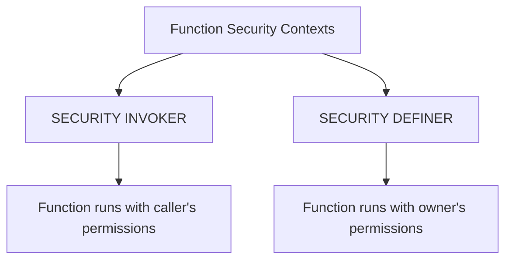

# PostgreSQL Function Security

When creating and using functions in PostgreSQL, security considerations are crucial to protect your database from unauthorized access and potential vulnerabilities. This guide explores function security concepts, execution contexts, permissions models, and best practices to help you build secure database applications.

## Introduction to Function Security

PostgreSQL functions are powerful tools that can execute complex operations within your database. However, this power comes with security responsibilities. Functions can:

- Access sensitive data
- Modify database structures
- Execute with different permission levels than the calling user
- Potentially expose your database to SQL injection attacks

Understanding PostgreSQL's security model for functions is essential for any database developer.

## Security Execution Contexts

PostgreSQL functions run in one of four execution contexts that determine their privileges:



### SECURITY INVOKER

By default, PostgreSQL functions run with `SECURITY INVOKER`, meaning they execute with the permissions of the calling user.

```sql
CREATE FUNCTION get_employee_data(employee_id INT) 
RETURNS TABLE (id INT, name TEXT, salary NUMERIC) AS $$
    SELECT id, name, salary 
    FROM employees
    WHERE id = employee_id;
$$ LANGUAGE SQL SECURITY INVOKER;
```

In this example, if a user without permissions to access the `salary` column calls this function, it will fail.

### SECURITY DEFINER

Functions created with `SECURITY DEFINER` run with the permissions of the function owner, regardless of who calls them.

```sql
CREATE FUNCTION get_employee_salary(employee_id INT) 
RETURNS NUMERIC AS $$
    SELECT salary 
    FROM employees
    WHERE id = employee_id;
$$ LANGUAGE SQL SECURITY DEFINER;
```

This is similar to "setuid" programs in Unix systems - they allow controlled access to privileged operations.

## Security Best Practices

### 1. Limit the Use of SECURITY DEFINER

While `SECURITY DEFINER` functions are useful, they represent potential security risks:

```sql
-- BAD PRACTICE: Overly powerful SECURITY DEFINER function
CREATE FUNCTION unsafe_user_operation() 
RETURNS VOID AS $$
    EXECUTE format('DROP TABLE %s', current_setting('user.table_name'));
$$ LANGUAGE plpgsql SECURITY DEFINER;
```

This function could be exploited to drop any table. Instead:

```sql
-- BETTER: Explicitly specify the tables and operations
CREATE FUNCTION safe_delete_user_data(user_id INT) 
RETURNS VOID AS $$
    DELETE FROM user_data WHERE id = user_id;
$$ LANGUAGE SQL SECURITY DEFINER;
```

### 2. Set Search Path Explicitly

Always set the search path in `SECURITY DEFINER` functions to prevent path injection attacks:

```sql
CREATE FUNCTION secure_function()
RETURNS VOID AS $$
BEGIN
    -- Function logic here
END;
$$ LANGUAGE plpgsql
SECURITY DEFINER
SET search_path = pg_catalog, pg_temp;
```

This prevents attackers from creating objects in schemas that might be included in the search path.

### 3. Validate Input Parameters

Always validate function inputs to prevent SQL injection:

```sql
CREATE FUNCTION safe_query(search_term TEXT) 
RETURNS SETOF records AS $$
BEGIN
    -- Bad: Vulnerable to SQL injection
    -- RETURN QUERY EXECUTE 'SELECT * FROM records WHERE description LIKE ''%' || search_term || '%''';
    
    -- Good: Parameterized query
    RETURN QUERY SELECT * FROM records WHERE description LIKE '%' || search_term || '%';
END;
$$ LANGUAGE plpgsql;
```

### 4. Apply Least Privilege Principle

Grant the function owner only the permissions necessary for the function to work:

```sql
-- Create a function owner with limited permissions
CREATE ROLE function_executor;
GRANT SELECT ON employees TO function_executor;
ALTER FUNCTION get_employee_data OWNER TO function_executor;
```

## Row Security Policies and Functions

PostgreSQL's Row-Level Security (RLS) interacts with functions in important ways:

```sql
-- Enable row-level security on a table
ALTER TABLE employees ENABLE ROW LEVEL SECURITY;

-- Create a policy that filters rows based on department
CREATE POLICY department_access ON employees
    USING (department_id IN (SELECT dept_id FROM user_departments WHERE user_id = current_user));
```

When a `SECURITY INVOKER` function accesses this table, the RLS policies apply. However, `SECURITY DEFINER` functions owned by superusers or the table owner bypass these policies unless explicitly configured.

## Function Permissions

Control who can execute your functions:

```sql
-- Grant execute permission to specific roles
GRANT EXECUTE ON FUNCTION get_employee_data TO hr_staff;

-- Revoke execute permission
REVOKE EXECUTE ON FUNCTION get_employee_data FROM interns;
```

## Practical Examples

### Example 1: Secure Audit Logging

This example creates a secure audit logging function that runs with elevated privileges but is safe from injection:

```sql
CREATE TABLE audit_log (
    id SERIAL PRIMARY KEY,
    action TEXT,
    table_affected TEXT,
    record_id INTEGER,
    user_name TEXT,
    timestamp TIMESTAMP DEFAULT CURRENT_TIMESTAMP
);

CREATE FUNCTION log_action(action TEXT, affected_table TEXT, record_id INTEGER) 
RETURNS VOID AS $$
BEGIN
    INSERT INTO audit_log (action, table_affected, record_id, user_name)
    VALUES (action, affected_table, record_id, session_user);
END;
$$ LANGUAGE plpgsql
SECURITY DEFINER
SET search_path = pg_catalog, pg_temp;

-- Grant execute permission to all users
GRANT EXECUTE ON FUNCTION log_action TO PUBLIC;
```

### Example 2: Secure Data Access Layer

This example creates a data access layer that enforces business rules while protecting sensitive data:

```sql
-- Table with sensitive data
CREATE TABLE customer_data (
    id SERIAL PRIMARY KEY,
    customer_id INTEGER,
    full_name TEXT,
    credit_card TEXT,
    purchase_history JSONB
);

-- Enable row level security
ALTER TABLE customer_data ENABLE ROW LEVEL SECURITY;

-- Create secure access function
CREATE FUNCTION get_customer_data(cust_id INTEGER) 
RETURNS TABLE (id INTEGER, name TEXT, history JSONB) AS $$
BEGIN
    -- Only return non-sensitive fields
    RETURN QUERY
        SELECT 
            cd.id, 
            cd.full_name, 
            cd.purchase_history
        FROM 
            customer_data cd
        WHERE 
            cd.customer_id = cust_id;
END;
$$ LANGUAGE plpgsql
SECURITY DEFINER
SET search_path = pg_catalog, pg_temp;

-- Grant limited access
GRANT EXECUTE ON FUNCTION get_customer_data TO sales_team;
```

This function allows sales team members to access customer data without exposing sensitive credit card information.

## Monitoring Function Security

Regularly review function permissions and activities:

```sql
-- Show all SECURITY DEFINER functions
SELECT proname, proowner::regrole 
FROM pg_proc 
WHERE prosecdef 
ORDER BY proowner, proname;

-- Check function execution permissions
SELECT grantor::regrole, grantee::regrole, priv_type
FROM pg_proc p
JOIN pg_default_acl acl ON p.pronamespace = acl.defaclnamespace
WHERE acl.defaclobjtype = 'f';
```

## Summary

PostgreSQL function security involves understanding:

1. Execution contexts (`SECURITY INVOKER` vs `SECURITY DEFINER`)
2. Permission models and the principle of least privilege
3. Input validation to prevent SQL injection
4. Interaction with row-level security
5. Safe search path configuration

By following the best practices outlined in this guide, you can create functions that provide powerful capabilities while maintaining the security of your PostgreSQL database.

## Additional Resources

- Practice analyzing and improving the security of existing functions
- Review your current PostgreSQL functions for security vulnerabilities
- Explore advanced topics like dynamic SQL security in functions
- Learn about PostgreSQL security audit extensions

## Exercise

Review the following function and identify security issues:

```sql
CREATE OR REPLACE FUNCTION update_user_profile(user_id INT, profile_data TEXT)
RETURNS VOID AS $$
BEGIN
    EXECUTE 'UPDATE user_profiles SET profile = ''' || profile_data || ''' WHERE user_id = ' || user_id;
END;
$$ LANGUAGE plpgsql SECURITY DEFINER;
```

Can you identify the security vulnerabilities and propose a more secure implementation?