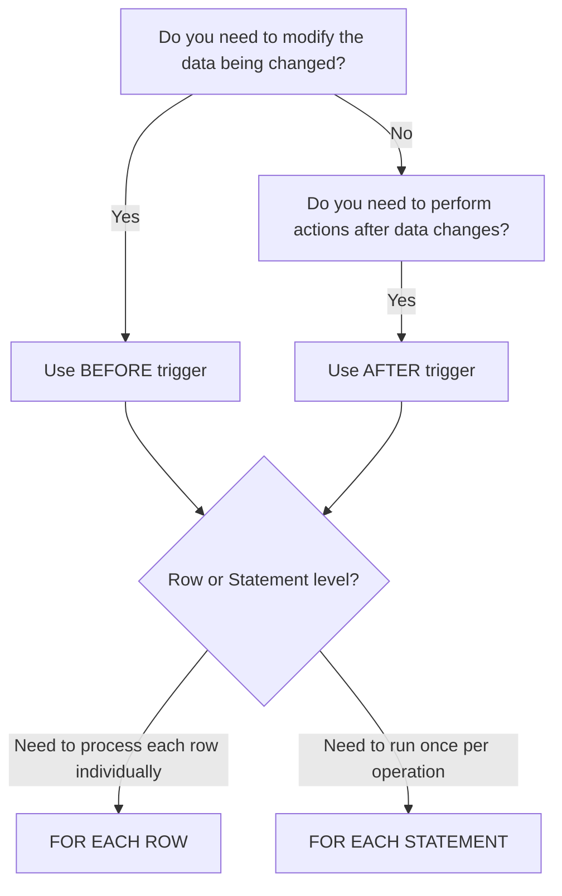

# PostgreSQL Trigger Basics

## Introduction

Triggers are database objects that automatically execute when specific events occur in your database. They are like event listeners that respond to changes in your data, enabling you to implement complex business rules, maintain data integrity, and automate routine tasks directly at the database level.

In PostgreSQL, triggers provide a powerful way to enforce business rules and automate processes without requiring application code modifications. This makes your database more self-contained and reduces the risk of inconsistent data that might occur if these rules were implemented only at the application level.

## What Are PostgreSQL Triggers?

A trigger is a function that PostgreSQL automatically calls when a specified database event occurs. These events include:

- **INSERT** - When new rows are added to a table
- **UPDATE** - When existing rows are modified
- **DELETE** - When rows are removed from a table
- **TRUNCATE** - When a table is truncated

Triggers can execute:
- **BEFORE** the event (to potentially modify the operation)
- **AFTER** the event (to perform follow-up actions)
- **INSTEAD OF** the event (used with views)

They can also run:
- For **EACH ROW** affected by the operation
- Once per **STATEMENT** regardless of how many rows are affected

## Basic Trigger Anatomy

Creating a trigger in PostgreSQL involves two steps:

1. Creating a trigger function
2. Binding that function to a specific event on a table

Here's the general structure for creating a trigger:

```sql
-- Step 1: Create a trigger function
CREATE OR REPLACE FUNCTION trigger_function_name()
RETURNS TRIGGER AS $$
BEGIN
    -- Trigger logic goes here
    RETURN NEW; -- or other return value
END;
$$ LANGUAGE plpgsql;

-- Step 2: Create the trigger
CREATE TRIGGER trigger_name
BEFORE INSERT OR UPDATE OR DELETE ON table_name
FOR EACH ROW
EXECUTE FUNCTION trigger_function_name();
```

## Special Trigger Variables

Within trigger functions, PostgreSQL provides special variables:

- **NEW** - Contains the new row for INSERT/UPDATE operations
- **OLD** - Contains the old row for UPDATE/DELETE operations
- **TG_OP** - Contains the operation type ('INSERT', 'UPDATE', 'DELETE', or 'TRUNCATE')
- **TG_TABLE_NAME** - Contains the name of the table the trigger is associated with

## Basic Trigger Examples

Let's explore some basic examples to understand how triggers work in practice.

### Example 1: Automatic Timestamp Update

This example automatically updates a `last_modified` timestamp whenever a row is modified:

```sql
-- Create a sample table
CREATE TABLE products (
    product_id SERIAL PRIMARY KEY,
    name VARCHAR(100) NOT NULL,
    price NUMERIC(10, 2) NOT NULL,
    created_at TIMESTAMP DEFAULT CURRENT_TIMESTAMP,
    last_modified TIMESTAMP DEFAULT CURRENT_TIMESTAMP
);

-- Create the trigger function
CREATE OR REPLACE FUNCTION update_modified_column()
RETURNS TRIGGER AS $$
BEGIN
    NEW.last_modified = CURRENT_TIMESTAMP;
    RETURN NEW;
END;
$$ LANGUAGE plpgsql;

-- Create the trigger
CREATE TRIGGER update_product_modtime
BEFORE UPDATE ON products
FOR EACH ROW
EXECUTE FUNCTION update_modified_column();
```

Let's test this trigger:

```sql
-- Insert a product
INSERT INTO products (name, price) VALUES ('Laptop', 999.99);

-- View the product
SELECT * FROM products;
```

The output will look something like:

```
 product_id | name   | price  | created_at           | last_modified       
------------+--------+--------+----------------------+---------------------
 1          | Laptop | 999.99 | 2025-03-10 10:00:00 | 2025-03-10 10:00:00
```

Now, let's update the product:

```sql
-- Update the product
UPDATE products SET price = 899.99 WHERE product_id = 1;

-- View the product again
SELECT * FROM products;
```

The output will show that `last_modified` has been automatically updated:

```
 product_id | name   | price  | created_at           | last_modified       
------------+--------+--------+----------------------+---------------------
 1          | Laptop | 899.99 | 2025-03-10 10:00:00 | 2025-03-10 10:05:23
```

### Example 2: Audit Trail

This example creates an audit trail by logging changes to a table:

```sql
-- Create an audit table
CREATE TABLE employee_audit (
    audit_id SERIAL PRIMARY KEY,
    employee_id INT NOT NULL,
    changed_at TIMESTAMP NOT NULL,
    operation VARCHAR(10) NOT NULL,
    old_data JSONB,
    new_data JSONB
);

-- Create a sample employees table
CREATE TABLE employees (
    employee_id SERIAL PRIMARY KEY,
    first_name VARCHAR(50) NOT NULL,
    last_name VARCHAR(50) NOT NULL,
    email VARCHAR(100) UNIQUE NOT NULL,
    hire_date DATE NOT NULL,
    salary NUMERIC(10, 2) NOT NULL
);

-- Create the trigger function
CREATE OR REPLACE FUNCTION log_employee_changes()
RETURNS TRIGGER AS $$
BEGIN
    IF (TG_OP = 'DELETE') THEN
        INSERT INTO employee_audit (employee_id, changed_at, operation, old_data, new_data)
        VALUES (OLD.employee_id, CURRENT_TIMESTAMP, TG_OP, 
                row_to_json(OLD)::jsonb, NULL);
        RETURN OLD;
    ELSIF (TG_OP = 'UPDATE') THEN
        INSERT INTO employee_audit (employee_id, changed_at, operation, old_data, new_data)
        VALUES (NEW.employee_id, CURRENT_TIMESTAMP, TG_OP, 
                row_to_json(OLD)::jsonb, row_to_json(NEW)::jsonb);
        RETURN NEW;
    ELSIF (TG_OP = 'INSERT') THEN
        INSERT INTO employee_audit (employee_id, changed_at, operation, old_data, new_data)
        VALUES (NEW.employee_id, CURRENT_TIMESTAMP, TG_OP, 
                NULL, row_to_json(NEW)::jsonb);
        RETURN NEW;
    END IF;
    RETURN NULL;
END;
$$ LANGUAGE plpgsql;

-- Create the trigger
CREATE TRIGGER employee_audit_trigger
AFTER INSERT OR UPDATE OR DELETE ON employees
FOR EACH ROW
EXECUTE FUNCTION log_employee_changes();
```

Let's test the audit trail:

```sql
-- Insert an employee
INSERT INTO employees (first_name, last_name, email, hire_date, salary)
VALUES ('John', 'Doe', 'john.doe@example.com', '2025-01-15', 75000);

-- Check the audit table
SELECT * FROM employee_audit;
```

Output:

```
 audit_id | employee_id | changed_at           | operation | old_data | new_data                                                                                                       
----------+-------------+----------------------+-----------+----------+----------------------------------------------------------------------------------------------------------------
 1        | 1           | 2025-03-10 10:15:00 | INSERT    | NULL     | {"email": "john.doe@example.com", "salary": 75000, "last_name": "Doe", "hire_date": "2025-01-15", "first_name": "John", "employee_id": 1}
```

Now let's update the employee:

```sql
-- Update the employee
UPDATE employees SET salary = 80000 WHERE employee_id = 1;

-- Check the audit table
SELECT * FROM employee_audit;
```

Updated output:

```
 audit_id | employee_id | changed_at           | operation | old_data                                                                                                       | new_data                                                                                                       
----------+-------------+----------------------+-----------+----------------------------------------------------------------------------------------------------------------+----------------------------------------------------------------------------------------------------------------
 1        | 1           | 2025-03-10 10:15:00 | INSERT    | NULL                                                                                                           | {"email": "john.doe@example.com", "salary": 75000, "last_name": "Doe", "hire_date": "2025-01-15", "first_name": "John", "employee_id": 1}
 2        | 1           | 2025-03-10 10:20:00 | UPDATE    | {"email": "john.doe@example.com", "salary": 75000, "last_name": "Doe", "hire_date": "2025-01-15", "first_name": "John", "employee_id": 1} | {"email": "john.doe@example.com", "salary": 80000, "last_name": "Doe", "hire_date": "2025-01-15", "first_name": "John", "employee_id": 1}
```

## When to Use Different Trigger Types

Understanding when to use different types of triggers is crucial:



### BEFORE Triggers
- Useful for data validation or modification before it's stored
- Can prevent the operation by returning NULL (for row-level triggers)
- Must return NEW (possibly modified) for INSERT/UPDATE operations
- Must return OLD for DELETE operations

### AFTER Triggers
- Useful for auditing, notifications, or cascading changes
- Cannot modify the data being changed (it's already done)
- Return value is ignored but conventionally returns NULL

### FOR EACH ROW vs. FOR EACH STATEMENT
- ROW triggers execute once for each row affected
- STATEMENT triggers execute once per SQL statement regardless of rows affected

## Real-World Applications

### Data Validation

This trigger ensures that product prices can't be set below a minimum threshold:

```sql
CREATE OR REPLACE FUNCTION validate_product_price()
RETURNS TRIGGER AS $$
BEGIN
    -- Ensure price is at least $0.01
    IF NEW.price < 0.01 THEN
        RAISE EXCEPTION 'Product price must be at least $0.01';
    END IF;
    RETURN NEW;
END;
$$ LANGUAGE plpgsql;

CREATE TRIGGER check_product_price
BEFORE INSERT OR UPDATE ON products
FOR EACH ROW
EXECUTE FUNCTION validate_product_price();
```

### Denormalization for Performance

This trigger keeps a summary count updated in a parent table:

```sql
-- Create tables
CREATE TABLE orders (
    order_id SERIAL PRIMARY KEY,
    customer_id INT NOT NULL,
    order_date DATE NOT NULL,
    item_count INT DEFAULT 0
);

CREATE TABLE order_items (
    item_id SERIAL PRIMARY KEY,
    order_id INT REFERENCES orders(order_id),
    product_id INT NOT NULL,
    quantity INT NOT NULL
);

-- Create trigger function
CREATE OR REPLACE FUNCTION update_item_count()
RETURNS TRIGGER AS $$
BEGIN
    IF (TG_OP = 'INSERT') THEN
        UPDATE orders
        SET item_count = item_count + NEW.quantity
        WHERE order_id = NEW.order_id;
    ELSIF (TG_OP = 'UPDATE') THEN
        UPDATE orders
        SET item_count = item_count - OLD.quantity + NEW.quantity
        WHERE order_id = NEW.order_id;
    ELSIF (TG_OP = 'DELETE') THEN
        UPDATE orders
        SET item_count = item_count - OLD.quantity
        WHERE order_id = OLD.order_id;
    END IF;
    RETURN NULL;
END;
$$ LANGUAGE plpgsql;

-- Create trigger
CREATE TRIGGER maintain_item_count
AFTER INSERT OR UPDATE OR DELETE ON order_items
FOR EACH ROW
EXECUTE FUNCTION update_item_count();
```

### Implementing Business Rules

This trigger enforces a business rule that prevents hiring employees under 18 years old:

```sql
CREATE OR REPLACE FUNCTION check_employee_age()
RETURNS TRIGGER AS $$
DECLARE
    min_age_date DATE;
BEGIN
    -- Calculate date for 18 years ago
    min_age_date := CURRENT_DATE - INTERVAL '18 years';
    
    -- Check if birth date indicates employee is at least 18
    IF NEW.birth_date > min_age_date THEN
        RAISE EXCEPTION 'Employees must be at least 18 years old';
    END IF;
    
    RETURN NEW;
END;
$$ LANGUAGE plpgsql;

CREATE TRIGGER enforce_minimum_age
BEFORE INSERT OR UPDATE ON employees
FOR EACH ROW
EXECUTE FUNCTION check_employee_age();
```

## Common Pitfalls and Best Practices

### Pitfalls to Avoid

1. **Recursive Trigger Execution**: Triggers that modify tables that have other triggers can cause recursive execution. Be careful with logic that could create infinite loops.

2. **Performance Impact**: Triggers execute for every qualifying operation. Complex trigger logic on frequently modified tables can impact performance.

3. **Hidden Logic**: Since triggers execute automatically, developers might not be aware of all the side effects of their database operations.

### Best Practices

1. **Keep Triggers Simple**: Avoid complex logic in triggers. Consider stored procedures for complex operations.

2. **Document Thoroughly**: Since triggers operate "behind the scenes," document their purpose and behavior extensively.

3. **Use Conditional Execution**: Not every trigger needs to run for every row. Use `IF` statements to conditionally execute trigger logic.

4. **Consider Transaction Handling**: Be aware of how transactions affect trigger execution and plan accordingly.

5. **Test Thoroughly**: Test triggers with various scenarios including edge cases to ensure they behave as expected.

## Summary

PostgreSQL triggers provide a powerful mechanism to implement database-level automation, enforce business rules, and maintain data integrity. By automatically executing in response to database events, triggers help ensure consistent application of business logic regardless of how data is modified.

In this tutorial, we've covered:
- The basic concepts and types of PostgreSQL triggers
- How to create and implement triggers
- When to use different trigger types (BEFORE, AFTER, ROW, STATEMENT)
- Real-world applications of triggers
- Common pitfalls and best practices

## Exercises

1. Create a trigger that prevents deleting records from a critical table during business hours (9 AM to 5 PM).

2. Implement a trigger that encrypts sensitive data (like passwords) before storing it in the database.

3. Design a trigger system that maintains a full history of all changes to a customer information table.

4. Create a trigger that automatically generates a unique slug (URL-friendly string) whenever a product name is inserted or updated.

## Additional Resources

- [PostgreSQL Official Documentation on Triggers](https://www.postgresql.org/docs/current/trigger-definition.html)
- [PL/pgSQL Language Reference](https://www.postgresql.org/docs/current/plpgsql.html)
- [PostgreSQL Event Triggers](https://www.postgresql.org/docs/current/event-triggers.html)