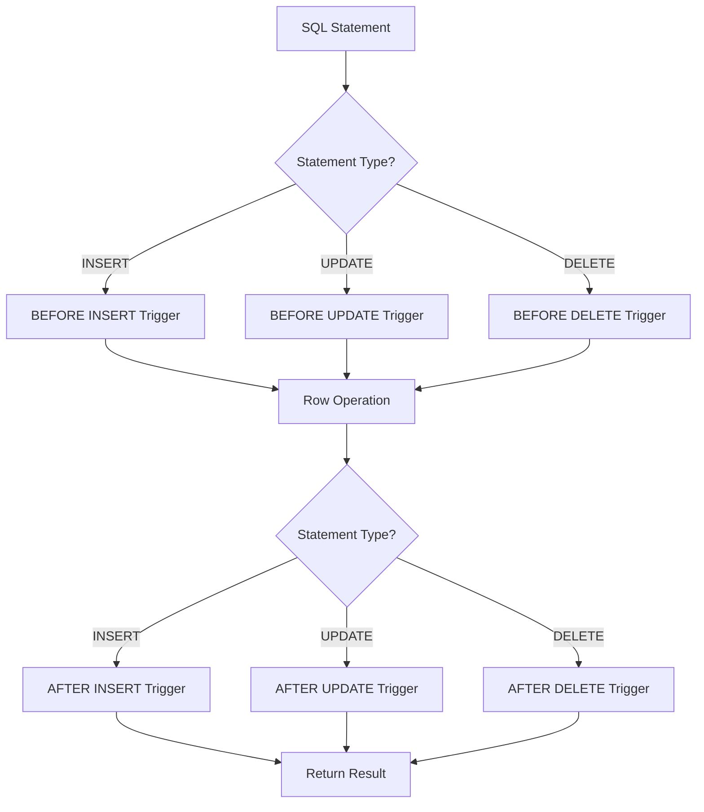

# PostgreSQL CREATE TRIGGER

Triggers are database features that automatically execute specified functions when certain events occur. In PostgreSQL, triggers provide a powerful way to enforce business rules, maintain data integrity, and automate database tasks.

## What are Triggers?

A trigger is a specification that the database should automatically execute a particular function whenever a certain type of operation (INSERT, UPDATE, DELETE, or TRUNCATE) is performed on a specific table or view. Triggers are like event listeners for your database—they "listen" for specific operations and respond accordingly.

## Basic Syntax

The basic syntax for creating a trigger in PostgreSQL is:

```sql
CREATE TRIGGER trigger_name
{BEFORE | AFTER | INSTEAD OF} {event [OR ...]}
ON table_name
[FOR [EACH] {ROW | STATEMENT}]
[WHEN (condition)]
EXECUTE FUNCTION function_name(arguments);
```

Let's break down the components:

- `trigger_name`: A unique identifier for your trigger
- `{BEFORE | AFTER | INSTEAD OF}`: When to execute the trigger
- `event`: The database event that activates the trigger (INSERT, UPDATE, DELETE, or TRUNCATE)
- `table_name`: The table on which to create the trigger
- `[FOR [EACH] {ROW | STATEMENT}]`: Whether to fire once per modified row or once per SQL statement
- `[WHEN (condition)]`: Optional condition that must be true for the trigger to fire
- `EXECUTE FUNCTION function_name(arguments)`: The function to execute when the trigger fires

## Creating a Simple Trigger

Let's start with a simple example. First, we'll create a table and a trigger function:

```sql
-- Create a table to track employees
CREATE TABLE employees (
    id SERIAL PRIMARY KEY,
    name VARCHAR(100) NOT NULL,
    position VARCHAR(100),
    salary NUMERIC(10, 2),
    hire_date DATE DEFAULT CURRENT_DATE
);

-- Create an audit log table
CREATE TABLE employee_audit (
    id SERIAL PRIMARY KEY,
    employee_id INTEGER,
    changed_on TIMESTAMP DEFAULT CURRENT_TIMESTAMP,
    action VARCHAR(20),
    old_data JSONB,
    new_data JSONB
);

-- Create a trigger function
CREATE OR REPLACE FUNCTION log_employee_changes()
RETURNS TRIGGER AS $$
BEGIN
    IF TG_OP = 'INSERT' THEN
        INSERT INTO employee_audit(employee_id, action, new_data)
        VALUES(NEW.id, 'INSERT', row_to_json(NEW));
    ELSIF TG_OP = 'UPDATE' THEN
        INSERT INTO employee_audit(employee_id, action, old_data, new_data)
        VALUES(NEW.id, 'UPDATE', row_to_json(OLD), row_to_json(NEW));
    ELSIF TG_OP = 'DELETE' THEN
        INSERT INTO employee_audit(employee_id, action, old_data)
        VALUES(OLD.id, 'DELETE', row_to_json(OLD));
    END IF;
    RETURN NULL;
END;
$$ LANGUAGE plpgsql;
```

Now, let's create a trigger that uses this function:

```sql
-- Create the trigger
CREATE TRIGGER employee_audit_trigger
AFTER INSERT OR UPDATE OR DELETE ON employees
FOR EACH ROW
EXECUTE FUNCTION log_employee_changes();
```

## Testing Our Trigger

Let's see our trigger in action:

```sql
-- Insert a new employee
INSERT INTO employees (name, position, salary)
VALUES ('John Doe', 'Developer', 75000);

-- Check the audit log
SELECT * FROM employee_audit;
```

Output:
```
 id | employee_id |        changed_on         | action |                                old_data                                |                                               new_data                                               
----+-------------+---------------------------+--------+------------------------------------------------------------------------+------------------------------------------------------------------------------------------------------
  1 |           1 | 2023-03-15 10:32:45.12345 | INSERT |                                                                        | {"id":1,"name":"John Doe","salary":75000,"position":"Developer","hire_date":"2023-03-15"}
```

Let's update the employee's information:

```sql
-- Update employee
UPDATE employees SET salary = 80000 WHERE id = 1;

-- Check the audit log again
SELECT * FROM employee_audit;
```

Output:
```
 id | employee_id |        changed_on         | action |                                old_data                                |                                               new_data                                               
----+-------------+---------------------------+--------+------------------------------------------------------------------------+------------------------------------------------------------------------------------------------------
  1 |           1 | 2023-03-15 10:32:45.12345 | INSERT |                                                                        | {"id":1,"name":"John Doe","salary":75000,"position":"Developer","hire_date":"2023-03-15"}
  2 |           1 | 2023-03-15 10:33:12.78901 | UPDATE | {"id":1,"name":"John Doe","salary":75000,"position":"Developer","hire_date":"2023-03-15"} | {"id":1,"name":"John Doe","salary":80000,"position":"Developer","hire_date":"2023-03-15"}
```

## Types of Triggers

PostgreSQL supports several types of triggers:

### Row-Level vs. Statement-Level Triggers

- **Row-Level Triggers** (using `FOR EACH ROW`): Fire once for each row affected by the SQL statement
- **Statement-Level Triggers** (using `FOR EACH STATEMENT`): Fire once for each SQL statement, regardless of how many rows are affected

### BEFORE vs. AFTER vs. INSTEAD OF Triggers

- **BEFORE**: Execute before the operation is attempted on a row
- **AFTER**: Execute after the operation has completed
- **INSTEAD OF**: Used only on views, replacing the triggering operation with the trigger function

## Trigger Variables and Functions

Inside trigger functions, you have access to special variables:

- `NEW`: A variable holding the new database row for INSERT and UPDATE operations
- `OLD`: A variable holding the old database row for UPDATE and DELETE operations
- `TG_OP`: A string containing the operation name ('INSERT', 'UPDATE', 'DELETE', or 'TRUNCATE')
- `TG_TABLE_NAME`: Name of the table the trigger was fired on
- `TG_WHEN`: Either 'BEFORE', 'AFTER', or 'INSTEAD OF'
- `TG_LEVEL`: Either 'ROW' or 'STATEMENT'

## Practical Examples

### Example 1: Preventing Negative Salaries

Let's create a trigger to ensure employee salaries are never negative:

```sql
-- Create trigger function
CREATE OR REPLACE FUNCTION check_salary()
RETURNS TRIGGER AS $$
BEGIN
    IF NEW.salary < 0 THEN
        RAISE EXCEPTION 'Salary cannot be negative';
    END IF;
    RETURN NEW;
END;
$$ LANGUAGE plpgsql;

-- Create the trigger
CREATE TRIGGER salary_check_trigger
BEFORE INSERT OR UPDATE ON employees
FOR EACH ROW
EXECUTE FUNCTION check_salary();
```

Testing the trigger:

```sql
-- This will fail
INSERT INTO employees (name, position, salary)
VALUES ('Jane Smith', 'Manager', -5000);
```

Output:
```
ERROR:  Salary cannot be negative
CONTEXT:  PL/pgSQL function check_salary() line 4 at RAISE
```

### Example 2: Automatic Timestamp Update

Let's create a trigger to automatically update a `last_modified` timestamp whenever a row is updated:

```sql
-- Add last_modified column to employees table
ALTER TABLE employees ADD COLUMN last_modified TIMESTAMP;

-- Create trigger function
CREATE OR REPLACE FUNCTION update_modified_column()
RETURNS TRIGGER AS $$
BEGIN
    NEW.last_modified = NOW();
    RETURN NEW;
END;
$$ LANGUAGE plpgsql;

-- Create the trigger
CREATE TRIGGER update_employee_modtime
BEFORE UPDATE ON employees
FOR EACH ROW
EXECUTE FUNCTION update_modified_column();
```

Testing the trigger:

```sql
-- Update employee
UPDATE employees SET position = 'Senior Developer' WHERE id = 1;

-- Check the result
SELECT id, name, position, last_modified FROM employees WHERE id = 1;
```

Output:
```
 id |   name   |      position      |      last_modified       
----+----------+--------------------+-------------------------
  1 | John Doe | Senior Developer   | 2023-03-15 10:45:22.345678
```

### Example 3: Maintaining Derived Data

Triggers can help maintain derived data. Let's create a table for employee projects with a trigger that updates a project's status based on completion percentage:

```sql
-- Create projects table
CREATE TABLE projects (
    id SERIAL PRIMARY KEY,
    name VARCHAR(100) NOT NULL,
    completion_percentage INTEGER CHECK (completion_percentage BETWEEN 0 AND 100),
    status VARCHAR(20)
);

-- Create trigger function
CREATE OR REPLACE FUNCTION update_project_status()
RETURNS TRIGGER AS $$
BEGIN
    IF NEW.completion_percentage = 100 THEN
        NEW.status = 'Completed';
    ELSIF NEW.completion_percentage >= 75 THEN
        NEW.status = 'Almost Complete';
    ELSIF NEW.completion_percentage >= 50 THEN
        NEW.status = 'Halfway Done';
    ELSIF NEW.completion_percentage >= 25 THEN
        NEW.status = 'Started';
    ELSE
        NEW.status = 'Just Beginning';
    END IF;
    RETURN NEW;
END;
$$ LANGUAGE plpgsql;

-- Create the trigger
CREATE TRIGGER update_project_status_trigger
BEFORE INSERT OR UPDATE OF completion_percentage ON projects
FOR EACH ROW
EXECUTE FUNCTION update_project_status();
```

Testing the trigger:

```sql
-- Insert a project
INSERT INTO projects (name, completion_percentage)
VALUES ('Database Migration', 30);

-- Check the result
SELECT * FROM projects;
```

Output:
```
 id |        name        | completion_percentage |    status    
----+--------------------+----------------------+--------------
  1 | Database Migration |                   30 | Started
```

```sql
-- Update completion
UPDATE projects SET completion_percentage = 80 WHERE id = 1;

-- Check the result
SELECT * FROM projects;
```

Output:
```
 id |        name        | completion_percentage |      status      
----+--------------------+----------------------+------------------
  1 | Database Migration |                   80 | Almost Complete
```

## Common Trigger Patterns

Here are some common patterns where triggers are particularly useful:

### Audit Trails
As shown in our first example, triggers are perfect for maintaining audit logs of changes to sensitive data.

### Data Validation
Triggers can enforce complex business rules and data validation that go beyond simple constraints.

### Cascading Changes
When changes to one table should automatically affect other tables, triggers can automate this process.

### Computed Columns
Triggers can maintain the values of computed columns based on other columns in the same or different tables.

## Best Practices for Using Triggers

While triggers are powerful, they should be used wisely:

1. **Keep them simple**: Complex trigger logic can be hard to debug and maintain.
2. **Document thoroughly**: Since triggers execute automatically, make sure they're well-documented.
3. **Be cautious with cascading triggers**: Triggers that activate other triggers can lead to unexpected behavior.
4. **Consider performance impact**: Triggers add overhead to database operations, especially on frequently modified tables.
5. **Don't use triggers for everything**: Sometimes application-level logic or constraints are more appropriate.

## When to Use Constraints vs. Triggers

It's important to know when to use constraints versus triggers:

- Use **constraints** for simple data validation (NOT NULL, UNIQUE, CHECK, FOREIGN KEY)
- Use **triggers** when you need:
  - Complex validation logic
  - To take action based on changes
  - To maintain derived data
  - To keep audit logs

## Dropping Triggers

If you need to remove a trigger, you can use the `DROP TRIGGER` command:

```sql
DROP TRIGGER employee_audit_trigger ON employees;
```

## Disabling/Enabling Triggers

Sometimes you may want to temporarily disable triggers, such as during bulk data loads:

```sql
-- Disable a specific trigger
ALTER TABLE employees DISABLE TRIGGER employee_audit_trigger;

-- Disable all triggers on a table
ALTER TABLE employees DISABLE TRIGGER ALL;

-- Re-enable a specific trigger
ALTER TABLE employees ENABLE TRIGGER employee_audit_trigger;

-- Re-enable all triggers
ALTER TABLE employees ENABLE TRIGGER ALL;
```

## Trigger Execution Order

When multiple triggers of the same kind exist on a table, they execute in alphabetical order by trigger name. You can control this order by using the `ALTER TRIGGER` command to rename triggers.

## Visualization of Trigger Flow

Here's a diagram showing the flow of trigger execution:



## Summary

PostgreSQL triggers provide a powerful mechanism for automating database operations and enforcing business rules. They can be used to maintain data integrity, create audit trails, automate updates to derived data, and much more.

In this tutorial, we've covered:
- The basic syntax of `CREATE TRIGGER`
- Different types of triggers (BEFORE, AFTER, INSTEAD OF)
- Row-level vs. statement-level triggers
- Practical examples with real-world applications
- Best practices for using triggers
- How to manage triggers (disabling, enabling, dropping)

## Exercises

To reinforce your understanding:

1. Create a trigger that prevents updates to employee records on weekends.
2. Implement a trigger that keeps track of how many projects each employee is assigned to in a separate table.
3. Create a trigger that automatically sends a notification (by inserting into a notifications table) when an employee's salary increases by more than 10%.
4. Develop a trigger system for maintaining inventory levels when products are ordered.

## Additional Resources

- [PostgreSQL Official Documentation on Triggers](https://www.postgresql.org/docs/current/trigger-definition.html)
- [PL/pgSQL Language Reference](https://www.postgresql.org/docs/current/plpgsql.html)
- [PostgreSQL Event Triggers](https://www.postgresql.org/docs/current/event-triggers.html) - A different type of trigger that operates at the database level