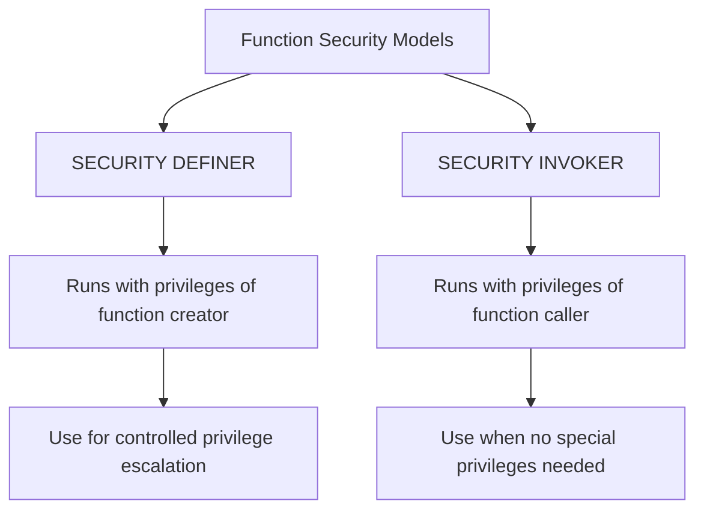

# PostgreSQL Trigger Security

## Introduction

Triggers are powerful mechanisms in PostgreSQL that automatically execute functions in response to database events. While triggers can significantly enhance database functionality, they also introduce security considerations that must be addressed to prevent unauthorized access or unintended operations. This guide explores the security aspects of PostgreSQL triggers, helping you implement robust and secure trigger systems in your applications.

## Understanding Trigger Security Contexts

In PostgreSQL, triggers execute within a specific security context that determines their permissions and capabilities.

### Execution Context

Triggers in PostgreSQL execute with the privileges of the user who created the trigger, not the user who initiated the operation that fired the trigger. This concept is crucial to understand:

```sql
-- Example: Trigger execution context
CREATE TABLE sensitive_data (
  id SERIAL PRIMARY KEY,
  data TEXT,
  last_modified TIMESTAMP
);

CREATE OR REPLACE FUNCTION update_last_modified()
RETURNS TRIGGER AS $$
BEGIN
  NEW.last_modified = NOW();
  RETURN NEW;
END;
$$ LANGUAGE plpgsql;

CREATE TRIGGER set_last_modified
BEFORE UPDATE ON sensitive_data
FOR EACH ROW
EXECUTE FUNCTION update_last_modified();
```

When any user updates the `sensitive_data` table, the trigger executes with the permissions of the user who created the trigger, not the user performing the update. This has important security implications.

## Security Risks with Triggers

### Privilege Escalation

One of the main security risks with triggers is privilege escalation, where a user with limited permissions might indirectly perform operations they wouldn't normally be allowed to do.

```sql
-- A trigger function that could lead to privilege escalation
CREATE OR REPLACE FUNCTION log_data_changes()
RETURNS TRIGGER AS $$
BEGIN
  -- This inserts into a table that regular users might not have access to
  INSERT INTO admin_audit_log (table_name, operation, user_name, changed_at)
  VALUES (TG_TABLE_NAME, TG_OP, CURRENT_USER, NOW());
  
  RETURN NEW;
END;
$$ LANGUAGE plpgsql;
```

In this example, a regular user updating the table would indirectly cause an insert into the `admin_audit_log` table, which they might not have direct permission to modify.

### Data Leakage

Triggers can potentially leak sensitive data, especially if they're not carefully designed:

```sql
-- Risky trigger that could leak data
CREATE OR REPLACE FUNCTION notify_data_change()
RETURNS TRIGGER AS $$
BEGIN
  -- This might expose sensitive data in database logs
  RAISE NOTICE 'Data changed: %', NEW.sensitive_field;
  
  RETURN NEW;
END;
$$ LANGUAGE plpgsql;
```

This trigger outputs the value of a sensitive field to the database logs, which might be accessible to database administrators or could appear in error reports.

## Implementing Secure Triggers

### Principle of Least Privilege

Always follow the principle of least privilege when creating triggers:

```sql
-- Create a role with minimal permissions
CREATE ROLE trigger_executor;
GRANT SELECT, INSERT ON audit_log TO trigger_executor;

-- Create the function with security definer
CREATE OR REPLACE FUNCTION secure_audit_log()
RETURNS TRIGGER AS $$
BEGIN
  INSERT INTO audit_log (table_name, operation, changed_at)
  VALUES (TG_TABLE_NAME, TG_OP, NOW());
  
  RETURN NEW;
END;
$$ LANGUAGE plpgsql
SECURITY DEFINER
SET ROLE trigger_executor;
```

This approach:
1. Creates a role with only the permissions needed
2. Uses `SECURITY DEFINER` to run the function with the creator's permissions
3. Sets the role to a restricted role inside the function

### Security Definer vs. Security Invoker

PostgreSQL offers two security models for functions (including trigger functions):



The default is `SECURITY INVOKER`, but for triggers, you often need `SECURITY DEFINER` to perform privileged operations while restricting what those operations can do.

### Row-Level Security with Triggers

Triggers can complement row-level security (RLS) policies:

```sql
-- Table with RLS
CREATE TABLE customer_data (
  id SERIAL PRIMARY KEY,
  customer_id INTEGER,
  data TEXT
);

-- Enable RLS
ALTER TABLE customer_data ENABLE ROW LEVEL SECURITY;

-- Create policy
CREATE POLICY customer_data_policy ON customer_data
  USING (customer_id = CURRENT_SETTING('app.current_customer_id')::INTEGER);

-- Trigger to enforce additional security
CREATE OR REPLACE FUNCTION validate_customer_access()
RETURNS TRIGGER AS $$
BEGIN
  IF NOT EXISTS (
    SELECT 1 FROM user_customers 
    WHERE user_id = CURRENT_USER::INTEGER 
    AND customer_id = NEW.customer_id
  ) THEN
    RAISE EXCEPTION 'Not authorized to modify this customer data';
  END IF;
  
  RETURN NEW;
END;
$$ LANGUAGE plpgsql;

CREATE TRIGGER check_customer_access
BEFORE INSERT OR UPDATE ON customer_data
FOR EACH ROW
EXECUTE FUNCTION validate_customer_access();
```

This example uses a trigger to provide an additional layer of security validation beyond RLS.

## Best Practices for Trigger Security

### Audit Trigger Example

Here's a secure pattern for implementing an audit trigger:

```sql
-- Audit table
CREATE TABLE audit_trail (
  id SERIAL PRIMARY KEY,
  table_name TEXT NOT NULL,
  operation TEXT NOT NULL,
  record_id INTEGER,
  old_data JSONB,
  new_data JSONB,
  changed_by TEXT NOT NULL,
  changed_at TIMESTAMP NOT NULL
);

-- Create a limited role for audit functions
CREATE ROLE audit_role;
GRANT INSERT ON audit_trail TO audit_role;

-- Create the audit function
CREATE OR REPLACE FUNCTION audit_changes()
RETURNS TRIGGER AS $$
DECLARE
  record_id INTEGER;
  old_data JSONB := NULL;
  new_data JSONB := NULL;
BEGIN
  -- Get record ID based on operation
  IF (TG_OP = 'DELETE') THEN
    record_id := OLD.id;
    old_data := row_to_json(OLD)::JSONB;
  ELSIF (TG_OP = 'UPDATE') THEN
    record_id := NEW.id;
    old_data := row_to_json(OLD)::JSONB;
    new_data := row_to_json(NEW)::JSONB;
  ELSE -- INSERT
    record_id := NEW.id;
    new_data := row_to_json(NEW)::JSONB;
  END IF;

  -- Insert audit record
  INSERT INTO audit_trail (
    table_name, operation, record_id, 
    old_data, new_data, changed_by, changed_at
  ) VALUES (
    TG_TABLE_NAME, TG_OP, record_id,
    old_data, new_data, CURRENT_USER, NOW()
  );

  RETURN NULL; -- for AFTER triggers
END;
$$ LANGUAGE plpgsql
SECURITY DEFINER
SET ROLE audit_role;

-- Apply the trigger to a table
CREATE TRIGGER audit_users_changes
AFTER INSERT OR UPDATE OR DELETE ON users
FOR EACH ROW EXECUTE FUNCTION audit_changes();
```

This implements a comprehensive audit system with:
- Secure role-based permissions
- Limited privileges through `SET ROLE`
- JSON storage of old and new data states

### Securing Sensitive Data in Triggers

When working with sensitive data, consider these techniques:

```sql
-- Function that securely handles sensitive data
CREATE OR REPLACE FUNCTION process_payment_data()
RETURNS TRIGGER AS $$
DECLARE
  masked_card VARCHAR;
BEGIN
  -- Only store last 4 digits of credit card
  masked_card := 'XXXX-XXXX-XXXX-' || RIGHT(NEW.credit_card, 4);
  
  -- Replace sensitive data before storing
  NEW.credit_card := masked_card;
  
  -- Clear other sensitive fields
  NEW.cvv := NULL;
  
  RETURN NEW;
END;
$$ LANGUAGE plpgsql;

CREATE TRIGGER secure_payment_data
BEFORE INSERT OR UPDATE ON payment_info
FOR EACH ROW
EXECUTE FUNCTION process_payment_data();
```

This trigger automatically masks sensitive credit card information and removes CVV data before it's stored in the database.

## Trigger Security Testing

It's important to test your trigger security implementation. Here's a practical example of testing a secure audit trigger:

```sql
-- Create test tables
CREATE TABLE test_secured (
  id SERIAL PRIMARY KEY,
  data TEXT
);

-- Apply audit trigger
CREATE TRIGGER audit_test_secured
AFTER INSERT OR UPDATE OR DELETE ON test_secured
FOR EACH ROW EXECUTE FUNCTION audit_changes();

-- Create test users
CREATE ROLE regular_user;
GRANT SELECT, INSERT, UPDATE, DELETE ON test_secured TO regular_user;
GRANT USAGE, SELECT ON SEQUENCE test_secured_id_seq TO regular_user;

-- Test script (run as different users)
-- First as admin/owner:
INSERT INTO test_secured (data) VALUES ('test data 1');

-- Then connect as regular_user and run:
-- INSERT INTO test_secured (data) VALUES ('test data 2');
-- UPDATE test_secured SET data = 'modified data' WHERE id = 1;
-- DELETE FROM test_secured WHERE id = 2;

-- Check audit trail (as admin)
SELECT * FROM audit_trail WHERE table_name = 'test_secured';
```

The output will look something like:

```
 id | table_name  | operation | record_id |       old_data        |        new_data        |  changed_by   |        changed_at        
----+-------------+-----------+-----------+-----------------------+------------------------+---------------+---------------------------
  1 | test_secured | INSERT    |         1 | null                  | {"id":1,"data":"test data 1"} | postgres      | 2023-10-15 14:30:22.543621
  2 | test_secured | INSERT    |         2 | null                  | {"id":2,"data":"test data 2"} | regular_user  | 2023-10-15 14:31:05.762134
  3 | test_secured | UPDATE    |         1 | {"id":1,"data":"test data 1"} | {"id":1,"data":"modified data"} | regular_user  | 2023-10-15 14:31:30.123456
  4 | test_secured | DELETE    |         2 | {"id":2,"data":"test data 2"} | null                   | regular_user  | 2023-10-15 14:32:10.987654
```

This test confirms that the audit trigger correctly records all operations with appropriate user attribution, even when different users perform the actions.

## Troubleshooting Security Issues

When working with trigger security, you might encounter these common issues:

1. **Permission errors**: Trigger function fails because it attempts operations the trigger owner doesn't have permission for
2. **Unexpected data modifications**: Triggers might modify data in ways users don't expect
3. **Performance impacts**: Security checks in triggers might impact performance

To troubleshoot these issues:

```sql
-- Enable more verbose logging for trigger execution
SET log_min_messages TO DEBUG;

-- Test trigger with explicit user context
SET ROLE test_user;
INSERT INTO test_table (data) VALUES ('test');
RESET ROLE;

-- Check for trigger execution in logs
-- Look in PostgreSQL log files for DEBUG level messages
```

## Summary

Proper security for PostgreSQL triggers is essential for maintaining data integrity and preventing unauthorized access. Key takeaways include:

1. Understand that triggers execute with the privileges of their creator, not the operation invoker
2. Use `SECURITY DEFINER` with `SET ROLE` to implement least privilege principles
3. Be careful about potential data leakage in trigger functions
4. Test trigger security thoroughly with different user contexts
5. Implement audit trails to track changes made through triggers
6. Mask or protect sensitive data within trigger functions

By following these best practices, you can safely leverage PostgreSQL triggers while maintaining a strong security posture for your database applications.

## Additional Resources and Exercises

### Resources

* [PostgreSQL Documentation on Trigger Security](https://www.postgresql.org/docs/current/sql-createtrigger.html)
* [PostgreSQL Security Best Practices](https://www.postgresql.org/docs/current/user-manag.html)

### Exercises

1. Create a secure audit trigger that logs all changes to a table but masks any columns containing the word "password" or "secret"
2. Implement row-level security on a table and use a trigger to enforce additional validation rules
3. Set up a test environment with multiple user roles and verify that your trigger security works as expected
4. Create a trigger that uses different levels of access based on the time of day (more restrictive during non-business hours)
5. Implement a trigger-based approval system where certain changes must be approved before becoming permanent