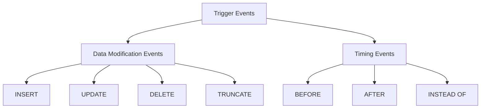

# PostgreSQL Trigger Events

## Introduction

Triggers in PostgreSQL are database callback functions that are automatically executed when specific events occur on a particular table or view. The events that can cause a trigger to fire are called "trigger events." Understanding these events is crucial for implementing effective database automation and enforcing business rules at the database level.

In this tutorial, we'll explore the various trigger events available in PostgreSQL, when to use them, and how they differ from one another. By the end, you'll be able to choose the right trigger event for your specific use case.

## Types of Trigger Events in PostgreSQL

PostgreSQL provides several types of events that can activate triggers:

1. **Data Modification Events**: `INSERT`, `UPDATE`, `DELETE`, `TRUNCATE`
2. **Timing Events**: `BEFORE`, `AFTER`, `INSTEAD OF`

Let's visualize the relationship between these events:



## Data Modification Trigger Events

### INSERT Event

The `INSERT` event fires when a new row is added to a table. This is useful for validating new data or performing additional actions when records are created.

#### Example: Creating an `INSERT` Trigger

```sql
CREATE OR REPLACE FUNCTION log_new_employee()
RETURNS TRIGGER AS $$
BEGIN
    INSERT INTO employee_audit(employee_id, changed_on, action)
    VALUES(NEW.id, NOW(), 'INSERT');
    RETURN NEW;
END;
$$ LANGUAGE plpgsql;

CREATE TRIGGER after_employee_insert
AFTER INSERT ON employees
FOR EACH ROW
EXECUTE FUNCTION log_new_employee();
```

In this example, whenever a new employee is added to the `employees` table, the trigger automatically logs this action in an audit table.

### UPDATE Event

The `UPDATE` event occurs when existing rows in a table are modified. This is helpful for tracking changes or enforcing business rules during updates.

#### Example: Creating an `UPDATE` Trigger

```sql
CREATE OR REPLACE FUNCTION log_employee_changes()
RETURNS TRIGGER AS $$
BEGIN
    IF NEW.salary <> OLD.salary THEN
        INSERT INTO salary_changes(employee_id, old_salary, new_salary, changed_on)
        VALUES(NEW.id, OLD.salary, NEW.salary, NOW());
    END IF;
    RETURN NEW;
END;
$$ LANGUAGE plpgsql;

CREATE TRIGGER after_employee_update
AFTER UPDATE ON employees
FOR EACH ROW
EXECUTE FUNCTION log_employee_changes();
```

This trigger tracks salary changes by recording the old and new salary values whenever an employee's record is updated.

### DELETE Event

The `DELETE` event triggers when rows are removed from a table. It's commonly used for maintaining referential integrity or creating audit trails.

#### Example: Creating a `DELETE` Trigger

```sql
CREATE OR REPLACE FUNCTION archive_deleted_employee()
RETURNS TRIGGER AS $$
BEGIN
    INSERT INTO former_employees(id, name, position, departure_date)
    VALUES(OLD.id, OLD.name, OLD.position, NOW());
    RETURN OLD;
END;
$$ LANGUAGE plpgsql;

CREATE TRIGGER before_employee_delete
BEFORE DELETE ON employees
FOR EACH ROW
EXECUTE FUNCTION archive_deleted_employee();
```

When an employee is deleted, this trigger preserves their information in an archive table before the deletion completes.

### TRUNCATE Event

The `TRUNCATE` event fires when a `TRUNCATE` command is executed on a table. Unlike other events, `TRUNCATE` triggers can only be defined at the statement level, not for each row.

#### Example: Creating a `TRUNCATE` Trigger

```sql
CREATE OR REPLACE FUNCTION log_truncate()
RETURNS TRIGGER AS $$
BEGIN
    INSERT INTO admin_actions(action, table_name, performed_on)
    VALUES('TRUNCATE', TG_TABLE_NAME, NOW());
    RETURN NULL;
END;
$$ LANGUAGE plpgsql;

CREATE TRIGGER on_truncate
BEFORE TRUNCATE ON employees
EXECUTE FUNCTION log_truncate();
```

This trigger logs administrative actions when someone truncates the employees table.

## Timing Trigger Events

The timing of a trigger determines when the trigger function executes relative to the database operation.

### BEFORE Event

`BEFORE` triggers fire before the actual database operation occurs. They can:
- Modify the values being inserted/updated
- Perform validations and potentially cancel the operation
- Execute before constraints are checked

#### Example: Validation with `BEFORE` Trigger

```sql
CREATE OR REPLACE FUNCTION validate_employee_salary()
RETURNS TRIGGER AS $$
BEGIN
    IF NEW.salary < 0 THEN
        RAISE EXCEPTION 'Salary cannot be negative';
    END IF;
    
    -- Convert salary to two decimal places
    NEW.salary := ROUND(NEW.salary::numeric, 2);
    
    RETURN NEW;
END;
$$ LANGUAGE plpgsql;

CREATE TRIGGER before_employee_changes
BEFORE INSERT OR UPDATE ON employees
FOR EACH ROW
EXECUTE FUNCTION validate_employee_salary();
```

This trigger validates and formats salary data before it's saved to the database.

### AFTER Event

`AFTER` triggers execute after the operation and all constraints have been checked. They're ideal for:
- Audit logging
- Cascading updates to other tables
- Actions that should happen only if the operation succeeds

#### Example: Cascading Updates with `AFTER` Trigger

```sql
CREATE OR REPLACE FUNCTION update_department_stats()
RETURNS TRIGGER AS $$
BEGIN
    UPDATE departments
    SET employee_count = (
        SELECT COUNT(*) FROM employees
        WHERE department_id = NEW.department_id
    )
    WHERE id = NEW.department_id;
    
    RETURN NULL; -- Result is ignored for AFTER triggers
END;
$$ LANGUAGE plpgsql;

CREATE TRIGGER after_employee_changes
AFTER INSERT OR UPDATE OR DELETE ON employees
FOR EACH ROW
EXECUTE FUNCTION update_department_stats();
```

This trigger automatically updates the employee count in the departments table whenever employee data changes.

### INSTEAD OF Event

`INSTEAD OF` triggers are special triggers that apply only to views, not tables. They allow you to define what happens when someone attempts to modify data through a view.

#### Example: Updating Through a View with `INSTEAD OF` Trigger

```sql
CREATE VIEW employee_details AS
SELECT e.id, e.name, d.name AS department_name
FROM employees e
JOIN departments d ON e.department_id = d.id;

CREATE OR REPLACE FUNCTION update_employee_through_view()
RETURNS TRIGGER AS $$
BEGIN
    UPDATE employees
    SET name = NEW.name
    WHERE id = NEW.id;
    
    RETURN NEW;
END;
$$ LANGUAGE plpgsql;

CREATE TRIGGER instead_of_employee_update
INSTEAD OF UPDATE ON employee_details
FOR EACH ROW
EXECUTE FUNCTION update_employee_through_view();
```

This setup allows updates to the `employee_details` view to be translated into updates to the underlying `employees` table.

## Combining Events

PostgreSQL allows you to combine multiple events in a single trigger definition, making your code more concise.

### Example: Multi-Event Trigger

```sql
CREATE OR REPLACE FUNCTION track_employee_changes()
RETURNS TRIGGER AS $$
BEGIN
    IF TG_OP = 'INSERT' THEN
        INSERT INTO employee_audit(employee_id, action, changed_on)
        VALUES(NEW.id, 'INSERT', NOW());
        RETURN NEW;
    ELSIF TG_OP = 'UPDATE' THEN
        INSERT INTO employee_audit(employee_id, action, changed_on)
        VALUES(NEW.id, 'UPDATE', NOW());
        RETURN NEW;
    ELSIF TG_OP = 'DELETE' THEN
        INSERT INTO employee_audit(employee_id, action, changed_on)
        VALUES(OLD.id, 'DELETE', NOW());
        RETURN OLD;
    END IF;
    
    RETURN NULL;
END;
$$ LANGUAGE plpgsql;

CREATE TRIGGER employee_audit_trigger
AFTER INSERT OR UPDATE OR DELETE ON employees
FOR EACH ROW
EXECUTE FUNCTION track_employee_changes();
```

This single trigger handles multiple events by checking the `TG_OP` variable, which contains the operation type ('INSERT', 'UPDATE', or 'DELETE').

## Real-World Applications

### Example 1: Versioning System

In this example, we'll implement a simple versioning system for product data:

```sql
-- Create tables
CREATE TABLE products (
    id SERIAL PRIMARY KEY,
    name VARCHAR(100),
    price DECIMAL(10,2),
    description TEXT,
    last_updated TIMESTAMP DEFAULT NOW()
);

CREATE TABLE product_history (
    id SERIAL PRIMARY KEY,
    product_id INTEGER REFERENCES products(id),
    name VARCHAR(100),
    price DECIMAL(10,2),
    description TEXT,
    changed_on TIMESTAMP,
    operation CHAR(1)
);

-- Create trigger function
CREATE OR REPLACE FUNCTION track_product_changes()
RETURNS TRIGGER AS $$
BEGIN
    IF TG_OP = 'INSERT' THEN
        INSERT INTO product_history(product_id, name, price, description, changed_on, operation)
        VALUES(NEW.id, NEW.name, NEW.price, NEW.description, NOW(), 'I');
    ELSIF TG_OP = 'UPDATE' THEN
        INSERT INTO product_history(product_id, name, price, description, changed_on, operation)
        VALUES(NEW.id, NEW.name, NEW.price, NEW.description, NOW(), 'U');
        -- Update last_updated timestamp
        NEW.last_updated := NOW();
    ELSIF TG_OP = 'DELETE' THEN
        INSERT INTO product_history(product_id, name, price, description, changed_on, operation)
        VALUES(OLD.id, OLD.name, OLD.price, OLD.description, NOW(), 'D');
    END IF;
    
    RETURN TG_OP = 'DELETE' ? OLD : NEW;
END;
$$ LANGUAGE plpgsql;

-- Create trigger
CREATE TRIGGER product_version_trigger
BEFORE INSERT OR UPDATE OR DELETE ON products
FOR EACH ROW
EXECUTE FUNCTION track_product_changes();
```

This setup creates a complete history of all product changes, including inserts, updates, and deletes.

### Example 2: Automated Inventory Management

In this example, we'll use triggers to automatically update inventory when orders are placed:

```sql
-- Create tables
CREATE TABLE products (
    id SERIAL PRIMARY KEY,
    name VARCHAR(100),
    stock_quantity INTEGER CHECK (stock_quantity >= 0),
    price DECIMAL(10,2)
);

CREATE TABLE orders (
    id SERIAL PRIMARY KEY,
    customer_id INTEGER,
    order_date TIMESTAMP DEFAULT NOW()
);

CREATE TABLE order_items (
    id SERIAL PRIMARY KEY,
    order_id INTEGER REFERENCES orders(id),
    product_id INTEGER REFERENCES products(id),
    quantity INTEGER CHECK (quantity > 0),
    unit_price DECIMAL(10,2)
);

-- Create trigger function
CREATE OR REPLACE FUNCTION update_inventory()
RETURNS TRIGGER AS $$
BEGIN
    -- Decrease stock quantity
    UPDATE products
    SET stock_quantity = stock_quantity - NEW.quantity
    WHERE id = NEW.product_id;
    
    -- Check if we have inventory problems after the update
    IF (SELECT stock_quantity FROM products WHERE id = NEW.product_id) < 0 THEN
        RAISE EXCEPTION 'Not enough inventory for product %', NEW.product_id;
    END IF;
    
    -- Store the current product price in the order
    NEW.unit_price := (SELECT price FROM products WHERE id = NEW.product_id);
    
    RETURN NEW;
END;
$$ LANGUAGE plpgsql;

-- Create trigger
CREATE TRIGGER after_order_item_insert
BEFORE INSERT ON order_items
FOR EACH ROW
EXECUTE FUNCTION update_inventory();
```

This trigger automatically:
1. Reduces inventory when order items are added
2. Prevents orders that would result in negative inventory
3. Captures the current product price in the order

## Best Practices for Trigger Events

When working with PostgreSQL trigger events, keep these best practices in mind:

1. **Choose the right timing**:
   - Use `BEFORE` triggers for validation and data modification
   - Use `AFTER` triggers for audit logging and cascading updates
   - Use `INSTEAD OF` triggers only for views

2. **Keep triggers lightweight**:
   - Avoid complex processing in triggers
   - Consider using background workers for heavy tasks

3. **Be careful with recursive triggers**:
   - Triggers that modify tables with other triggers can cause cascading effects
   - Use conditional logic to prevent infinite loops

4. **Test thoroughly**:
   - Triggers can have unexpected side effects
   - Test all possible data scenarios

5. **Document your triggers**:
   - Add comments explaining the purpose of each trigger
   - Keep track of all triggers in your schema documentation

## Common Pitfalls

1. **Trigger Overuse**:
   Implementing too many triggers can make your database behavior difficult to understand and debug.

2. **Performance Issues**:
   Triggers execute for each affected row, so they can significantly impact performance on large operations.

3. **Transaction Complexity**:
   Triggers add complexity to transactions and can make rollbacks more complicated.

4. **Maintenance Challenges**:
   Triggers create "invisible" functionality that might be overlooked during schema changes.

## Summary

PostgreSQL trigger events provide a powerful way to automate database operations and enforce business rules. We've covered:

- The main types of trigger events: `INSERT`, `UPDATE`, `DELETE`, and `TRUNCATE`
- Timing options: `BEFORE`, `AFTER`, and `INSTEAD OF`
- How to combine multiple events in a single trigger
- Real-world applications of triggers
- Best practices and common pitfalls

By understanding these concepts, you can leverage PostgreSQL triggers to create more robust, automated, and consistent database applications.

## Further Learning

To practice your understanding of PostgreSQL trigger events, try these exercises:

1. Create a trigger that ensures employee salaries can never decrease
2. Implement a system that tracks login/logout times using triggers
3. Build a simple audit system that tracks all changes to a customer table
4. Create a view with an `INSTEAD OF` trigger that distributes inserts across multiple tables based on data characteristics

## Additional Resources

- [PostgreSQL Official Documentation on Triggers](https://www.postgresql.org/docs/current/trigger-definition.html)
- [PL/pgSQL Language Reference](https://www.postgresql.org/docs/current/plpgsql.html)
- [PostgreSQL Performance Tips](https://www.postgresql.org/docs/current/performance-tips.html)