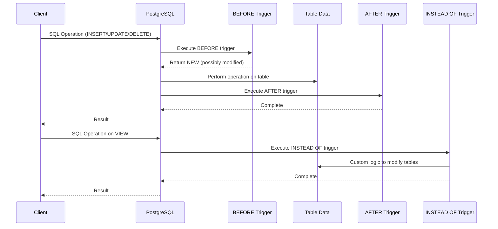

# PostgreSQL Trigger Timing

## Introduction

When working with triggers in PostgreSQL, one of the most important concepts to understand is **trigger timing**. Trigger timing determines *when* your trigger function executes in relation to the database event that activates it. The timing you choose significantly impacts your trigger's behavior and can be crucial for maintaining data integrity.

In PostgreSQL, trigger timing comes in two main varieties:
- **BEFORE** triggers
- **AFTER** triggers

Additionally, there's a special case:
- **INSTEAD OF** triggers (only for views)

This guide will explore each timing option in depth, with examples and practical applications to help you choose the right timing for your specific use case.

## BEFORE Triggers

### What Are BEFORE Triggers?

As the name suggests, `BEFORE` triggers execute *before* the actual database operation (INSERT, UPDATE, DELETE) takes place. This timing gives you the opportunity to:

- Modify the data that will be inserted or updated
- Validate data before changes are applied
- Reject operations by returning `NULL`

### Syntax

```sql
CREATE TRIGGER trigger_name
BEFORE INSERT OR UPDATE OR DELETE ON table_name
FOR EACH ROW
EXECUTE FUNCTION trigger_function();
```

### How BEFORE Triggers Work

When a `BEFORE` trigger executes:

1. The trigger function runs
2. If the function returns `NULL`, the operation is canceled
3. If the function returns a value (typically `NEW` for INSERT/UPDATE), the operation continues with potentially modified data

### Example: Data Validation

Let's create a `BEFORE INSERT` trigger that ensures product prices are never negative:

```sql
-- First, create our products table
CREATE TABLE products (
    product_id SERIAL PRIMARY KEY,
    name VARCHAR(100) NOT NULL,
    price DECIMAL(10, 2) NOT NULL
);

-- Create the trigger function
CREATE OR REPLACE FUNCTION validate_product_price()
RETURNS TRIGGER AS $$
BEGIN
    -- Check if price is negative
    IF NEW.price < 0 THEN
        RAISE EXCEPTION 'Product price cannot be negative';
    END IF;
    
    -- If price is zero, log a warning message
    IF NEW.price = 0 THEN
        RAISE NOTICE 'Adding a free product: %', NEW.name;
    END IF;
    
    -- Return NEW to allow the insert to proceed
    RETURN NEW;
END;
$$ LANGUAGE plpgsql;

-- Create the trigger
CREATE TRIGGER before_product_insert
BEFORE INSERT ON products
FOR EACH ROW
EXECUTE FUNCTION validate_product_price();
```

### Testing Our BEFORE Trigger

```sql
-- This works fine
INSERT INTO products (name, price) VALUES ('Notebook', 12.99);

-- This raises a warning but succeeds
INSERT INTO products (name, price) VALUES ('Free Sample', 0);

-- This fails with an exception
INSERT INTO products (name, price) VALUES ('Discounted Item', -5.00);
```

Output:
```
NOTICE:  Adding a free product: Free Sample
ERROR:  Product price cannot be negative
```

### BEFORE Triggers for Data Modifications

`BEFORE` triggers can also modify the data being inserted or updated:

```sql
-- Create a trigger function to standardize product names
CREATE OR REPLACE FUNCTION standardize_product_name()
RETURNS TRIGGER AS $$
BEGIN
    -- Convert name to title case
    NEW.name = initcap(NEW.name);
    
    RETURN NEW;
END;
$$ LANGUAGE plpgsql;

-- Create the trigger
CREATE TRIGGER before_product_name_standardize
BEFORE INSERT OR UPDATE ON products
FOR EACH ROW
EXECUTE FUNCTION standardize_product_name();
```

Now if we insert:
```sql
INSERT INTO products (name, price) VALUES ('blue pen', 1.99);
SELECT * FROM products WHERE name LIKE '%Pen%';
```

Output:
```
 product_id |  name   | price 
------------+---------+-------
          4 | Blue Pen|  1.99
```

The trigger automatically converted "blue pen" to "Blue Pen" before storing it.

## AFTER Triggers

### What Are AFTER Triggers?

`AFTER` triggers execute *after* the database operation has already been completed. These triggers can't modify the data being changed or prevent the operation, but they're perfect for:

- Logging changes
- Maintaining derived data or secondary tables
- Sending notifications
- Performing additional operations that depend on the successful completion of the main operation

### Syntax

```sql
CREATE TRIGGER trigger_name
AFTER INSERT OR UPDATE OR DELETE ON table_name
FOR EACH ROW
EXECUTE FUNCTION trigger_function();
```

### How AFTER Triggers Work

1. The database operation completes successfully
2. The `AFTER` trigger executes
3. The trigger function can't modify the operation that just happened
4. If the trigger function raises an exception, the entire transaction is rolled back

### Example: Audit Logging

Let's create an audit log for our products table:

```sql
-- Create audit log table
CREATE TABLE product_audit_log (
    log_id SERIAL PRIMARY KEY,
    product_id INTEGER NOT NULL,
    action VARCHAR(10) NOT NULL,
    changed_at TIMESTAMP NOT NULL DEFAULT CURRENT_TIMESTAMP,
    old_data JSONB,
    new_data JSONB
);

-- Create the trigger function
CREATE OR REPLACE FUNCTION log_product_changes()
RETURNS TRIGGER AS $$
BEGIN
    IF TG_OP = 'INSERT' THEN
        INSERT INTO product_audit_log (product_id, action, new_data)
        VALUES (NEW.product_id, 'INSERT', row_to_json(NEW)::jsonb);
    ELSIF TG_OP = 'UPDATE' THEN
        INSERT INTO product_audit_log (product_id, action, old_data, new_data)
        VALUES (NEW.product_id, 'UPDATE', row_to_json(OLD)::jsonb, row_to_json(NEW)::jsonb);
    ELSIF TG_OP = 'DELETE' THEN
        INSERT INTO product_audit_log (product_id, action, old_data)
        VALUES (OLD.product_id, 'DELETE', row_to_json(OLD)::jsonb);
    END IF;
    
    RETURN NULL; -- Result is ignored for AFTER triggers
END;
$$ LANGUAGE plpgsql;

-- Create the trigger
CREATE TRIGGER after_product_change
AFTER INSERT OR UPDATE OR DELETE ON products
FOR EACH ROW
EXECUTE FUNCTION log_product_changes();
```

### Testing Our AFTER Trigger

```sql
-- Insert a new product
INSERT INTO products (name, price) VALUES ('Coffee Mug', 8.95);

-- Update a product
UPDATE products SET price = 9.95 WHERE name = 'Coffee Mug';

-- Delete a product
DELETE FROM products WHERE name = 'Coffee Mug';

-- Check our audit log
SELECT * FROM product_audit_log;
```

The audit log now contains entries for all these operations, including what data was changed, without affecting the operations themselves.

## INSTEAD OF Triggers

### What Are INSTEAD OF Triggers?

`INSTEAD OF` triggers are special triggers that apply only to views, not tables. As the name suggests, these triggers execute *instead of* the attempted operation on the view. They're essential for making views updatable when the default PostgreSQL rules can't handle it.

### When to Use INSTEAD OF Triggers

- For complex views that join multiple tables
- When you need custom logic for inserting, updating, or deleting through a view
- To create a user-friendly abstraction layer that simplifies data operations

### Syntax

```sql
CREATE TRIGGER trigger_name
INSTEAD OF INSERT OR UPDATE OR DELETE ON view_name
FOR EACH ROW
EXECUTE FUNCTION trigger_function();
```

### Example: Updatable View with INSTEAD OF Trigger

Let's create a view that combines product information with category data, and make it updatable:

```sql
-- Create a categories table
CREATE TABLE categories (
    category_id SERIAL PRIMARY KEY,
    category_name VARCHAR(50) NOT NULL
);

-- Add a category_id to our products table
ALTER TABLE products ADD COLUMN category_id INTEGER REFERENCES categories(category_id);

-- Insert some categories
INSERT INTO categories (category_name) VALUES ('Office Supplies'), ('Kitchen'), ('Electronics');

-- Create a view that joins products and categories
CREATE VIEW product_details AS
SELECT p.product_id, p.name, p.price, c.category_id, c.category_name
FROM products p
JOIN categories c ON p.category_id = c.category_id;

-- Create a trigger function for inserts
CREATE OR REPLACE FUNCTION insert_product_details()
RETURNS TRIGGER AS $$
BEGIN
    -- Insert the product using the category_id from the view
    INSERT INTO products (name, price, category_id)
    VALUES (NEW.name, NEW.price, NEW.category_id)
    RETURNING product_id INTO NEW.product_id;
    
    RETURN NEW;
END;
$$ LANGUAGE plpgsql;

-- Create the INSTEAD OF trigger
CREATE TRIGGER instead_of_insert_product_details
INSTEAD OF INSERT ON product_details
FOR EACH ROW
EXECUTE FUNCTION insert_product_details();
```

### Testing Our INSTEAD OF Trigger

Now we can insert through the view:

```sql
-- Insert a product through the view
INSERT INTO product_details (name, price, category_id, category_name)
VALUES ('Wireless Mouse', 24.99, 3, 'Electronics');

-- Query the view to see the result
SELECT * FROM product_details WHERE name = 'Wireless Mouse';
```

Output:
```
 product_id |     name      | price | category_id | category_name 
------------+---------------+-------+-------------+--------------
          7 | Wireless Mouse| 24.99 |           3 | Electronics
```

The `INSTEAD OF` trigger handled the insert operation, putting the data into the appropriate underlying table.

## Comparing Trigger Timings

Let's compare the different trigger timings with a diagram to help visualize when each type executes:



## Choosing the Right Trigger Timing

Here's a guide to help you choose the appropriate trigger timing:

| Timing | Use When You Need To |
|--------|----------------------|
| BEFORE | - Validate data before it's stored<br />- Modify incoming data (e.g., formatting, calculations)<br />- Potentially reject operations based on conditions |
| AFTER | - Log changes after they're confirmed<br />- Update derived data in other tables<br />- Perform follow-up actions that depend on successful changes<br />- Send notifications about changes |
| INSTEAD OF | - Make complex views updatable<br />- Implement custom logic for operations on views<br />- Create a simplified interface for complex data structures |

## Best Practices for Trigger Timing

1. **Use BEFORE triggers for data validation and modification**
   - Keep validation logic in BEFORE triggers to prevent invalid data from ever entering your tables
   - Use BEFORE triggers when you need to modify the data being changed

2. **Use AFTER triggers for side effects and derived data**
   - Keep secondary operations in AFTER triggers
   - Remember that AFTER triggers can't prevent the operation that triggered them

3. **Use INSTEAD OF triggers only for views**
   - Don't overcomplicate view logic; sometimes multiple simpler views are better than one complex view with triggers

4. **Consider transaction context**
   - Remember that if any part of a transaction fails (including triggers), the entire transaction is rolled back
   - For critical operations, consider using AFTER triggers in a separate transaction if appropriate

5. **Be cautious about trigger chains**
   - A trigger that modifies another table might fire other triggers
   - Long trigger chains can be hard to debug and may impact performance

## Practical Examples

### Example 1: Automatic Timestamp Management

```sql
-- Create a table with created_at and updated_at columns
CREATE TABLE articles (
    article_id SERIAL PRIMARY KEY,
    title VARCHAR(200) NOT NULL,
    content TEXT,
    created_at TIMESTAMP NOT NULL,
    updated_at TIMESTAMP NOT NULL
);

-- Create a function to manage timestamps
CREATE OR REPLACE FUNCTION manage_article_timestamps()
RETURNS TRIGGER AS $$
BEGIN
    IF TG_OP = 'INSERT' THEN
        NEW.created_at = CURRENT_TIMESTAMP;
        NEW.updated_at = CURRENT_TIMESTAMP;
    ELSIF TG_OP = 'UPDATE' THEN
        -- Keep the original created_at
        NEW.updated_at = CURRENT_TIMESTAMP;
    END IF;
    
    RETURN NEW;
END;
$$ LANGUAGE plpgsql;

-- Create the BEFORE trigger
CREATE TRIGGER before_article_timestamp
BEFORE INSERT OR UPDATE ON articles
FOR EACH ROW
EXECUTE FUNCTION manage_article_timestamps();
```

This BEFORE trigger automatically sets the timestamps without requiring application code to handle them.

### Example 2: Maintaining a Search Index

```sql
-- Create a full text search column in our articles table
ALTER TABLE articles ADD COLUMN search_vector tsvector;

-- Create a function to update the search vector
CREATE OR REPLACE FUNCTION update_article_search_vector()
RETURNS TRIGGER AS $$
BEGIN
    NEW.search_vector = to_tsvector('english', NEW.title || ' ' || NEW.content);
    RETURN NEW;
END;
$$ LANGUAGE plpgsql;

-- Create the BEFORE trigger
CREATE TRIGGER before_article_search_update
BEFORE INSERT OR UPDATE OF title, content ON articles
FOR EACH ROW
EXECUTE FUNCTION update_article_search_vector();
```

This BEFORE trigger maintains a search index automatically, making full-text searches more efficient.

### Example 3: Implementing Soft Deletes

```sql
-- Add deleted_at column to our products table
ALTER TABLE products ADD COLUMN deleted_at TIMESTAMP;

-- Create a view for active products
CREATE VIEW active_products AS
SELECT * FROM products WHERE deleted_at IS NULL;

-- Create a trigger function for soft deletes
CREATE OR REPLACE FUNCTION soft_delete_product()
RETURNS TRIGGER AS $$
BEGIN
    UPDATE products SET deleted_at = CURRENT_TIMESTAMP 
    WHERE product_id = OLD.product_id;
    RETURN NULL;
END;
$$ LANGUAGE plpgsql;

-- Create the INSTEAD OF trigger on the view
CREATE TRIGGER instead_of_delete_product
INSTEAD OF DELETE ON active_products
FOR EACH ROW
EXECUTE FUNCTION soft_delete_product();
```

This INSTEAD OF trigger implements "soft delete" functionality where records are marked as deleted rather than actually removed.

## Summary

Trigger timing is a fundamental concept in PostgreSQL that determines when your custom logic executes in relation to database operations:

- **BEFORE triggers** run before the operation, allowing data validation and modification
- **AFTER triggers** run after the operation completes, perfect for logging and secondary operations
- **INSTEAD OF triggers** replace the standard operation on views, enabling custom handling of view updates

Choosing the right timing is essential for implementing your database logic correctly. By understanding the strengths and limitations of each timing option, you can create more robust, maintainable database applications.

## Exercises

1. Create a BEFORE trigger that ensures all product names are at least 3 characters long.
2. Implement an AFTER trigger that keeps a count of products per category in a separate summary table.
3. Create a view joining customers and orders, then implement an INSTEAD OF INSERT trigger that properly distributes the data to the appropriate tables.
4. Modify the audit logging example to include the username of the database user who made the change.
5. Create a trigger that prevents changes to products during non-business hours.

## Additional Resources

- [PostgreSQL Documentation on Triggers](https://www.postgresql.org/docs/current/trigger-definition.html)
- [PostgreSQL PL/pgSQL Language Documentation](https://www.postgresql.org/docs/current/plpgsql.html)
- [PostgreSQL Views and Updatable Views](https://www.postgresql.org/docs/current/sql-createview.html)