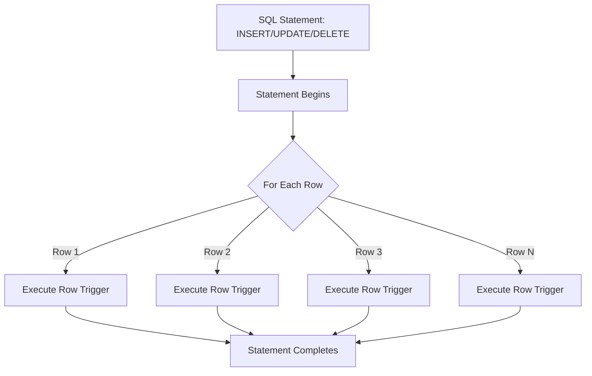

# PostgreSQL Row Triggers

## Introduction

Row triggers in PostgreSQL are database objects that automatically execute a specified function when certain events occur on individual rows in a table. Unlike statement triggers that fire once per SQL statement, row triggers fire once for each row affected by the SQL operation.

Row triggers are powerful tools for implementing complex business rules, maintaining data integrity, enforcing security policies, and automating related updates across your database.

## How Row Triggers Work

Row triggers operate at the row level, meaning they're executed for each individual row that is affected by an INSERT, UPDATE, or DELETE operation. This provides fine-grained control over your data transformations and validation.



### Trigger Timing

Row triggers can be configured to fire in different ways:

- **BEFORE triggers**: Execute before the actual row operation (INSERT, UPDATE, or DELETE)
- **AFTER triggers**: Execute after the row operation completes
- **INSTEAD OF triggers**: Replace the original operation with the trigger function (used with views)

## Creating Basic Row Triggers

Here's the basic syntax for creating a row trigger in PostgreSQL:

```sql
CREATE TRIGGER trigger_name
{BEFORE | AFTER | INSTEAD OF} {INSERT | UPDATE | DELETE | TRUNCATE}
ON table_name
FOR EACH ROW
[WHEN (condition)]
EXECUTE FUNCTION trigger_function();
```

Let's create a simple trigger function first, and then attach it to a table:

```sql
-- Create a trigger function
CREATE OR REPLACE FUNCTION log_employee_changes()
RETURNS TRIGGER AS $$
BEGIN
    IF TG_OP = 'INSERT' THEN
        INSERT INTO employee_audit(employee_id, changed_on, operation, new_data)
        VALUES(NEW.id, NOW(), 'INSERT', row_to_json(NEW));
        RETURN NEW;
    ELSIF TG_OP = 'UPDATE' THEN
        INSERT INTO employee_audit(employee_id, changed_on, operation, old_data, new_data)
        VALUES(NEW.id, NOW(), 'UPDATE', row_to_json(OLD), row_to_json(NEW));
        RETURN NEW;
    ELSIF TG_OP = 'DELETE' THEN
        INSERT INTO employee_audit(employee_id, changed_on, operation, old_data)
        VALUES(OLD.id, NOW(), 'DELETE', row_to_json(OLD));
        RETURN OLD;
    END IF;
    RETURN NULL;
END;
$$ LANGUAGE plpgsql;

-- Create the trigger
CREATE TRIGGER employee_audit_trigger
AFTER INSERT OR UPDATE OR DELETE ON employees
FOR EACH ROW
EXECUTE FUNCTION log_employee_changes();
```

## Working with OLD and NEW Values

Within a trigger function, you can access:

- **OLD**: A row variable holding the old version of the row (for UPDATE or DELETE operations)
- **NEW**: A row variable holding the new version of the row (for INSERT or UPDATE operations)

Availability depends on the operation:

| Operation | OLD available | NEW available |
|-----------|--------------|--------------|
| INSERT    | No           | Yes          |
| UPDATE    | Yes          | Yes          |
| DELETE    | Yes          | No           |

## Practical Examples

### Example 1: Automatically Updating a Timestamp

This example updates a `last_modified` timestamp whenever a row is changed:

```sql
-- Create a trigger function
CREATE OR REPLACE FUNCTION update_last_modified()
RETURNS TRIGGER AS $$
BEGIN
    NEW.last_modified = NOW();
    RETURN NEW;
END;
$$ LANGUAGE plpgsql;

-- Create the trigger
CREATE TRIGGER set_last_modified
BEFORE UPDATE ON products
FOR EACH ROW
EXECUTE FUNCTION update_last_modified();
```

Let's see it in action:

```sql
-- Create a sample table
CREATE TABLE products (
    id SERIAL PRIMARY KEY,
    name VARCHAR(100),
    price NUMERIC(10,2),
    last_modified TIMESTAMP DEFAULT NOW()
);

-- Insert a product
INSERT INTO products (name, price) VALUES ('Laptop', 999.99);

-- Check the initial data
SELECT * FROM products;
```

Output:
```
 id |  name  | price  |       last_modified        
----+--------+--------+----------------------------
  1 | Laptop | 999.99 | 2023-05-10 14:30:45.123456
```

Now let's update the product and see the timestamp change:

```sql
-- Update the product
UPDATE products SET price = 899.99 WHERE id = 1;

-- Check the updated data
SELECT * FROM products;
```

Output:
```
 id |  name  | price  |       last_modified        
----+--------+--------+----------------------------
  1 | Laptop | 899.99 | 2023-05-10 14:35:12.654321
```

### Example 2: Enforcing Business Rules

This example ensures that product prices can never be decreased by more than 50%:

```sql
-- Create a trigger function
CREATE OR REPLACE FUNCTION check_price_decrease()
RETURNS TRIGGER AS $$
BEGIN
    IF NEW.price < (OLD.price * 0.5) THEN
        RAISE EXCEPTION 'Price cannot be reduced by more than 50%%';
    END IF;
    RETURN NEW;
END;
$$ LANGUAGE plpgsql;

-- Create the trigger
CREATE TRIGGER enforce_price_policy
BEFORE UPDATE ON products
FOR EACH ROW
WHEN (NEW.price < OLD.price)
EXECUTE FUNCTION check_price_decrease();
```

Let's test our business rule:

```sql
-- This should work (10% reduction)
UPDATE products SET price = 809.99 WHERE id = 1;

-- This should fail (60% reduction)
UPDATE products SET price = 359.99 WHERE id = 1;
```

Output from the second UPDATE:
```
ERROR:  Price cannot be reduced by more than 50%
CONTEXT:  PL/pgSQL function check_price_decrease() line 4 at RAISE
```

### Example 3: Implementing Audit Trail

This expanded example creates a comprehensive audit system for a customer table:

```sql
-- Create tables
CREATE TABLE customers (
    id SERIAL PRIMARY KEY,
    name VARCHAR(100),
    email VARCHAR(100),
    status VARCHAR(20) DEFAULT 'active'
);

CREATE TABLE customer_audit (
    audit_id SERIAL PRIMARY KEY,
    customer_id INTEGER,
    changed_on TIMESTAMP,
    operation VARCHAR(10),
    changed_by VARCHAR(100),
    old_data JSONB,
    new_data JSONB
);

-- Create a trigger function
CREATE OR REPLACE FUNCTION audit_customers()
RETURNS TRIGGER AS $$
BEGIN
    INSERT INTO customer_audit(
        customer_id,
        changed_on,
        operation,
        changed_by,
        old_data,
        new_data
    )
    VALUES(
        COALESCE(NEW.id, OLD.id),
        NOW(),
        TG_OP,
        current_user,
        CASE WHEN TG_OP = 'DELETE' THEN to_jsonb(OLD) ELSE NULL END,
        CASE WHEN TG_OP IN ('INSERT', 'UPDATE') THEN to_jsonb(NEW) ELSE NULL END
    );
    RETURN NULL;
END;
$$ LANGUAGE plpgsql;

-- Create the trigger
CREATE TRIGGER customers_audit_trigger
AFTER INSERT OR UPDATE OR DELETE ON customers
FOR EACH ROW
EXECUTE FUNCTION audit_customers();
```

Let's demonstrate the audit functionality:

```sql
-- Insert a new customer
INSERT INTO customers (name, email)
VALUES ('John Doe', 'john@example.com');

-- Update the customer
UPDATE customers
SET email = 'john.doe@example.com'
WHERE id = 1;

-- Delete the customer
DELETE FROM customers WHERE id = 1;

-- Check the audit trail
SELECT * FROM customer_audit;
```

Output:
```
 audit_id | customer_id |        changed_on         | operation | changed_by |                     old_data                     |                      new_data                      
----------+-------------+---------------------------+-----------+------------+--------------------------------------------------+----------------------------------------------------
        1 |           1 | 2023-05-10 15:10:22.111222 | INSERT    | postgres   |                                                  | {"id": 1, "name": "John Doe", "email": "john@example.com", "status": "active"}
        2 |           1 | 2023-05-10 15:10:45.333444 | UPDATE    | postgres   | {"id": 1, "name": "John Doe", "email": "john@example.com", "status": "active"} | {"id": 1, "name": "John Doe", "email": "john.doe@example.com", "status": "active"}
        3 |           1 | 2023-05-10 15:11:10.555666 | DELETE    | postgres   | {"id": 1, "name": "John Doe", "email": "john.doe@example.com", "status": "active"} | 
```

## Advanced Techniques

### Conditional Triggers with WHEN

You can make your row triggers conditional by adding a WHEN clause:

```sql
CREATE TRIGGER update_premium_customers
AFTER UPDATE ON customers
FOR EACH ROW
WHEN (NEW.status = 'premium')
EXECUTE FUNCTION notify_premium_status();
```

This trigger will only fire for rows where the new status is 'premium'.

### Multiple Triggers on the Same Table

You can create multiple triggers on the same table that fire for the same events. PostgreSQL will execute them in alphabetical order by trigger name.

```sql
-- These will execute in order: a_first, b_second, c_third
CREATE TRIGGER a_first
BEFORE UPDATE ON products
FOR EACH ROW
EXECUTE FUNCTION log_changes();

CREATE TRIGGER b_second
BEFORE UPDATE ON products
FOR EACH ROW
EXECUTE FUNCTION validate_data();

CREATE TRIGGER c_third
BEFORE UPDATE ON products
FOR EACH ROW
EXECUTE FUNCTION update_timestamp();
```

To control the execution order more precisely, you can use the `DROP TRIGGER` and `CREATE TRIGGER` statements to rename your triggers.

### Disabling and Enabling Triggers

You can temporarily disable triggers:

```sql
-- Disable a specific trigger
ALTER TABLE products DISABLE TRIGGER update_timestamp;

-- Disable all triggers on a table
ALTER TABLE products DISABLE TRIGGER ALL;

-- Re-enable a trigger
ALTER TABLE products ENABLE TRIGGER update_timestamp;

-- Re-enable all triggers
ALTER TABLE products ENABLE TRIGGER ALL;
```

This is useful for bulk operations where you don't want triggers to fire for each row.

## Best Practices for Row Triggers

1. **Keep triggers lightweight**: Heavy processing in triggers can significantly slow down your database operations.

2. **Avoid infinite loops**: Be careful not to create triggers that could cause circular references.

3. **Use statement triggers when possible**: If you're performing the same operation for every row, consider using a statement trigger instead.

4. **Document your triggers**: They're often "invisible" during normal database operations but play critical roles.

5. **Consider transaction management**: Be aware of how triggers interact with transactions, especially when they perform operations that could fail.

6. **Test thoroughly**: Triggers can have unexpected side effects, so comprehensive testing is essential.

## Common Pitfalls

1. **Recursive triggers**: When a trigger causes the same trigger to fire again, creating an infinite loop.

2. **Performance degradation**: Slow-running triggers can severely impact database performance.

3. **Maintenance complexity**: Too many triggers can make database maintenance and troubleshooting difficult.

4. **Unexpected interactions**: Triggers might interact with constraints, defaults, or other database features in unexpected ways.

## Summary

Row triggers in PostgreSQL provide a powerful mechanism for automating database operations at the row level. They allow you to:

- Automatically maintain derived data
- Implement complex business rules
- Create comprehensive audit trails
- Enforce data consistency and integrity

By understanding how and when to use row triggers, you can build robust, self-maintaining database systems that enforce your business rules consistently.

## Exercises

1. Create a table `employees` with columns `id`, `name`, `department`, and `salary`. Write a row trigger that prevents salary decreases.

2. Implement an audit system for a `bank_accounts` table that logs all balance changes to a separate `account_transactions` table.

3. Create a trigger that automatically sets a `full_name` column by concatenating `first_name` and `last_name` columns whenever either of them changes.

4. Design a versioning system using triggers that keeps historical versions of rows in a separate history table.

## Additional Resources

- [PostgreSQL Documentation on Triggers](https://www.postgresql.org/docs/current/trigger-definition.html)
- [PostgreSQL PL/pgSQL Trigger Procedures](https://www.postgresql.org/docs/current/plpgsql-trigger.html)
- [PostgreSQL Trigger Examples](https://www.postgresql.org/docs/current/trigger-example.html)