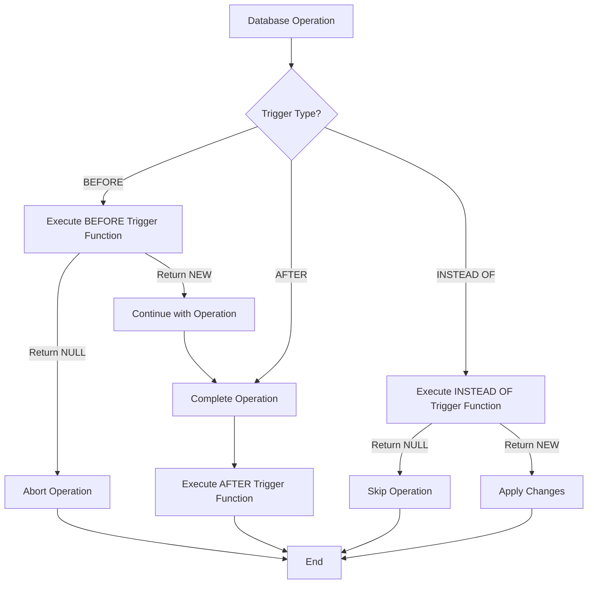

# PostgreSQL Trigger Functions

## Introduction

Trigger functions are the backbone of PostgreSQL's trigger system. While triggers define *when* an action should occur (before, after, or instead of specific database operations), trigger functions define *what* should happen when a trigger fires. Think of trigger functions as the brains behind your database automation.

In this guide, you'll learn how to create powerful trigger functions that can validate data, maintain audit trails, keep derived data in sync, and much more — all automatically whenever data changes in your database.

## What Are Trigger Functions?

A trigger function is a special type of PostgreSQL function that is called automatically when a trigger event occurs. These functions:

- Must return either `NULL` or a record/row value with the same structure as the table the trigger operates on
- Have access to special variables containing data about the event that fired the trigger
- Can perform virtually any operation you could do in a regular function, including modifying data in other tables

## Creating a Basic Trigger Function

Let's start with the syntax for creating a trigger function:

```sql
CREATE OR REPLACE FUNCTION function_name()
RETURNS TRIGGER AS $$
BEGIN
    -- Function logic goes here
    RETURN NEW; -- Or RETURN OLD, or RETURN NULL
END;
$$ LANGUAGE plpgsql;
```

The `RETURNS TRIGGER` clause identifies this as a trigger function, and `LANGUAGE plpgsql` specifies we're using PostgreSQL's procedural language.

### Special Variables in Trigger Functions

When working with trigger functions, you have access to these special variables:

- `NEW`: Contains the new database row for INSERT/UPDATE operations
- `OLD`: Contains the old database row for UPDATE/DELETE operations
- `TG_OP`: Contains the operation that triggered the function ('INSERT', 'UPDATE', 'DELETE')
- `TG_TABLE_NAME`: Contains the name of the table that triggered the function
- `TG_WHEN`: Contains 'BEFORE', 'AFTER', or 'INSTEAD OF'
- `TG_LEVEL`: Contains 'ROW' or 'STATEMENT'

## Example 1: Creating an Audit Trail

Let's create a trigger function that maintains an audit trail of all changes to a table:

First, let's create our tables:

```sql
-- Table to be audited
CREATE TABLE employees (
    id SERIAL PRIMARY KEY,
    name VARCHAR(100),
    position VARCHAR(100),
    salary NUMERIC(10,2)
);

-- Audit trail table
CREATE TABLE employee_audit (
    audit_id SERIAL PRIMARY KEY,
    table_name VARCHAR(50),
    user_name VARCHAR(50),
    operation VARCHAR(10),
    old_data JSONB,
    new_data JSONB,
    change_timestamp TIMESTAMP DEFAULT CURRENT_TIMESTAMP
);
```

Now, let's create the trigger function:

```sql
CREATE OR REPLACE FUNCTION log_employee_changes()
RETURNS TRIGGER AS $$
BEGIN
    IF TG_OP = 'INSERT' THEN
        INSERT INTO employee_audit(table_name, user_name, operation, new_data)
        VALUES(TG_TABLE_NAME, current_user, TG_OP, row_to_json(NEW)::jsonb);
        RETURN NEW;
    ELSIF TG_OP = 'UPDATE' THEN
        INSERT INTO employee_audit(table_name, user_name, operation, old_data, new_data)
        VALUES(TG_TABLE_NAME, current_user, TG_OP, row_to_json(OLD)::jsonb, row_to_json(NEW)::jsonb);
        RETURN NEW;
    ELSIF TG_OP = 'DELETE' THEN
        INSERT INTO employee_audit(table_name, user_name, operation, old_data)
        VALUES(TG_TABLE_NAME, current_user, TG_OP, row_to_json(OLD)::jsonb);
        RETURN OLD;
    END IF;
    RETURN NULL;
END;
$$ LANGUAGE plpgsql;
```

Finally, let's create the trigger that uses this function:

```sql
CREATE TRIGGER employee_audit_trigger
AFTER INSERT OR UPDATE OR DELETE ON employees
FOR EACH ROW
EXECUTE FUNCTION log_employee_changes();
```

Now, let's see our audit trail in action:

```sql
-- Insert a new employee
INSERT INTO employees (name, position, salary) VALUES ('John Doe', 'Developer', 75000);

-- Check the audit log
SELECT * FROM employee_audit;
```

**Output:**
```
 audit_id | table_name | user_name | operation |                                old_data                                |                                       new_data                                        |     change_timestamp     
----------+------------+-----------+-----------+------------------------------------------------------------------------+--------------------------------------------------------------------------------------+-------------------------
        1 | employees  | postgres  | INSERT    |                                                                        | {"id": 1, "name": "John Doe", "salary": 75000, "position": "Developer"}              | 2023-10-15 14:32:45.123
```

Now, let's update the employee:

```sql
-- Update employee salary
UPDATE employees SET salary = 80000 WHERE id = 1;

-- Check the audit log again
SELECT * FROM employee_audit;
```

**Output:**
```
 audit_id | table_name | user_name | operation |                                old_data                                |                                       new_data                                        |     change_timestamp     
----------+------------+-----------+-----------+------------------------------------------------------------------------+--------------------------------------------------------------------------------------+-------------------------
        1 | employees  | postgres  | INSERT    |                                                                        | {"id": 1, "name": "John Doe", "salary": 75000, "position": "Developer"}              | 2023-10-15 14:32:45.123
        2 | employees  | postgres  | UPDATE    | {"id": 1, "name": "John Doe", "salary": 75000, "position": "Developer"}| {"id": 1, "name": "John Doe", "salary": 80000, "position": "Developer"}              | 2023-10-15 14:33:12.456
```

## Example 2: Data Validation

Let's create a trigger function that validates data before it's inserted or updated:

```sql
CREATE OR REPLACE FUNCTION validate_employee()
RETURNS TRIGGER AS $$
BEGIN
    -- Check that salary is positive
    IF NEW.salary <= 0 THEN
        RAISE EXCEPTION 'Salary must be greater than zero';
    END IF;
    
    -- Check that name is not empty
    IF NEW.name = '' THEN
        RAISE EXCEPTION 'Employee name cannot be empty';
    END IF;
    
    -- All checks passed, return the new row
    RETURN NEW;
END;
$$ LANGUAGE plpgsql;
```

Now, let's create a trigger using this function:

```sql
CREATE TRIGGER validate_employee_trigger
BEFORE INSERT OR UPDATE ON employees
FOR EACH ROW
EXECUTE FUNCTION validate_employee();
```

Let's test our validation:

```sql
-- This should fail
INSERT INTO employees (name, position, salary) VALUES ('', 'Manager', 90000);
```

**Output:**
```
ERROR:  Employee name cannot be empty
CONTEXT:  PL/pgSQL function validate_employee() line 9 at RAISE
```

```sql
-- This should also fail
INSERT INTO employees (name, position, salary) VALUES ('Jane Smith', 'Designer', -5000);
```

**Output:**
```
ERROR:  Salary must be greater than zero
CONTEXT:  PL/pgSQL function validate_employee() line 4 at RAISE
```

```sql
-- This should succeed
INSERT INTO employees (name, position, salary) VALUES ('Jane Smith', 'Designer', 65000);
```

## Example 3: Maintaining Derived Data

Trigger functions are excellent for keeping derived data in sync. Let's create a table that tracks department statistics:

```sql
-- Create departments table
CREATE TABLE departments (
    id SERIAL PRIMARY KEY,
    name VARCHAR(100)
);

-- Create a table to store department stats
CREATE TABLE department_stats (
    department_id INTEGER PRIMARY KEY REFERENCES departments(id),
    employee_count INTEGER DEFAULT 0,
    avg_salary NUMERIC(10,2) DEFAULT 0,
    total_salary NUMERIC(12,2) DEFAULT 0
);

-- Add department_id to employees
ALTER TABLE employees ADD COLUMN department_id INTEGER REFERENCES departments(id);
```

Now, let's create a trigger function to update department statistics whenever employee data changes:

```sql
CREATE OR REPLACE FUNCTION update_department_stats()
RETURNS TRIGGER AS $$
DECLARE
    old_dept_id INTEGER;
    new_dept_id INTEGER;
BEGIN
    -- Set department IDs based on operation
    IF TG_OP = 'DELETE' THEN
        old_dept_id := OLD.department_id;
        new_dept_id := NULL;
    ELSIF TG_OP = 'UPDATE' THEN
        old_dept_id := OLD.department_id;
        new_dept_id := NEW.department_id;
    ELSIF TG_OP = 'INSERT' THEN
        old_dept_id := NULL;
        new_dept_id := NEW.department_id;
    END IF;
    
    -- Update old department stats if applicable
    IF old_dept_id IS NOT NULL THEN
        -- Ensure entry exists
        INSERT INTO department_stats (department_id)
        VALUES (old_dept_id)
        ON CONFLICT (department_id) DO NOTHING;
        
        -- Update stats
        UPDATE department_stats
        SET
            employee_count = (SELECT COUNT(*) FROM employees WHERE department_id = old_dept_id),
            total_salary = COALESCE((SELECT SUM(salary) FROM employees WHERE department_id = old_dept_id), 0),
            avg_salary = COALESCE((SELECT AVG(salary) FROM employees WHERE department_id = old_dept_id), 0)
        WHERE department_id = old_dept_id;
    END IF;
    
    -- Update new department stats if applicable
    IF new_dept_id IS NOT NULL THEN
        -- Ensure entry exists (if different from old)
        IF new_dept_id != COALESCE(old_dept_id, 0) THEN
            INSERT INTO department_stats (department_id)
            VALUES (new_dept_id)
            ON CONFLICT (department_id) DO NOTHING;
        END IF;
        
        -- Update stats
        UPDATE department_stats
        SET
            employee_count = (SELECT COUNT(*) FROM employees WHERE department_id = new_dept_id),
            total_salary = COALESCE((SELECT SUM(salary) FROM employees WHERE department_id = new_dept_id), 0),
            avg_salary = COALESCE((SELECT AVG(salary) FROM employees WHERE department_id = new_dept_id), 0)
        WHERE department_id = new_dept_id;
    END IF;
    
    -- Return the appropriate record based on operation
    IF TG_OP = 'DELETE' THEN
        RETURN OLD;
    ELSE
        RETURN NEW;
    END IF;
END;
$$ LANGUAGE plpgsql;
```

Now, let's create the trigger:

```sql
CREATE TRIGGER update_department_stats_trigger
AFTER INSERT OR UPDATE OR DELETE ON employees
FOR EACH ROW
EXECUTE FUNCTION update_department_stats();
```

Let's test this by adding departments and assigning employees:

```sql
-- Add departments
INSERT INTO departments (name) VALUES ('Engineering');
INSERT INTO departments (name) VALUES ('Design');

-- Assign employees to departments
UPDATE employees SET department_id = 1 WHERE id = 1; -- John Doe
INSERT INTO employees (name, position, salary, department_id) 
VALUES ('Jane Smith', 'Designer', 65000, 2);
INSERT INTO employees (name, position, salary, department_id)
VALUES ('Bob Johnson', 'Senior Developer', 95000, 1);

-- Check department stats
SELECT d.name, ds.employee_count, ds.avg_salary, ds.total_salary
FROM departments d
JOIN department_stats ds ON d.id = ds.department_id;
```

**Output:**
```
    name    | employee_count | avg_salary | total_salary 
------------+----------------+------------+--------------
 Engineering |              2 |   87500.00 |    175000.00
 Design      |              1 |   65000.00 |     65000.00
```

## Advanced Concepts

### Returning Values from Trigger Functions

What you return from a trigger function depends on when the trigger fires:

- `BEFORE` triggers: Return `NEW` (possibly modified) to allow the operation to continue, or return `NULL` to abort the operation
- `AFTER` triggers: The return value is ignored, but you must return something (usually `NEW` or `OLD`)
- `INSTEAD OF` triggers: Return `NEW` to apply the changes, or `NULL` to skip them

### Error Handling

You can use `RAISE` to control error messages when validation fails:

```sql
IF condition_fails THEN
    RAISE EXCEPTION 'User-friendly error message';
END IF;
```

For non-fatal warnings, use:

```sql
RAISE WARNING 'Something to note: %', some_variable;
```

### Transaction Control

Trigger functions inherit the transaction context of the operation that fired them. If you raise an exception, the entire transaction will be rolled back.

## Best Practices for Trigger Functions

1. **Keep trigger functions focused**: Each trigger function should have a single responsibility.

2. **Be cautious with recursive triggers**: Modifications made by a trigger function can fire other triggers, potentially causing infinite loops.

3. **Consider performance**: Complex trigger functions that run on frequently updated tables can impact performance.

4. **Use WHEN clauses to limit execution**: You can add conditions to triggers to prevent unnecessary function calls.

5. **Document your triggers**: Always document what your trigger functions do, as they operate "behind the scenes."

6. **Be careful with INSTEAD OF triggers**: These completely replace the original operation, so ensure all necessary actions are performed.

7. **Watch out for concurrency issues**: Remember that multiple trigger functions may execute concurrently in a busy database.

## Real-World Applications

### Maintaining Denormalized Data

Trigger functions are perfect for keeping denormalized data in sync with normalized sources. For example, maintaining a materialized view of full customer information across multiple tables.

### Implementing Business Rules

Trigger functions can enforce complex business rules that go beyond simple constraints, such as:
- Ensuring budget limits aren't exceeded
- Implementing approval workflows
- Validating complex relationships

### Implementing Custom Access Control

Trigger functions can implement row-level security based on custom logic that's more complex than PostgreSQL's built-in row-level security.

## Diagrams

The following diagram shows the lifecycle of a typical trigger function:



## Summary

PostgreSQL trigger functions give you the power to automate complex database operations and enforce business rules. By understanding how to create effective trigger functions, you can:

- Maintain data integrity beyond simple constraints
- Automate complex workflows
- Keep derived data in sync
- Create detailed audit trails
- Implement sophisticated business logic directly in your database

When combined with PostgreSQL's robust triggering system, trigger functions form a powerful toolkit for database automation and data management.

## Exercises

1. **Basic Exercise**: Create a trigger function that automatically updates a `last_modified` timestamp whenever a row is updated in any table.

2. **Intermediate Exercise**: Implement a trigger function that maintains a running total of inventory items across multiple warehouse tables.

3. **Advanced Exercise**: Create a trigger function that implements a state machine for an order processing system, validating that orders move through states in the correct sequence.

## Additional Resources

- [PostgreSQL Official Documentation on Trigger Functions](https://www.postgresql.org/docs/current/plpgsql-trigger.html)
- [PostgreSQL PL/pgSQL Language Documentation](https://www.postgresql.org/docs/current/plpgsql.html)
- [PostgreSQL Trigger Examples](https://www.postgresql.org/docs/current/trigger-example.html)