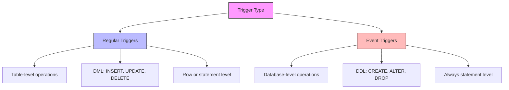

# PostgreSQL Event Triggers

## Introduction

PostgreSQL event triggers provide a powerful mechanism to monitor and respond to database-level events, as opposed to regular triggers that operate on table-level data changes. While standard triggers are confined to reacting to `INSERT`, `UPDATE`, or `DELETE` operations on specific tables, event triggers can capture database-wide events such as schema changes, object creations, and other Data Definition Language (DDL) operations.

Event triggers were introduced in PostgreSQL 9.3 and represent an important tool for database administrators and developers who need to:

- Track schema changes
- Enforce naming conventions or structural policies
- Log DDL operations for auditing
- Prevent certain types of database modifications
- Automate responses to database structural changes

Let's explore how event triggers work, when to use them, and how they can enhance your PostgreSQL database management.

## Event Trigger Basics

Unlike regular triggers that are attached to specific tables, event triggers are defined at the database level. They react to specific events that occur during database operations.

### Supported Event Types

PostgreSQL supports several event types that can trigger an event trigger:

- `ddl_command_start` - Fires before the execution of DDL commands
- `ddl_command_end` - Fires after the execution of DDL commands
- `table_rewrite` - Fires when a table is rewritten (e.g., due to `ALTER TABLE`)
- `sql_drop` - Fires before a `DROP` command is executed

### Event Trigger Functions

Event triggers execute functions written in procedural languages like PL/pgSQL or a trusted language like C. These functions have a specific signature and can access special variables to get information about the event that occurred.

## Creating Event Triggers

Let's look at how to create a basic event trigger. The general syntax is:

```sql
CREATE EVENT TRIGGER name
ON event_type
[WHEN filter_condition]
EXECUTE FUNCTION function_name();
```

### Example 1: Logging DDL Operations

First, let's create a function to log DDL operations:

```sql
CREATE OR REPLACE FUNCTION log_ddl_events()
RETURNS event_trigger AS $$
DECLARE
    r RECORD;
BEGIN
    SELECT * INTO r FROM pg_event_trigger_ddl_commands();
    
    INSERT INTO ddl_audit_log (
        event_time,
        command_tag,
        object_type,
        schema_name,
        object_identity
    ) VALUES (
        current_timestamp,
        tg_tag,
        r.object_type,
        r.schema_name,
        r.object_identity
    );
    
    RAISE NOTICE 'DDL operation logged: % on %', tg_tag, r.object_identity;
END;
$$ LANGUAGE plpgsql;
```

Now, let's create the event trigger that uses this function:

```sql
-- First, create a table to store the audit logs
CREATE TABLE ddl_audit_log (
    id SERIAL PRIMARY KEY,
    event_time TIMESTAMP NOT NULL,
    command_tag TEXT NOT NULL,
    object_type TEXT,
    schema_name TEXT,
    object_identity TEXT
);

-- Create the event trigger
CREATE EVENT TRIGGER log_ddl_operations
ON ddl_command_end
EXECUTE FUNCTION log_ddl_events();
```

When we execute DDL commands, our trigger will log them:

```sql
-- This will trigger our event trigger
CREATE TABLE test_table (id INT, name TEXT);
```

Output:
```
NOTICE:  DDL operation logged: CREATE TABLE on public.test_table
CREATE TABLE
```

If we check our audit log:

```sql
SELECT * FROM ddl_audit_log ORDER BY event_time DESC LIMIT 1;
```

Output:
```
 id |         event_time         | command_tag  | object_type | schema_name |  object_identity  
----+----------------------------+--------------+-------------+-------------+-------------------
  1 | 2025-03-10 10:15:22.452631 | CREATE TABLE | table       | public      | public.test_table
```

## Filtering Events

You can make event triggers more specific by using the `WHEN` clause to filter which events the trigger responds to.

### Example 2: Enforcing Naming Conventions

Let's create an event trigger that enforces a naming convention for tables:

```sql
CREATE OR REPLACE FUNCTION enforce_table_naming()
RETURNS event_trigger AS $$
DECLARE
    r RECORD;
BEGIN
    FOR r IN SELECT * FROM pg_event_trigger_ddl_commands() WHERE object_type = 'table'
    LOOP
        IF r.object_identity !~ '^public\.tbl_' THEN
            RAISE EXCEPTION 'Table names must start with "tbl_". Invalid table name: %', r.object_identity;
        END IF;
    END LOOP;
END;
$$ LANGUAGE plpgsql;

CREATE EVENT TRIGGER enforce_table_naming_convention
ON ddl_command_start
WHEN tag IN ('CREATE TABLE')
EXECUTE FUNCTION enforce_table_naming();
```

Now, let's test our naming convention enforcer:

```sql
-- This will violate our naming convention
CREATE TABLE users (id INT, name TEXT);
```

Output:
```
ERROR:  Table names must start with "tbl_". Invalid table name: public.users
```

```sql
-- This follows our naming convention
CREATE TABLE tbl_users (id INT, name TEXT);
```

Output:
```
CREATE TABLE
```

## Preventing Dangerous Operations

Event triggers are particularly useful for preventing accidental or unauthorized database changes.

### Example 3: Preventing Table Drops During Business Hours

This example prevents dropping tables during specified business hours:

```sql
CREATE OR REPLACE FUNCTION prevent_table_drops_during_business_hours()
RETURNS event_trigger AS $$
DECLARE
    current_hour INT;
BEGIN
    current_hour := EXTRACT(HOUR FROM CURRENT_TIME);
    
    -- Prevent drops between 9 AM and 5 PM on weekdays
    IF current_hour BETWEEN 9 AND 16 AND EXTRACT(DOW FROM CURRENT_DATE) BETWEEN 1 AND 5 THEN
        RAISE EXCEPTION 'Dropping tables is not allowed during business hours (9 AM - 5 PM on weekdays)';
    END IF;
END;
$$ LANGUAGE plpgsql;

CREATE EVENT TRIGGER no_drops_during_business_hours
ON sql_drop
EXECUTE FUNCTION prevent_table_drops_during_business_hours();
```

## Event Trigger Functions and Variables

Event triggers can access specific variables and functions to get information about the event:

### Available Variables

- `TG_EVENT`: The event that triggered the event trigger (as text)
- `TG_TAG`: Command tag (e.g., 'CREATE TABLE')

### Special Functions

Event triggers can use these special functions to get more information:

1. `pg_event_trigger_ddl_commands()`: Returns information about DDL commands
2. `pg_event_trigger_dropped_objects()`: Returns information about objects being dropped

## Real-World Applications

### Application 1: Schema Change Management

In a team environment, tracking who makes schema changes is crucial. Here's how you can implement this:

```sql
CREATE TABLE schema_change_log (
    id SERIAL PRIMARY KEY,
    event_time TIMESTAMP NOT NULL,
    database_user TEXT NOT NULL,
    command_tag TEXT NOT NULL,
    object_type TEXT,
    object_identity TEXT,
    ddl_command TEXT
);

CREATE OR REPLACE FUNCTION log_schema_changes()
RETURNS event_trigger AS $$
DECLARE
    r RECORD;
    ddl_text TEXT;
BEGIN
    -- Get the current query from pg_stat_activity
    SELECT query INTO ddl_text
    FROM pg_stat_activity
    WHERE pid = pg_backend_pid();

    FOR r IN SELECT * FROM pg_event_trigger_ddl_commands()
    LOOP
        INSERT INTO schema_change_log (
            event_time,
            database_user,
            command_tag,
            object_type,
            object_identity,
            ddl_command
        ) VALUES (
            current_timestamp,
            current_user,
            tg_tag,
            r.object_type,
            r.object_identity,
            ddl_text
        );
    END LOOP;
END;
$$ LANGUAGE plpgsql;

CREATE EVENT TRIGGER schema_change_logger
ON ddl_command_end
EXECUTE FUNCTION log_schema_changes();
```

### Application 2: Automated Backup Before Structure Change

This example demonstrates automatically backing up a table before it's altered:

```sql
CREATE OR REPLACE FUNCTION backup_before_alter()
RETURNS event_trigger AS $$
DECLARE
    r RECORD;
    backup_table_name TEXT;
BEGIN
    FOR r IN SELECT * FROM pg_event_trigger_ddl_commands() 
             WHERE command_tag = 'ALTER TABLE'
    LOOP
        -- Create backup table name with timestamp
        backup_table_name := r.object_identity || '_backup_' || 
                             to_char(current_timestamp, 'YYYYMMDD_HH24MISS');
                             
        -- Create the backup table
        EXECUTE 'CREATE TABLE ' || backup_table_name || 
                ' AS SELECT * FROM ' || r.object_identity;
                
        RAISE NOTICE 'Created backup % before altering table %', 
                     backup_table_name, r.object_identity;
    END LOOP;
END;
$$ LANGUAGE plpgsql;

CREATE EVENT TRIGGER backup_tables_before_alter
ON ddl_command_start
WHEN tag IN ('ALTER TABLE')
EXECUTE FUNCTION backup_before_alter();
```

## Managing Event Triggers

Like other database objects, you can alter, disable, enable, or drop event triggers:

### Disabling/Enabling an Event Trigger

```sql
-- Temporarily disable an event trigger
ALTER EVENT TRIGGER log_ddl_operations DISABLE;

-- Re-enable it when needed
ALTER EVENT TRIGGER log_ddl_operations ENABLE;
```

### Dropping an Event Trigger

```sql
DROP EVENT TRIGGER log_ddl_operations;
```

## Event Triggers vs. Regular Triggers

To understand when to use event triggers versus regular triggers, let's compare them:



## Performance Considerations

Event triggers add overhead to DDL operations, so use them judiciously:

1. Keep trigger functions efficient
2. Limit the number of event triggers on frequently used DDL operations
3. Consider disabling event triggers during bulk schema changes or migrations
4. Test the performance impact of your event triggers in a staging environment

## Summary

PostgreSQL event triggers provide a powerful mechanism for monitoring and responding to database-level events and DDL operations. They can be used for enforcing policies, auditing schema changes, automating tasks, and ensuring consistency across your database.

Key takeaways:
- Event triggers work at the database level, not the table level
- They can respond to various events like DDL commands and object drops
- They're useful for auditing, enforcing conventions, and preventing unwanted changes
- They should be used carefully to avoid performance impacts

## Additional Resources

- [PostgreSQL Official Documentation on Event Triggers](https://www.postgresql.org/docs/current/event-triggers.html)
- [PostgreSQL DDL Commands](https://www.postgresql.org/docs/current/ddl.html)
- [PostgreSQL Procedural Languages](https://www.postgresql.org/docs/current/server-programming.html)

## Exercises

1. Create an event trigger that logs all table creation events to a dedicated log table.
2. Implement an event trigger that enforces a naming convention for all new indexes.
3. Write an event trigger that prevents dropping any table that contains the word "important" in its name.
4. Create an event trigger that automatically adds a standard comment to newly created tables.
5. Implement a system that uses event triggers to maintain a live database schema documentation table.