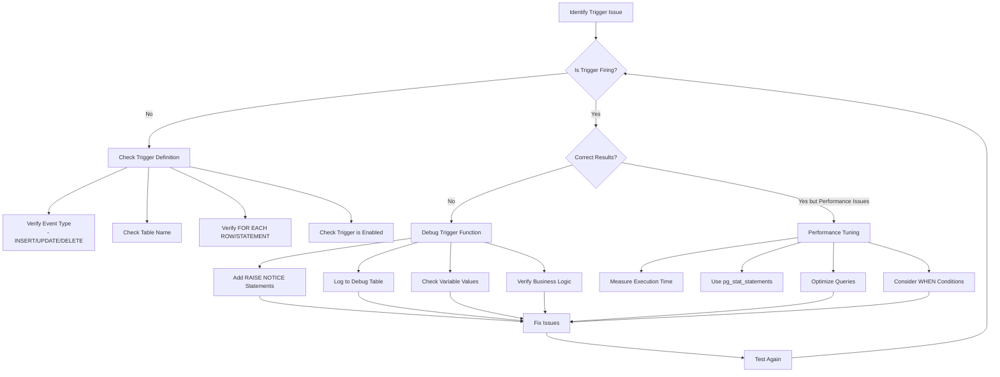

# PostgreSQL Trigger Debugging

## Introduction

When working with PostgreSQL triggers, debugging becomes an essential skill as triggers execute automatically in response to events, making issues harder to track. This guide will help you understand how to identify, diagnose, and fix problems in your PostgreSQL triggers, enabling you to build more reliable database automation.

Triggers are powerful tools that run SQL code in response to database events (like INSERT, UPDATE, or DELETE operations), but their behind-the-scenes nature can make troubleshooting challenging. Let's explore systematic approaches to debug these hidden processes.

## Common Trigger Problems

Before diving into debugging techniques, let's review the most common issues you might encounter with PostgreSQL triggers:

1. **Syntax errors** - Incorrect SQL syntax in trigger functions
2. **Logic errors** - The trigger works but produces incorrect results
3. **Performance issues** - Triggers causing slowdowns in database operations
4. **Infinite recursion** - Triggers that modify the same table they're monitoring without proper guards
5. **Unexpected behavior** - Triggers firing at unexpected times or not firing when expected

## Setting Up Logging for Trigger Debugging

PostgreSQL provides robust logging capabilities that can be invaluable for trigger debugging. The first step in troubleshooting is to increase the logging level to capture trigger activity.

### Configuring PostgreSQL Logging

```sql
-- Increase logging level temporarily for your session
SET client_min_messages TO debug5;

-- Or modify postgresql.conf to enable more detailed logging globally
-- log_min_messages = debug1
-- log_min_error_statement = debug1
```

### Using the RAISE Statement

Within your trigger functions, you can use the `RAISE` statement to output debugging information:

```sql
CREATE OR REPLACE FUNCTION my_trigger_function()
RETURNS TRIGGER AS $$
BEGIN
  -- Debug information
  RAISE NOTICE 'Trigger fired: % operation on %', TG_OP, TG_TABLE_NAME;
  RAISE NOTICE 'New data: %', NEW;
  
  -- Your trigger logic here
  
  RETURN NEW;
END;
$$ LANGUAGE plpgsql;
```

### Example Output

When the trigger fires, you'll see output like this in your logs:

```
NOTICE:  Trigger fired: INSERT operation on employees
NOTICE:  New data: (10,"John Doe",50000,"IT")
```

## Using Trigger Variables for Debugging

PostgreSQL provides special variables within trigger functions that can help with debugging:

| Variable | Description |
|----------|-------------|
| `TG_NAME` | Trigger name |
| `TG_WHEN` | BEFORE, AFTER, or INSTEAD OF |
| `TG_LEVEL` | ROW or STATEMENT |
| `TG_OP` | INSERT, UPDATE, DELETE, or TRUNCATE |
| `TG_TABLE_NAME` | Name of the table the trigger is attached to |
| `TG_TABLE_SCHEMA` | Schema of the table |
| `NEW` | New row for INSERT/UPDATE operations |
| `OLD` | Old row for UPDATE/DELETE operations |

### Example: Debugging with Trigger Variables

```sql
CREATE OR REPLACE FUNCTION audit_employee_changes()
RETURNS TRIGGER AS $$
BEGIN
  RAISE NOTICE 'Debug: -------------------------------------';
  RAISE NOTICE 'Debug: Trigger name: %', TG_NAME;
  RAISE NOTICE 'Debug: Table affected: %.%', TG_TABLE_SCHEMA, TG_TABLE_NAME;
  RAISE NOTICE 'Debug: Operation: %', TG_OP;
  
  IF (TG_OP = 'UPDATE') THEN
    RAISE NOTICE 'Debug: Old record: %', OLD;
    RAISE NOTICE 'Debug: New record: %', NEW;
    RAISE NOTICE 'Debug: Changed columns:';
    
    -- Check which columns changed
    IF OLD.name IS DISTINCT FROM NEW.name THEN
      RAISE NOTICE 'Debug:   - name: % -> %', OLD.name, NEW.name;
    END IF;
    
    IF OLD.salary IS DISTINCT FROM NEW.salary THEN
      RAISE NOTICE 'Debug:   - salary: % -> %', OLD.salary, NEW.salary;
    END IF;
  END IF;
  
  -- Actual trigger logic here
  INSERT INTO employee_audit (
    employee_id, action, changed_at, changed_by
  ) VALUES (
    COALESCE(NEW.id, OLD.id),
    TG_OP,
    now(),
    current_user
  );
  
  RETURN NEW;
END;
$$ LANGUAGE plpgsql;
```

## Step-by-Step Trigger Debugging Process

Let's walk through a systematic approach to debug triggers:

### 1. Check If Your Trigger Is Firing

First, verify that your trigger is actually being executed:

```sql
-- Add a simple RAISE NOTICE to confirm trigger execution
CREATE OR REPLACE FUNCTION test_trigger_function()
RETURNS TRIGGER AS $$
BEGIN
  RAISE NOTICE 'Trigger was fired!';
  RETURN NEW;
END;
$$ LANGUAGE plpgsql;

-- Create a test trigger
CREATE TRIGGER test_trigger
AFTER INSERT ON your_table
FOR EACH ROW EXECUTE FUNCTION test_trigger_function();

-- Test with an insert
INSERT INTO your_table (column1, column2) VALUES ('value1', 'value2');
```

If you don't see the "Trigger was fired!" message, check if:
- The trigger is enabled
- The operation matches what your trigger is watching for
- The trigger is correctly attached to the table

### 2. Use Conditional Debugging

For complex triggers, you might want to debug only specific cases:

```sql
CREATE OR REPLACE FUNCTION inventory_update_trigger()
RETURNS TRIGGER AS $$
BEGIN
  -- Only debug for specific product_id
  IF NEW.product_id = 123 THEN
    RAISE NOTICE 'Debugging product 123: Quantity change from % to %', 
                 OLD.quantity, NEW.quantity;
  END IF;
  
  -- Normal trigger logic
  IF NEW.quantity < 10 THEN
    INSERT INTO low_stock_alerts (product_id, current_quantity, alert_time)
    VALUES (NEW.product_id, NEW.quantity, now());
  END IF;
  
  RETURN NEW;
END;
$$ LANGUAGE plpgsql;
```

### 3. Create a Debugging Table

For persistent debugging across sessions:

```sql
-- Create a debug log table
CREATE TABLE trigger_debug_log (
  id SERIAL PRIMARY KEY,
  trigger_name TEXT,
  table_name TEXT,
  operation TEXT,
  row_data JSONB,
  timestamp TIMESTAMPTZ DEFAULT now()
);

-- Modify your trigger function to log to this table
CREATE OR REPLACE FUNCTION my_trigger_function()
RETURNS TRIGGER AS $$
BEGIN
  -- Log to debug table
  INSERT INTO trigger_debug_log (trigger_name, table_name, operation, row_data)
  VALUES (
    TG_NAME,
    TG_TABLE_NAME,
    TG_OP,
    CASE TG_OP
      WHEN 'INSERT' THEN row_to_json(NEW)::jsonb
      WHEN 'UPDATE' THEN jsonb_build_object('old', row_to_json(OLD), 'new', row_to_json(NEW))
      WHEN 'DELETE' THEN row_to_json(OLD)::jsonb
    END
  );
  
  -- Actual trigger logic
  -- ...
  
  RETURN NEW;
END;
$$ LANGUAGE plpgsql;
```

You can then query this table to analyze trigger behavior:

```sql
-- View recent trigger executions
SELECT * FROM trigger_debug_log ORDER BY timestamp DESC LIMIT 10;

-- Find all executions for a specific table
SELECT * FROM trigger_debug_log WHERE table_name = 'employees';
```

## Debugging Real-World Issues

Let's walk through debugging some common real-world trigger problems:

### Debugging Infinite Recursion

One of the trickiest issues is when triggers cause infinite recursion:

```sql
-- Problematic trigger function (will cause recursion)
CREATE OR REPLACE FUNCTION update_last_modified()
RETURNS TRIGGER AS $$
BEGIN
  -- This will cause another UPDATE, triggering this function again
  UPDATE users SET last_modified = now() WHERE id = NEW.id;
  
  RETURN NEW;
END;
$$ LANGUAGE plpgsql;

-- Create the trigger
CREATE TRIGGER last_modified_trigger
AFTER UPDATE ON users
FOR EACH ROW EXECUTE FUNCTION update_last_modified();
```

The fix:

```sql
-- Fixed version
CREATE OR REPLACE FUNCTION update_last_modified()
RETURNS TRIGGER AS $$
BEGIN
  -- Directly modify NEW instead of doing another UPDATE
  -- For BEFORE triggers
  NEW.last_modified = now();
  
  RETURN NEW;
END;
$$ LANGUAGE plpgsql;

-- Create the trigger as a BEFORE trigger
CREATE TRIGGER last_modified_trigger
BEFORE UPDATE ON users
FOR EACH ROW EXECUTE FUNCTION update_last_modified();
```

### Debugging Performance Issues

If triggers are causing slowdowns:

```sql
-- Add timing information to your trigger function
CREATE OR REPLACE FUNCTION inventory_trigger()
RETURNS TRIGGER AS $$
DECLARE
  start_time TIMESTAMPTZ;
  end_time TIMESTAMPTZ;
BEGIN
  start_time := clock_timestamp();
  
  -- Your trigger logic here
  -- ...
  
  end_time := clock_timestamp();
  
  -- Log execution time
  RAISE NOTICE 'Trigger execution time: % ms', 
    (extract(epoch from end_time) - extract(epoch from start_time)) * 1000;
  
  RETURN NEW;
END;
$$ LANGUAGE plpgsql;
```

## Using pg_stat_statements for Trigger Performance Analysis

For more detailed performance analysis, you can use the `pg_stat_statements` extension:

```sql
-- Enable the extension
CREATE EXTENSION IF NOT EXISTS pg_stat_statements;

-- After running your operations, check the most time-consuming SQL statements
SELECT query, calls, total_exec_time, rows, mean_exec_time
FROM pg_stat_statements
ORDER BY total_exec_time DESC
LIMIT 10;
```

This can help identify if trigger functions are causing performance bottlenecks.

## Practical Debug Example: Order Processing System

Let's look at a complete real-world example for an e-commerce order processing system:

```sql
-- Create the necessary tables
CREATE TABLE orders (
  id SERIAL PRIMARY KEY,
  customer_id INTEGER NOT NULL,
  order_date TIMESTAMP DEFAULT now(),
  total_amount DECIMAL(10,2) DEFAULT 0,
  status VARCHAR(20) DEFAULT 'pending'
);

CREATE TABLE order_items (
  id SERIAL PRIMARY KEY,
  order_id INTEGER REFERENCES orders(id),
  product_id INTEGER NOT NULL,
  quantity INTEGER NOT NULL,
  price DECIMAL(10,2) NOT NULL
);

CREATE TABLE inventory (
  product_id INTEGER PRIMARY KEY,
  stock_quantity INTEGER NOT NULL,
  last_updated TIMESTAMP DEFAULT now()
);

-- Debug log table
CREATE TABLE trigger_debug_log (
  id SERIAL PRIMARY KEY,
  trigger_name TEXT,
  operation TEXT,
  table_name TEXT,
  record_id INTEGER,
  details JSONB,
  logged_at TIMESTAMP DEFAULT now()
);

-- Trigger function to update order total when items are added
CREATE OR REPLACE FUNCTION update_order_total()
RETURNS TRIGGER AS $$
DECLARE
  new_total DECIMAL(10,2);
  debug_info JSONB;
BEGIN
  -- Start debugging
  debug_info = jsonb_build_object(
    'order_id', NEW.order_id,
    'product_id', NEW.product_id,
    'quantity', NEW.quantity,
    'price', NEW.price
  );
  
  -- Log the trigger execution
  INSERT INTO trigger_debug_log (
    trigger_name, operation, table_name, record_id, details
  ) VALUES (
    TG_NAME, TG_OP, TG_TABLE_NAME, NEW.order_id, debug_info
  );
  
  -- Calculate new total
  SELECT SUM(quantity * price) INTO new_total
  FROM order_items
  WHERE order_id = NEW.order_id;
  
  -- Update the order total
  UPDATE orders SET total_amount = new_total WHERE id = NEW.order_id;
  
  -- Log the result
  debug_info = debug_info || jsonb_build_object('new_total', new_total);
  
  UPDATE trigger_debug_log 
  SET details = details || debug_info
  WHERE id = currval('trigger_debug_log_id_seq');
  
  RETURN NEW;
END;
$$ LANGUAGE plpgsql;

-- Trigger to update inventory when an order item is added
CREATE OR REPLACE FUNCTION update_inventory()
RETURNS TRIGGER AS $$
DECLARE
  current_stock INTEGER;
  debug_info JSONB;
BEGIN
  -- Initialize debug info
  debug_info = jsonb_build_object(
    'product_id', NEW.product_id,
    'quantity_ordered', NEW.quantity
  );
  
  -- Log start of trigger execution
  INSERT INTO trigger_debug_log (
    trigger_name, operation, table_name, record_id, details
  ) VALUES (
    TG_NAME, TG_OP, 'order_items', NEW.id, debug_info
  );
  
  -- Get current stock
  SELECT stock_quantity INTO current_stock
  FROM inventory
  WHERE product_id = NEW.product_id;
  
  -- Update debug info
  debug_info = debug_info || jsonb_build_object('current_stock', current_stock);
  
  -- Check if enough stock is available
  IF current_stock IS NULL THEN
    RAISE EXCEPTION 'Product % not found in inventory', NEW.product_id;
  ELSIF current_stock < NEW.quantity THEN
    RAISE EXCEPTION 'Not enough stock for product %. Available: %, Requested: %', 
      NEW.product_id, current_stock, NEW.quantity;
  END IF;
  
  -- Update inventory
  UPDATE inventory
  SET stock_quantity = stock_quantity - NEW.quantity,
      last_updated = now()
  WHERE product_id = NEW.product_id;
  
  -- Final debug update
  debug_info = debug_info || jsonb_build_object(
    'new_stock', current_stock - NEW.quantity,
    'success', true
  );
  
  UPDATE trigger_debug_log 
  SET details = details || debug_info
  WHERE id = currval('trigger_debug_log_id_seq');
  
  RETURN NEW;
END;
$$ LANGUAGE plpgsql;

-- Create the triggers
CREATE TRIGGER after_order_item_insert
AFTER INSERT ON order_items
FOR EACH ROW EXECUTE FUNCTION update_order_total();

CREATE TRIGGER check_inventory
BEFORE INSERT ON order_items
FOR EACH ROW EXECUTE FUNCTION update_inventory();
```

### Testing and Debugging the Order System

```sql
-- Insert test data
INSERT INTO inventory (product_id, stock_quantity) VALUES 
  (101, 50),
  (102, 30),
  (103, 10);

-- Create an order
INSERT INTO orders (customer_id) VALUES (1);
  
-- Try to add items to the order
INSERT INTO order_items (order_id, product_id, quantity, price) VALUES
  (1, 101, 5, 19.99);
  
-- Check the debug log
SELECT * FROM trigger_debug_log ORDER BY logged_at DESC LIMIT 5;

-- Try to order more than available stock (this should fail)
INSERT INTO order_items (order_id, product_id, quantity, price) VALUES
  (1, 103, 20, 29.99);

-- Check the final state
SELECT * FROM orders;
SELECT * FROM inventory;
```

## Visual Flowchart for Trigger Debugging

Here's a flowchart showing the trigger debugging process:



## Best Practices for Trigger Debugging

1. **Start simple** - Test with minimal trigger functionality before adding complexity
2. **Use version control** - Keep track of changes to your trigger functions
3. **Create test cases** - Develop specific scenarios to test trigger behavior
4. **Add guard clauses** - Prevent infinite recursion with appropriate checks
5. **Log selectively** - Too much logging can cause performance issues
6. **Use transactions** - Test triggers within transactions you can roll back
7. **Document your triggers** - Add comments explaining the purpose and behavior

## Summary

Debugging PostgreSQL triggers can be challenging, but a systematic approach makes it manageable. By using PostgreSQL's built-in debugging tools like `RAISE NOTICE`, trigger variables, and custom debug tables, you can track down issues in your trigger functions efficiently.

Key points to remember:
- Verify triggers are firing as expected
- Use logging to track execution flow
- Create debug tables for persistent analysis
- Watch for common issues like recursion
- Measure performance impact

Mastering trigger debugging will help you build more robust, maintainable database applications with PostgreSQL.

## Additional Resources

- Try the exercises below to practice your debugging skills
- Explore the official [PostgreSQL documentation on triggers](https://www.postgresql.org/docs/current/plpgsql-trigger.html)
- Learn about [PostgreSQL's performance analysis tools](https://www.postgresql.org/docs/current/monitoring-stats.html)

## Exercises

1. Create a trigger that logs all changes to a user table and debug it to ensure it captures all required information.
2. Debug a recursive trigger situation and fix it using appropriate techniques.
3. Implement and debug a complex validation trigger that checks business rules before allowing data changes.
4. Create a performance-optimized audit trigger and use the techniques from this guide to measure and improve its execution time.