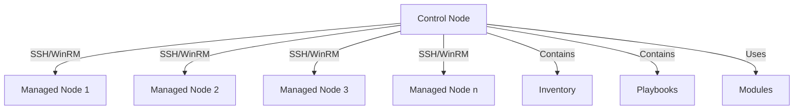

# Ansible Overview

## Introduction

Ansible is an open-source automation tool that simplifies complex IT tasks like configuration management, application deployment, cloud provisioning, and orchestration. Unlike other automation tools, Ansible is agentless, meaning it doesn't require any special software to be installed on managed nodes, making it lightweight and easy to implement.

In today's rapidly evolving IT landscape, managing infrastructure manually is not only time-consuming but also prone to human error. Ansible addresses these challenges by providing a simple, yet powerful platform for automating repetitive tasks across your entire infrastructure.

## Core Concepts

### How Ansible Works

Ansible works by connecting to your nodes (managed hosts) via SSH (for Linux/Unix) or WinRM (for Windows) and pushing out small programs called **Ansible modules**. These modules are executed on the target nodes and removed when finished.



### Key Components

1. **Control Node**: The machine where Ansible is installed and from which all tasks and playbooks are run.

2. **Managed Nodes**: The devices (servers, network devices, etc.) you manage with Ansible.

3. **Inventory**: A list of managed nodes. The inventory file can specify information like IP address, hostname, and variables.

4. **Modules**: Units of code that Ansible executes. Each module has a particular use, like managing users, installing packages, or configuring network devices.

5. **Tasks**: Units of action in Ansible. You can execute a single task once with an ad-hoc command.

6. **Playbooks**: YAML files containing a series of tasks to be executed on managed nodes.

7. **Roles**: Ways of organizing playbooks and related files to facilitate sharing and reuse of code.

## Getting Started with Ansible

### Installation

Ansible can be installed on most Unix/Linux systems. Here's how to install it on various platforms:

**For Ubuntu/Debian:**

```bash
sudo apt update
sudo apt install ansible
```

**For CentOS/RHEL:**

```bash
sudo yum install epel-release
sudo yum install ansible
```

**For macOS (using Homebrew):**

```bash
brew install ansible
```

After installation, verify that Ansible is installed correctly:

```bash
ansible --version
```

Output:
```
ansible [core 2.14.3]
  config file = /etc/ansible/ansible.cfg
  configured module search path = ['/home/user/.ansible/plugins/modules', '/usr/share/ansible/plugins/modules']
  ansible python module location = /usr/lib/python3/dist-packages/ansible
  ansible collection location = /home/user/.ansible/collections:/usr/share/ansible/collections
  executable location = /usr/bin/ansible
  python version = 3.10.6 (main, May 29 2023, 11:10:38) [GCC 11.3.0] (/usr/bin/python3)
  jinja version = 3.0.3
  libyaml = True
```

### Creating an Inventory

Ansible needs to know which servers it needs to manage. Let's create a simple inventory file:

```ini
# inventory.ini
[webservers]
web1.example.com
web2.example.com

[dbservers]
db1.example.com
db2.example.com

[all:vars]
ansible_user=deploy
```

### Writing Your First Playbook

Playbooks are Ansible's configuration, deployment, and orchestration language. They are expressed in YAML format.

Let's create a simple playbook that ensures Apache is installed and running on all web servers:

```yaml
# install_apache.yml
---
- name: Install and configure Apache
  hosts: webservers
  become: true
  
  tasks:
    - name: Install Apache
      apt:
        name: apache2
        state: present
      when: ansible_os_family == "Debian"
      
    - name: Install Apache
      yum:
        name: httpd
        state: present
      when: ansible_os_family == "RedHat"
      
    - name: Start Apache service
      service:
        name: "{{ 'apache2' if ansible_os_family == 'Debian' else 'httpd' }}"
        state: started
        enabled: yes
        
    - name: Create a test page
      copy:
        content: "<html><body><h1>Hello from Ansible!</h1></body></html>"
        dest: "{{ '/var/www/html/index.html' if ansible_os_family == 'Debian' else '/var/www/html/index.html' }}"
```

### Running a Playbook

To run the playbook:

```bash
ansible-playbook -i inventory.ini install_apache.yml
```

Output:
```
PLAY [Install and configure Apache] *********************************************

TASK [Gathering Facts] *********************************************************
ok: [web1.example.com]
ok: [web2.example.com]

TASK [Install Apache] **********************************************************
changed: [web1.example.com]
changed: [web2.example.com]

TASK [Start Apache service] ****************************************************
changed: [web1.example.com]
changed: [web2.example.com]

TASK [Create a test page] ******************************************************
changed: [web1.example.com]
changed: [web2.example.com]

PLAY RECAP *********************************************************************
web1.example.com          : ok=4    changed=3    unreachable=0    failed=0    skipped=0    rescued=0    ignored=0   
web2.example.com          : ok=4    changed=3    unreachable=0    failed=0    skipped=0    rescued=0    ignored=0   
```

## Ansible Ad-hoc Commands

While playbooks are powerful, sometimes you need to perform quick, one-off tasks. Ansible's ad-hoc commands allow you to do this.

For example, to check disk space on all servers:

```bash
ansible all -i inventory.ini -m shell -a "df -h"
```

To restart a service on all web servers:

```bash
ansible webservers -i inventory.ini -m service -a "name=apache2 state=restarted"
```

## Real-world Example: Multi-tier Application Deployment

Here's a more comprehensive example showing how Ansible can deploy a multi-tier application:

```yaml
# deploy_app.yml
---
- name: Configure database servers
  hosts: dbservers
  become: true
  
  tasks:
    - name: Install MySQL
      apt:
        name: mysql-server
        state: present
      when: ansible_os_family == "Debian"
      
    - name: Start MySQL service
      service:
        name: mysql
        state: started
        enabled: yes
        
    - name: Create application database
      mysql_db:
        name: myapp
        state: present
        
    - name: Create application database user
      mysql_user:
        name: myapp
        password: securepassword
        priv: 'myapp.*:ALL'
        state: present
        host: '%'

- name: Configure web servers
  hosts: webservers
  become: true
  
  tasks:
    - name: Install Apache and PHP
      apt:
        name:
          - apache2
          - php
          - php-mysql
          - libapache2-mod-php
        state: present
      when: ansible_os_family == "Debian"
      
    - name: Start Apache service
      service:
        name: apache2
        state: started
        enabled: yes
        
    - name: Clone application repository
      git:
        repo: https://github.com/example/myapp.git
        dest: /var/www/html/myapp
        
    - name: Configure application database connection
      template:
        src: config.php.j2
        dest: /var/www/html/myapp/config.php
```

## Benefits of Ansible

1. **Simplicity**: Ansible uses YAML, which is easy to read and write.
2. **Agentless**: No need to install additional software on managed nodes.
3. **Idempotent**: Running the same playbook multiple times won't cause problems.
4. **Extensible**: Easily integrate with other tools and platforms.
5. **Community-driven**: Large community and ecosystem of modules and roles.

## Ansible vs. Other Tools

Ansible stands out from other configuration management tools like Puppet, Chef, and SaltStack in several ways:

| Feature | Ansible | Puppet | Chef | SaltStack |
|---------|---------|--------|------|-----------|
| Architecture | Agentless, Push-based | Agent-based, Pull-based | Agent-based, Pull-based | Agent-based, Push/Pull |
| Language | YAML | Puppet DSL | Ruby | YAML |
| Learning Curve | Low | Medium-High | High | Medium |
| Setup Complexity | Low | Medium | Medium | Medium |
| Master Server | Optional | Required | Required | Required |

## Best Practices

1. **Use version control for your Ansible code**:
   Store your playbooks, roles, and inventory files in a Git repository.

2. **Keep sensitive data encrypted**:
   Use Ansible Vault to encrypt sensitive information like passwords and API keys.

   ```bash
   ansible-vault encrypt secrets.yml
   ```

3. **Test your playbooks**:
   Use tools like Molecule for testing Ansible roles.

4. **Use roles for organization**:
   Break down complex tasks into roles for better code organization and reusability.

5. **Use variables appropriately**:
   Leverage group variables, host variables, and defaults to make your playbooks more flexible.

6. **Document your code**:
   Add comments to your playbooks and roles to make them easier to understand.

## Summary

Ansible is a powerful, yet simple automation tool that can significantly improve your infrastructure management capabilities. It allows you to:

- Automate repetitive tasks
- Deploy applications
- Manage configurations
- Orchestrate complex IT processes
- Ensure consistency across your infrastructure

By using Ansible, you can reduce manual effort, minimize human errors, and speed up your deployments, ultimately making your IT operations more efficient and reliable.

## Additional Resources

- [Official Ansible Documentation](https://docs.ansible.com/)
- [Ansible Galaxy](https://galaxy.ansible.com/) - Repository of community-contributed Ansible roles
- [Ansible Collections](https://docs.ansible.com/ansible/latest/user_guide/collections_using.html) - New way to distribute Ansible content

## Exercises

1. Install Ansible on your local machine.
2. Create an inventory file with two servers (or virtual machines).
3. Write a playbook that installs and configures Nginx web server.
4. Modify the playbook to deploy a simple HTML website.
5. Create an Ansible role that installs and configures a database server.