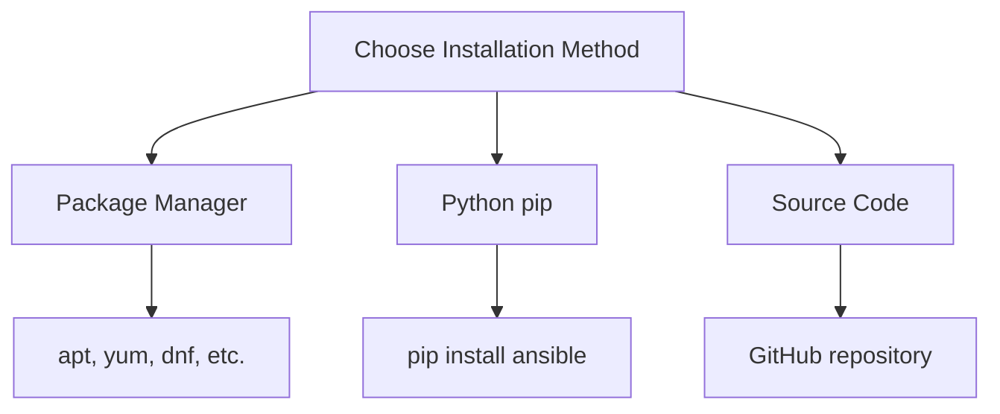

# Ansible Installation

## Introduction

Ansible is a powerful open-source automation tool that simplifies complex tasks like application deployment, configuration management, and IT orchestration. Unlike other automation tools, Ansible is agentless, meaning it doesn't require any special software to be installed on the nodes it manages. Instead, it uses SSH to connect to remote machines and execute commands.

This guide will walk you through the process of installing Ansible on different operating systems and setting up your environment for automation.

## Prerequisites

Before installing Ansible, ensure you have:

- A control node: This is the machine where Ansible will be installed. It can be a Linux, macOS, or WSL on Windows.
- Target nodes: These are the machines you want to manage with Ansible.
- SSH access between the control node and target nodes.
- Python 3.9 or higher on the control node.

## Installation Methods

You can install Ansible using different methods:



Let's explore each method in detail.

## Installing Ansible on Linux

### Ubuntu/Debian

```bash
# Update package index
sudo apt update

# Install software-properties-common package
sudo apt install software-properties-common

# Add Ansible PPA repository
sudo apt-add-repository --yes --update ppa:ansible/ansible

# Install Ansible
sudo apt install ansible
```

Verify the installation:

```bash
ansible --version
```

Expected output:
```
ansible [core 2.14.2]
  config file = /etc/ansible/ansible.cfg
  configured module search path = ['/home/user/.ansible/plugins/modules', '/usr/share/ansible/plugins/modules']
  ansible python module location = /usr/lib/python3/dist-packages/ansible
  ansible collection location = /home/user/.ansible/collections:/usr/share/ansible/collections
  executable location = /usr/bin/ansible
  python version = 3.10.x (default, Jan 10 2023, 11:44:58) [GCC 12.2.0] (/usr/bin/python3)
  jinja version = 3.0.3
  libyaml = True
```

### Red Hat/CentOS/Fedora

```bash
# For RHEL/CentOS 8 and Fedora
sudo dnf install ansible

# For older versions (RHEL/CentOS 7)
sudo yum install epel-release
sudo yum install ansible
```

## Installing Ansible on macOS

You can use Homebrew to install Ansible on macOS:

```bash
# Install Homebrew if not already installed
/bin/bash -c "$(curl -fsSL https://raw.githubusercontent.com/Homebrew/install/HEAD/install.sh)"

# Install Ansible
brew install ansible
```

## Installing Ansible on Windows

Ansible doesn't run natively on Windows, but you can use Windows Subsystem for Linux (WSL):

1. Install WSL by following the [official Microsoft documentation](https://docs.microsoft.com/en-us/windows/wsl/install).
2. Install a Linux distribution (e.g., Ubuntu) from the Microsoft Store.
3. Open your Linux distribution and follow the Linux installation instructions above.

## Installing Ansible using pip

Pip is the Python package manager and can be used to install Ansible on any system with Python:

```bash
# Install pip if not already installed
sudo apt install python3-pip  # For Debian-based systems
sudo dnf install python3-pip  # For RHEL-based systems
brew install python3  # For macOS (includes pip)

# Install Ansible using pip
pip3 install ansible
```

## Installing Ansible from Source

For the latest features or specific versions:

```bash
# Clone the Ansible repository
git clone https://github.com/ansible/ansible.git
cd ansible

# Checkout a specific version (optional)
git checkout stable-2.14

# Set up the environment
source ./hacking/env-setup

# Install dependencies
pip3 install -r requirements.txt
```

## Configuring Ansible After Installation

After installing Ansible, you should create a basic configuration:

1. Create a directory for your Ansible project:

```bash
mkdir ~/ansible-project
cd ~/ansible-project
```

2. Create an inventory file (`hosts`) to list your managed nodes:

```bash
# Create and edit the hosts file
nano hosts
```

Add the following content:

```ini
[webservers]
web1 ansible_host=192.168.1.101
web2 ansible_host=192.168.1.102

[dbservers]
db1 ansible_host=192.168.1.201

[all:vars]
ansible_user=yourusername
ansible_ssh_private_key_file=~/.ssh/id_rsa
```

3. Create a basic Ansible configuration file:

```bash
nano ansible.cfg
```

Add the following content:

```ini
[defaults]
inventory = ./hosts
remote_user = yourusername
host_key_checking = False
```

## Testing Your Ansible Installation

Let's verify that Ansible is working correctly:

```bash
# Test connectivity to all hosts
ansible all -m ping
```

Expected output:
```
web1 | SUCCESS => {
    "ansible_facts": {
        "discovered_interpreter_python": "/usr/bin/python3"
    },
    "changed": false,
    "ping": "pong"
}
web2 | SUCCESS => {
    "ansible_facts": {
        "discovered_interpreter_python": "/usr/bin/python3"
    },
    "changed": false,
    "ping": "pong"
}
db1 | SUCCESS => {
    "ansible_facts": {
        "discovered_interpreter_python": "/usr/bin/python3"
    },
    "changed": false,
    "ping": "pong"
}
```

## Running Your First Ansible Command

After verifying connectivity, let's run a simple command to gather information about our hosts:

```bash
# Gather facts about all hosts
ansible all -m gather_facts --limit web1
```

This will display detailed information about the web1 host, including hardware, operating system, and network details.

## Common Issues and Troubleshooting

### SSH Connection Issues

If you encounter SSH connection problems:

1. Ensure SSH is installed and running on target nodes:

```bash
sudo apt install openssh-server  # For Debian-based systems
sudo systemctl start sshd        # Start SSH service
```

2. Verify you can connect manually:

```bash
ssh yourusername@192.168.1.101
```

3. Set up password-less SSH:

```bash
# Generate SSH key if you don't have one
ssh-keygen -t rsa -b 4096

# Copy your key to the remote hosts
ssh-copy-id yourusername@192.168.1.101
```

### Python Issues

Ansible requires Python on target nodes. Ensure Python is installed:

```bash
ansible all -m raw -a "apt update && apt install -y python3"  # For Debian-based systems
```

## Practical Example: Setting Up Multiple Web Servers

Let's create a simple playbook to install the Apache web server on all webservers:

```bash
# Create a playbook file
nano install_apache.yml
```

Add the following content:

```yaml
---
- name: Install Apache on webservers
  hosts: webservers
  become: yes  # Use sudo
  tasks:
    - name: Update apt cache
      apt:
        update_cache: yes
      when: ansible_os_family == "Debian"
      
    - name: Install Apache
      package:
        name: "{{ apache_package }}"
        state: present
      vars:
        apache_package: "{{ 'apache2' if ansible_os_family == 'Debian' else 'httpd' }}"
        
    - name: Start and enable Apache service
      service:
        name: "{{ apache_service }}"
        state: started
        enabled: yes
      vars:
        apache_service: "{{ 'apache2' if ansible_os_family == 'Debian' else 'httpd' }}"
        
    - name: Create a simple index.html file
      copy:
        content: "<html><body><h1>Hello from {{ ansible_hostname }}</h1></body></html>"
        dest: "{{ apache_document_root }}/index.html"
      vars:
        apache_document_root: "{{ '/var/www/html' if ansible_os_family == 'Debian' else '/var/www/html' }}"
```

Run the playbook:

```bash
ansible-playbook install_apache.yml
```

After running this playbook, you should be able to access a basic web page by visiting the IP addresses of your web servers in a browser.

## Summary

In this guide, we've covered:

1. Installing Ansible on different operating systems:
   - Ubuntu/Debian
   - Red Hat/CentOS/Fedora
   - macOS
   - Windows (via WSL)

2. Installation methods:
   - Package managers
   - Python pip
   - Source code

3. Basic configuration:
   - Creating an inventory file
   - Setting up the ansible.cfg file

4. Testing your installation:
   - Verifying connectivity
   - Running basic commands

5. Practical example:
   - Deploying web servers with a simple playbook

Ansible is now installed and ready to use for automating your infrastructure. As you become more comfortable with Ansible, you can create more complex playbooks to automate various aspects of your IT environment.

## Next Steps and Resources

Here are some suggestions for continuing your Ansible journey:

1. **Official Documentation**: Visit the [Ansible Documentation](https://docs.ansible.com/) for comprehensive guides.

2. **Practice Exercises**:
   - Create a playbook to install and configure a database server
   - Write a playbook to deploy a simple application
   - Explore Ansible roles for reusable automation

3. **Advanced Topics**:
   - Ansible Galaxy for sharing and reusing roles
   - Ansible Vault for managing sensitive data
   - Dynamic inventories for cloud environments
   - Ansible Tower/AWX for a web-based interface

4. **Books**:
   - "Ansible for DevOps" by Jeff Geerling
   - "Ansible: Up and Running" by Lorin Hochstein

Remember, automation is a journey. Start with simple tasks and gradually build up to more complex automation workflows as you become more comfortable with Ansible's capabilities.