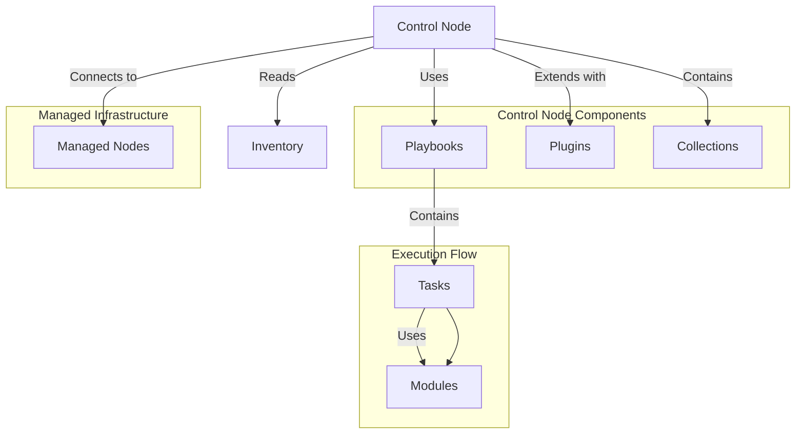

# Ansible Architecture

## Introduction

Ansible is a powerful open-source automation tool that simplifies configuration management, application deployment, and task automation. Understanding Ansible's architecture is fundamental to using it effectively. 

In this guide, we'll explore how Ansible is structured, how its components interact, and the workflow that makes Ansible such a powerful yet simple tool for IT automation. Whether you're managing a handful of servers or a complex infrastructure, knowing Ansible's architecture will help you leverage its full potential.

## Core Components of Ansible Architecture

Ansible follows a simple and agentless architecture, making it easy to deploy and use. Let's examine the key components:

### 1. Control Node

The control node is the central component where Ansible is installed and from which all tasks and playbooks are executed.

**Key characteristics:**
- Must be a Linux/Unix-based system (Windows is not supported as a control node)
- Requires Python 3.6 or newer
- Can manage multiple managed nodes simultaneously
- Connects to managed nodes via SSH by default

### 2. Managed Nodes

Managed nodes (sometimes called "hosts") are the target systems that Ansible automates.

**Key characteristics:**
- Can be any system (Linux, Windows, network devices, etc.)
- Do not require Ansible installation
- Need Python installed (Python 2.7 or Python 3.5+)
- Are defined in the Ansible inventory

### 3. Inventory

The inventory is a file or collection of files that lists and organizes your managed nodes.

**Example of a basic inventory file:**

```ini
[webservers]
web1.example.com
web2.example.com

[databases]
db1.example.com
db2.example.com

[all:vars]
ansible_user=deploy
```

### 4. Modules

Modules are small programs that Ansible pushes to the managed nodes to execute specific tasks.

**Key characteristics:**
- Self-contained units of code
- Provide idempotency (can be run multiple times without changing the result beyond the initial application)
- Can be written in any programming language (typically Python)
- Over 3,000+ built-in modules available

**Example of using a module:**

```yaml
- name: Install Apache
  ansible.builtin.apt:
    name: apache2
    state: present
```

### 5. Playbooks

Playbooks are YAML files that define a series of tasks to be executed on managed nodes.

**Example of a simple playbook:**

```yaml
---
- name: Configure webserver
  hosts: webservers
  become: true
  tasks:
    - name: Install Apache
      ansible.builtin.apt:
        name: apache2
        state: present
        
    - name: Start Apache service
      ansible.builtin.service:
        name: apache2
        state: started
        enabled: true
```

### 6. Plugins

Plugins extend Ansible's core functionality. There are various types of plugins, including:

- Connection plugins: How Ansible connects to managed nodes
- Callback plugins: Control output, logging, and notifications
- Filter plugins: Manipulate data within templates
- Inventory plugins: Generate or import inventory data

### 7. Collections

Collections are a distribution format for Ansible content that can include playbooks, roles, modules, and plugins.

**Example of installing a collection:**

```bash
ansible-galaxy collection install community.general
```

## Ansible Architecture Diagram

Let's visualize how these components work together:



## Ansible Workflow

Understanding the workflow of Ansible helps clarify how the architecture functions in practice:

1. **Read Configuration**: Ansible reads its configuration from files like `ansible.cfg`.
2. **Parse Inventory**: Ansible parses the inventory to determine target hosts.
3. **Execute Playbook**: The playbook defines what operations to perform.
4. **Connect to Managed Nodes**: Ansible connects to the managed nodes via SSH (or other connection plugins).
5. **Transfer Modules**: Ansible transfers the necessary modules to the managed nodes.
6. **Execute Modules**: The modules are executed on the managed nodes with the provided arguments.
7. **Collect Return Values**: Ansible collects the return values and status from the executed modules.
8. **Process Results**: Results are processed and presented to the user.

## Ansible's Push-Based Architecture

Ansible uses a "push" model for configuration management, which differs from "pull" models used by tools like Chef or Puppet:

- **Push-based**: The control node initiates connections to managed nodes and pushes configurations.
- **Agentless**: No permanent agent needs to be installed on managed nodes.
- **SSH-based**: Uses SSH for secure communication by default.

The push model provides several advantages:
- Simpler to set up and maintain
- No need to manage agents on managed nodes
- Easier to secure (relies on existing SSH infrastructure)
- Better control over when changes are deployed

## Practical Example: Setting Up a Complete Web Application Stack

Let's see how Ansible's architecture components work together in a real-world scenario. In this example, we'll set up a web application stack with a web server and database:

```yaml
---
- name: Configure Database Servers
  hosts: databases
  become: true
  tasks:
    - name: Install MySQL
      ansible.builtin.apt:
        name: mysql-server
        state: present
        
    - name: Start MySQL Service
      ansible.builtin.service:
        name: mysql
        state: started
        enabled: true
        
    - name: Create Application Database
      community.mysql.mysql_db:
        name: my_application
        state: present
        
- name: Configure Web Servers
  hosts: webservers
  become: true
  tasks:
    - name: Install Apache and PHP
      ansible.builtin.apt:
        name:
          - apache2
          - php
          - php-mysql
        state: present
        
    - name: Deploy Application Files
      ansible.builtin.copy:
        src: files/application/
        dest: /var/www/html/
        owner: www-data
        group: www-data
        mode: '0644'
        
    - name: Configure Database Connection
      ansible.builtin.template:
        src: templates/config.php.j2
        dest: /var/www/html/config.php
        owner: www-data
        group: www-data
        mode: '0644'
      vars:
        db_host: "{{ groups['databases'][0] }}"
        db_name: my_application
        db_user: app_user
        db_password: "{{ app_db_password }}"
```

In this example:
1. The inventory defines `webservers` and `databases` groups
2. We use built-in modules like `apt` and `service`
3. We use community modules like `mysql_db`
4. We leverage variables and templates for configuration

## Advanced Ansible Architecture Features

### 1. Ansible Tower/AWX

For enterprise environments, Ansible Tower (or its open-source counterpart AWX) adds a web-based UI, role-based access control, job scheduling, and more.

### 2. Delegation and Local Actions

Ansible can delegate tasks to specific hosts or run actions locally on the control node:

```yaml
- name: Backup database
  ansible.builtin.command: mysqldump -u root myapp > /tmp/db_backup.sql
  delegate_to: db.example.com
  
- name: Download backup locally
  ansible.builtin.fetch:
    src: /tmp/db_backup.sql
    dest: backups/
    flat: yes
```

### 3. Asynchronous Actions

For long-running tasks, Ansible supports asynchronous execution:

```yaml
- name: Long-running operation
  ansible.builtin.command: /opt/long_script.sh
  async: 3600  # Maximum runtime in seconds
  poll: 0      # Run in background
  register: async_result

- name: Check on async task
  ansible.builtin.async_status:
    jid: "{{ async_result.ansible_job_id }}"
  register: job_result
  until: job_result.finished
  retries: 30
  delay: 60
```

## Summary

Ansible's architecture is designed for simplicity and efficiency:

- **Agentless Design**: Minimal requirements on managed nodes
- **Push-Based Model**: Control node initiates all operations
- **Modular Structure**: Playbooks, roles, and modules provide reusability
- **Idempotent Execution**: Safe to run operations multiple times
- **Extensible Framework**: Plugins and collections extend functionality

Understanding this architecture allows you to effectively plan, implement, and scale your automation workflows. Whether you're managing a few servers or thousands of nodes across diverse environments, Ansible's architecture provides the foundation for reliable and efficient IT automation.

## Additional Resources

- Explore more examples in the [Ansible Documentation](https://docs.ansible.com/)
- Practice with these exercises:
  1. Create an inventory with different groups for your infrastructure
  2. Write a playbook that installs different packages based on the operating system
  3. Use Ansible Vault to encrypt sensitive information in your playbooks
  4. Create a role to standardize your application deployment
  5. Implement handlers to restart services only when configuration changes

By mastering Ansible's architecture, you'll have the knowledge needed to design efficient automation solutions for your infrastructure needs.