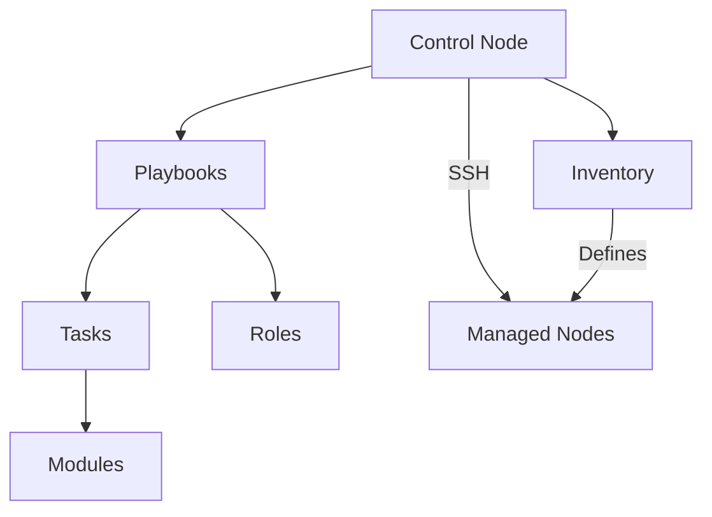

# Ansible Core Concepts

## Introduction

Ansible is a powerful open-source automation tool that simplifies configuration management, application deployment, and task automation. Unlike other configuration management tools, Ansible is agentless, meaning you don't need to install any special software on the nodes you want to manage. It uses SSH for secure connections and Python for executing tasks on remote machines.

This guide will walk you through the fundamental concepts of Ansible that form the building blocks for any automation project.

## Core Concepts Overview



## 1. Control Node

The control node is the system where Ansible is installed and from which all tasks and playbooks are executed. Think of it as the central management point.

**Requirements:**
- Python 2.7 or Python 3.5+ (Python 3.8+ recommended)
- SSH client
- Ansible package installed

```bash
# Installing Ansible on Ubuntu/Debian
sudo apt update
sudo apt install ansible

# Installing Ansible on CentOS/RHEL
sudo yum install ansible

# Installing Ansible with pip
pip install ansible
```

## 2. Inventory

The inventory is a file that defines the managed nodes (hosts) that Ansible will communicate with. It can be written in INI or YAML format and can organize hosts into groups.

**Example Inventory (INI format):**

```ini
# Simple inventory file: inventory.ini

# Web servers
[webservers]
web1.example.com
web2.example.com ansible_host=192.168.1.101

# Database servers
[dbservers]
db1.example.com
db2.example.com

# Group of groups
[datacenter:children]
webservers
dbservers

# Variables applied to a group
[webservers:vars]
http_port=80
```

You can specify connection details and variables for hosts:

```ini
web1.example.com ansible_user=admin ansible_ssh_private_key_file=/path/to/key
```

To use your inventory:

```bash
# Test connection to hosts in inventory
ansible all -i inventory.ini -m ping
```

**Output:**
```
web1.example.com | SUCCESS => {
    "changed": false,
    "ping": "pong"
}
web2.example.com | SUCCESS => {
    "changed": false,
    "ping": "pong"
}
db1.example.com | SUCCESS => {
    "changed": false,
    "ping": "pong"
}
db2.example.com | SUCCESS => {
    "changed": false,
    "ping": "pong"
}
```

## 3. Playbooks

Playbooks are Ansible's configuration, deployment, and orchestration language. They express configurations, deployment steps, and orchestration in a declarative YAML format. A playbook is composed of one or more plays, which map groups of hosts to tasks.

**Example Playbook:**

```yaml
---
# web_setup.yml - A playbook to configure web servers

- name: Configure webservers
  hosts: webservers
  become: true  # Use sudo
  vars:
    http_port: 80
    max_clients: 200
  
  tasks:
    - name: Install Apache
      apt:
        name: apache2
        state: present
        update_cache: yes
      
    - name: Start Apache service
      service:
        name: apache2
        state: started
        enabled: yes
      
    - name: Create a directory for custom website
      file:
        path: /var/www/custom
        state: directory
        mode: '0755'
      
    - name: Deploy index.html
      copy:
        content: "<html><body><h1>Hello from Ansible</h1></body></html>"
        dest: /var/www/custom/index.html
      notify: Restart Apache
      
  handlers:
    - name: Restart Apache
      service:
        name: apache2
        state: restarted
```

To run a playbook:

```bash
ansible-playbook -i inventory.ini web_setup.yml
```

**Output:**
```
PLAY [Configure webservers] *****************************************************

TASK [Gathering Facts] **********************************************************
ok: [web1.example.com]
ok: [web2.example.com]

TASK [Install Apache] ***********************************************************
changed: [web1.example.com]
changed: [web2.example.com]

TASK [Start Apache service] *****************************************************
ok: [web1.example.com]
ok: [web2.example.com]

TASK [Create a directory for custom website] ************************************
changed: [web1.example.com]
changed: [web2.example.com]

TASK [Deploy index.html] ********************************************************
changed: [web1.example.com]
changed: [web2.example.com]

RUNNING HANDLER [Restart Apache] ************************************************
changed: [web1.example.com]
changed: [web2.example.com]

PLAY RECAP *********************************************************************
web1.example.com           : ok=6    changed=4    unreachable=0    failed=0
web2.example.com           : ok=6    changed=4    unreachable=0    failed=0
```

## 4. Tasks

Tasks are units of action in Ansible. Each task calls an Ansible module with specific arguments. Tasks run sequentially in the order they are defined.

**Example Task:**

```yaml
- name: Install a package
  apt:
    name: nginx
    state: present
```

Tasks can have conditions:

```yaml
- name: Install MySQL client on database servers
  apt:
    name: mysql-client
    state: present
  when: inventory_hostname in groups['dbservers']
```

## 5. Modules

Modules are the building blocks of Ansible and perform the actual work. There are hundreds of built-in modules for various tasks like package management, file operations, user management, etc.

Common modules include:

- **apt/yum/dnf**: Package installation
- **service**: Manage services
- **file**: Manage files and directories
- **copy/template**: Copy files or render templates
- **user**: Manage user accounts
- **git**: Interact with Git repositories
- **command/shell**: Run commands or scripts

**Examples:**

```yaml
# File module
- name: Create a directory
  file:
    path: /opt/data
    state: directory
    mode: '0755'

# Template module
- name: Configure Nginx
  template:
    src: nginx.conf.j2
    dest: /etc/nginx/nginx.conf
  notify: Restart Nginx

# Command module
- name: Check disk space
  command: df -h
  register: disk_space
  changed_when: false  # Command doesn't change the system
```

## 6. Handlers

Handlers are tasks that only run when notified by other tasks. They are typically used for actions like restarting services after a configuration change.

```yaml
tasks:
  - name: Update nginx configuration
    template:
      src: nginx.conf.j2
      dest: /etc/nginx/nginx.conf
    notify: Restart Nginx

handlers:
  - name: Restart Nginx
    service:
      name: nginx
      state: restarted
```

Handlers run only once at the end of the play, even if notified multiple times.

## 7. Variables

Variables allow you to store and reuse values across your playbooks. They can be defined at various levels:

- In playbooks
- In inventory
- In separate variable files
- In roles
- Through command-line arguments

**Examples:**

```yaml
# In a playbook
vars:
  http_port: 80
  max_clients: 200

# In an inventory file (INI format)
[webservers:vars]
http_port=80

# In a separate vars file (YAML format)
---
# web_vars.yml
http_port: 80
max_clients: 200

# Using variables in a task
- name: Create a virtual host file
  template:
    src: vhost.j2
    dest: "/etc/apache2/sites-available/{{ domain_name }}.conf"
```

To use a variables file:

```yaml
- name: Configure webservers
  hosts: webservers
  vars_files:
    - web_vars.yml
```

## 8. Roles

Roles are ways of organizing playbooks into reusable components. A role follows a specific directory structure and allows you to break down complex automation into smaller pieces.

The structure of a role:

```
roles/
  web_server/
    defaults/        # Default variables
      main.yml
    files/           # Static files
    handlers/        # Handlers
      main.yml
    meta/            # Role metadata
      main.yml
    tasks/           # Tasks
      main.yml
    templates/       # Jinja2 templates
    vars/            # Role variables
      main.yml
```

**Example Role Usage:**

```yaml
# In your playbook
- name: Configure webservers
  hosts: webservers
  roles:
    - web_server
    - { role: database_client, when: "inventory_hostname in groups['dbservers']" }
```

## 9. Facts

Facts are pieces of information about remote systems that Ansible discovers automatically when connecting to hosts. They include system details like IP addresses, OS version, hardware information, etc.

You can use the `setup` module to view all facts:

```bash
ansible web1.example.com -i inventory.ini -m setup
```

**Output (excerpt):**
```json
{
    "ansible_facts": {
        "ansible_distribution": "Ubuntu",
        "ansible_distribution_version": "20.04",
        "ansible_memtotal_mb": 2048,
        "ansible_processor_cores": 2,
        "ansible_hostname": "web1",
        "ansible_default_ipv4": {
            "address": "192.168.1.100"
        }
    }
}
```

You can use facts in your playbooks:

```yaml
- name: Print system information
  debug:
    msg: "Running on {{ ansible_distribution }} {{ ansible_distribution_version }}"

- name: Install Apache on Ubuntu
  apt:
    name: apache2
    state: present
  when: ansible_distribution == "Ubuntu"
```

## 10. Ad-hoc Commands

Ad-hoc commands are one-liner ansible commands that perform quick tasks without writing a full playbook.

```bash
# Check connectivity
ansible webservers -i inventory.ini -m ping

# Run a command
ansible webservers -i inventory.ini -m command -a "uptime"

# Install a package
ansible webservers -i inventory.ini -m apt -a "name=nginx state=present" --become

# Update all packages
ansible webservers -i inventory.ini -m apt -a "upgrade=dist update_cache=yes" --become
```

## Real-world Scenario: Web Application Deployment

Let's put it all together in a real-world scenario: deploying a simple web application.

```yaml
---
# deploy_webapp.yml

- name: Deploy Web Application
  hosts: webservers
  become: true
  vars:
    app_name: myapp
    app_version: 1.2.0
    db_host: db1.example.com
    
  tasks:
    - name: Update package cache
      apt:
        update_cache: yes
      when: ansible_distribution == "Ubuntu"
    
    - name: Install required packages
      apt:
        name:
          - nginx
          - python3-pip
          - python3-venv
        state: present
        
    - name: Create application directory
      file:
        path: "/opt/{{ app_name }}"
        state: directory
        owner: www-data
        group: www-data
        
    - name: Download application archive
      get_url:
        url: "https://example.com/releases/{{ app_name }}-{{ app_version }}.tar.gz"
        dest: "/tmp/{{ app_name }}.tar.gz"
      register: download_app
        
    - name: Extract application
      unarchive:
        src: "/tmp/{{ app_name }}.tar.gz"
        dest: "/opt/{{ app_name }}"
        remote_src: yes
      when: download_app.changed
        
    - name: Set up Python virtual environment
      pip:
        requirements: "/opt/{{ app_name }}/requirements.txt"
        virtualenv: "/opt/{{ app_name }}/venv"
        virtualenv_command: python3 -m venv
        
    - name: Configure application
      template:
        src: app_config.j2
        dest: "/opt/{{ app_name }}/config.py"
      notify: Restart application service
        
    - name: Set up Nginx virtual host
      template:
        src: nginx_vhost.j2
        dest: "/etc/nginx/sites-available/{{ app_name }}"
      notify: Reload Nginx
        
    - name: Enable Nginx virtual host
      file:
        src: "/etc/nginx/sites-available/{{ app_name }}"
        dest: "/etc/nginx/sites-enabled/{{ app_name }}"
        state: link
      notify: Reload Nginx
        
    - name: Create systemd service for application
      template:
        src: app_service.j2
        dest: "/etc/systemd/system/{{ app_name }}.service"
        
    - name: Start and enable application service
      systemd:
        name: "{{ app_name }}"
        state: started
        enabled: yes
        daemon_reload: yes
        
  handlers:
    - name: Reload Nginx
      service:
        name: nginx
        state: reloaded
        
    - name: Restart application service
      service:
        name: "{{ app_name }}"
        state: restarted
```

## Best Practices

1. **Use Version Control**: Keep your Ansible code in a version control system like Git.

2. **Keep Playbooks Simple**: Focus on readability. Break complex tasks into smaller, reusable roles.

3. **Use Variables**: Make your playbooks flexible and reusable with variables.

4. **Organize Your Inventory**: Structure your inventory to reflect your infrastructure. Use groups effectively.

5. **Test Changes**: Use `--check` (dry-run) mode to test changes before applying them:

```bash
ansible-playbook deploy_webapp.yml -i inventory.ini --check
```

6. **Use Vault for Secrets**: Store sensitive data like passwords using Ansible Vault:

```bash
# Create an encrypted file
ansible-vault create secrets.yml

# Edit an encrypted file
ansible-vault edit secrets.yml

# Run a playbook with vault
ansible-playbook deploy_webapp.yml -i inventory.ini --ask-vault-pass
```

7. **Document Your Code**: Use comments and meaningful names for tasks, roles, and variables.

## Summary

In this guide, we've covered the core concepts of Ansible:

- **Control Node**: Where Ansible is installed and run from
- **Inventory**: Defines the managed hosts and groups
- **Playbooks**: YAML files describing the desired state and tasks
- **Tasks**: Individual units of work performed by modules
- **Modules**: The components that perform the actual actions
- **Handlers**: Tasks that run in response to change notifications
- **Variables**: Store and reuse values across playbooks
- **Roles**: Organize related tasks, handlers, and files into reusable components
- **Facts**: Discovered system information
- **Ad-hoc Commands**: Quick, one-off automation tasks

Understanding these concepts provides a solid foundation for building your automation workflows with Ansible.

## Exercises

1. Create a simple inventory file with two groups: `webservers` and `dbservers`.

2. Write a playbook that installs different packages based on the host group (e.g., nginx for webservers, mysql for dbservers).

3. Create a role to configure a web server with a custom homepage.

4. Write a playbook that uses facts to perform different tasks based on the operating system.

5. Use ad-hoc commands to check disk space usage on all your hosts.

## Additional Resources

- [Ansible Documentation](https://docs.ansible.com/)
- [Ansible Galaxy](https://galaxy.ansible.com/) - Repository for Ansible roles
- [Ansible Best Practices](https://docs.ansible.com/ansible/latest/user_guide/playbooks_best_practices.html)
- [Ansible for DevOps](https://www.ansiblefordevops.com/) - A great book by Jeff Geerling