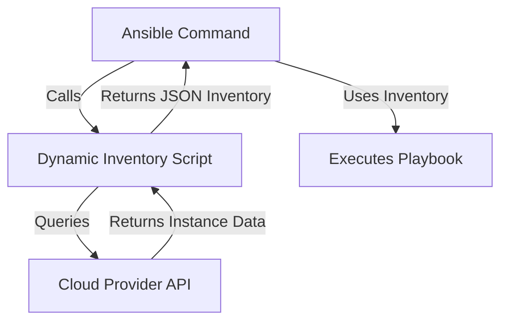

# Ansible Inventory

## Introduction

An Ansible inventory is a file or set of files that defines the hosts and groups that Ansible will manage. It's one of the fundamental components of Ansible that allows you to specify which servers you want to control and how to organize them logically. Think of it as your address book for all the machines you want to automate.

In this guide, we'll learn:
- What an Ansible inventory is
- How to create and structure inventory files
- How to define host patterns and groups
- How to assign variables to hosts and groups
- How to use dynamic inventories

## Basic Inventory File

At its simplest, an inventory is a text file that lists server names or IP addresses. By default, Ansible looks for this file at `/etc/ansible/hosts`, but you can specify a different location using the `-i` flag when running Ansible commands.

### Simple Inventory Example

Let's start with a basic inventory file:

```ini
# Simple inventory example
web1.example.com
web2.example.com
db1.example.com
192.168.1.100
```

This inventory contains four hosts: three identified by their domain names and one by its IP address. With this inventory file, you can already start running Ansible commands against these hosts.

### Using the Inventory

To use this inventory, you can run a simple ping command:

```bash
ansible all -i inventory -m ping
```

Output:
```
web1.example.com | SUCCESS => {
    "changed": false,
    "ping": "pong"
}
web2.example.com | SUCCESS => {
    "changed": false,
    "ping": "pong"
}
db1.example.com | SUCCESS => {
    "changed": false,
    "ping": "pong"
}
192.168.1.100 | SUCCESS => {
    "changed": false,
    "ping": "pong"
}
```

## Grouping Hosts

A more powerful approach is to organize your hosts into groups. This allows you to apply configurations or run playbooks against specific sets of machines.

### Group Example

```ini
# Group example
[webservers]
web1.example.com
web2.example.com

[databases]
db1.example.com

[development]
192.168.1.100
```

In this example, we've created three groups:
- `webservers` containing two web servers
- `databases` containing one database server
- `development` containing one server identified by IP

### Nested Groups

You can also create groups of groups, called nested groups:

```ini
# Nested groups example
[webservers]
web1.example.com
web2.example.com

[databases]
db1.example.com

[development]
dev.example.com

[production:children]
webservers
databases
```

Here, we've created a group called `production` that includes all hosts in both the `webservers` and `databases` groups.

## Inventory Patterns

When running Ansible, you can specify patterns to target specific hosts or groups:

```bash
# Run on all webservers
ansible webservers -i inventory -m ping

# Run on all hosts in production
ansible production -i inventory -m ping

# Run on all hosts
ansible all -i inventory -m ping

# Run on a specific host
ansible web1.example.com -i inventory -m ping

# Run on multiple groups
ansible webservers:databases -i inventory -m ping

# Run on all hosts except databases
ansible all:!databases -i inventory -m ping

# Run on hosts that are in both webservers and production
ansible webservers:&production -i inventory -m ping
```

## Host and Group Variables

You can assign variables to hosts or groups in your inventory file. These variables can then be used in your playbooks and templates.

### Host Variables

```ini
# Host variables example
[webservers]
web1.example.com http_port=80 max_connections=100
web2.example.com http_port=8080 max_connections=200

[databases]
db1.example.com db_port=5432 backup_time=midnight
```

### Group Variables

```ini
# Group variables example
[webservers]
web1.example.com
web2.example.com

[webservers:vars]
http_port=80
ansible_user=apache
max_connections=100

[databases]
db1.example.com

[databases:vars]
db_port=5432
ansible_user=postgres
backup_time=midnight
```

## Separate Variable Files

For larger projects, it's better to keep variables in separate files. Ansible looks for these variables in the `host_vars` and `group_vars` directories:

```
inventory/
├── hosts
├── group_vars/
│   ├── webservers.yml
│   └── databases.yml
└── host_vars/
    ├── web1.example.com.yml
    └── db1.example.com.yml
```

Example content of `group_vars/webservers.yml`:

```yaml
---
http_port: 80
ansible_user: apache
max_connections: 100
```

## Connection Variables

You can specify connection details in your inventory:

```ini
# Connection variables example
[webservers]
web1.example.com ansible_host=192.168.1.101 ansible_user=admin ansible_port=2222
web2.example.com ansible_connection=ssh ansible_ssh_private_key_file=/path/to/key.pem

[monitoring]
monitor.example.com ansible_connection=winrm ansible_user=admin ansible_password=secret
```

Common connection variables include:
- `ansible_host`: The actual hostname or IP to connect to (if different from the inventory name)
- `ansible_port`: The port to connect to
- `ansible_user`: The username to use for the connection
- `ansible_connection`: The connection type (ssh, winrm, local)
- `ansible_ssh_private_key_file`: Path to the SSH private key file
- `ansible_password`: The password for the connection (consider using Ansible Vault instead)

## Inventory File Formats

Ansible supports several formats for inventory files:

### INI Format (Traditional)

```ini
[webservers]
web1.example.com
web2.example.com
```

### YAML Format

```yaml
all:
  children:
    webservers:
      hosts:
        web1.example.com:
        web2.example.com:
          http_port: 8080
    databases:
      hosts:
        db1.example.com:
        db2.example.com:
```

## Dynamic Inventory

For dynamic environments (like cloud infrastructure), Ansible supports dynamic inventory scripts. These scripts generate inventory information on the fly.

### Using Dynamic Inventory

A dynamic inventory is usually a script (Python, Shell, etc.) that outputs JSON in a specific format:

```bash
ansible-playbook -i inventory_script.py playbook.yml
```

Here's a simplified diagram of how dynamic inventory works:



## Practical Example: Multi-Environment Setup

Let's create a more comprehensive example for a real-world application with development, staging, and production environments:

```ini
# File: inventory/hosts

# Web Servers
[web]
web-prod-01.example.com
web-prod-02.example.com
web-staging-01.example.com
web-dev-01.example.com

# Database Servers
[db]
db-prod-01.example.com
db-staging-01.example.com
db-dev-01.example.com

# Environment-based groups
[production]
web-prod-01.example.com
web-prod-02.example.com
db-prod-01.example.com

[staging]
web-staging-01.example.com
db-staging-01.example.com

[development]
web-dev-01.example.com
db-dev-01.example.com

# Application-based groups
[app:children]
web
db

# Default connection settings
[all:vars]
ansible_user=deploy
ansible_connection=ssh
```

With this setup, you can:
- Target all web servers with `ansible web -i inventory/hosts -m ping`
- Target production environment with `ansible production -i inventory/hosts -m ping`
- Target staging web servers with `ansible web:&staging -i inventory/hosts -m ping`

## Using the Inventory in a Playbook

Here's how to use your inventory in a playbook:

```yaml
---
# deploy_webserver.yml
- name: Configure webservers
  hosts: webservers
  become: yes
  
  tasks:
    - name: Install nginx
      apt:
        name: nginx
        state: present
      
    - name: Start nginx service
      service:
        name: nginx
        state: started
        enabled: yes
      
    - name: Deploy configuration
      template:
        src: templates/nginx.conf.j2
        dest: /etc/nginx/nginx.conf
      vars:
        http_port: "{{ http_port | default('80') }}"
```

Run the playbook with:

```bash
ansible-playbook -i inventory deploy_webserver.yml
```

## Best Practices

1. **Keep It Organized**: Group related hosts together and use meaningful group names.
2. **Use Version Control**: Keep your inventory files in version control.
3. **Separate Variables**: Use group_vars and host_vars directories for variables.
4. **Use Patterns Carefully**: Be precise with patterns to avoid unintended changes.
5. **Consider Dynamic Inventory**: For cloud environments, dynamic inventory is usually better.
6. **Limit Access Variables**: For sensitive data, use Ansible Vault.
7. **Document Your Inventory**: Add comments to explain the purpose of groups and special variables.

## Summary

The Ansible inventory is a fundamental component that defines what hosts Ansible manages and how they're organized. We've covered:

- Basic inventory structure and syntax
- Host and group organization
- Variable assignment at host and group levels
- Connection parameters
- Different inventory formats
- Dynamic inventories for cloud environments
- Practical examples and patterns

With a well-structured inventory, you can organize your infrastructure logically and target specific parts of it for configuration and deployment tasks.

## Exercise: Create Your First Inventory

1. Create an inventory file for a small infrastructure with two web servers and one database server.
2. Add appropriate groups and variables.
3. Run a simple Ansible command against each group to verify your inventory works.
4. Create a simple playbook that uses host and group variables from your inventory.

## Additional Resources

- [Ansible Inventory Documentation](https://docs.ansible.com/ansible/latest/user_guide/intro_inventory.html)
- [Working with Dynamic Inventory](https://docs.ansible.com/ansible/latest/user_guide/intro_dynamic_inventory.html)
- [Ansible Patterns](https://docs.ansible.com/ansible/latest/user_guide/intro_patterns.html)